Anna Godek

Inżynieria Obliczeniowa

GCL01

# Metodyki DevOps

## Laboratorium 11
## Wdrażanie na zarządzalne kontenery: Kubernetes (1)
**Instalacja klastra Kubernetes**
- Zaopatrz się w implementację stosu k8s: minikube.
Instrukcję przeprowadzono na Ubuntu 22.04 postawionym w VB. Pierwszym krokiem było pobranie plików binarnych i instalacja minkube.

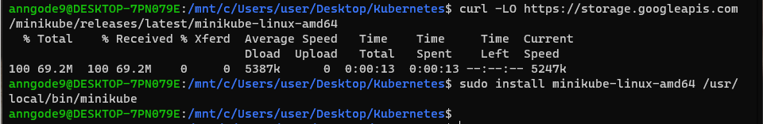


Następnie spróbowano uruchomić minkube. Próba zakończyła się błędem, dodano więc użytkownika do grupy docker za pomocą polecenia:
```bash
sudo usermod -aG docker anngode9 && newgrp docker
```

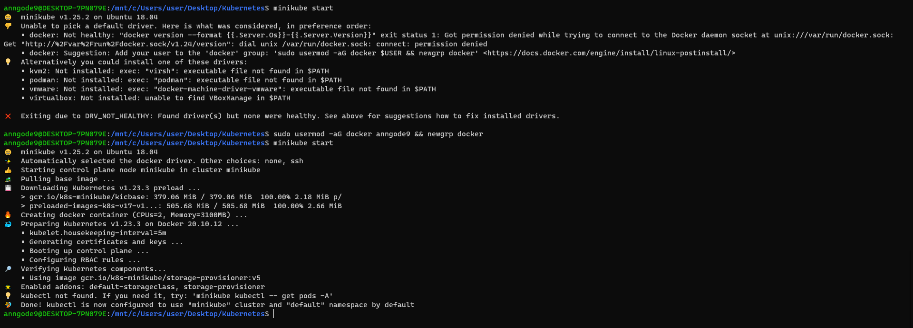 


Zainstalowano kubectl i uzyskano dostęp do klastra.


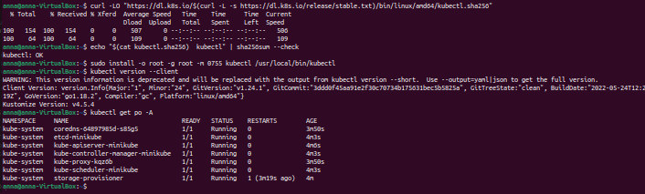


Uruchomiono `minkube dashboard`.

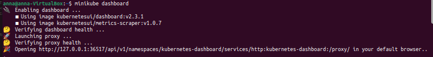

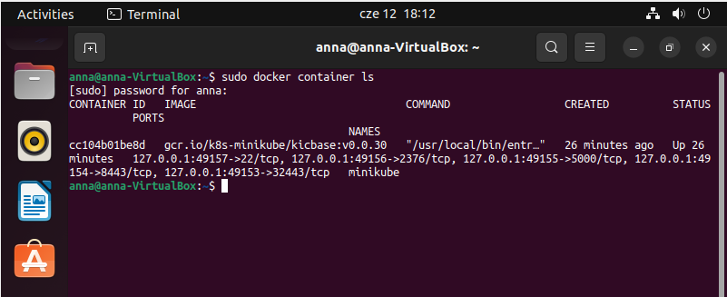


Utworzono przykładowe wdrożenie.

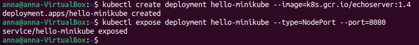
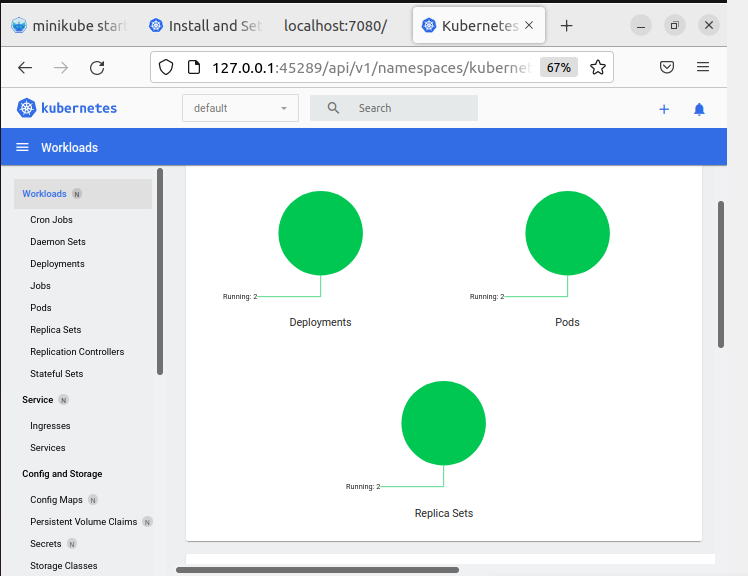

Pobrano gotowy obraz nginx:stable.

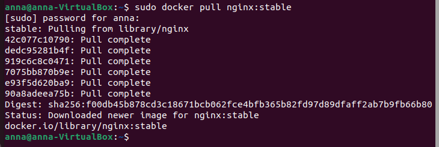
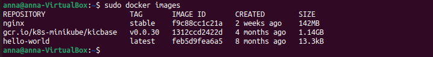

Uruchomiono kontener.

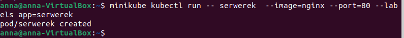
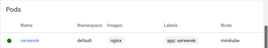
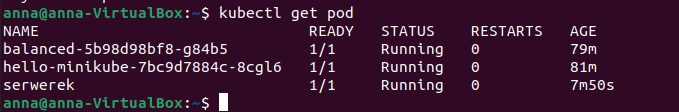


Włączono obsługę deploymentu `kubectl get services hello-minikube`.
Przekierowanie na port.

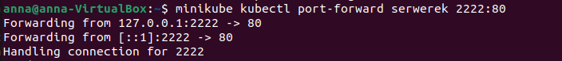
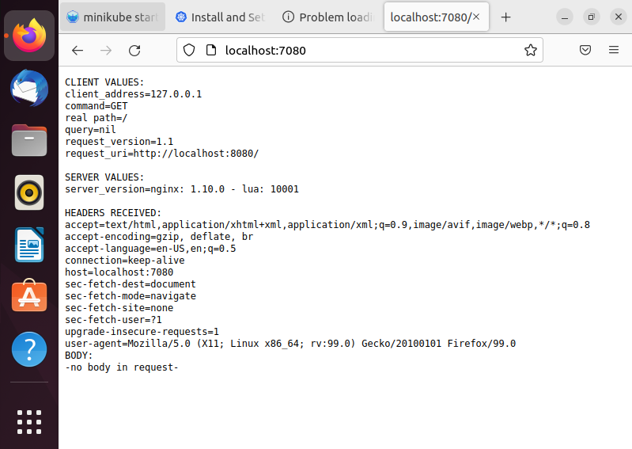
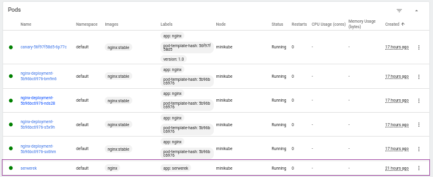
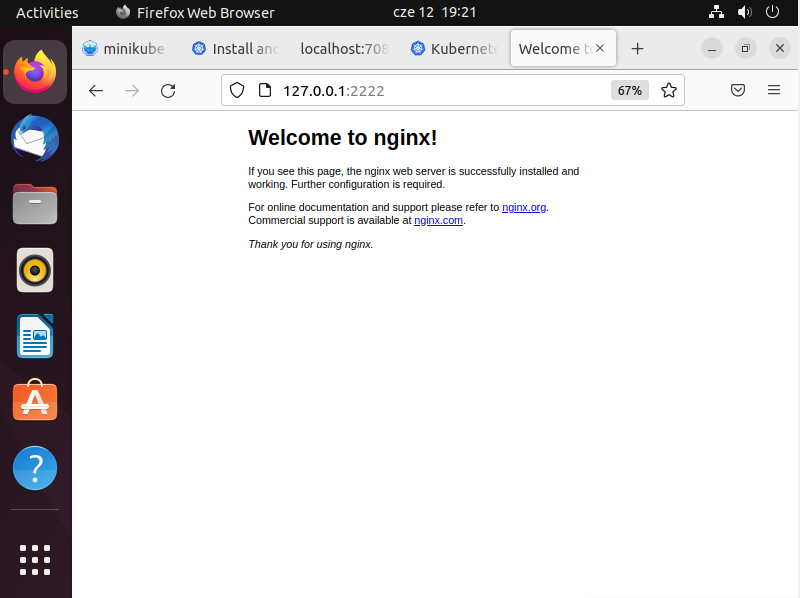

Wdrożenie.
Utworzono plik `.yaml` za pomocą polecenia `touch nginx-deployment.yaml`. Zawartość pliku:
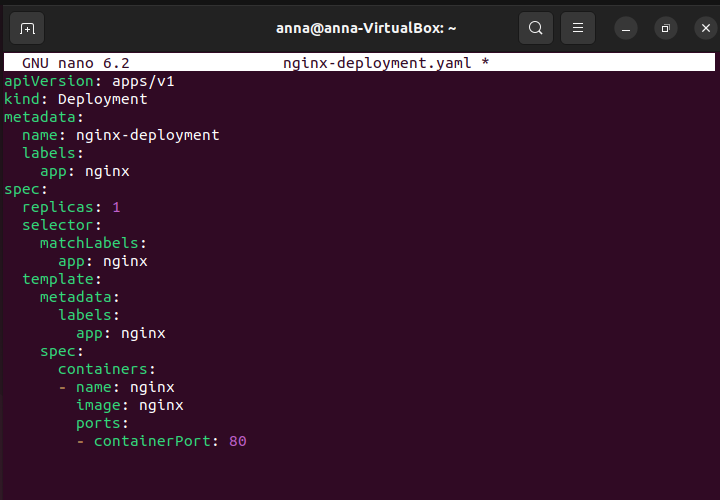
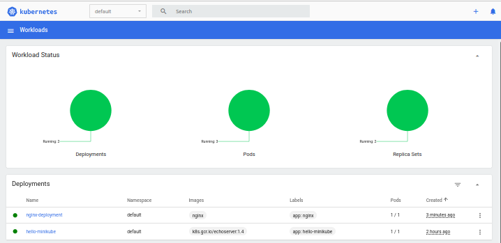
