Anna Godek

Inżynieria Obliczeniowa

GCL01

# Metodyki DevOps

## Laboratorium 12
## Wdrażanie na zarządzalne kontenery: Kubernetes (2)
**Konwersja wdrożenia ręcznego na wdrożenie deklaratywne YAML**
Wzbogacono obraz o 4 repliki.

Rozpoczęto wdrożenie za pomocą `kubectl apply` i zbadano stan za pomocą `kubectl rollout status`.

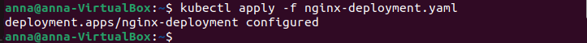 
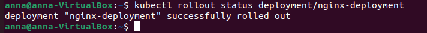
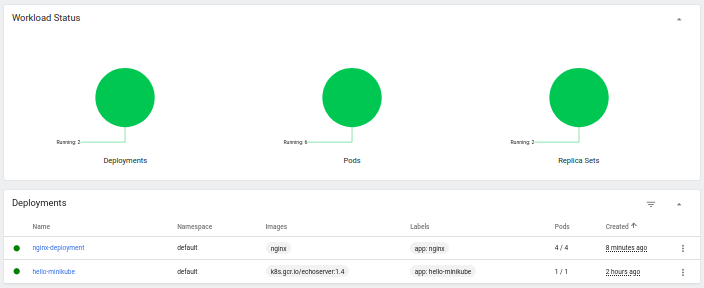

**Przygotowanie nowego obrazu**
Pobrano inną, starszą wersję obrazu `nginx`.

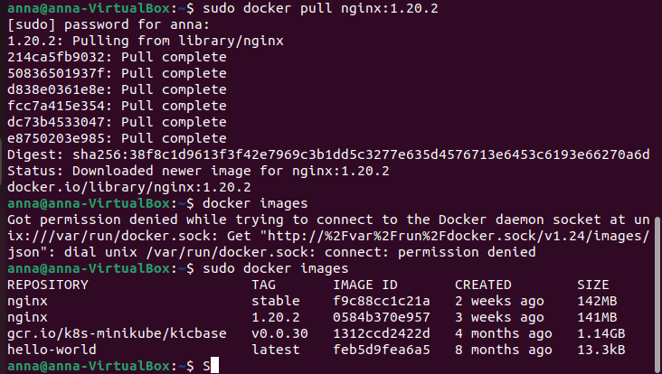

**Zmiany w deploymencie**
Aktualizowano plik `YAML` z wdrożeniem i przeprowadzano je ponownie po zastosowaniu zmian.

Zmniejszenie liczby replik do 1. 

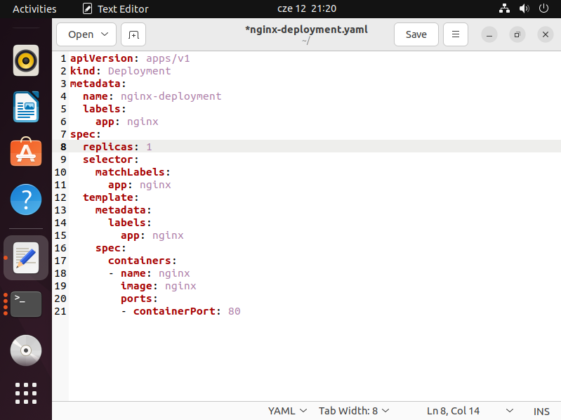
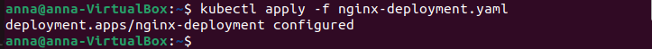
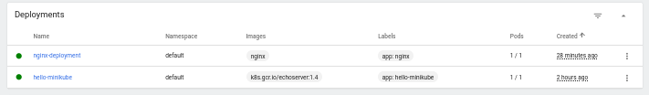

Zmniejszenie liczby replik do 0.

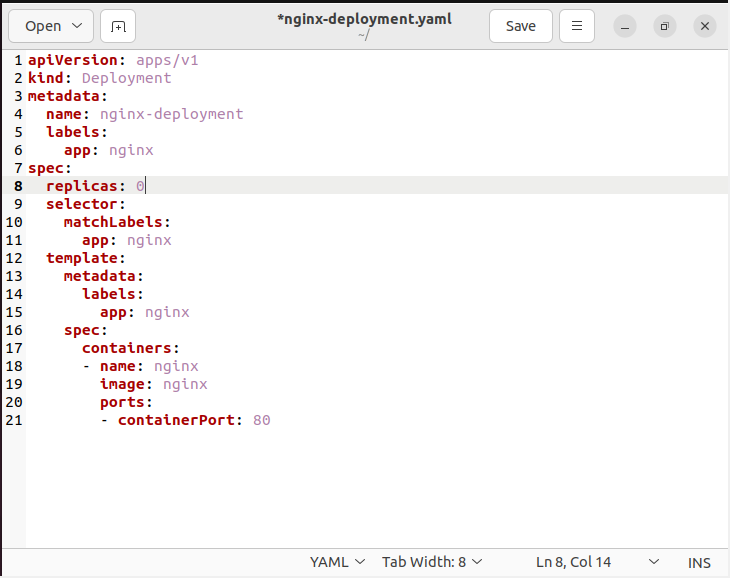
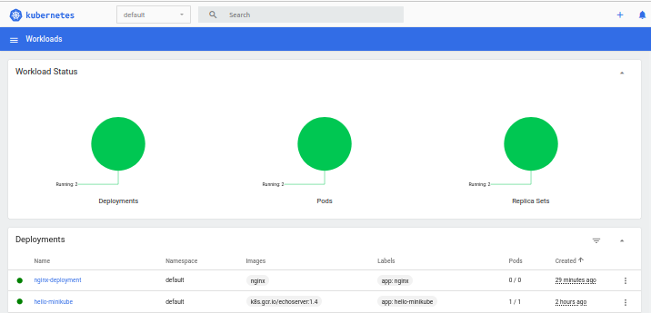

Zastosowano starszą wersję.

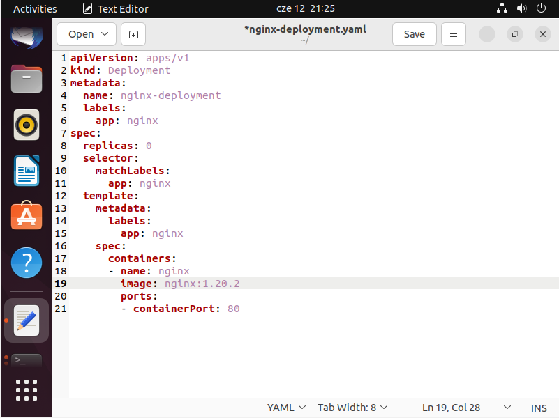
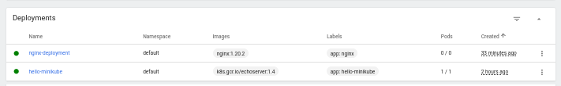

Przywrócono poprzednie wersje wdrożeń za pomocą poleceń `kubectl rollout history` i `kubectl rollout undo`.

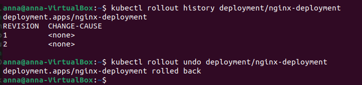
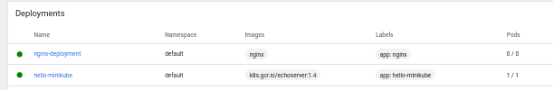

**Kontrola wdrożenia**
Napisano skrypt weryfikujący, czy wdrożenie „zdążyło” się wdrożyć (60 sekund).
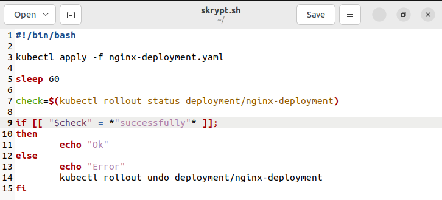
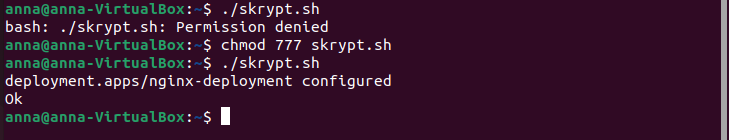

**Strategie wdrożenia**
Recreate kończy dziąłanie nieaktualnych instancji i uruchamia je w nowszej wersji, zapewnia ciągłość odnawiania stanu aplikacji.

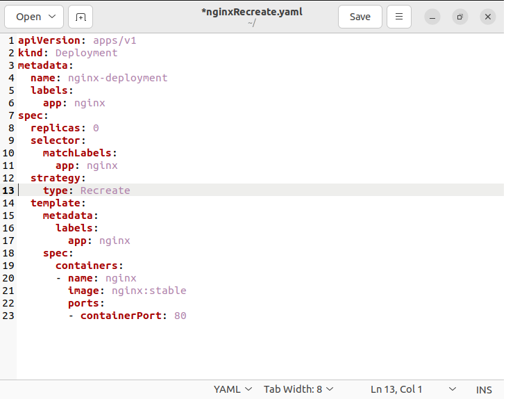
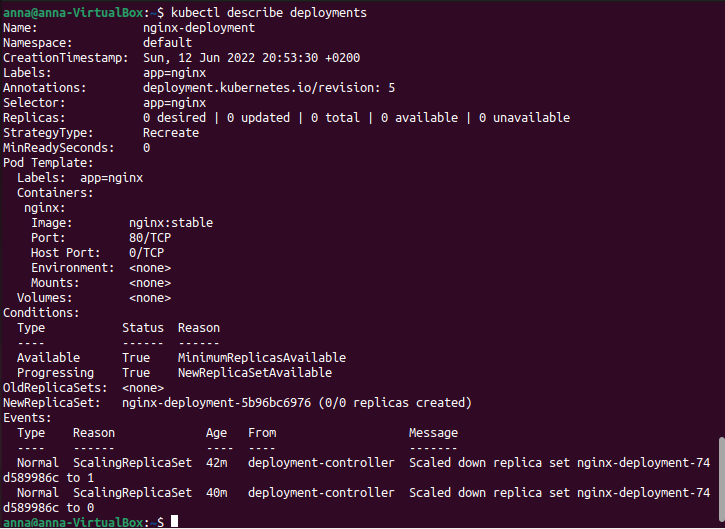
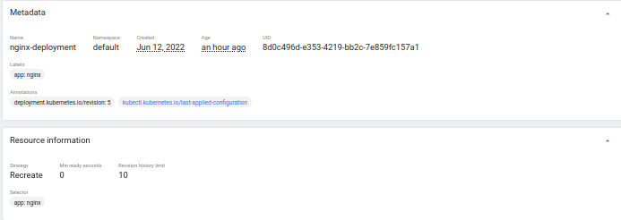
Pody są niszczone.

Rolling Update umożliwia stopniową aktualizację. Liczba podów ze starszą wersją jest zmniejsza a z nową wersją zwiększana. Istotnymi argumetami są:
maxSurge – liczba podów, które możemy dodać
maxUnvailable – liczba podów nieaktywnych

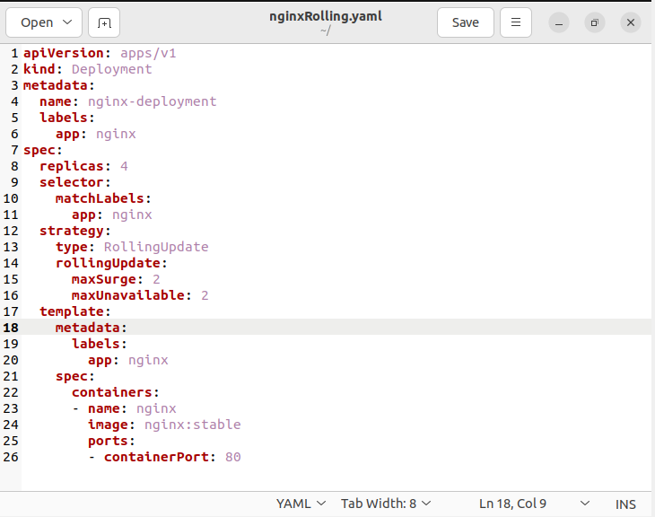
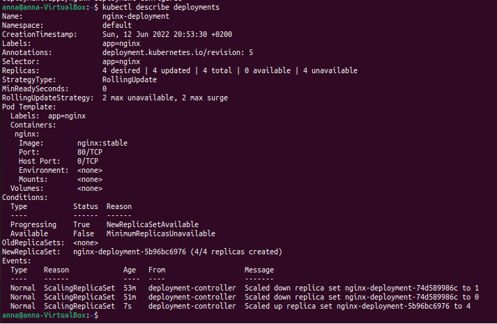
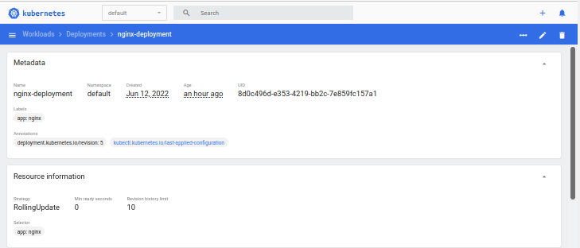

Canary deployment workload – opiera się na wdrożeniu nowego oprogramowania obok starszych wersji, które są stabilne. Wraz z nowym wdrożeniem umożliwia zwiększenie podów i rezygnację ze starych.

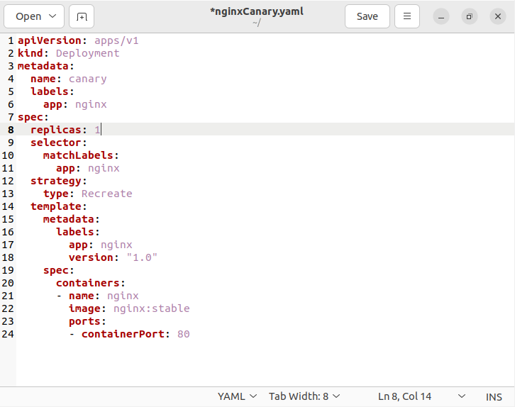
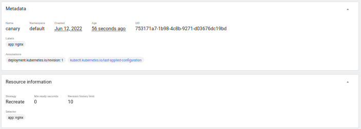
