##DevOps Sprawozdanie 11

Postanowiłem zaktualizować Debiana, bo od długiego czasu mnie o to prosił, oraz zwiększyłem dostępną ilość pamięci po usunięciu innych systemów z Virtualboxa. Niestety poskutkowało to zaprzestaniem działania interfejsu w Virtualboxie z nieznanych mi przyczyn. Połączenie przez PuTTy wciąż działa ale w dalszych krokach napotkałem głębsze problemy więc pożegnałem się z systemem ubuntu i wszystkimi plikami na nim...
Poniżej zdjęcie do jakiego stopnia odpala się Debian w virtualBoxie:
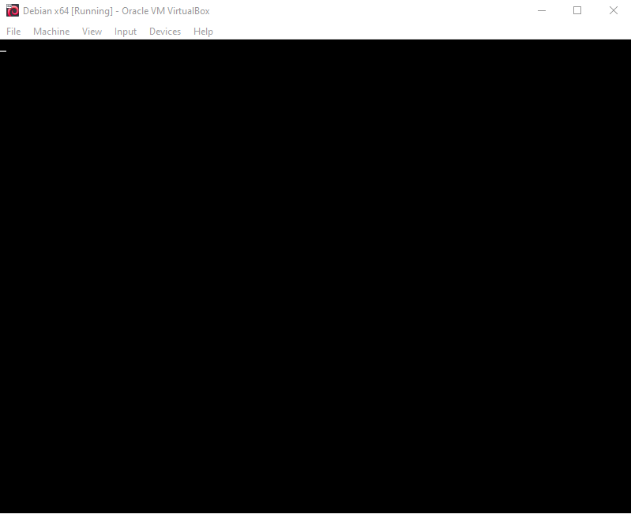

Od razu przy instalacji systemu Ubuntu, ustawiłem w VirtualBoxie odpowiednie opcje:
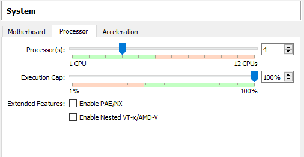
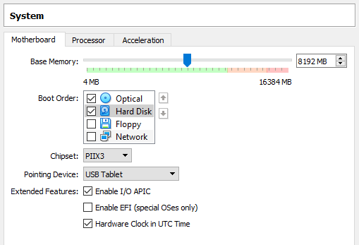
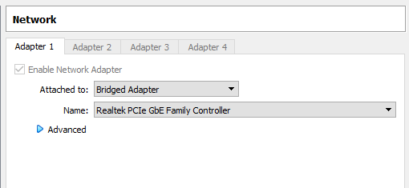

Kubernetesa instaluje na Ubuntu postawionym na Virtual Boxie.
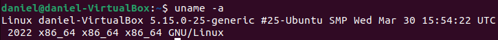

Pobieram obraz **curl -LO https://storage.googleapis.com/minikube/releases/latest/minikube-linux-amd64** (na zdjęciu tutaj pobrałem go na VBoxie):
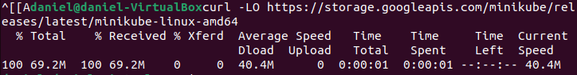

Instalacja minicube **sudo install minikube-linux-amd64 /usr/local/bin/minikube**:
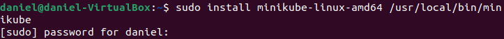
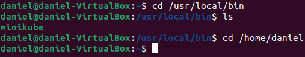

Po instalacji minikube instaluję dockera z racji tego, że śmigam na nowym systemie.
Potem próbuję wystartować klaster poprzez **minikube start**:
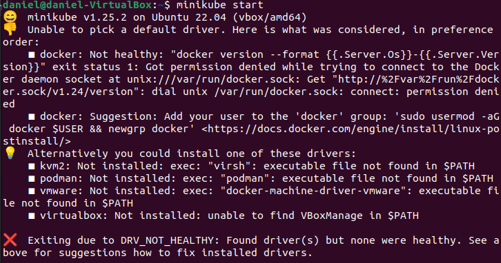

tutaj zgodnie z podpowiedzią i dodaje mojego uzytkownika do grupy docker poprzez **sudo usermod -aG docker daniel && newgrp docker**
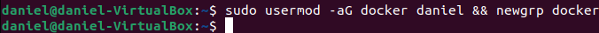

**minikube start --driver=docker**:
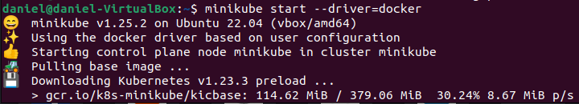

Wykonanie polecenia **minikube kubectl -- get pods -A**:
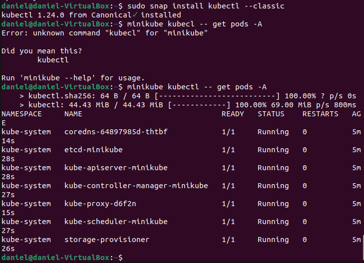

Tutaj jest nasz kontener **docker ps**:
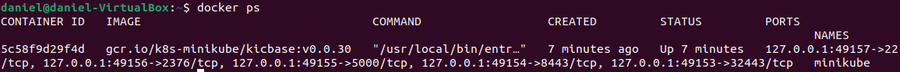

Uruchomienie dashboardu (**minikube dashboard**):
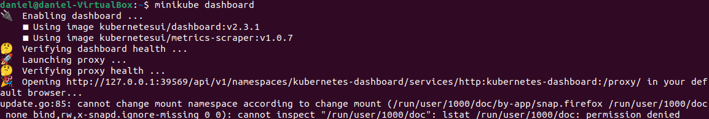
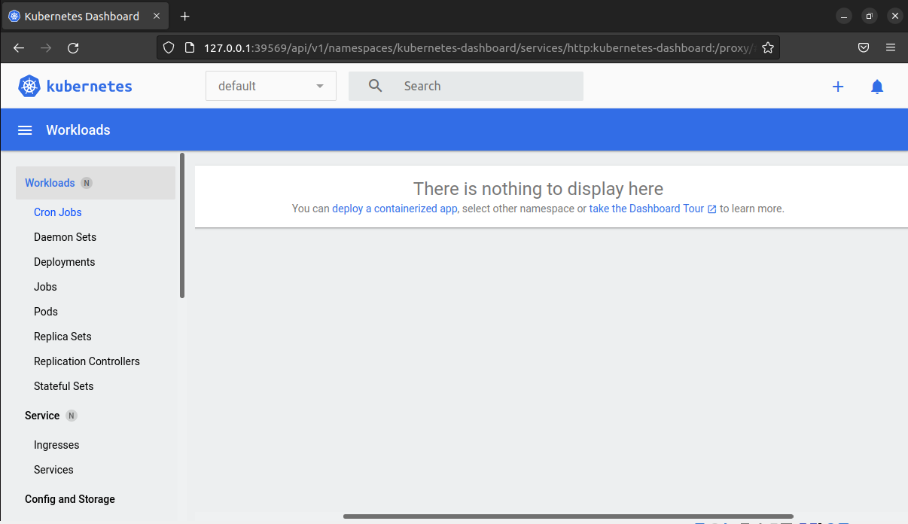

W ramach deployowania aplikacji do minikube'a, deployowałem domyślny obraz echoserver:1.4.

Tworze deployment, za pomocą komendy **kubectl create deployment "nazwa" --image= "nazwa_obrazu:tag"**
Kolejny krok to expose na port 8080 **kubectl expose deployment "nazwa" --type=NodePort --port=8080**
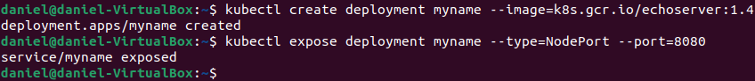

Dalej włączam obsługę deploymentu poprzez **kubectl get services "nazwa"**:
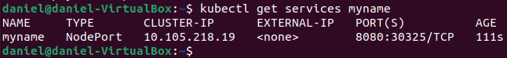

Korzystając z kubectl'a przekierowujemy się na port 7080 **kubectl port-forward service/nazwa" 7080:8080**:
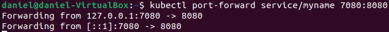

Wejście na localhost:7080:
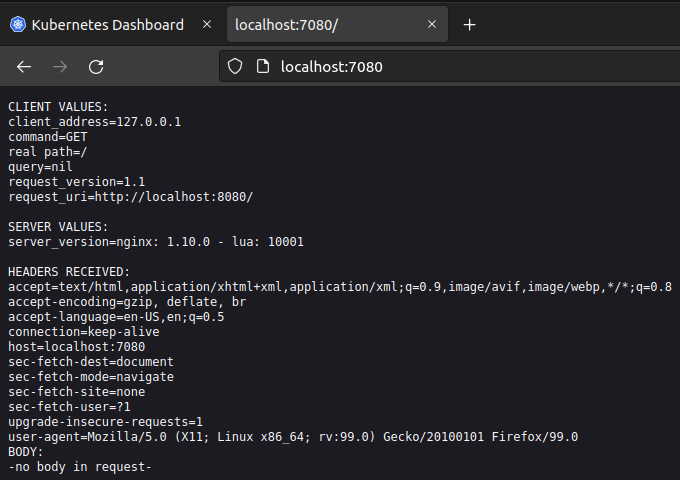

Dashboard:
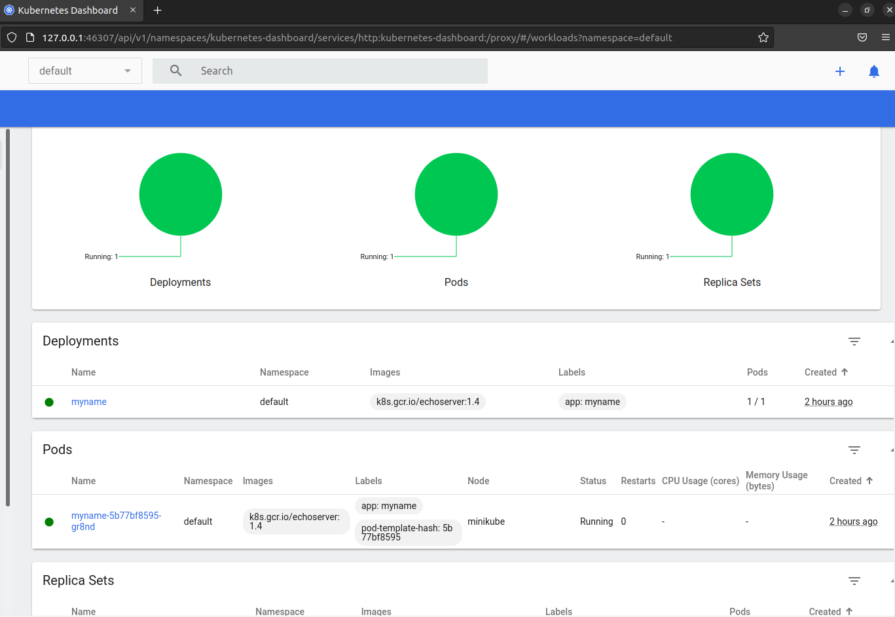

Services:
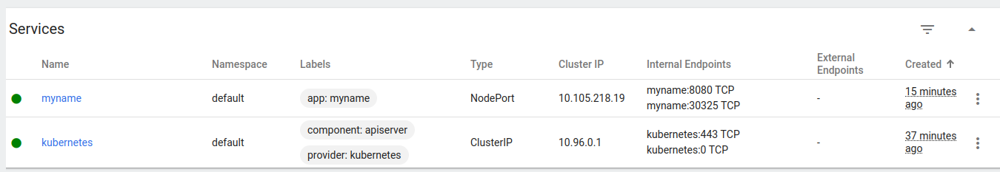