# Lab 11

- Wybieram na stronie minikube odpowiednie ustawienia w celu instalacji minikube

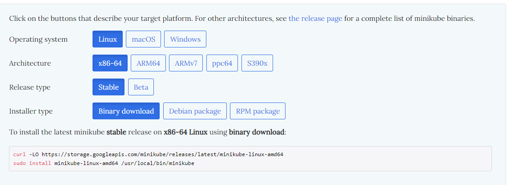

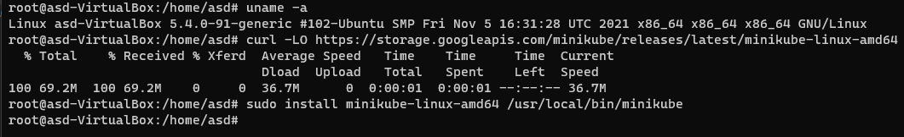

- Proba odpalenia minikube skonczyla sie niepowodzeniem przez zbyt mala ilosc rdzeni

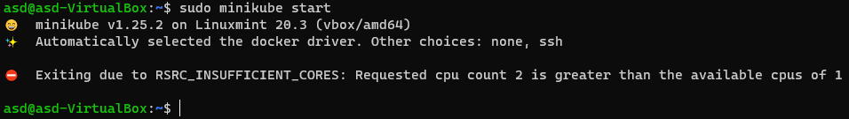

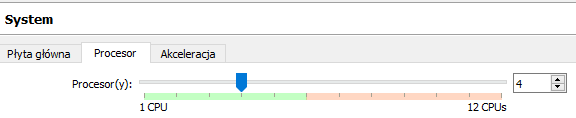

- elegancko

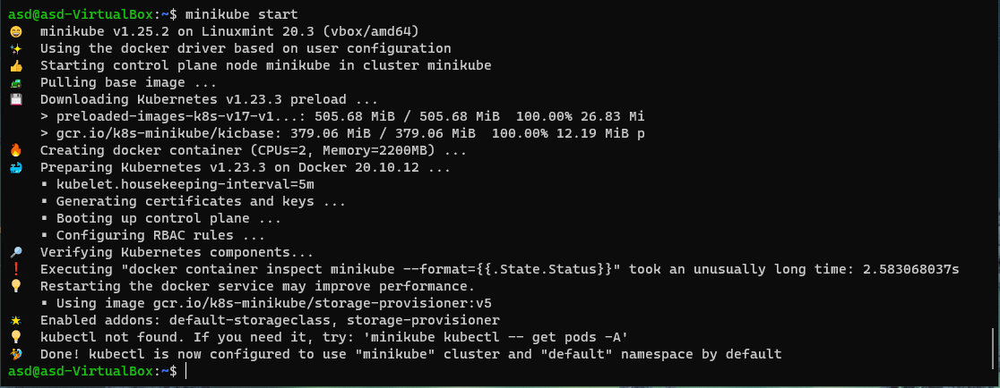

- Sprawdzenie dzialania oraz dodania aliasu


- Odpalenie minikube dashboard

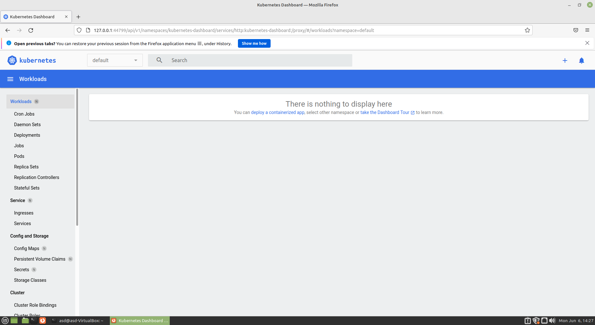

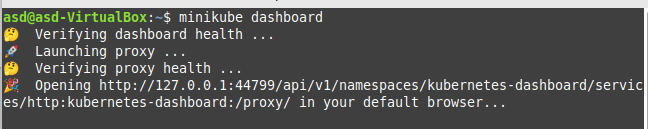

- port forwarding 

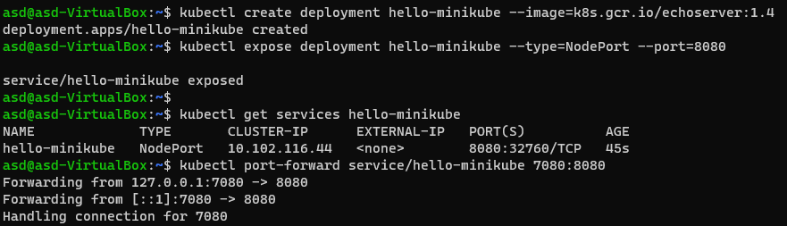

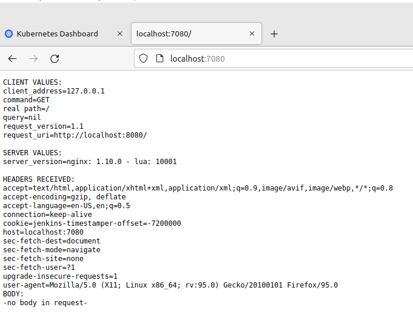

- Wszystko smiga
- 
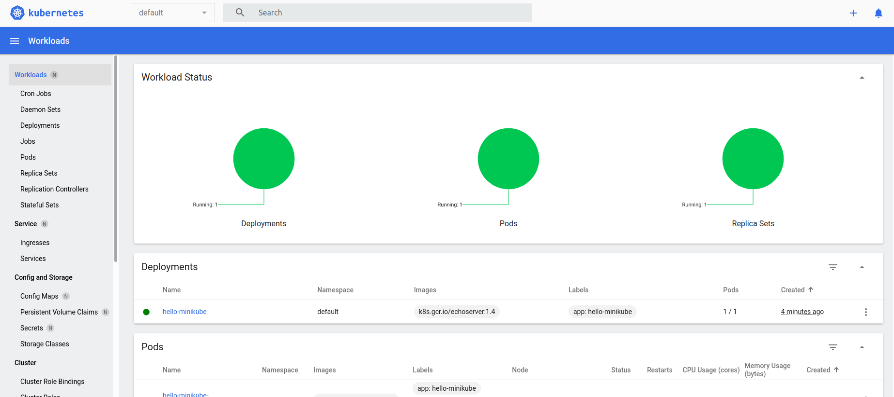

- Zrezygnowalem z pracy na irssi na potrzebe tego zadania, uzywam servera apache httpd

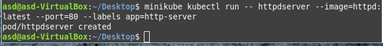
 
- Wygenerowany za pomoca kompose plik yaml, wygenerowany z `docker-compose.yml`:

```
version: "3"

services:
  httpd:
    image: httpd:latest
    ports:
      - "8080:80"
```

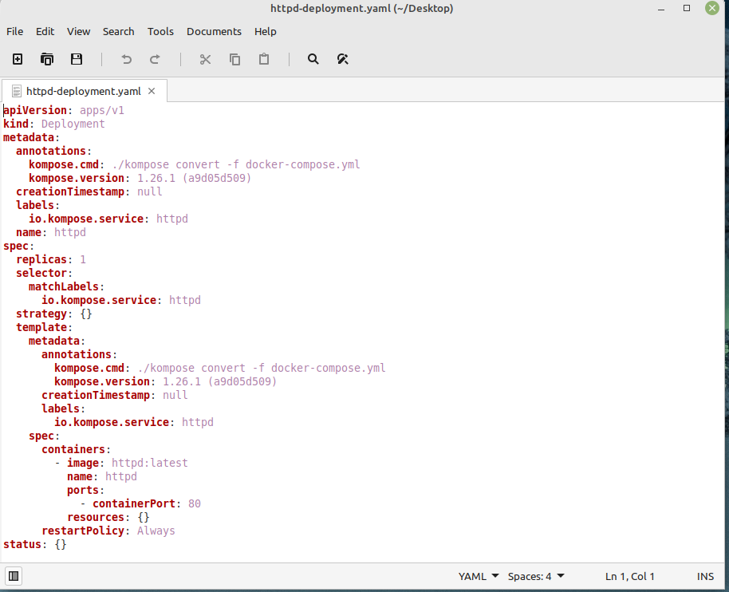

- Dzialajacy obraz po komendzie `minikube kubectl -- apply -f httpd-deployment.yaml

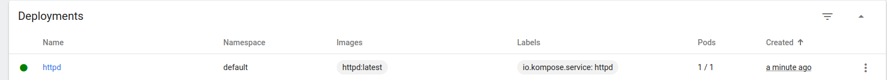
