# Lab 12

- Wzbogacenie obrazu o 4 repliki

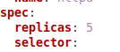

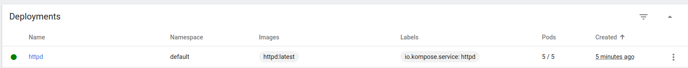

- Rollout status:

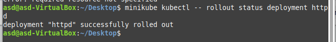

- Stworzenie wadliwego obrazu:

nowy obraz docker

`docker-compose.yml`:

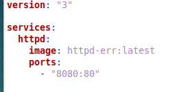

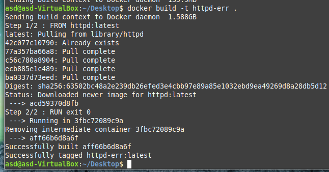

po wykonaniu apply na wygenerowany przez kompose deployment:

Kontener zrobił fikołka także nastepnie wykonuje rollback:

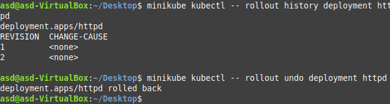

Sukces!

- Zwiekszenie ilosci replik:

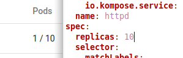

- Zmniejszenie ilosci do 1

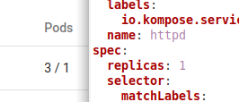

- Oraz do 0

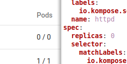

- Stworzenie skryptu sprawdzajacego poprawny deploy:

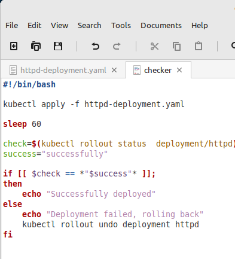

- Strategy types:

-- recreate - wszystkie pody sa zabijane zanim zostana stworzone nowe

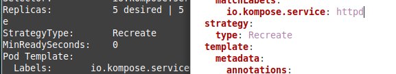

-- RollingUpdate - stare pody sa na biezaco zmieniane na nowe dzieki czemu aplikacje w teori nie maja downtime przy jakichkolwiek zmianach.

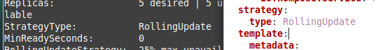

-- Canary deployment workload - tworzymy osobne pody z nowszymi wersjami testowymi dzialajacymi obok starszych

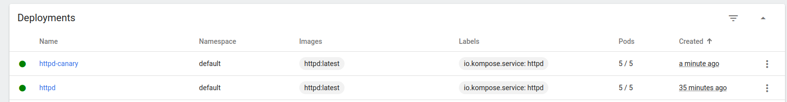

- yaml do stworzenia nowego poda z wyzsza wersja

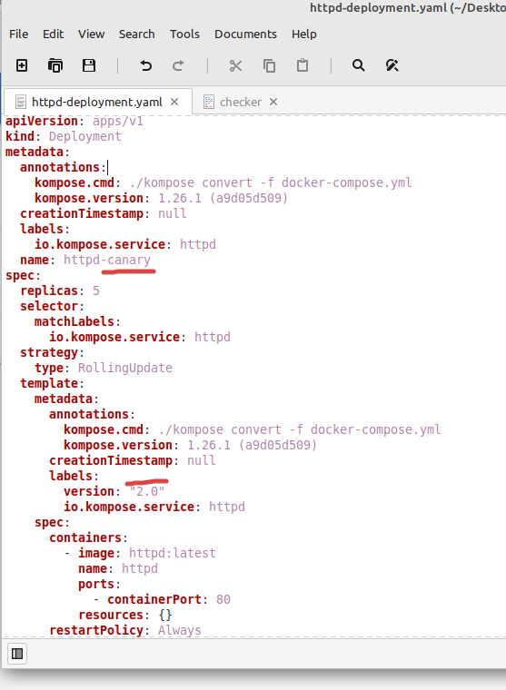 
