## Sprawozdanie Lab11
##### Autor: Dawid Gabryś

1. W ramach zajęć należało zainstalować Kubernetesa.

Na początku pobrałem pliki binarne ```minikube```:

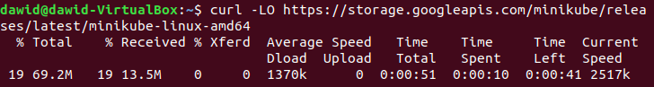

Następnie zainstalowałem ```minikube'a```:


I uruchomiłem. Niestety wystąpił błąd. Aby go naprawić musiałem dodać użytkownika do grupy ```docker```:

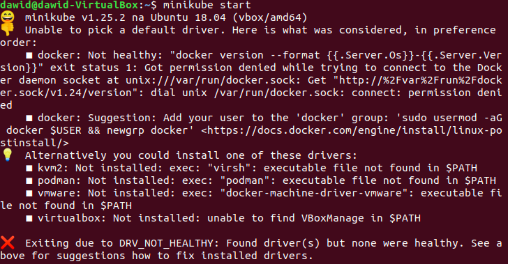

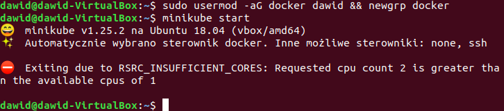

I jak widać na powyższym zrzucie ekranu ponownie nastąpił błąd. Widząc to i przy okazji upewniając się ostatecznie czy spełnione są pozostałe wymagania do uruchomienia ```minikube``` zwiększyłem liczbę CPU:

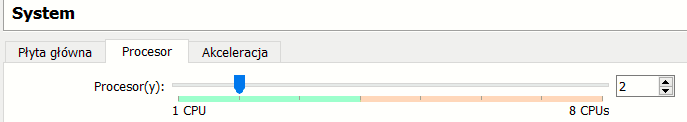

Po tym wszystkim uruchomienie przeszło bez problemów:

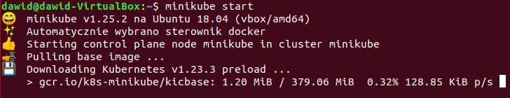


Następnie użyto poniższego polecenia by uzyskać dostęp do klastra (wcześniej musiałem zainstalować ```kubectl```):

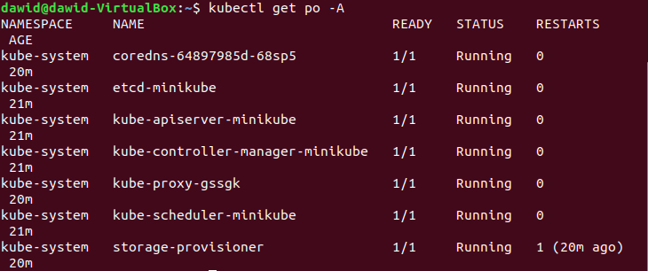

I uruchomiono dashboard ```minikube'a```:

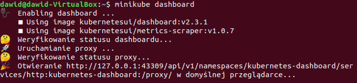

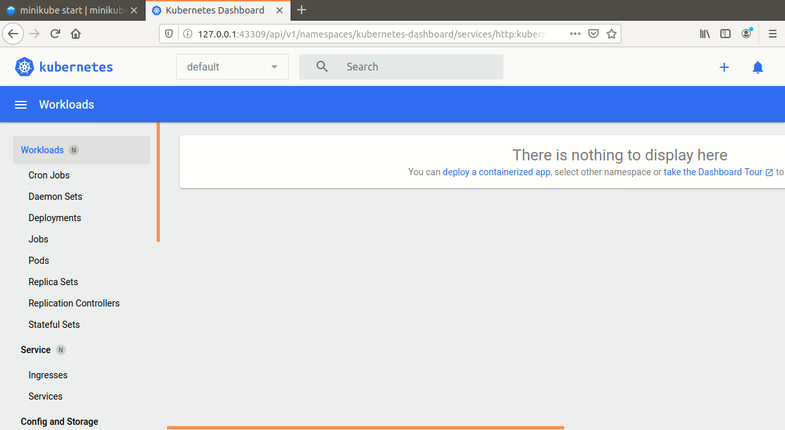

Sprawdzono również działający kontener:

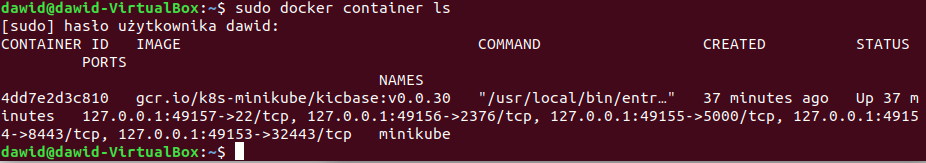

W celach testowych utworzono przykładowe wdrożenie:

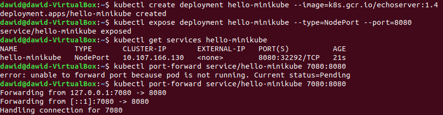

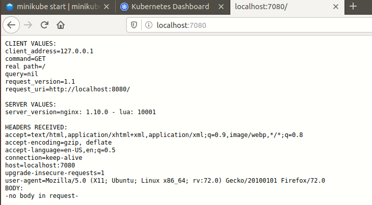

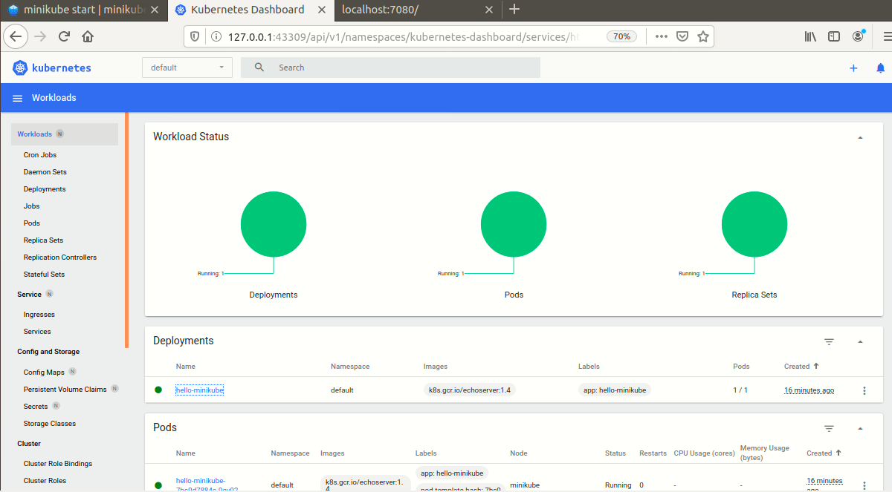

Potem pobrano gotowy obraz ```nginx:stable```:

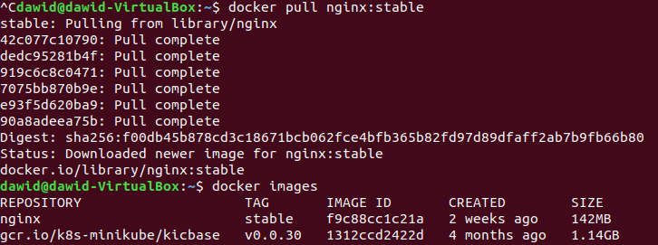

I uruchomiono kontener:

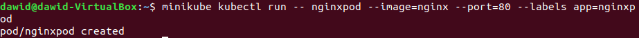

Uruchomiony kontener został ubrany w ```pod```. Sprawdzono, że działa na dashboardzie:

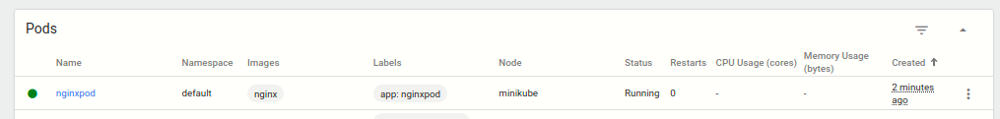

I w terminalu:

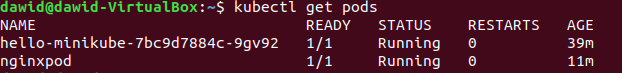

Następnie wprowadzono port celem dotarcia do eksponowanej funckjonalności:

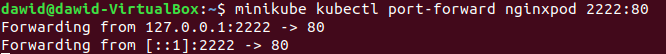

Oraz przedstawiono efekt:

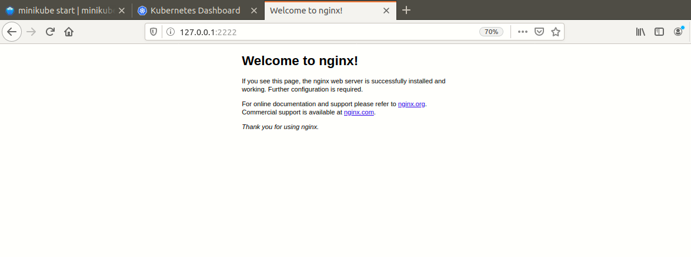

Wdrożenie przedstawiono w postaci pliku ```.yaml```:


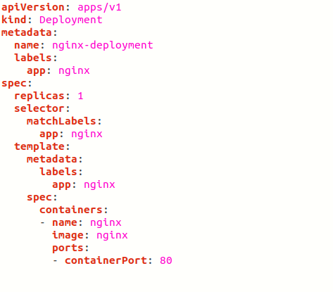

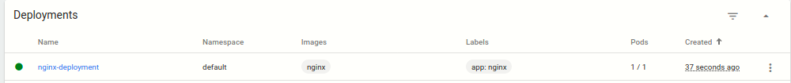
