## Sprawozdanie Lab12
##### Autor: Dawid Gabryś

1. Kontynuacja zajęć z Kubernetesa. Wdrożenie YAML.

Na początku zmodyfikowałem plik ```.yaml``` ustawiając liczbę replik z 1 na 4:

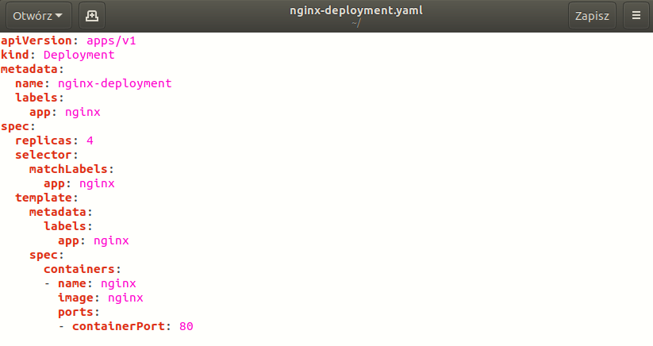

Następnie rozpocząłem wdrożenie za pomocą polecenia ```kubectl apply```:

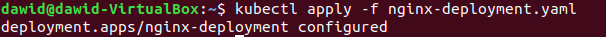

Sprawdziłem działanie w dashboardzie:

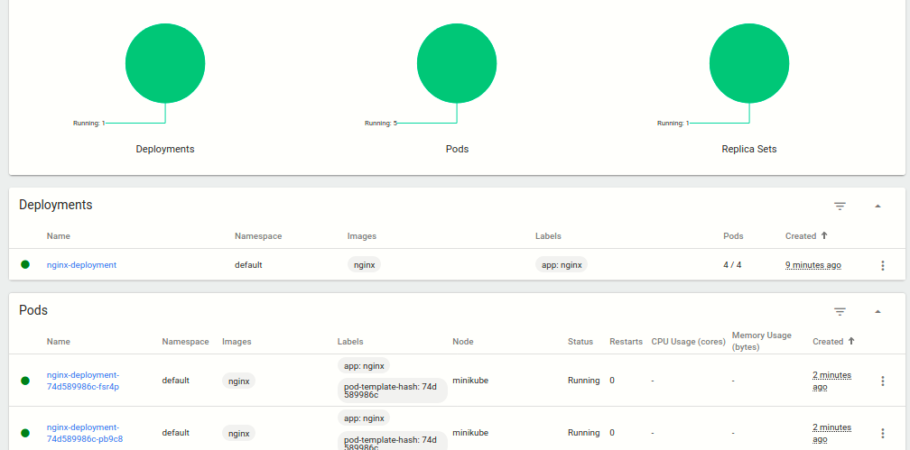

Oraz zbadałem stan za pomocą ```kubectl rollout status```:

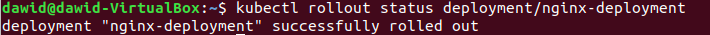

2. Następnie przygotowałem nowy obraz. W tym celu pobrałem starszą wersję obrazu ```nginx```:

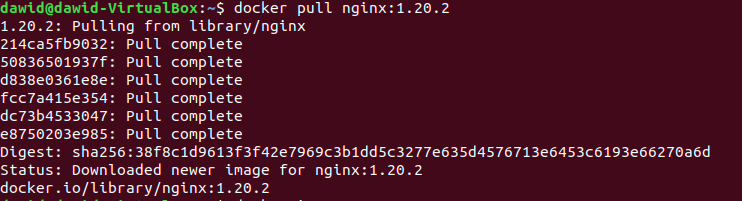

3. Potem przeprowadziłem zmiany w deploymencie. W tym celu aktualizowałem plik ```.yaml``` i ponownie wdrożyłem:

Dla liczby replik 1:

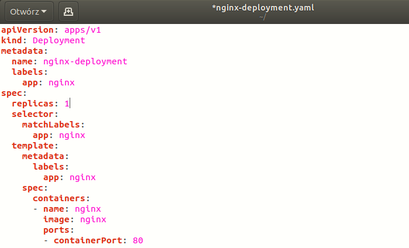

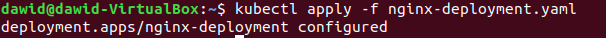

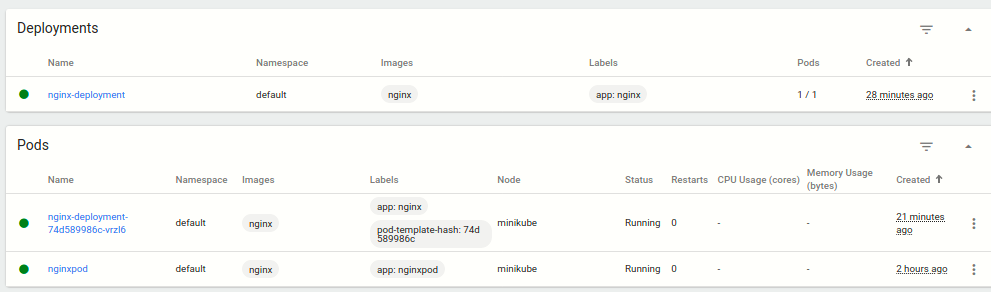

Dla liczby replik 0:

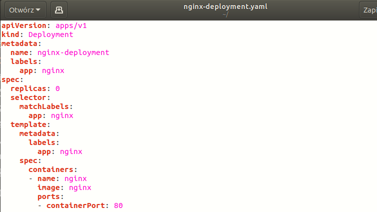

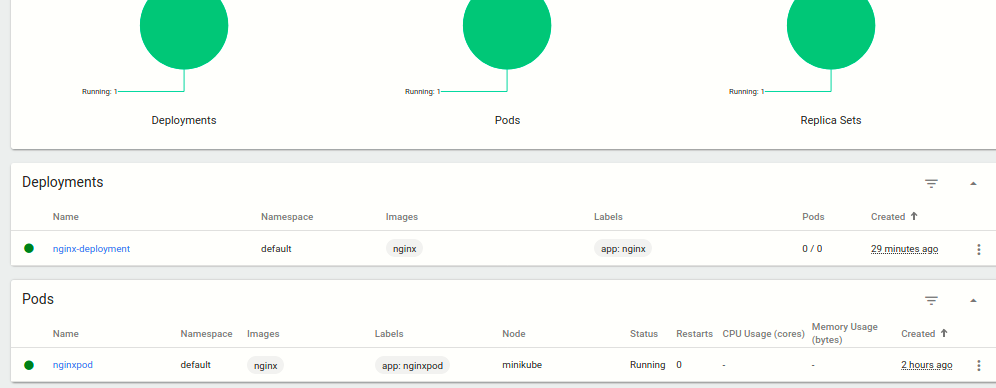

Dla starszej wersji ```nginx```:

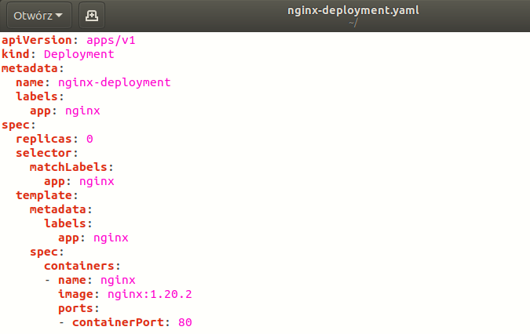

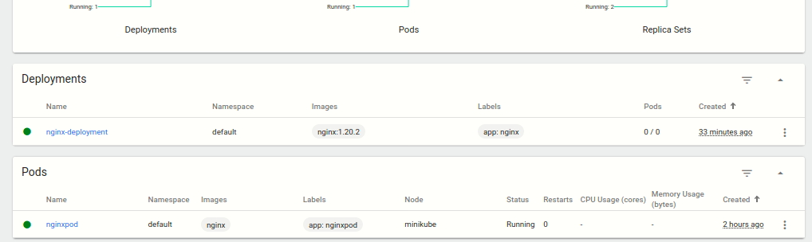

Następnie przywróciłem poprzednią wersję deploymentu:

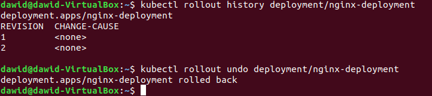

Sprawdziłem czy przywróciło:

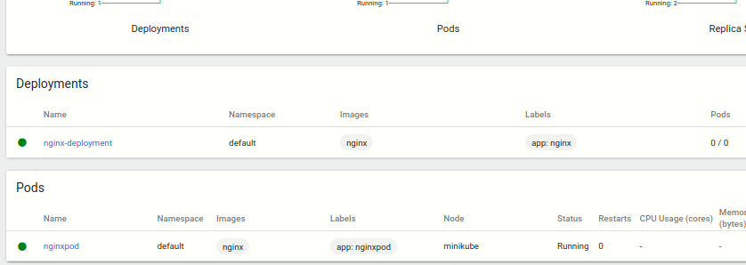

4. Potem napisałem skrypt, weryfikujący, czy wdrożenie zdążyło się wdrożyć. Jeśli tak, to sukces, jeśli nie, to przywracamy starą wersję:

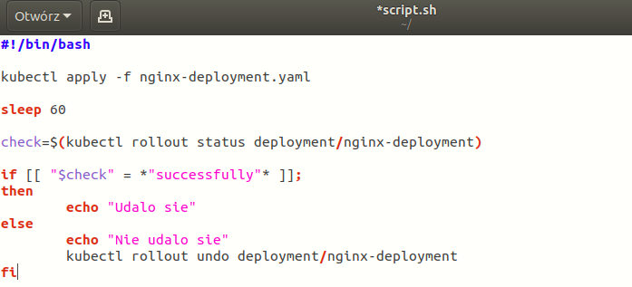

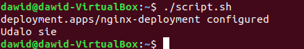

5. Testowanie strategii wdrożenia.

Dla strategii ```Recreate```:

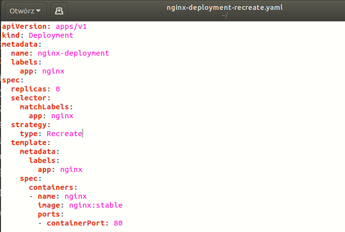

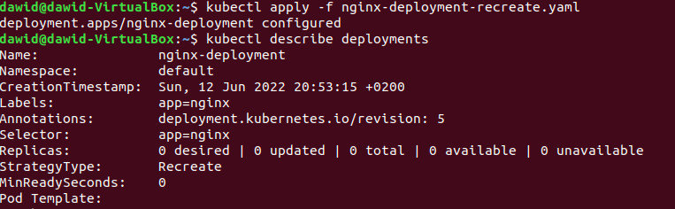

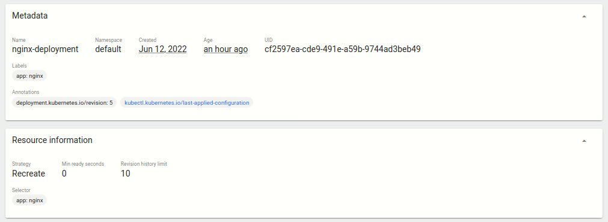

W tej strategii wszystkie istniejące pody są niszczone, po czym następuje ponowne utworzenie w nowszej wersji.

Dla strategii ```Rolling Update```:

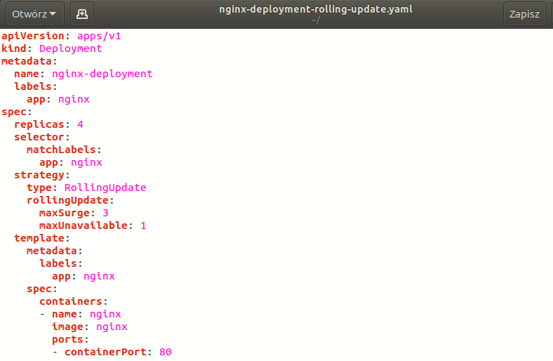

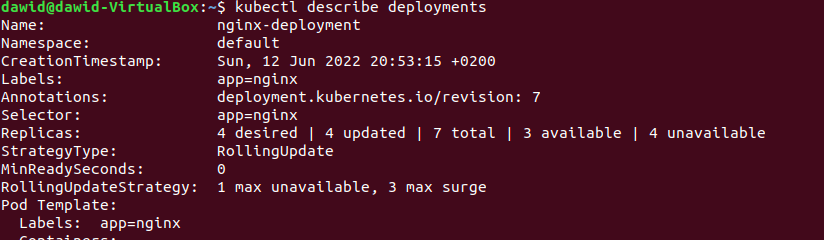

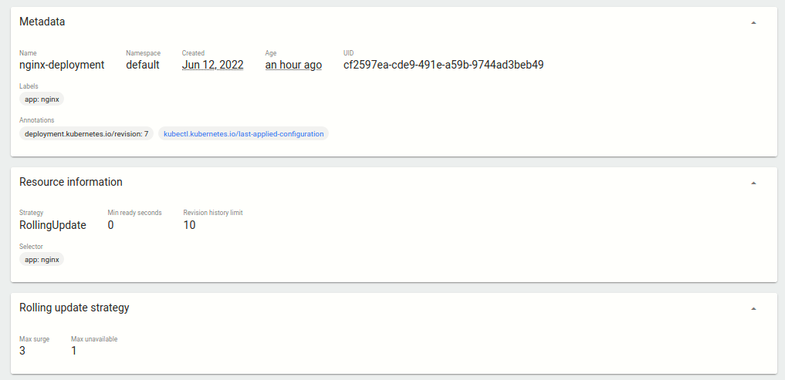

W tej strategii można prowadzić aktualizację w ramach wdrożenia bez przew w jego działaniu dzięki krokowemu aktualizowaniu kolejnych podów. Można dodać opcjonalnie dwa parametry: maxUnavailable - maksymalna liczba podów które mogą być niedostępne podczas procesu aktualizacji; maxSurge - maksymalna liczba podów, które mogą zostać utworzone powyżej pożądanej liczby replik. 

Dla strategii ```Canary Deployment workload```:

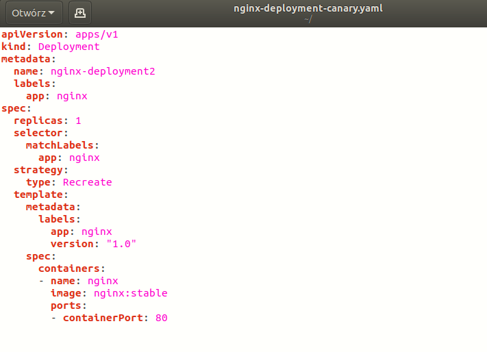


W tej strategii wdrażana jest nowa wersja obok istniejącej, stabilnej. Stosuje się ją w celu zmniejszenia ryzyka związanego z wydaniem nowej wersji.