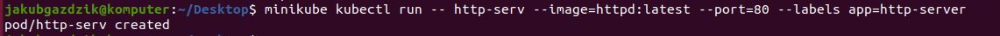
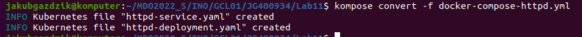
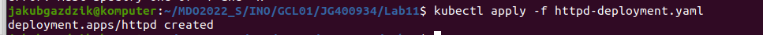

Instalacja minikube:


Start minikube:


Załączenie dashboardu:


Uruchomienie wybranego oprogramowania. W tym przypadku serwer HTTPD





Port Forwarding:


Konwersja do pliku yaml kubernetesa:

Do konwersji użyłem narzędzia Kompose.

Użyty do tego docker-compose:


```
version: "3"

services:
  httpd:
    image: httpd:latest
    ports:
      - "8080:80"

```





Gotowy plik do wdrożeń:


Wdrożenie go:





