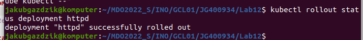
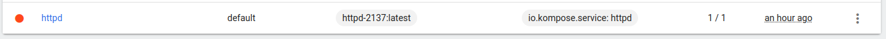
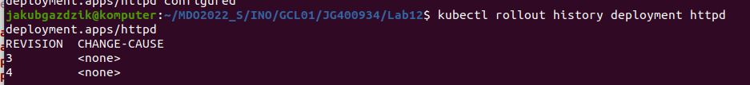
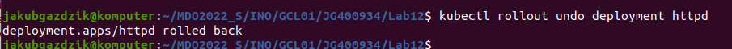
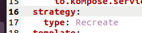
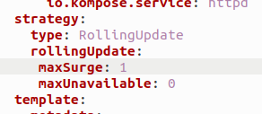
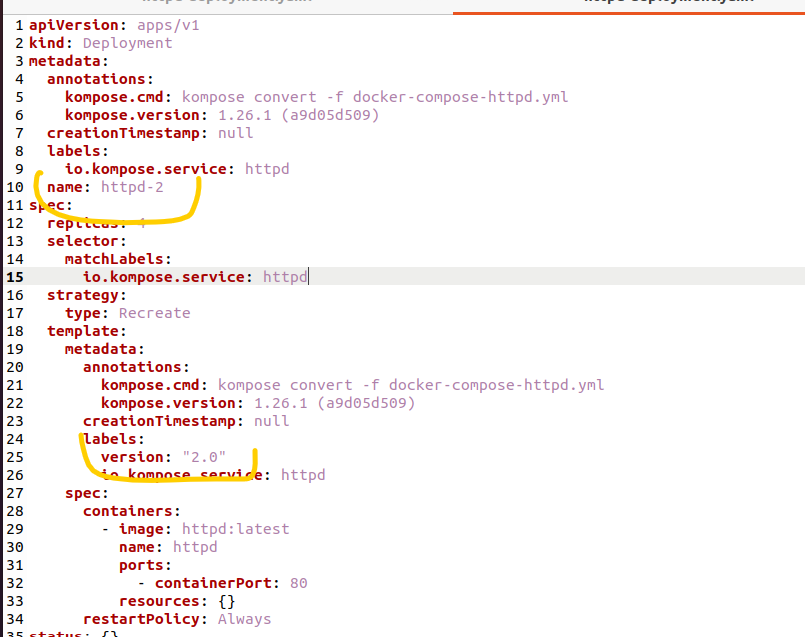

4 Repliki:


Apply to było już w zeszłym labie to nie robie screenów znowu tego samego.





Troche nie po kolei teraz robiłem, więc najpierw użycie różnych ilości replik.:


0 Replik:


1 Replika:


12 Replik:


Utworzenie obrazu ktorego wdrozenie zakonczy sie bledem:


Wdrożenie go:





Przywrócenie poprzedniej wersji, oraz pokazanie historii








Skrypt ktory sam bedzie sprawdzal czy wszystko poszlo dobrze po minucie:


```
#!/bin/bash

kubectl apply -f httpd-deployment.yaml

sleep 60

check=$(kubectl rollout status  deployment/httpd)
succ="successfully"

if [[ $check == *"$succ"* ]];
then
	echo "jest essa"
else
	echo "nie ma essy"
	kubectl rollout undo deployment httpd
fi
```


Strategie wdrożeń:


Recreate:





RollingUpdate:





Canary Deployment:


Tu jest trochę inaczej, należy utworzyć drugi plik wdrożeniowy yml, z inną nazwa/labelem. Wdrażamy to na kubernetesa, migrujemy dane/klientów do nowego deploymentu, i dopiero wtedy wyłączamy stary.





Dodatkowo w plikach znajdują sie pliki yml, docker build, docker-compose użyte do tego ćwiczenia.
