# Sprawozdanie 12
# Jan Król - Łęgwoski Inżynieria Obliczeniowa GCL01

## Konwersja wdrożenia ręcznego na wdrożenie deklaratywne YAML

1. W lab 11 wykonałem przysłowiowe minimum, decyduje się na użycie obrazu serwera httpd
*https://hub.docker.com/_/httpd*.
 Jak ostatnio dla wygody użytkowania łączę się przez SSH za pomocą programu `PuTTy` 

```minikube kubectl run -- http-server --image=httpd:latest --port=80 --labels app=http-server```

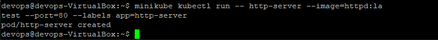

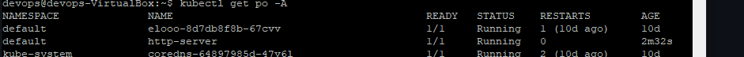

Przekierowuję port
```kubectl port-forward http-server 8080:80```

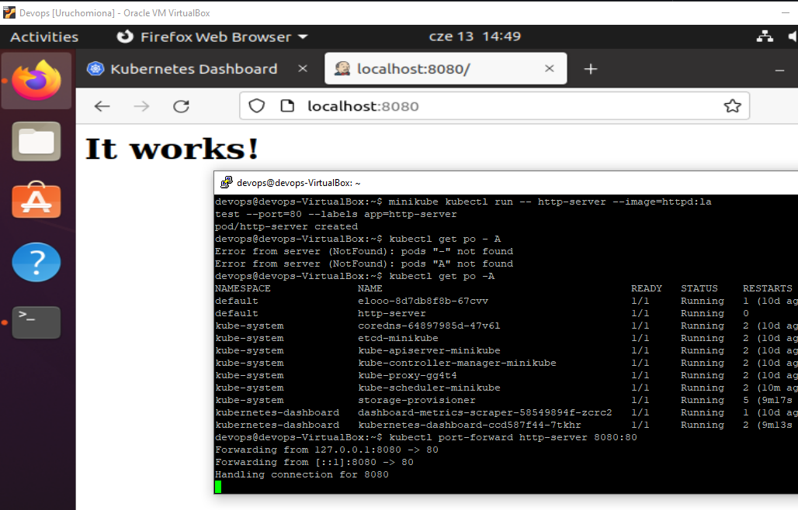


2. Intsaluję nardzędzie `kompose`

```sudo snap install kompose```

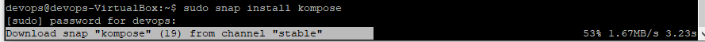

 Plik ```docker-compose-httpd.yml``` wykorzystałem do konwersji do pliku *yaml* kubernetesa za pomocą komendy 
 
 ```kompose convert -f compose-httpd.yml``
 
Plik przerzuciłem za pomocą `FileZilla`

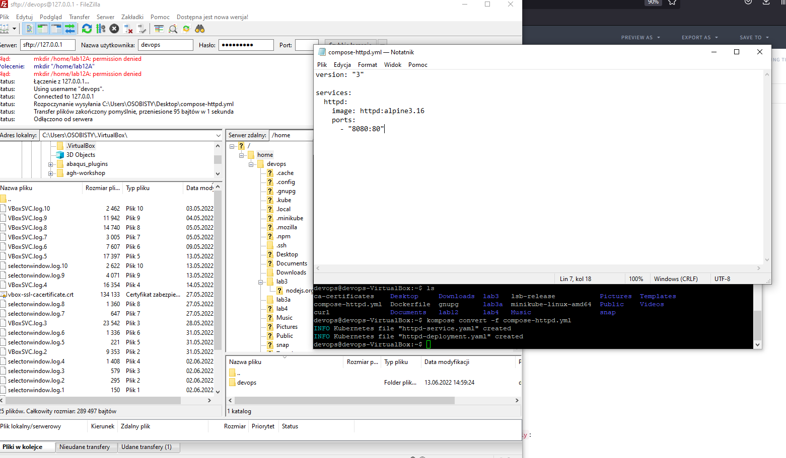


3. Wygenerowany plik do wdrożeń:

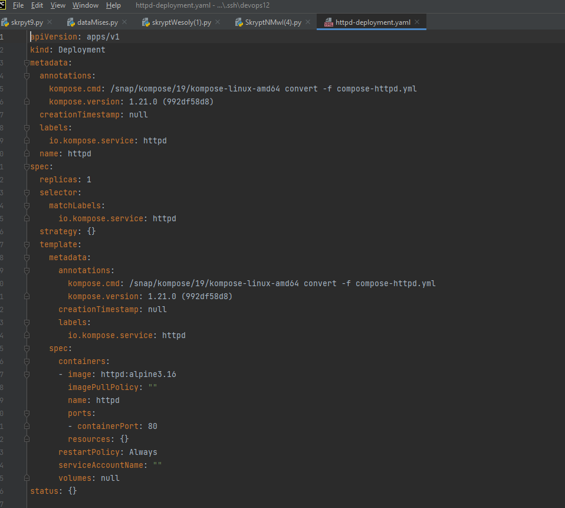

4. Wdrożenie za pomocą ```kubectl apply``` i badanie statusu ```kubectl rollout status```:

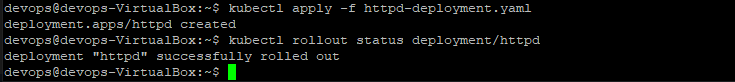

## Przygotowanie nowego obrazu i zmiany w deploymencie

1. Manipulacja ilością replik:

- jedna:
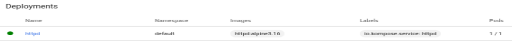

- zero:

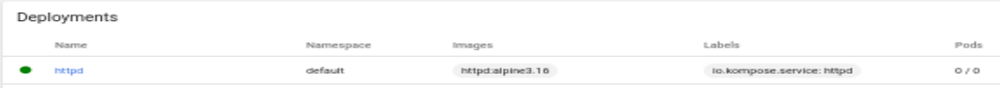

- cztery:

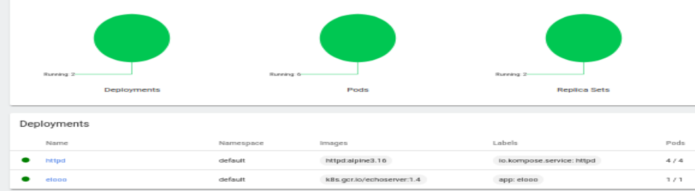


2. Nowa/stara wersja obrazu: ```httpd:2.4-alpine```

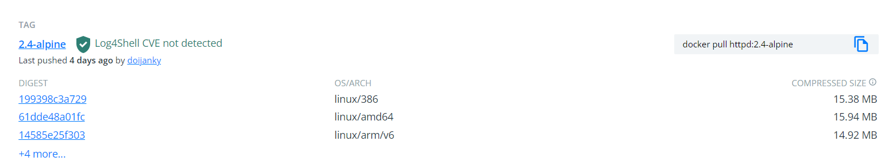


3. Zastosowanie starej wersji:

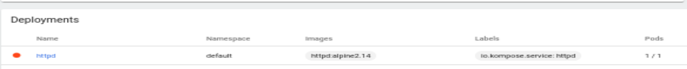


4. Przywrócenie poprzedniej wersji:

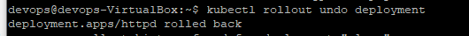

## Kontrola wdrożenia

1. Skrypt weryfikujący wdrożenie (timeout 60s)

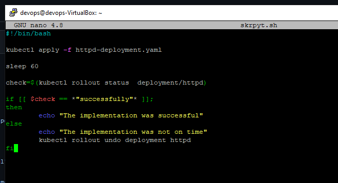

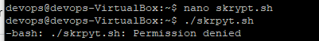

Pojawił się problem, naszemu skryptowi trzeba nadać 'execute permission'
``` chmod +x skrpyt.sh ```

Dałem sleep 5 by pokazać niepowodzenie 
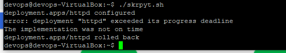

## Strategie wdrożenia

1. Recreate

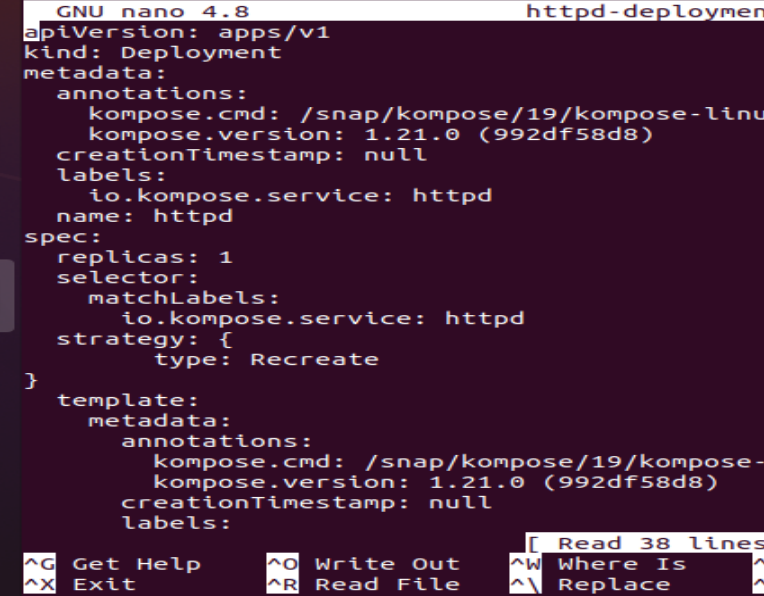
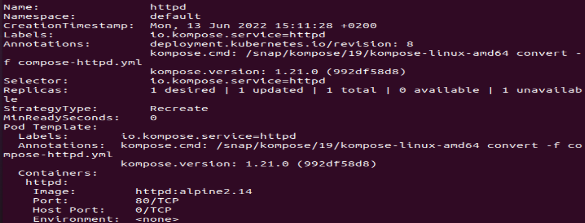


2. Rolling Update

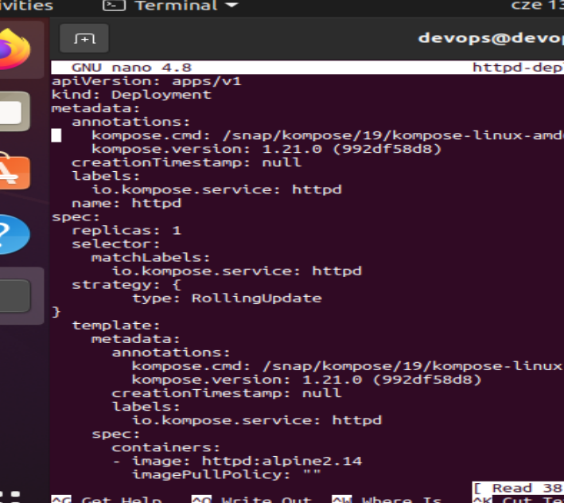
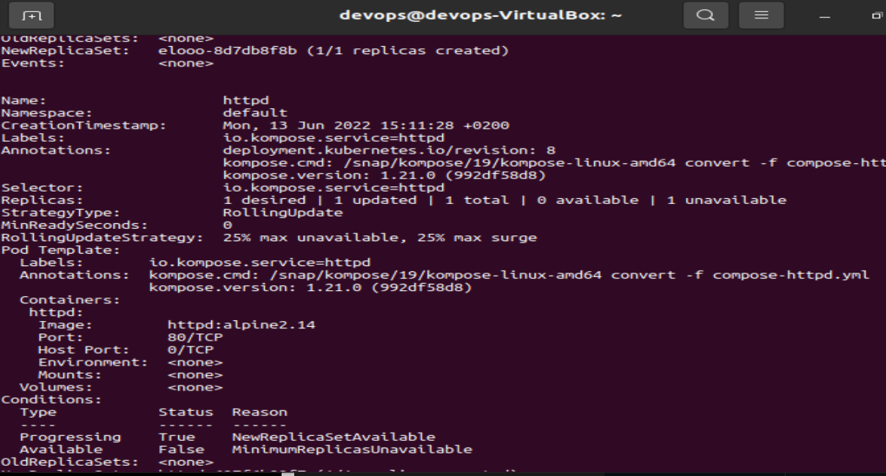


3. Canary Deployment workload

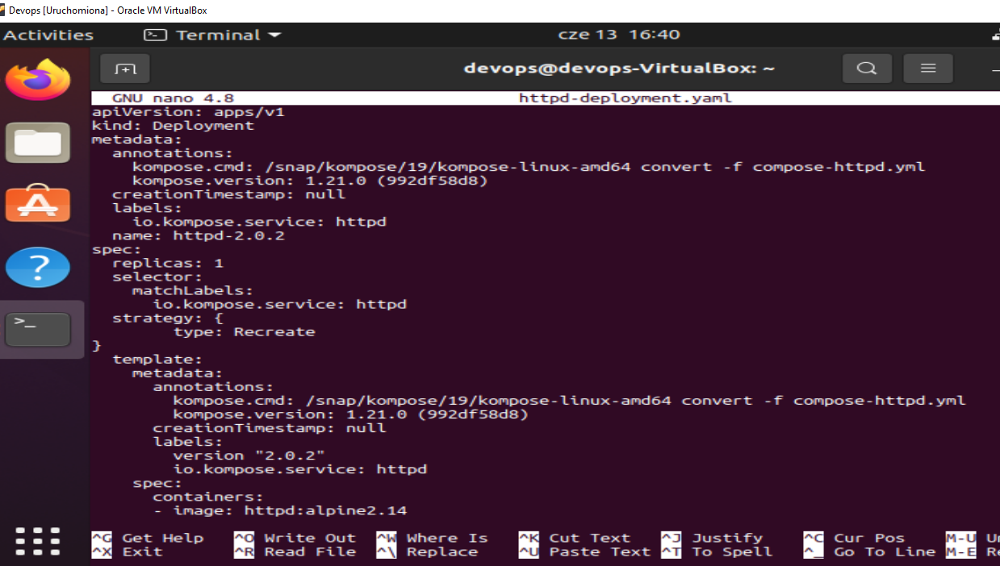
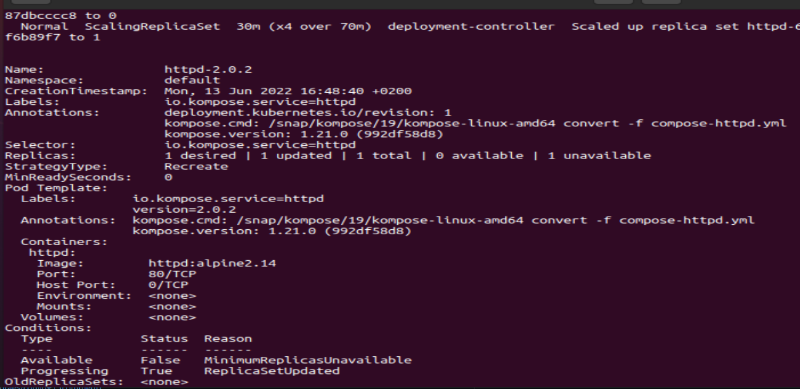

4. Różnice:

- Recreate - Wszystkie istniejące pody są zabijane, zanim zostaną utworzone nowe.

- Rolling Update - Wdrożenie aktualizuje pody w sposób stopniowej aktualizacji. Można  kontrolować proces aktualizacji kroczącej za pomocą parametrów.

- Canary Deployment workload - korzysta z podejścia progresywnego, przy czym jedna wersja aplikacji obsługuje większość użytkowników, a inna, nowsza wersja obsługuje niewielką pulę użytkowników testowych. Wdrożenie testowe jest wdrażane dla większej liczby użytkowników, jeśli się powiedzie.


