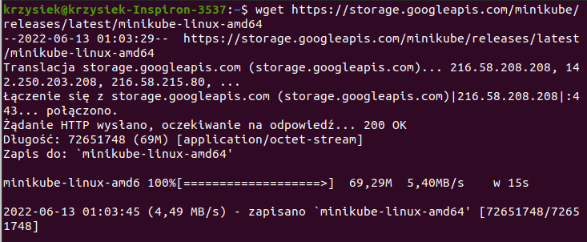
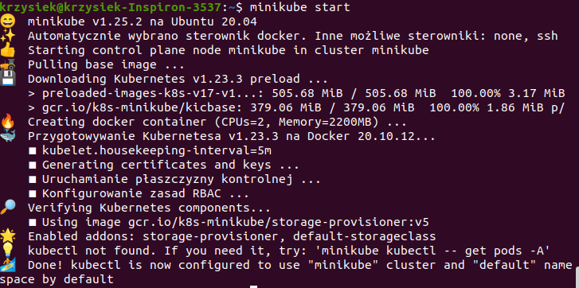
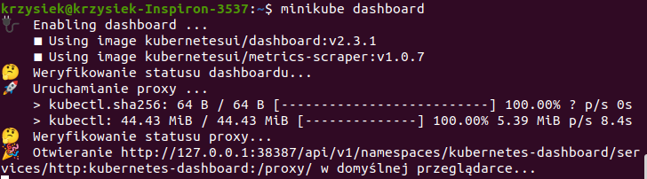
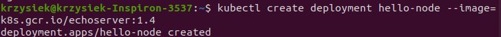
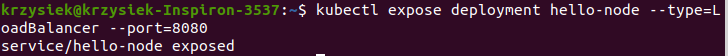
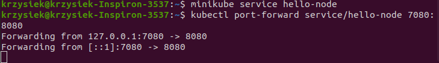
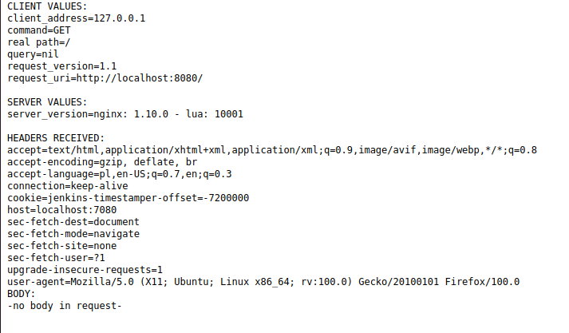
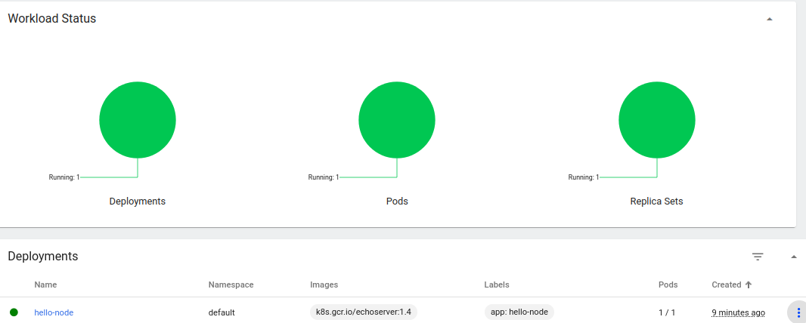
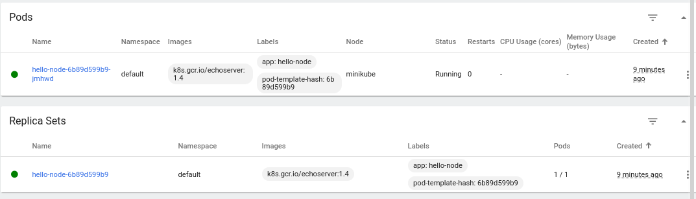

# Krzysztof Maurek #
## Inżynieria Obliczeniowa, gr. 1 ##
### Sprawozdanie 8 ###
Na początku instaluje minikube  
  
Następnie uruchamiam minikube  
  
Załączam dashboard  
  
W kolejnym kroku uruchamiam wybrane oprogramowanie.  
  
Dalej stworzyłem deploya i eksponowałem go na port 8080  
  
Na koniec przekierowałem porty aby można było wejść przez http://localhost:7080/ na aplikacje  
  
  
Widok z dashboardu  
  
  
