# Sprawozdanie

### Maciej Cholewa

### Część pierwsza 

1. Do wykonania tych labolatoriów, wykorszystam Ubuntu 18.04 postawionego w Virtual Boxie, dając dostęp do 3 rdzeni oraz 6gb ramu w celu spełnienia wymagań kubernetesa.

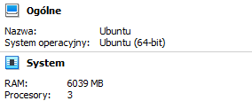

2. Zainstalowałem minikube

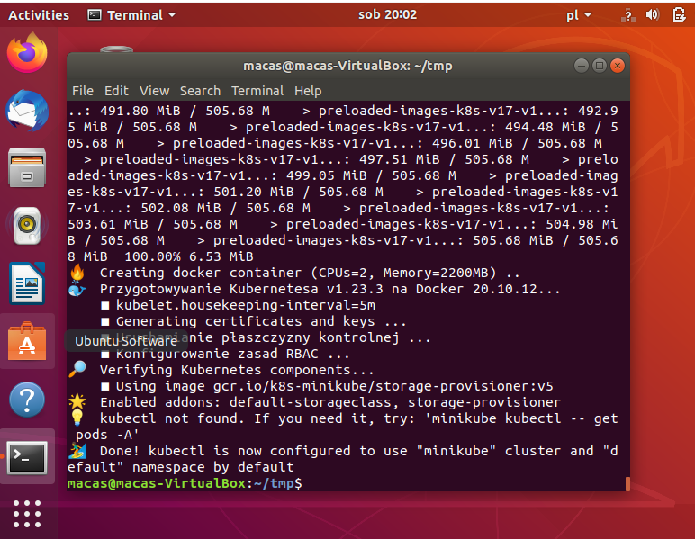

3. Sprawdziłem czy kubernetes działa w dockerowym kontenerze

        docker ps

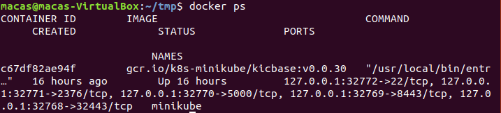

3. Zaopatrzyłem się w polecenie  **kubectl**, dokonując interakcji z clustrem

        minikube kubectl -- get po -A

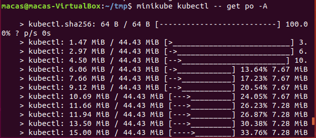

4. Następnie wykonałem polecenie 

        minikube dashboard

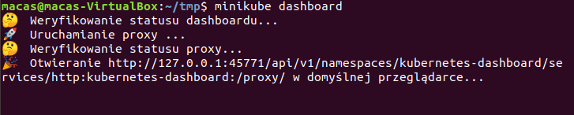
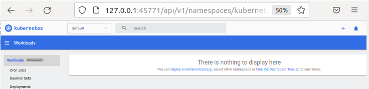        

5. Moja poprzednia aplikacja, nie nadaję się, do wdrożenia na chmurę, gdyż jest **smart contracterm** - wymaga interakcji z użytkownikiem. Do wdrożenia na chmurę wybrałem **klaster solany**, który obsluguje transakcje w sieci solana. 

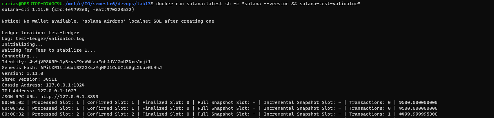

6.  Wdrożyłem obraz na poda

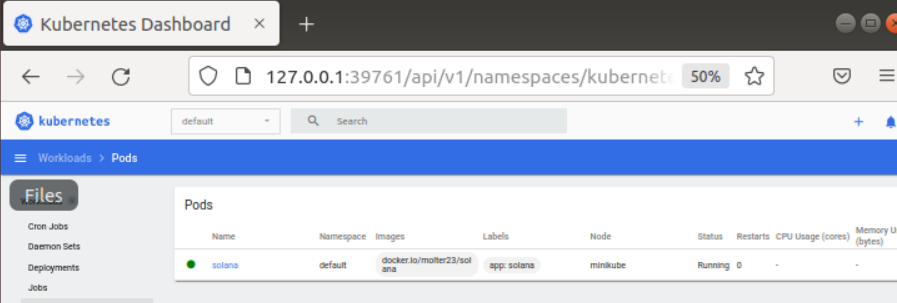

        minikube kubectl -- solana --image=docker.io/molter23/solna --port=80 --labels app=solana -- sleep infinity 

Niestety, na typ etapie miałem kilka błędów.  Pierwszym był problem z wdrożeniem obrazu który mam lokalnie. Udało mi się go rozwiązać używając obrazu, który zmaieściłem na **dockerhuie** robiąc labolatorium 13. 

Kolejnym napotkanym problemem, było **crash loop back-off**, gdyż kontener zakańczał pracę, gdy wykonał pracę tj. komendy z dockerfila i wpadał w nieskończoną pętle. Udało mi się to pokonać dodając komendę sleep infinity, co teoretycznie pozwala na wykonanie później **kubectl exec**

Kolejnym problem, jest wykonanie kubectl exec na  podzie. Aby wystartować klaster solany, potrzebyje wykonać w kontenerze komendę **solana-test-validator**. Niestety nie udało mi się tego zrobić. 

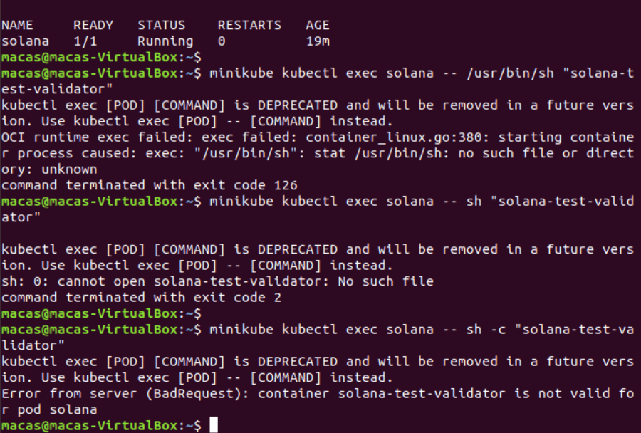

7. Z dokonanego wdrożenia uzyskałem plik **deploy.yaml**

        minikube kubectl get pod -- solana -o yaml > deploy.yaml

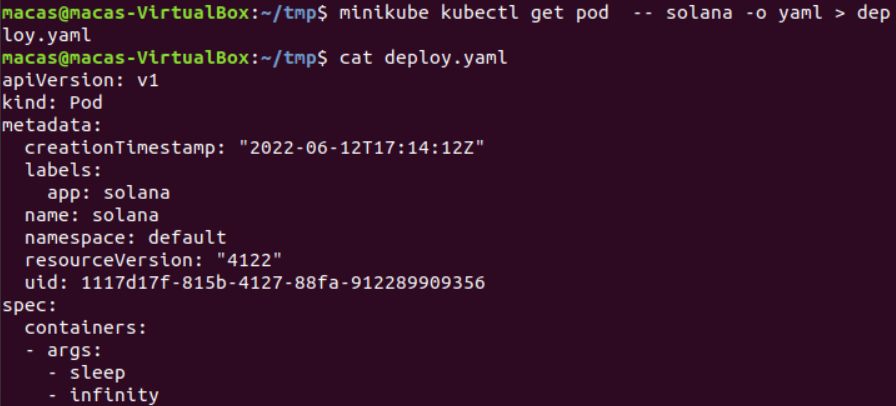

8. Następnie użyłem pliku **deploy.yaml** do utworzenia poda. 

        minikube kubectl create -- -f ./deploy.yaml

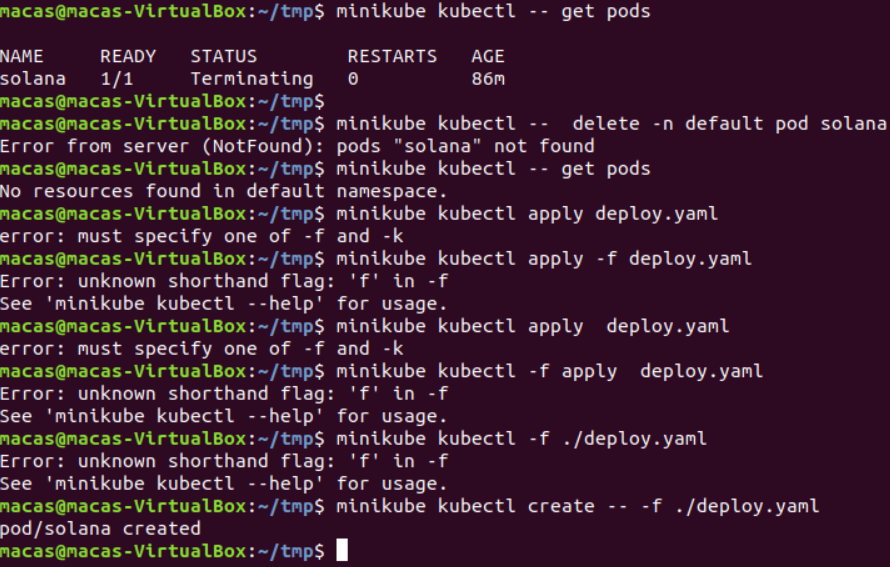
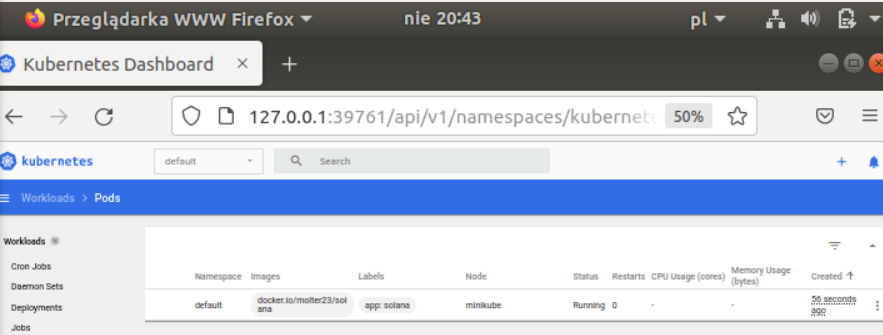