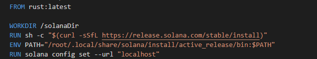
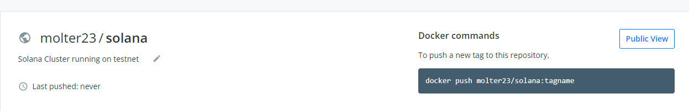
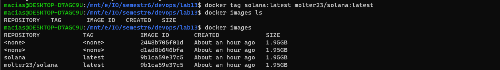
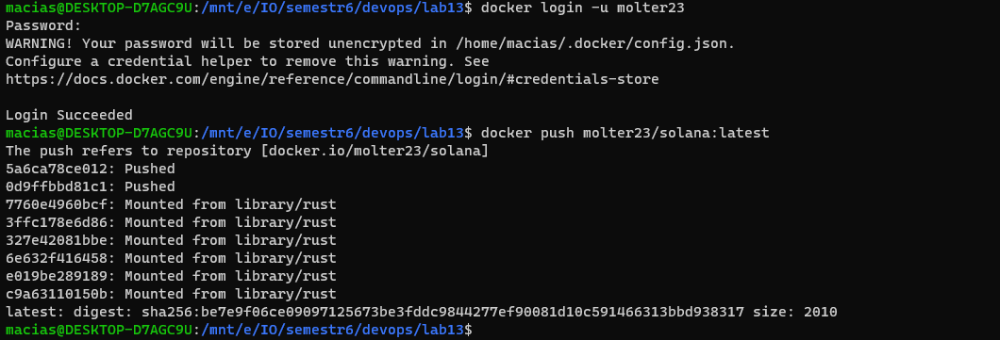
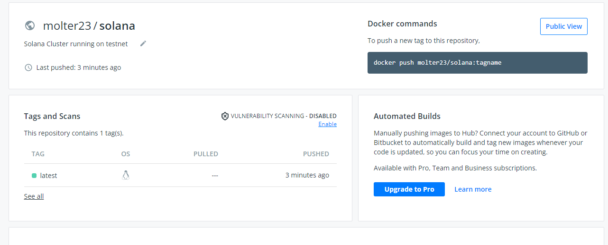
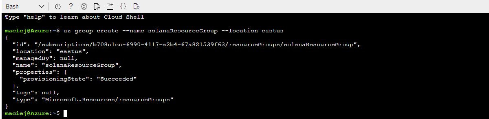
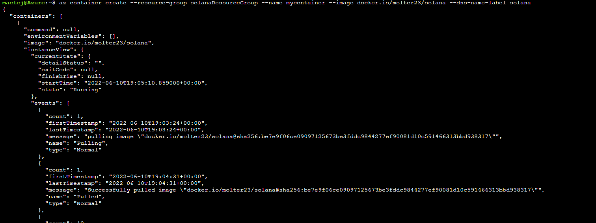
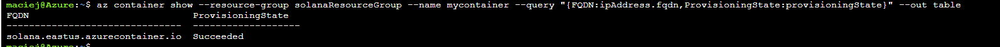
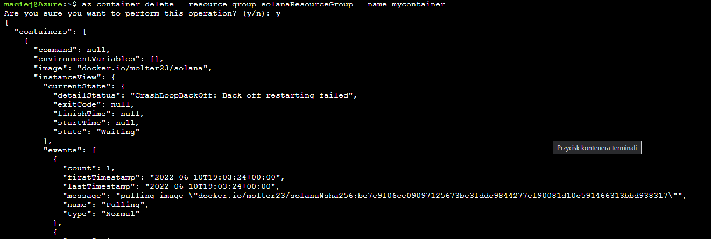

# Sprawozdanie

### Maciej Cholewa

1. Przygotowałem dockefile dla mojej aplikacji: - cluster solany (Solana cluster is a set of validators working together to serve client transactions and maintain the integrity of the ledger) 

Sprawdziłem działania aplikacji oraz poprawność działania dockefila lokalnie

    docker build  -t solanavalidator  .
    docker run solana:latest sh -c "solana --version && solana-test-validator"

2. Następnie stworzyłem repozytorium na **dockerhubie**, nadałem obrazowi tag oraz wrzuciłem go na repozytorium

    docker tag solana:latest molter23/solana:latest
    docker login -u molter23
    docker push molter23/solana:latest

3. Następnie uruchomiłem powłokę w microsoft azure, stworzyłem **resource group**

        az group create --name solanaResourceGroup --location eastus

Wdrożyłem kontener

        az container create --resource-group solanaResourceGroup --name mycontainer --image docker.io/molter23/solana --dns-name-label solana

Następnie sprawdziłem czy wdrożenie zadziałało poprawnie oraz usunąłem **kontener** oraz **resource group**

    az container delete --resource-group solanaResourceGroup --name mycontainer
    az group delete --name solanaResourceGroup

