### Sprawozdanie Lab.12 (Wdrażanie na zarządzalne kontenery: Kubernetes (2))
## Michał Korzym Inżynieria Obliczeniowa

# Konwersja wdrożenia ręcznego na wdrożenie deklaratywne YAML

w poprzedniej części nie zawarłem konfiguracji pliku YAML skupiłem się na naprawie błędów i konfiguracji. Uprzednio pracowałem z obrazem httpd i nginx co jest uwiecznione na screenach. Postanowiłem się skupić na httpd, ponieważ korzystanie z własnego obrazu nodejs nad którym pracowałem podczas projektu z pipelinem mnie przerosło.

- Upewnij się, że posiadasz wdrożenie z poprzednich zajęć zapisane jako plik.

Prace rozpoczynam od uruchomienia obrazu *httpd:latest*, a następnie jego przekierowania na odpowiedni port. Na końcu wyświetlam wynik poprzez odpytanie loopback'a na porcie 8080.

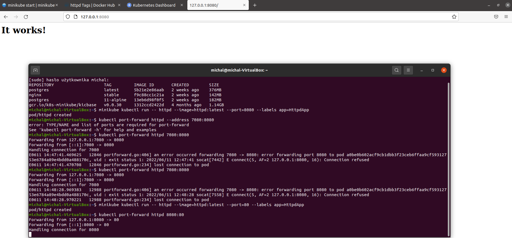

Kolejno tworze plik "jamlowy" *httpd-compose.yml*. Wersja 3, nazwa  *apache*, obraz httpd z najnowszym tagiem oraz port. 

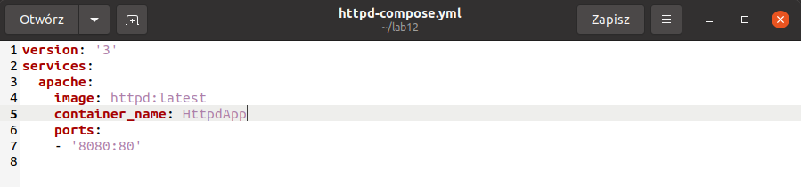

Aby skonwertować plik  "jawlowy" do  pliku obsługiwanego  przez kubectl korzystam z polecenia/narzędzia *kompose convert*.

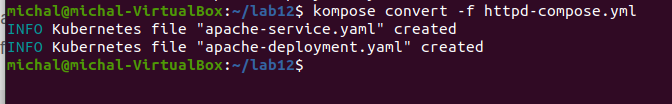

Poniżej plik wdrożenia.


Następnie przechodzimy do automatycznego wdrożenia dzięki plikowi .yml. Korzystam z komendy ```kubectl apply -f apache-deployment.yml```.

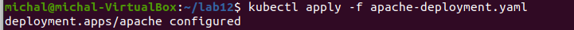

Potwierdzenie w DashBoardzie.

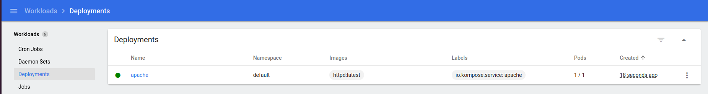

- Wzbogać swój obraz o 4 repliki.

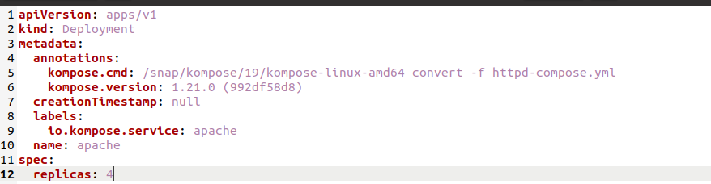

- Rozpocznij wdrożenie za pomocą kubectl apply i zbadaj stan za pomocą kubectl rollout status.

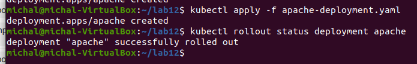

# Przygotowanie nowego obrazu.

Jako obrazu alternatywnego użyłem wersji *2.4.54-alpine*.

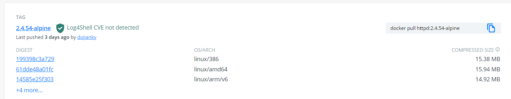

# Zmiany w deploymencie.

- zmniejszenie liczby replik do 1

Zmiany w piku wdrożeniowym rozpoczynam od ustalenia replik na wartość równą 1. Ponadto potwierdzam poprawność deploya screenem.

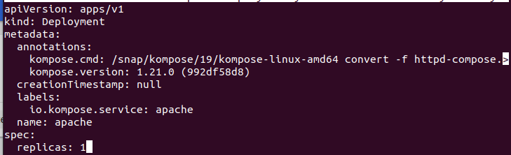

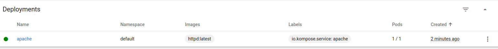

- zmniejszenie liczby replik do 0.

Zmiana na 0 replik.

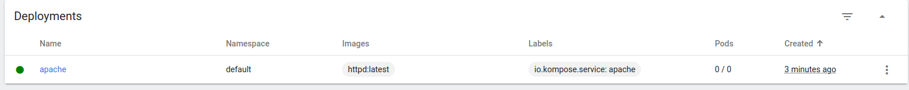


- utworzenie 4 replik.


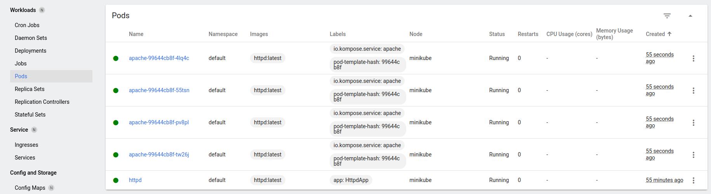

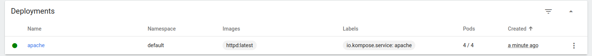

- zastosowanie nowej wersji obrazu.

Powyżej.

- zastosowanie starszej wersji obrazu.

Tak jak wspominałem powyżej skorzystam ze starszej wersji 2.4.54. Deployuje ją a kolejno przywracam za pomocą polecenia ```kubectl rollout undo``` przywracam nowszą wersję *latest*.

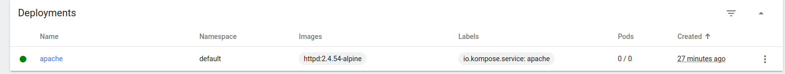

Jak już wspomniałem powyżej przechodze do przywracania wcześniejszej wersji.


# Kontrola wdrożenia

- Napisz skrypt weryfikujący, czy wdrożenie "zdążyło" się wdrożyć (60 sekund).

Skrypt *checkingStatus.sh* weryfikuje poprawność wdrożenia. Początkowo wdrażamy deployment, następnie wywołujemy sleepa na 60 sekund. Pobieramy status komendy *rollout status* . Przechodząc dalej korzystam z instrukcji warunkowej i porównuje zwrócony status ze stringiem ```successfully```. W pozytywnym przypadku wyświetlam wydruk *zaakceptowany* oraz wywołuje ```rollout status```. W przeciwnym wypadku wyświetlam *nie zaakceptowany* oraz wyświetlam status i przywracamy starą wersje. 

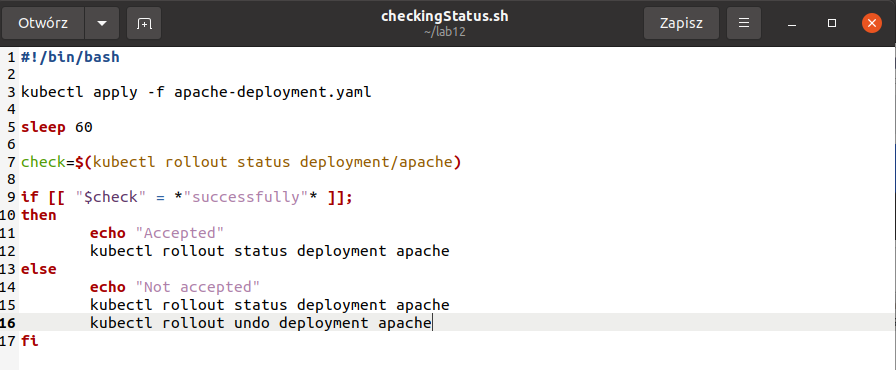

Poniżej przedstawiam działanie skryptu/

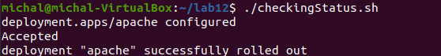

# Strategie wdrożenia 

Strategie wdrożenia to nic innego jak sposoby zmiany lub update'u aplikacji. Dobór strategi definiuje to czy podczas wykonywania wdrożenia nie będzie przestojów/awarii i jak szybko i sprawnie klient dostrzerze rezultat.

- Recreate, strategia ta charakteryzuje się zakończeniem działania instancji będących nieaktualnymi a następnie uruchomieniem ich ponownie w nowszej wersji. Wdrożenie to zapewnia nam ciągłość odnawiania stanu aplikacji, jednak czas przestoju wdrożenia jest sumą czasu zamknięcia oraz uruchomienia aplikacji. 

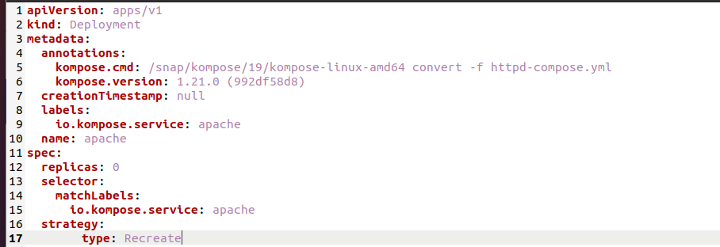

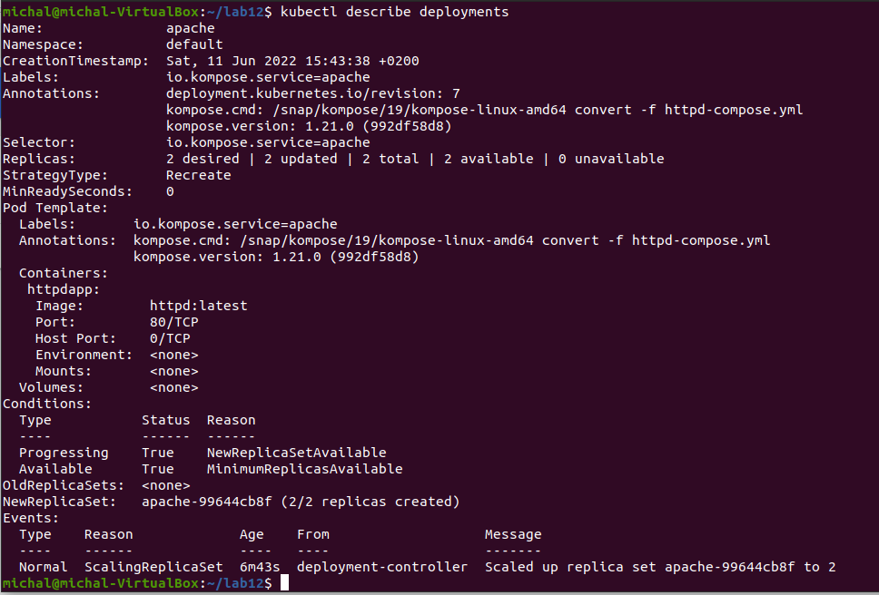

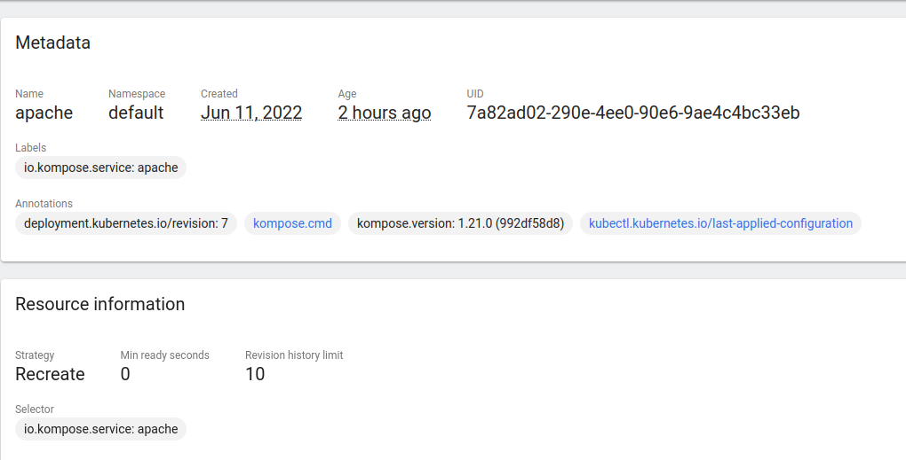

- Rolling Update, wdrażanie to prowadzi do stopniowej aktualizacji, ponadto tworzony jest dodatkowy zestaw podów z aktualną, nową wersją aplikacji. Kolejno pody ze starszą wersją aplikacji jest zmniejszana, a nowa wersja zwiększana. Proces ten jest kontynuuowany aż do osiągnięcia nominalnej liczby replik. Istotnymi argumentami są  *maxSurge* (mówiący o ilości podów jaką możemy dodać) oraz *maxUnavailable* określa ilość podów nieaktywnych. Wartości jakie im przypisujemy mogą być zarówno liczbowe jak i procentowe. Rozwiązanie to nadaje się do aplikacji stanowych, powoli wdrażana jest nowa wersja w pojedynczych podach. Minusem tego rozwiązania jest absorbcja czasowa, obsługa wielointerfejsowego API czy problem z  traffic control.

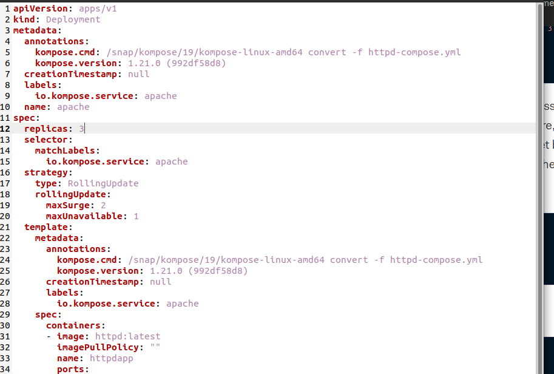

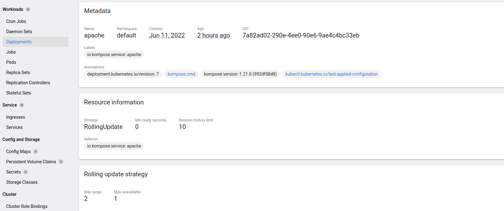

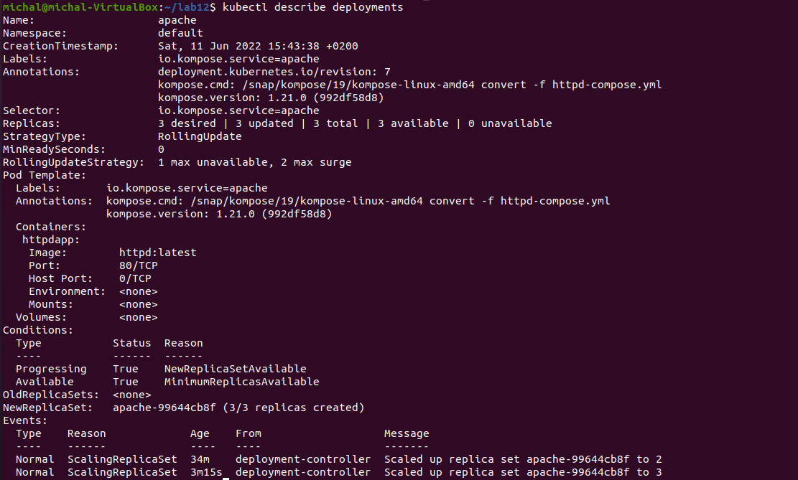

- Canary deployment workload

To wdrożenie opiera się na wdrażaniu nowego oprogramowania obok starszych stabilnych wersji, takie wdrożenie wykonujemy przy użyciu dwóch plików yamlowych  z różnymi labelami. Postępujące z czasem wdrożenie pozwala nam na zwiększanie podów z nowym wdrożeniem i rezygnacje ze starego. Działanie na tym wdrożeniu wymaga świadomości  w zarządzaniu ruchem, ponieważ jeśli przekierowujemy ruch na nową wersje to musimy mieć odpowiednią liczbe podów ze starą wersją aby obsłużyć ruch.

Plik yamlowy

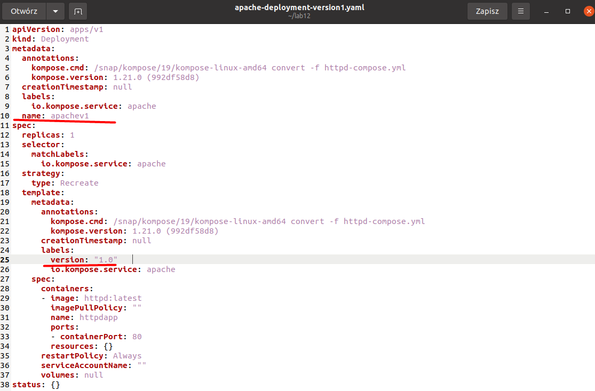

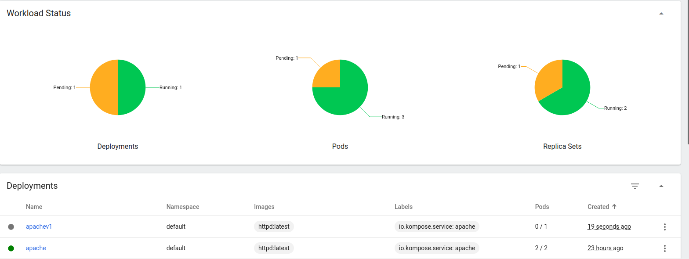

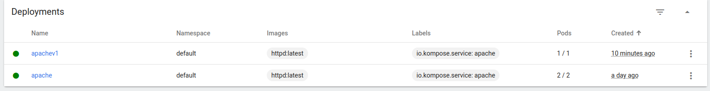

Pliki konfiguracyjne zamieściłem na repozytorium w folderze files.


