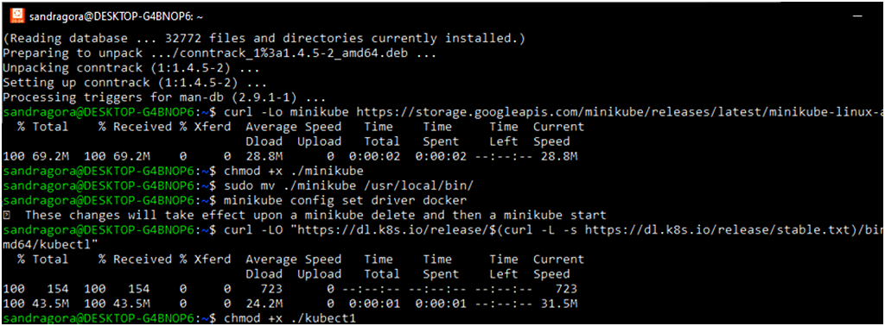
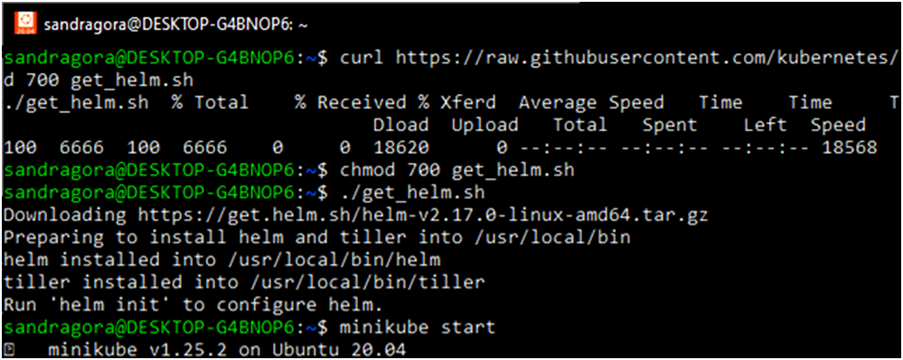
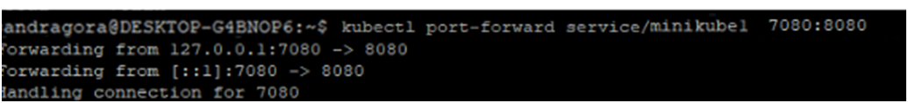
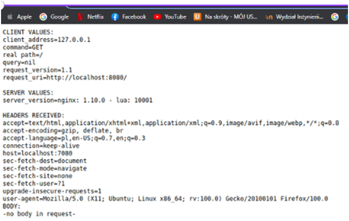
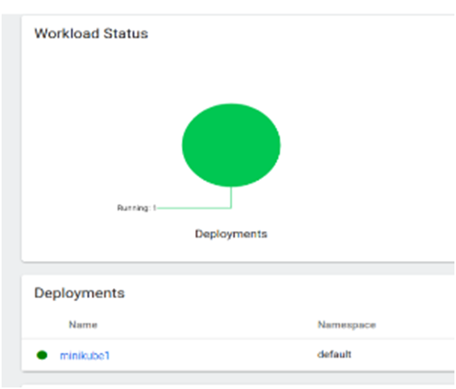
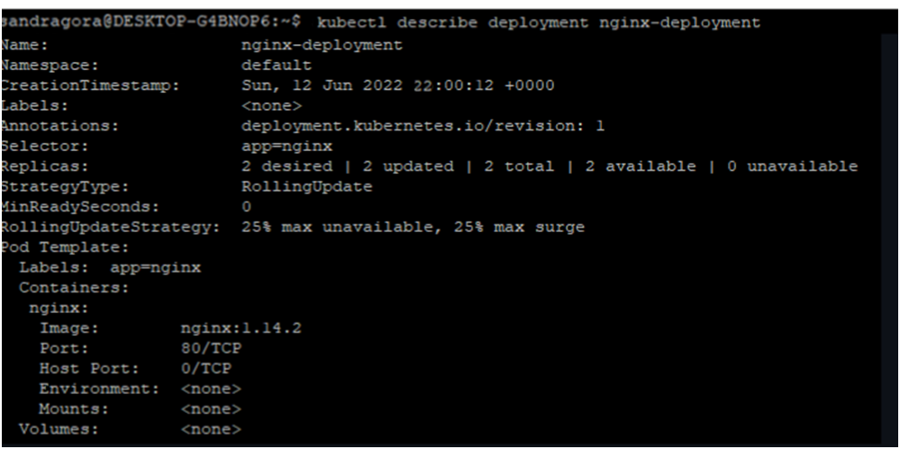
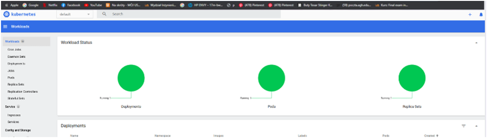

# Sprawozdanie nr 11
## DevOps – Sandra Góra – Nr albumu 404037
	
Przebieg laboratorium nr 11 :

1.	Instalacja oraz konfiguracja klastra Kubernetes :
 
 

 
 
   
   2. Analiza posiadanego kontenera:
   
 

 przekierowanie się na port 7080 i wysłanie requsta do localhost:7080 :
 
 

 

   3. Przekucie wdrożenia manualnego w plik wdrożenia (wprowadzenie) :
   
 

 
 
