# Sprawozdanie Lab11 Wiktoria Dęga Inżynieria Obliczeniowa 
## Wdrażanie na zarządzalne kontenery: Kubernetes (Część 1)
---
### Instalacja klastra Kubernetes

W pierwszym kroku skorzystałam z dokumentacji w internecie (https://minikube.sigs.k8s.io/docs/start/) w celu instalacji minikube. Za pomocą polecenia `curl -LO https://storage.googleapis.com/minikube/releases/latest/minikube_latest_amd64.deb` pobrałam najnowszą wersję minikube.
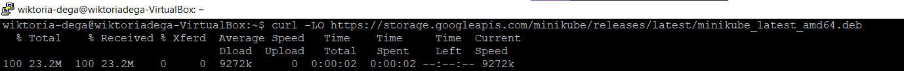

W kolejnym kroku uruchomiłam instalację przy użyciu polecenia `sudo dpkg -i minikube_latest_amd64.deb`.
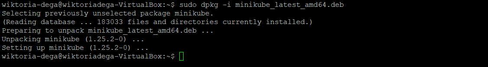

Następnie uruchomiłam klaster przy użyciu komendy z przełącznikiem `minikube start --driver=docker`, napotykając na problemy takie jak poniżej. Poza tym zadanie musiało zostać wykonane na innej maszynie wirtualnej z powodu zbyt małej ilości miejsca.
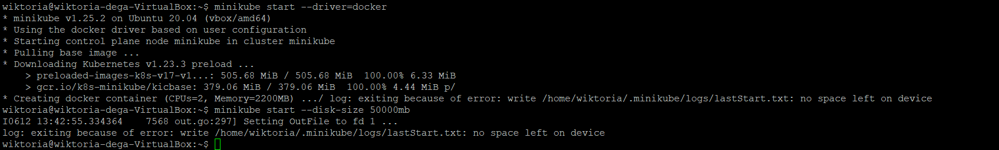
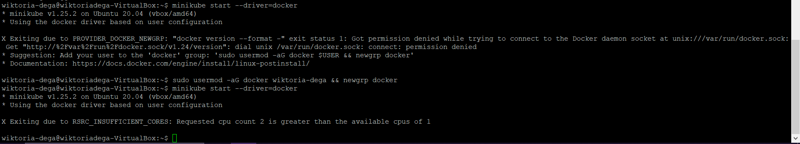

W celu zwiększenia wątków procesora zmieniłam ustawienia wirtualnej maszyny:
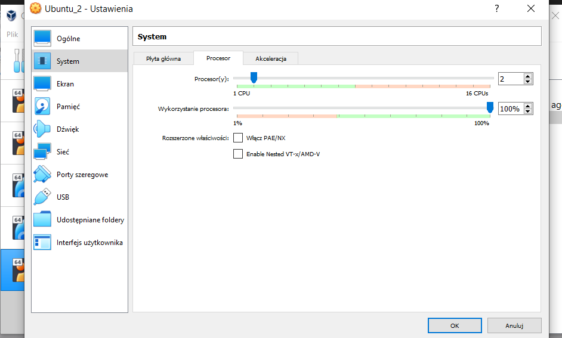

Ostatecznie problem został rozwiązany.
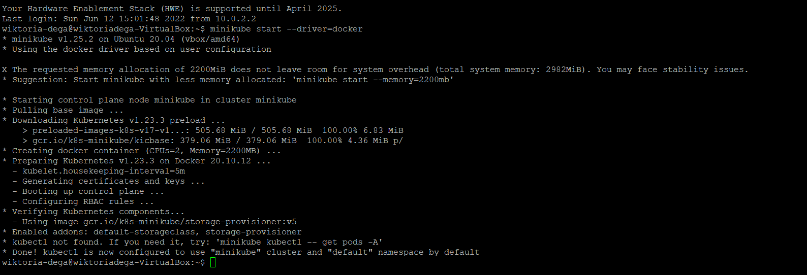

Zaopatrzyłam się w polecenie kubectl.
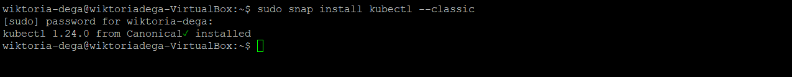

Następnie uruchomiłam polecenie `minikube kubectl -- get po -A`, w celu uzyskania dostępu do klastra.
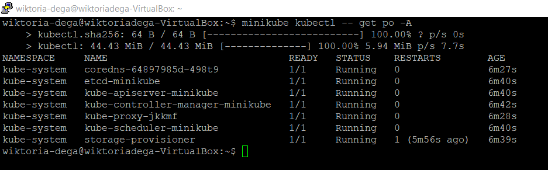

Za pomocą komendy `docker ps` pokazałam działający kontener.
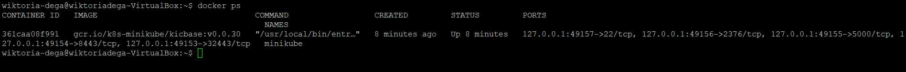

Podczas instalacji klastra jedyne ograniczenie stanowił 1 wątek CPU (co zostało rozwiązane poprzez zwiększenie do 2 wątków CPU), w związku z czym zostały spełnione podstawowe wymagania sprzętowe;
* 2 rdzenie dla procesora
* 3 GB pamięci RAM
* 60GB miejsca fizycznego
* kontener (Docker)

Poprzez komendę `minikube dashboard` uruchomiłam Dashboard:

Następnie przez localhosta dostałam się do Dashboardu w przeglądarce:
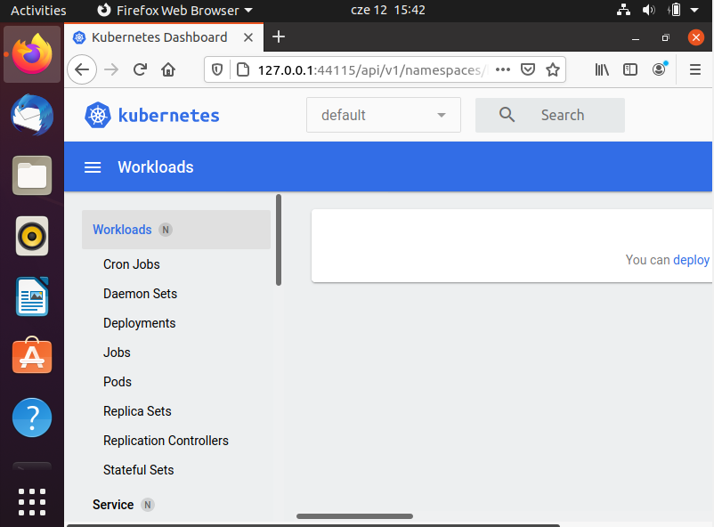
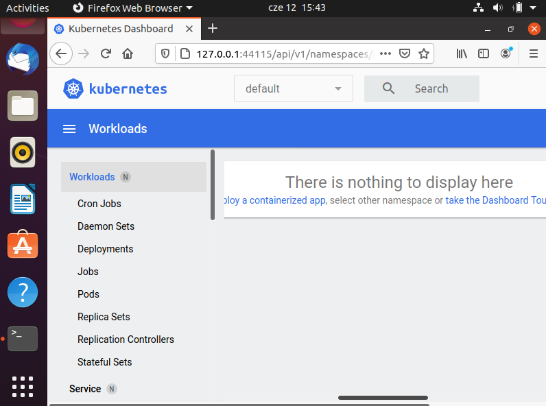

## Analiza posiadanego kontenera

Na początku zalogowałam się do Dockera
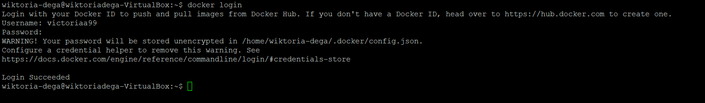

Deployowanym obrazem, który wykorzystałam był gotowy obraz `echoserver:1.4`.
Za pomocą polecenia `kubectl create deployment hello-minikube1 --image=k8s.gcr.io/echoserver:1.4` stworzyłam deployment.
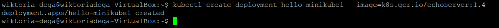

Następnie używam komendy `kubectl expose deployment hello-minikube1 --type=LoadBalancer --port=8080`, w celu wykonania kroku expose.
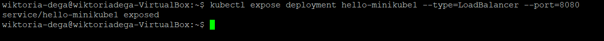

Z kolei przy pomocy `kube get services hello-minikube1` została przeze mnie włączona obsługa deploymentu. 
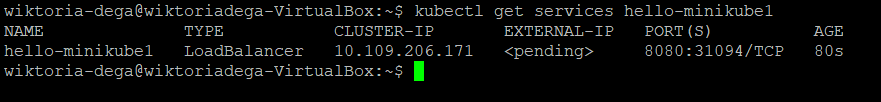

Następnie ma miejsce przekierowanie na port 7080 przy pomocy polecenia `kubectl port-forward service/hello-minikube1 7080:8080`
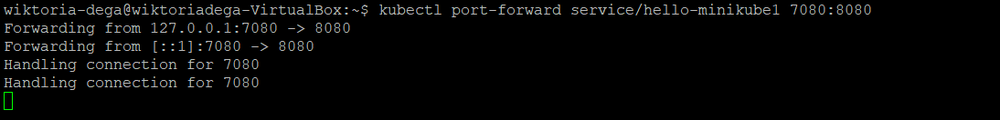

Po wysłaniu requesta do localhost:7080 :
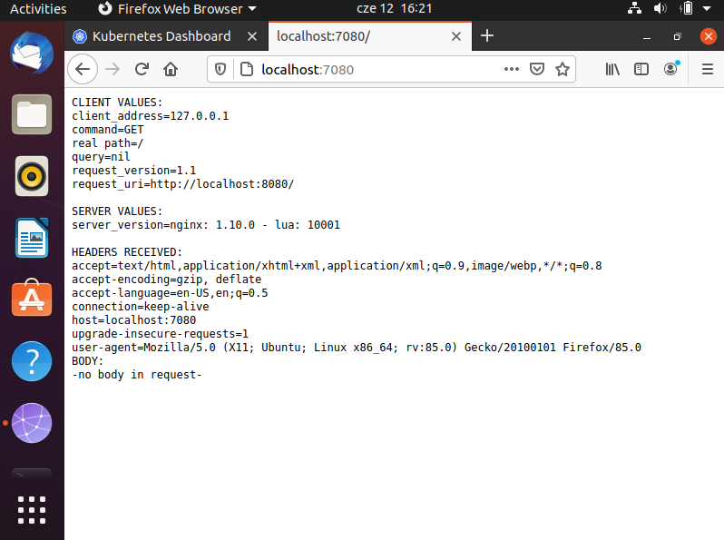

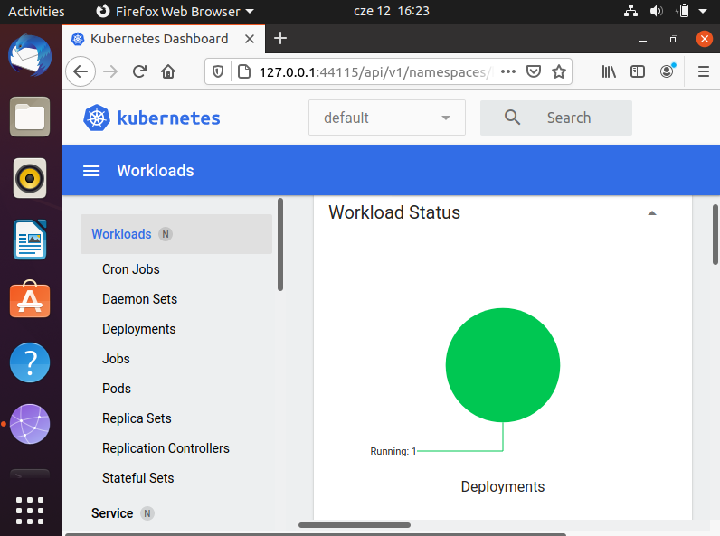

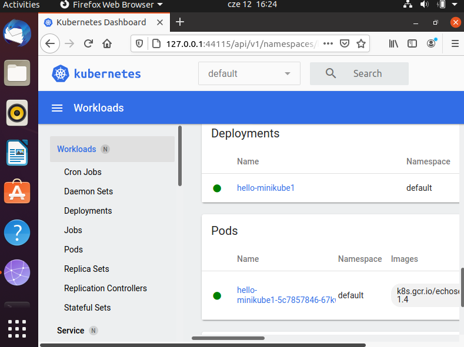

## Przekucie wdrożenia manualnego w plik wdrożenia (wprowadzenie)

W kolejnym kroku zapisałam wdrożenie jako plik YML, dodane zostały repliki.
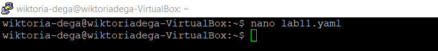
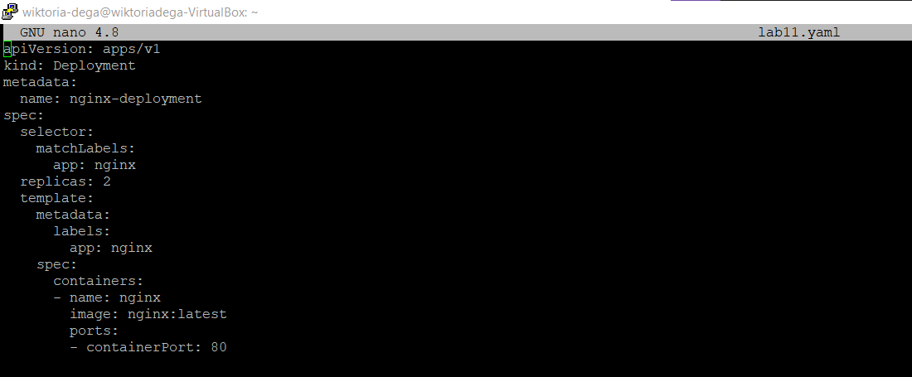
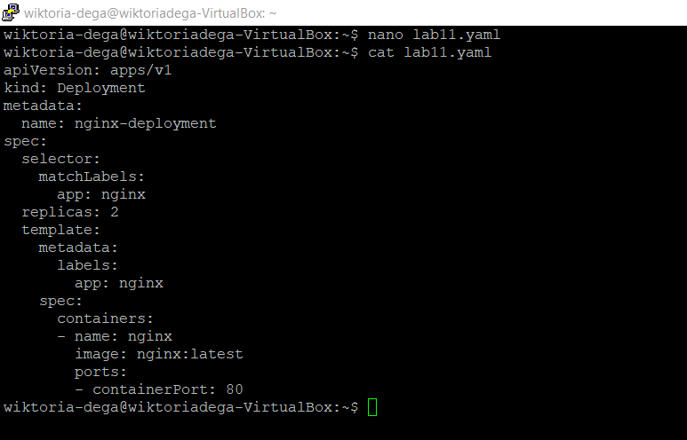

Skorzystałam z komendy `kubectl apply -f nginx-deployment.yaml` w celu stworzenia deploymentu na pliku YML.
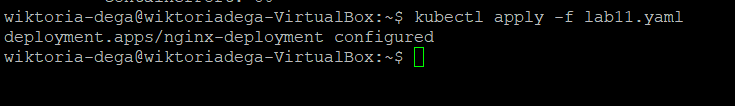

Sprawdzenie Dashboardu:

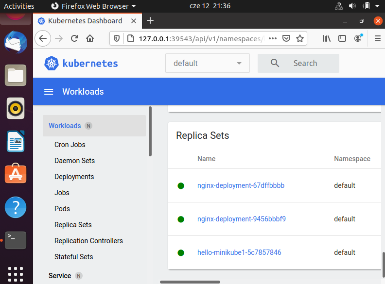
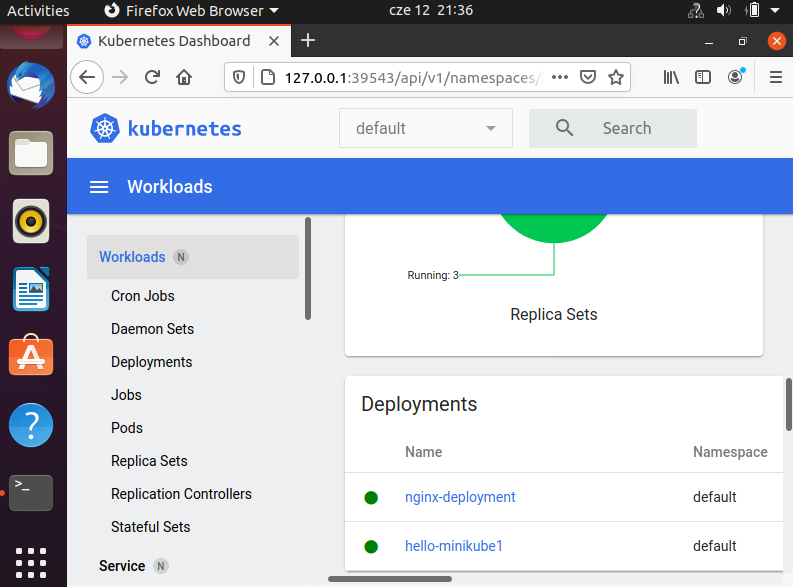