# Sprawozdanie Lab12 Wiktoria Dęga Inżynieria Obliczeniowa 
## Konwersja wdrożenia ręcznego na wdrożenie deklaratywne YAML
---
W wyniku wykonania zadań z lab11 stworzony został przeze mnie plik YAML (`lab11.yaml`).
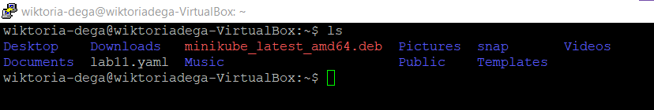

Najpierw wzbogaciłam swój obraz o 4 repliki. Następnie poprzez komendę `kubectl apply -f lab11.yaml` rozpoczęłam wdrożenie.
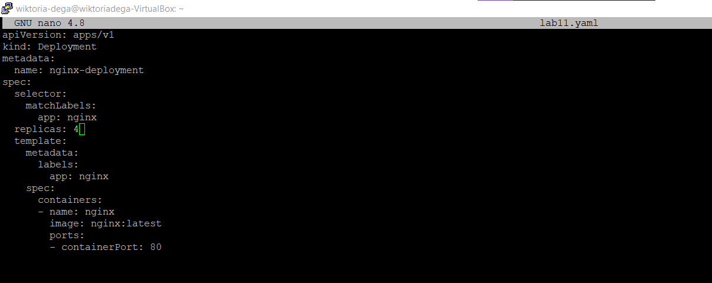
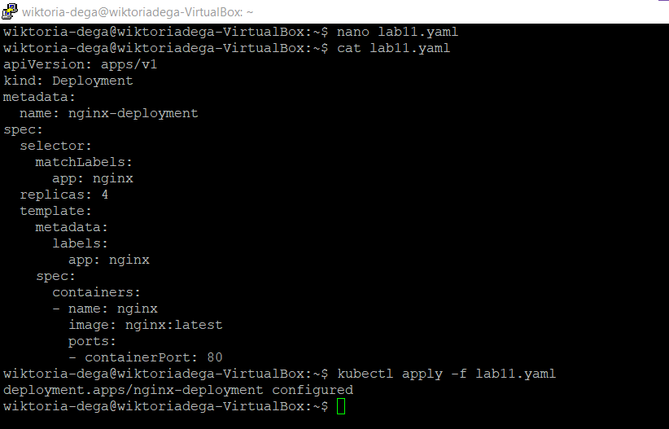

Sprawdzenie w Dashboardzie:
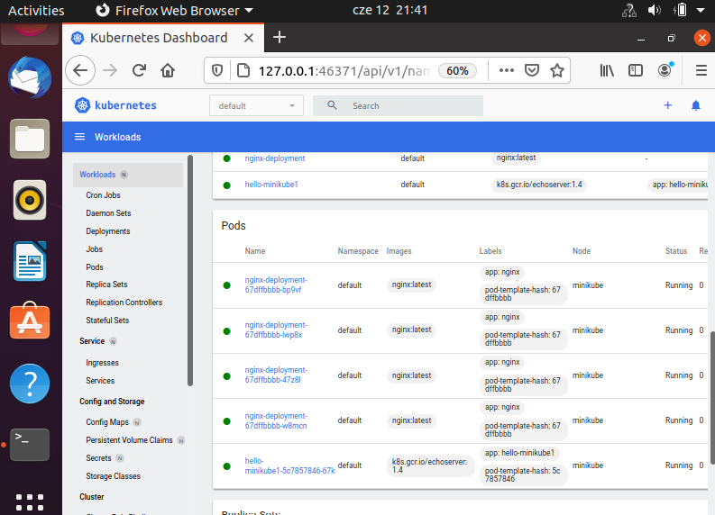

Następnie użyłam polecenia `kubectl rollout status deployment nginx-deployment`, w celu sprawdzenia stanu pliku.
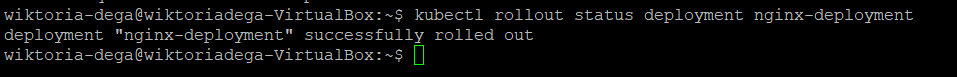

## Przygotowanie nowego obrazu

Użytą przeze mnie wersją obrazu nginx była wersja `nginx:1.14.2`

## Zmiany w deploymencie
W tym kroku przystąpiłam do aktualizacji pliku YAML z wdrożeniem. 
 * zwiększenie replik (powyżej)
 * zmniejszenie liczby replik do 1

Plik ze zmniejszoną liczbą replik i jego wdrożenie (niestety nie zrobiłam screena z użycia komendy `kubectl apply -f lab11.yaml`):
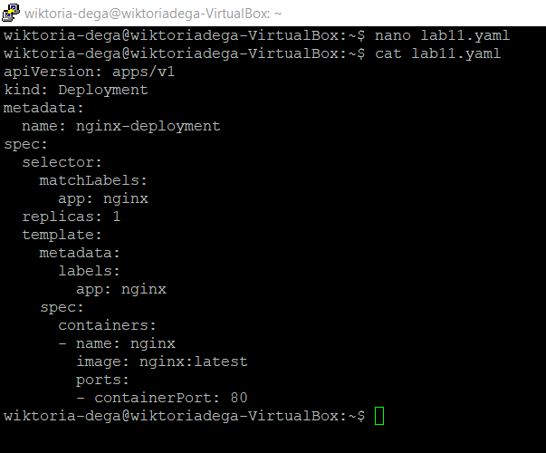
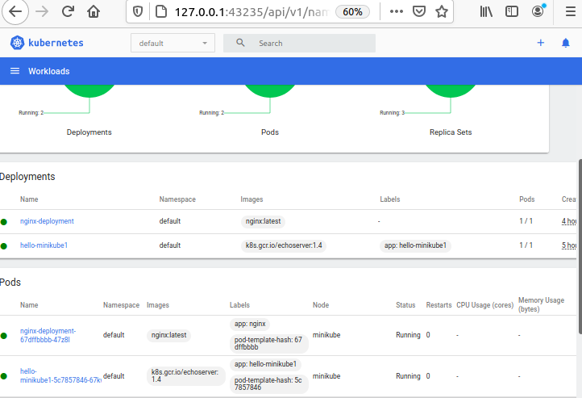
* zmniejszenie liczby replik do 0

Plik ze zmniejszoną liczbą replik i jego wdrożenie:
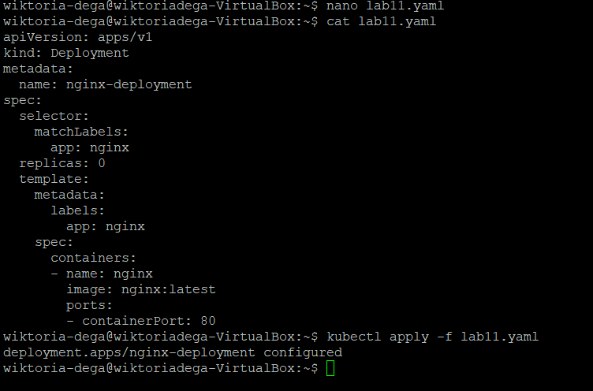
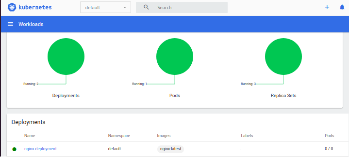
* zastosowanie nowej wersji obrazu (powyżej - wersja latest)
* zastosowanie starszej wersji obrazu (nginx:1.14.2)

Zmieniłam wersję obrazu na nginx:1.14.2
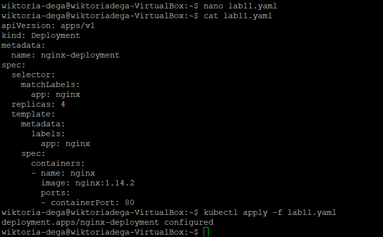
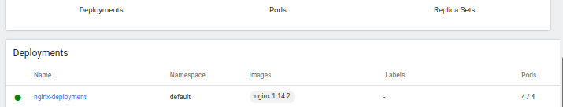

Następnie sprawdziłam historię wdrożeń za pomocą polecenia `kubectl rollout history deployment/nginx-deployment` oraz przywróciłam wersję obrazu nginx:latest używając polecenia `kubectl rollout undo deployment/nginx-deployment`. 
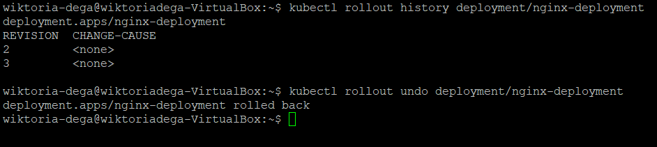
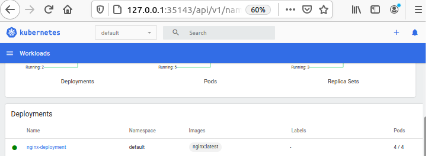

## Kontrola wdrożenia
W kolejnym etapie napisałam skrypt `script.sh`, w którym weryfikowałam, czy wdrożenie zaszło w czasie 60 sekund. Sprawdzane jest to przy użyciu `kubectl rollout status deployment/nginx-deployment` i `sleep 60`. Zastosowane zostały instrukcje warunkowe if, których wykonanie się (wdrożenie w ciągu 60 sekund) powoduje wypisanie odpowiednich komunikatów `success`/ `not success`.
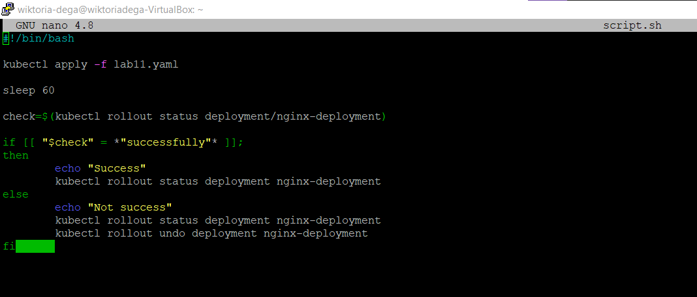
Działanie skryptu wygląda następująco:
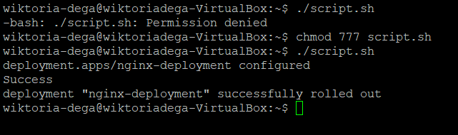

## Strategie wdrożenia
W tym kroku przystąpiłam do przygotowania wersji wdrożeń, które stosowały następujące strategie:
* Recreate

W pliku `lab11.yaml` zmieniłam strategię na `Recreate`.
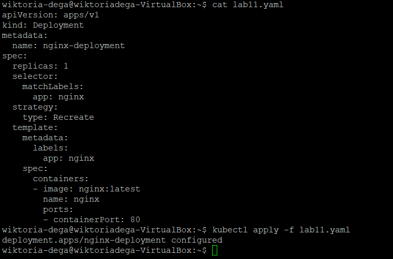

Używając polecenia `kubectl describe deployment nginx-deployment` upewniłam się czy strategia zmieniła się. 
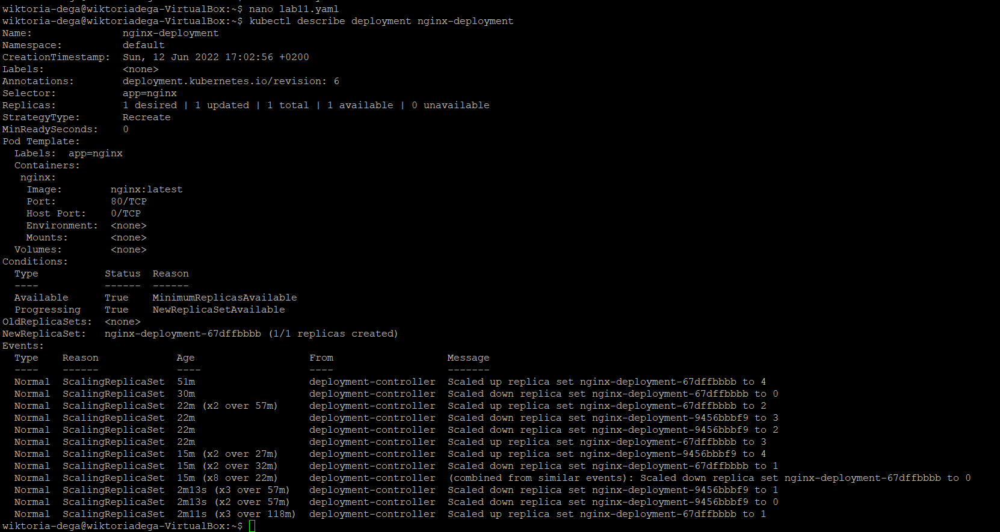

Sprawdzenie w dashboardzie:
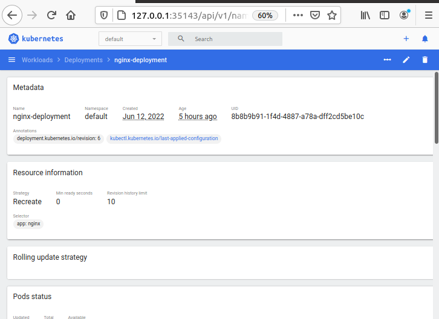

* RollingUpdate

W pliku `lab11.yaml` zmieniłam strategię na `RollingUpdate`.
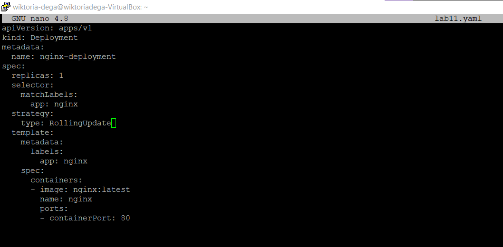

Używając polecenia `kubectl describe deployment nginx-deployment` upewniłam się czy strategia zmieniła się. 
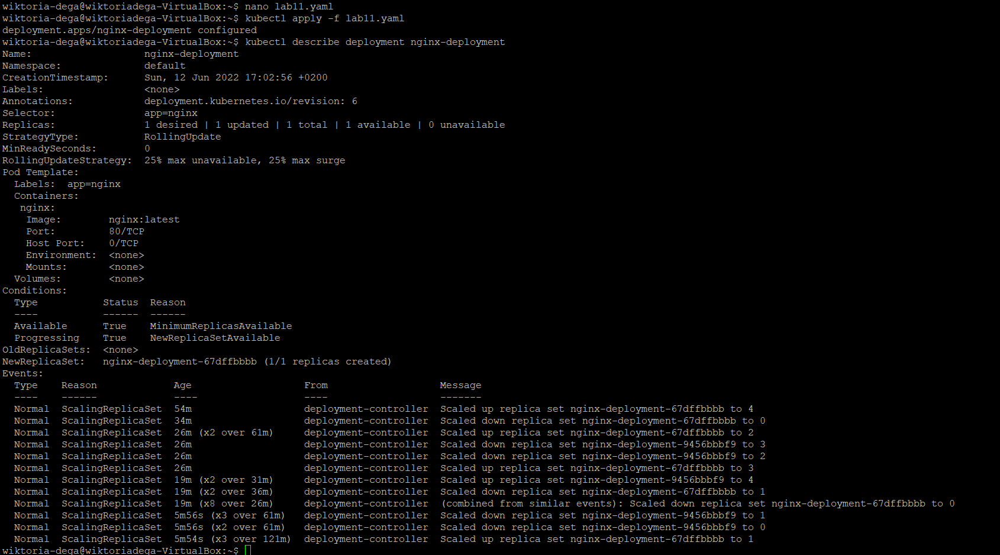

Sprawdzenie w dashboardzie:

* Canary Deployment workload

W pliku `lab11.yaml` zmodyfikowałam nazwę i podałam wersję.
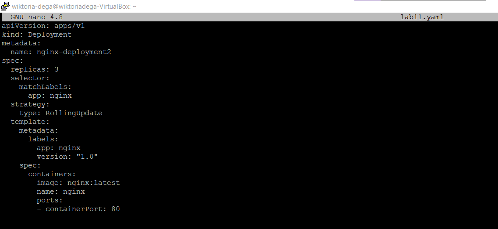

Sprawdzenie w dashboardzie, na którym widać istnienie nowego deploymentu (`nginx-deployment2`)
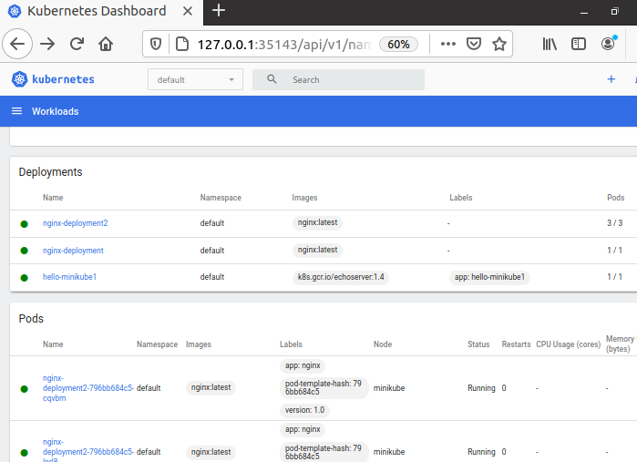

## Różnice
* Recreate - strategia, w której ma miejsce zakończenie działania podów ze starą wersją zanim nastąpi zastąpienie nowszą, zapewniona zostaje ciągłość co do aktualizacji stanu aplikacji, znaczenie ma tu jednak czas przestoju wdrożenia

* Rolling Update - charakterystyczne jest stopniowe aktualizowanie podów ze starą wersją

* Canary Deployment workload - charakterystyczne podejście progresywne, gdzie jedna wersja aplikacji obsługuje większość użytkowników, natomiast nowsza wersja obsługuje użytkowników testowych (nowe oprogramowanie wdrażane obok starszych wersji)
