# Sprawozdanie 11
# Agata Socha Inżynieria Obliczeniowa GCL02

##  Instalacja klastra Kubernetes

Na samym początku zmieniono liczbę procesorów na 2 w ustawieniach wirtualnej maszyny dzięki czemu uniknięto dalszych problemów i konieczności zmiany tego w mniej korzystnym momencie. 

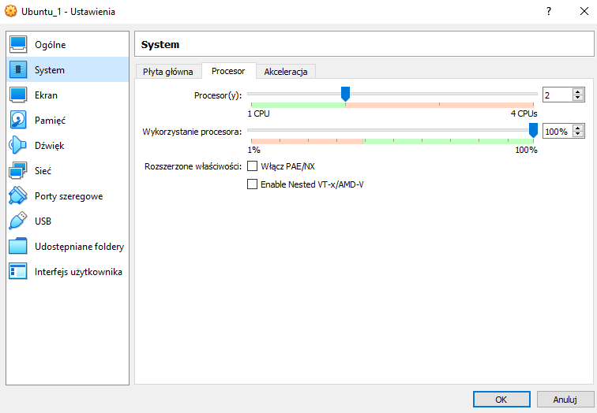

Następnie wykonywano kroki opisane w dokumentacji [(MINIKUBE)](https://minikube.sigs.k8s.io/docs/start/)
i. ``curl -LO https://storage.googleapis.com/minikube/releases/latest/minikube-darwin-amd64
``
ii. ``sudo install minikube-darwin-amd64 /usr/local/bin/minikube``
iii. ``minikube start``

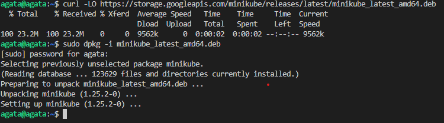

Ostatnia komenda się wykonała ale niestety był problem z pamięcią na dysku. 
Ostatecznie, po próbach edycji miejsca i naprawiania błędów,  wykonano to zadanie na innej maszynie z większa ilością miejsca. 
Dodatkowo komende startowania klastro wykonano z przełącznikiem: 
``minikube start --driveer=docker``

Po zmianie maszyny, kontynuowano polecenia z dokumentacji: 

iv. Zaopatrzono się w polecenie kubectl 
 `sudo snap install kubectl --classic`

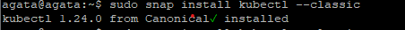

v. Oraz uzyskano dostęp do klastra
``minikube kubectl -- get po -A``

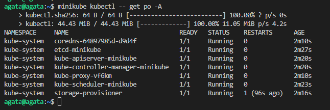

Poniżej screen udowadniający działający kontener. 

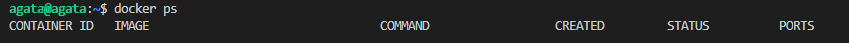

Następnie uruchomiono dashboard 
``minikube dashboard``

Przed zmianą maszyny, były problemy: 

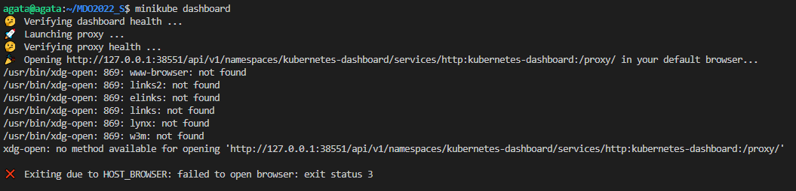

Natomiast, po wykonaniu instalacji minikube na drugiej maszynie, wszystko poszło w miare gładko: 

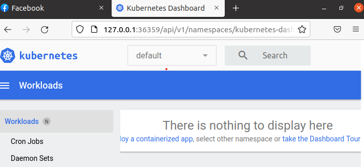

Na powyższym screenie widzimy przekierowanie do przeglądarki, czyli mamy dostęp do dashboarda Kubernetesa. 

## Analiza posiadanego kontenera

Najpierw zalogowano sie na swojego dockera

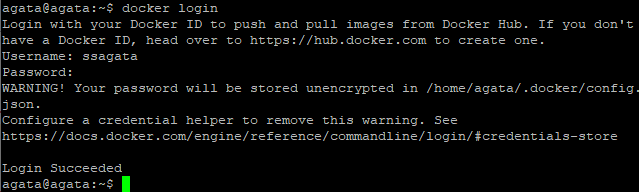

Moja aplikacja nie nadawała się  jednak do pracy w kontenerze więc zdecydowano się wykonać zadanie na gotowym obrazie: 

Najpierw tworzę deployment nginx : 

  ``kubectl create deployment hello-minikube1 --image=k8s.gcr.io/echoserver:1.4``
    
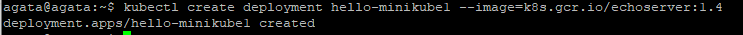

Potem sobie ujawniłam ten deeployment na port 8080

  ``kubectl expose deployment hello-minikub1 -type=LoadBalancer --port=8080``

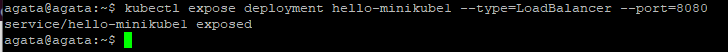

Po ujawnieniu na port 8080 włączyłam obsługę:

    kubectl get services hello-minikube1

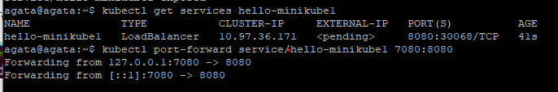

Kolejnym krokiem było przekireowanie się na port 7080 i wysłanie requsta do localhost:7080

- `kubectl port-forward service/hello-minikube1 7080:8080`

 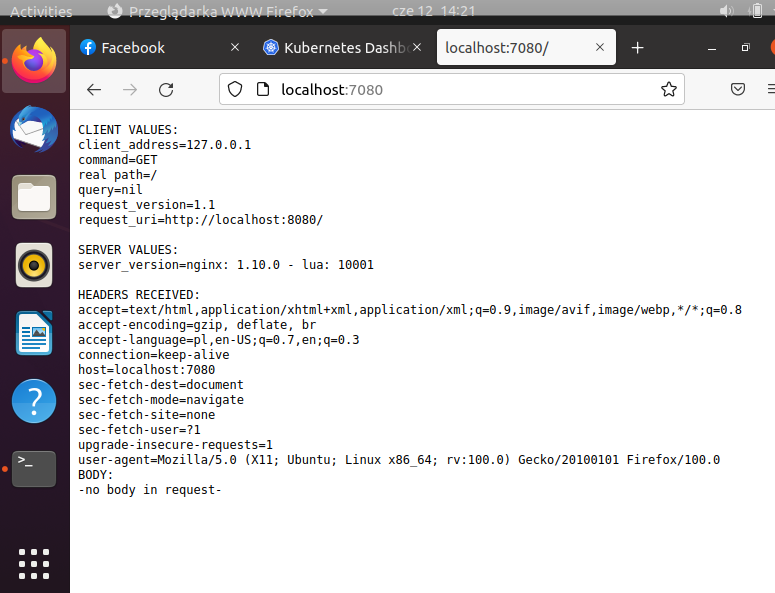

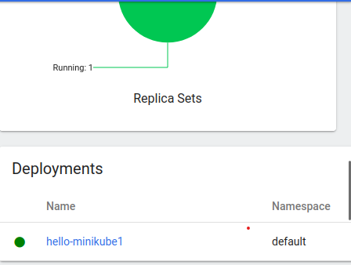

## Przekucie wdrożenia manualnego w plik wdrożenia (wprowadzenie)

Zapisano wdrożenie jako plik YML i dodano repliki: 

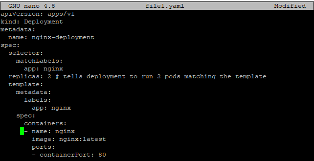

Stworzono deployment bazujący na pliku YAML: 

   ``kubectl apply -f https://k8s.io/examples/application/deployment.yaml``
     

Wyświetlono informacje o deploymencie: 

``kubectl describe deployment nginx-deployment``

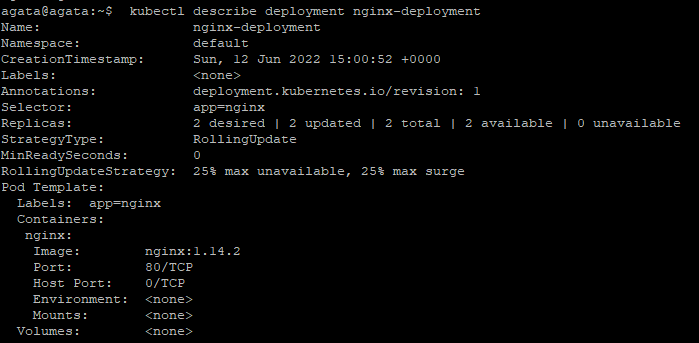

Wyświetlono jezcze jakie podsy zostały stworzone: 

  ``kubectl get pods -l app=nginx``

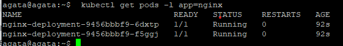

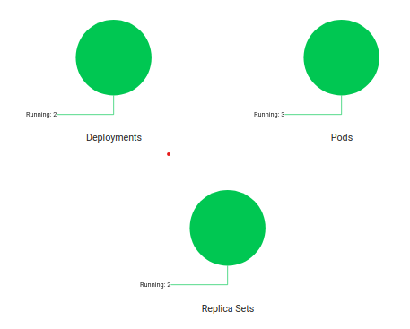

