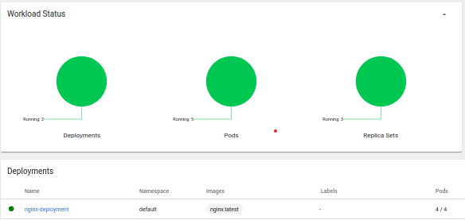

# Sprawozdanie 12
# Agata Socha Inżynieria Obliczeniowa GCL02

##  Konwersja wdrożenia ręcznego na wdrożenie deklaratywne YAML

Na poprzednich zajęciach udało się stworzyć plik YAML i udało się go nie zgubić pomiędzy zaj 11 a 12 i na dole dowód, że taki plik dalej mam:

Na samym początku wzbogacono obraz o 4 repliki:

i wdrożono plik za pomocą komendy
`` kubectl apply -f file1.yaml ``

i zbadano stan pliku za pomocą komendy 

``kubectl rollout status deploymnt nginx-deployment``

## Przygotowanie nowego obrazu

Znaleziono nową wersję obrazu nginx, którym była wersja nginx:1.14.2

## Zmiany w deploymencie

Najpierw wykonywano zmiany na nowej wersji obrazu (nginx:latest) 
- zmniejszenie liczby replik do 1

- wdrożenie pliku i wykazanie działania 

- zmniejszenie liczby replik do 0

- wdrożenie pliku i wykazanie działania 

Po dokonaniu zmian, zmieniono jeszcze wersję obrazu na nginx:1.14.2 

i sprawdzono działanie:

Następnie sprawdzono historie wdrożeń za pomocą komendy 
``kubectl rollout history deployment/nginx-deployment``

I przywrócono wersję obrazu nginx:latest za pomocą komendy 

``kubectl rollout undo deployment/nginx-deployment``

## Kontrola wdrożenia

Aby napisać skrypt sprawdzający, czy wdrożenie zdążyło si wdrożyć w czasie 60s, należy wiedzieć, że status "wyrobienia się w czasie" sprawdzamy za pomoca komendy ``rollout status``. Czas, po którym sprawdzamy ten nasz status wdrożenia ustanawiamy poprzez komendę ``slep 60``. 
W skrypcie wykorzystujemy prostego if'a, który sprawdza czy właśnie po wywołaniu komendy ``rollout status`` po upływie 60s wypluwa sie słowo ``successfully``. Jeśli się wypluwa to znaczy, że wdrożenie się zdążyło zrobić a jeśli nie wypluwa to znaczy że się nie zdążyło zrobić lub powstał jakiś inny błąd. 

Nasz komunikat świadczący o tym, że wdrożenie się zrobiło to "zycie jest prawie piekne" i możemy zaobserwować właśnie pomyślne działanie skryptu na screenie poniższym: 

## Strategie wdrożenia

1. **Recreate**

Do zmiany typu strategii na Recreate użyliśmy podanego pliku: 

Sprawdziliśmy komendą ``kubctl describe deployment nginx-deployment`` czy pomyślnie się strategia zmieniła: 

I jeszcze się upewniliśmy w dashboardzie: 

2. **RollingUpdate** 

Na początku w pliku mieliśmy strategię RollingUpdate, gdzie maxSruge i maxUnavailable było podane procentowo: 

Zmieniliśmy sobie jeszcze dodatkowo te opcje jako podanie max  ilości podów  do dodania i ilości podów nieaktywnych liczbowo a nie procentowo: 

3. **Canary deployment workload** 

W tym przypadku podano nowa nazwe i wersję:

I możemy zaobserwować działanie nowego deploymentu

### Obserwacje i różnice

**Rolling Update:**
- domyślna strategia
- zastępuje pody ze starą wersją aplikacji nową wersją, jeden po drugim, bez przestojów w klastrze

**Recreate**- kończy wszystkie pody i zastępuje je nową wersją

Plusy tej strategii - stan aplikacji jest całkowicie odnowiony 
Minusy - czas przestoju, który zależy zarówno od czasu zamknięcia, jak i czasu rozruchu aplikacji

**Canary deployment** - korzysta z podejścia progresywnego, przy czym jedna wersja aplikacji obsługuje większość użytkowników, a inna, nowsza wersja obsługuje niewielką pulę użytkowników testowych. Co najmniej dwie usługi lub wersje aplikacji są wdrażane równolegle, jedna z istniejącą wersją, a druga z nowymi funkcjami. Użytkownicy są stopniowo przenoszeni do nowej wersji, co pozwala na walidację nowej wersji poprzez udostępnienie jej prawdziwym użytkownikom. Jeśli nie zostaną zgłoszone żadne błędy, jedną z nowych wersji można stopniowo wdrażać u wszystkich użytkowników.

Plusy tej strategii - łatwe monitorowanie błedów i wydajności + szybkie cofanie 
Minusy - powolne wdrażanie 

