# Sprawozdanie - lab_11
## Gerard Skomin - 403353
___
### 1. Instalacja klastra Kubernetes
* Korzystając z poradnika instalacji z dokumentacji https://minikube.sigs.k8s.io/docs/start/ wykonano nastapujące kroki:  
  * Wybrano następujące opcje pobierania:  
  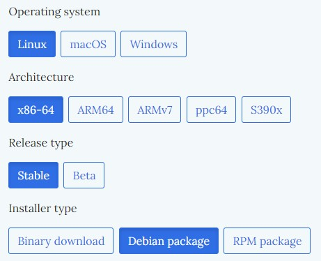  
  * Pobrano `Debian package` komendą `curl`: `curl -LO https://storage.googleapis.com/minikube/releases/latest/minikube_latest_amd64.deb`  
  * Zainstalowano paczkę komendą: `sudo dpkg -i minikube_latest_amd64.deb`  
  * Pierwsza próba uruchomienia klastra `minikube start`  
    
  * Dodanie odpowiednich uprawnień według zaleceń z wypisanego komunikatu: `sudo usermod -aG docker $USER && newgrp docker` oraz ponowne uruchomienie - `minikube start`  
  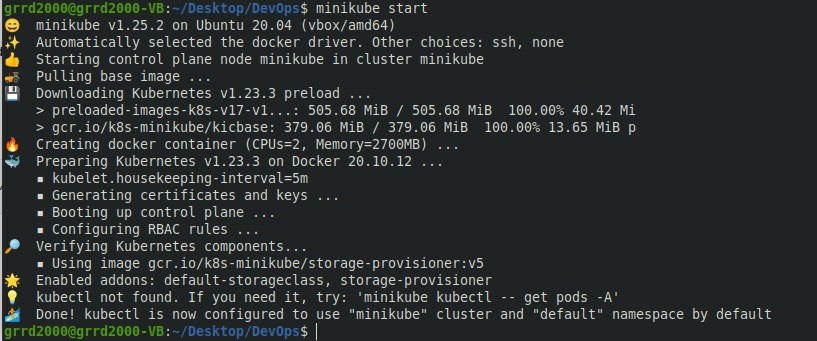  
* W celu korzystania z komendy `kubectl` zapoznano się z instrukcją w dokumentacji https://kubernetes.io/docs/tasks/tools/install-kubectl-linux/ i wykonano następujące kroki:  
  * Zaktualizowano *apt package index* komendą `sudo apt-get update`  
  * Pobrano wymagane dependencje komendą `sudo apt-get install -y apt-transport-https ca-certificates curl`  
  * Pobrano klucz Google Cloud `sudo curl -fsSLo /usr/share/keyrings/kubernetes-archive-keyring.gpg https://packages.cloud.google.com/apt/doc/apt-key.gpg`  
  * Dodano repozytorium Kubernetes: `echo "deb [signed-by=/usr/share/keyrings/kubernetes-archive-keyring.gpg] https://apt.kubernetes.io/ kubernetes-xenial main" | sudo tee /etc/apt/sources.list.d/kubernetes.list`  
  * Ponownie zaktualizowano `apt` i zainstalowano `kubectl` komendą `sudo apt-get install -y kubectl`  
  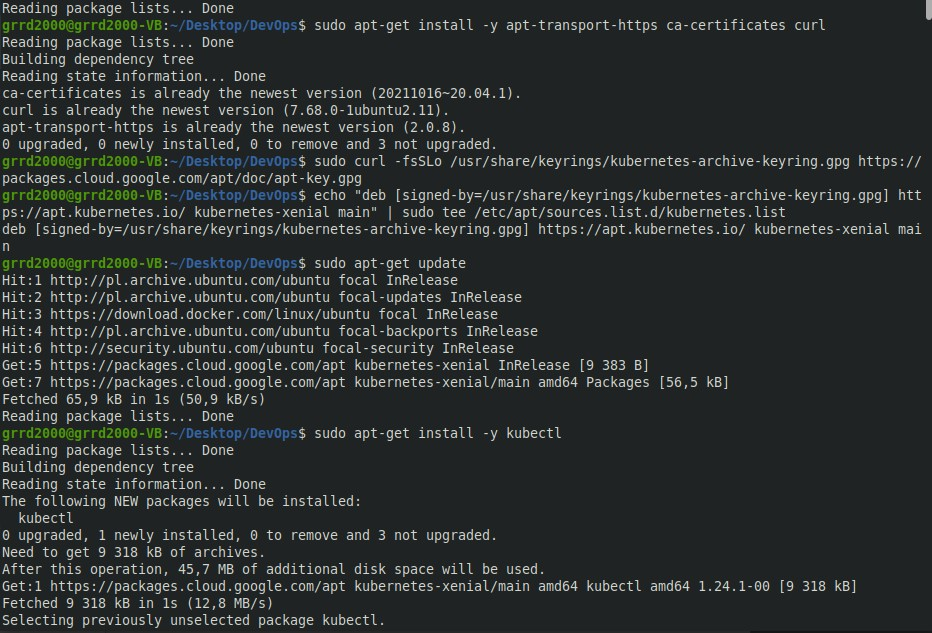  
* Sprawdzono działanie zainstalowanych oprogramowań:  
  * Uruchomiono `dashboard`  
  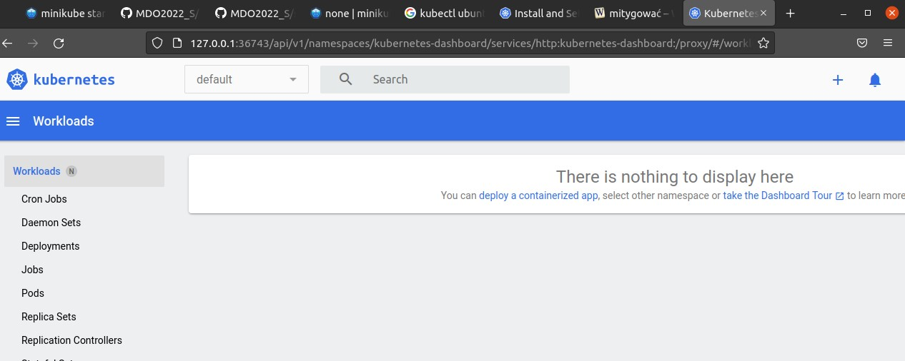  
  * Wykorzystano komendę `kubectl get po -A` w celu sprawdzenia poprawności instalacji oraz uruchomionych *Namespace'ów*  
    
  * Sprawdzono działanie kontenera komendą `docker ps`  
  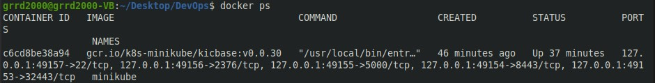  
* Następnie, zaciągnięto swój pierwszy **pod** `hello-minikube` kontynnując korzystanie z dokumentajci:  
  * Utworzono *deployment* komendą: `kubectl create deployment hello-minikube --image=k8s.gcr.io/echoserver:1.4`  
  * Eksponowano na port 8080: `kubectl expose deployment hello-minikube --type=NodePort --port=8080`  
  * Uruchomiono kolejną komendę z dokumentacji: `kubectl get services hello-minikube`  
  * Ostatecznie, dokonano konfiguracji portów: `kubectl port-forward service/hello-minikube 7080:8080`  
  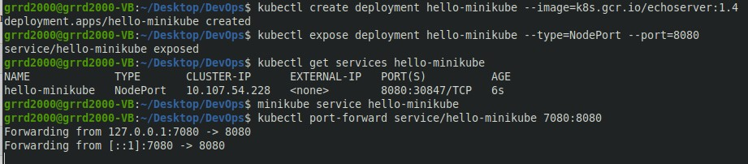  
  * Sprawdzono działanie aplikacji poprzez `localhost` i `dashboard`  
  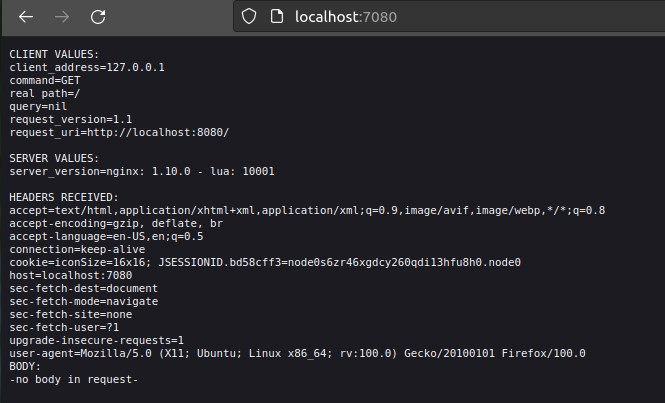  
  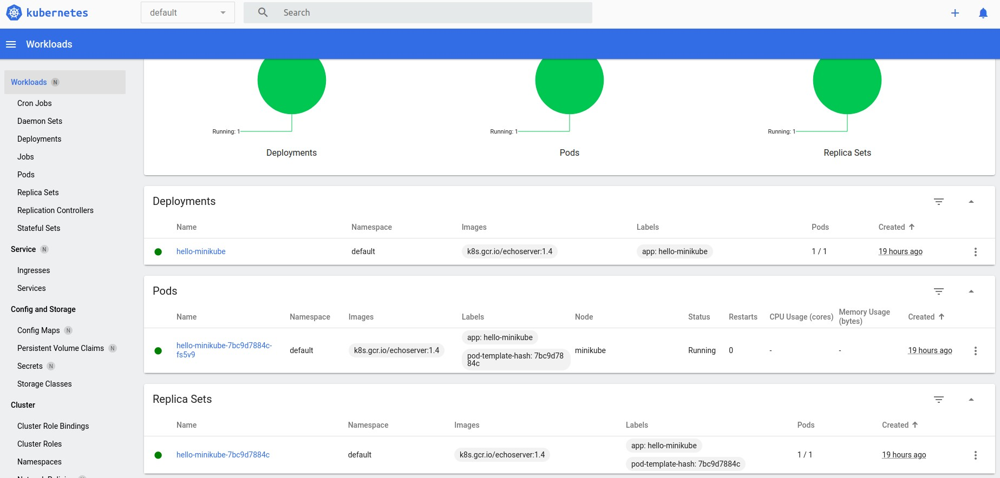  
### 2. Analiza posiadanego kontenera  
* Posiadany projekt nie wyprowadza interfejsu przez sieć i nie nadaje się do pracy w kontenerze, gdyż jest to aplikacja wyłącznie konsolowa. Wybrano więc projekt `Planets` z repozytorium: https://github.com/Powerock38/planets.  
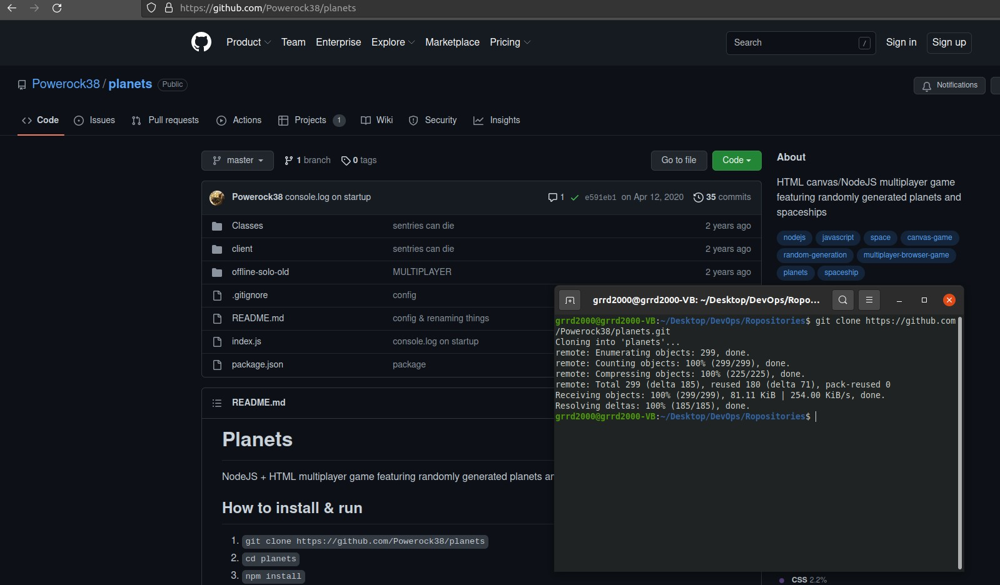  
* Utworzono własny plik `Dockerfile` korzystając z instrukcji instalacji z `README` projektu, wyglądający następująco:  
  ```bash
  FROM node:latest
  
  COPY package.json .
  
  RUN npm install
  EXPOSE 2000
  
  COPY . .
  
  CMD ["node", "."]
  ```  
* Na podstawie pliku `Dockerfile` dokonano zbudowania obrazu komendą: `sudo docker build -t planets .`  
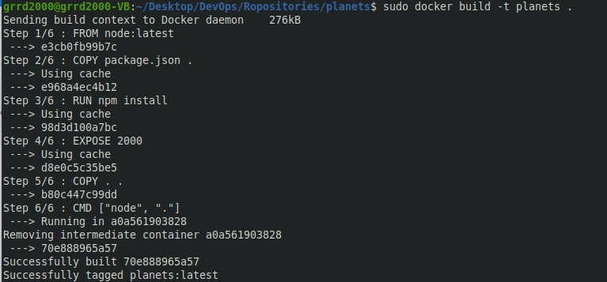  
* Uruchomiono powstały obraz wyprowadzając port 2000: `sudo docker run -d --rm --name planets -p 2000:2000 planets` oraz poleceniem `docker ps` sprawdzono jego działanie  
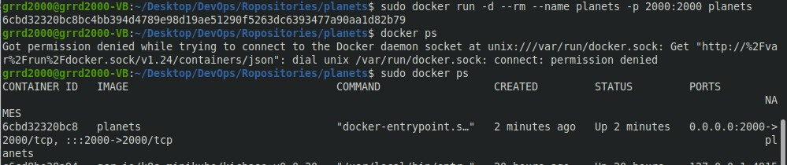  
* Przetestowano działanie uruchomionej aplikacji w przeglądarce na `localhost`  
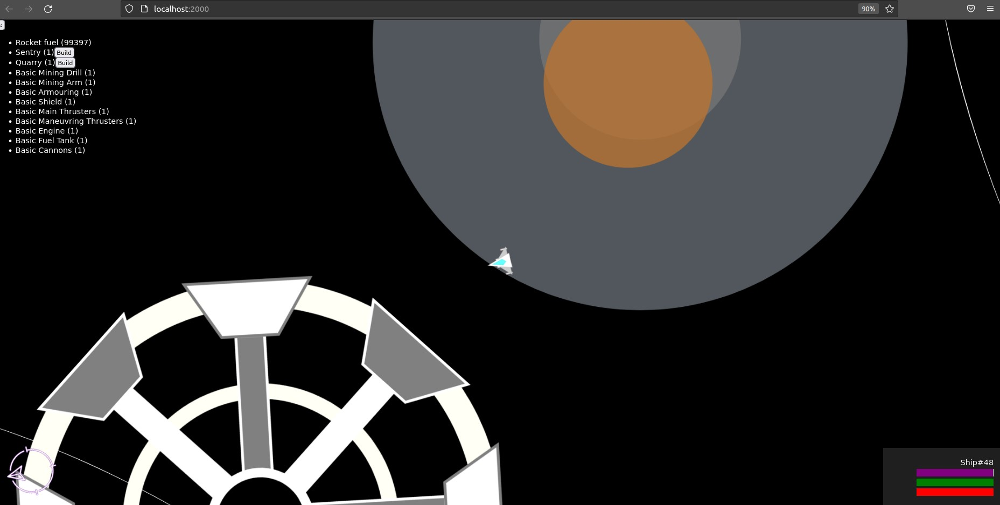  
* Następnie, utworzono nowe repozytorium na `Docker Hub`  
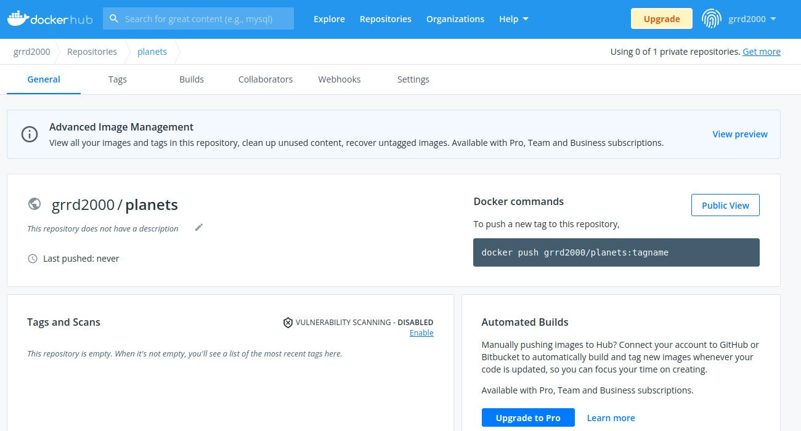  
* Otagowano poprzednio utworzony obraz komendą: `sudo docker tag planets grrd2000/planets`, i wypchnięto obraz komendą: `sudo docker push grrd2000/planets`  
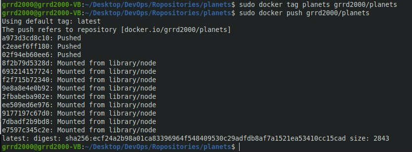  
* Rezultat powyżej ykonanych kroków widoczny na `Docker Hub`  
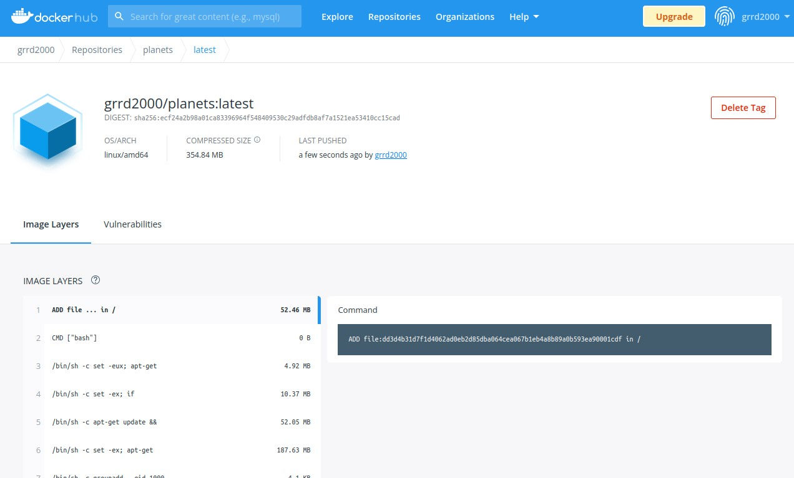  
### 3. Uruchomianie oprogramowania  
* Po wykonaniu poprzednich niezbędnych kroków przy pomocy komend z instrukcji uruchomiono kontener na stosie `k8s`  
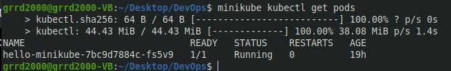  
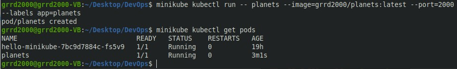  
* Wyprowadzono port poleceniem: `kubectl port-forward`  
* Przetestowano działanie aplikacji  
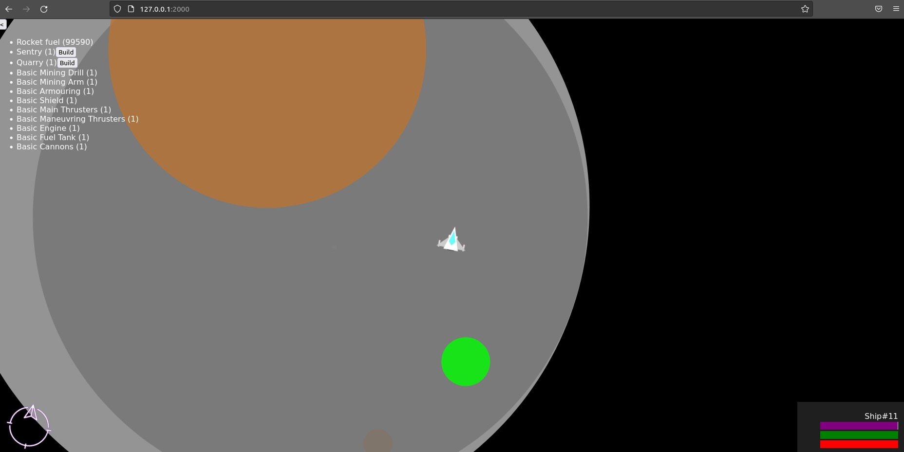  
### 4. Przekucie wdrożenia manualnego w plik wdrożenia  
* Utworzono plik `YML` początkowo uruchamiający **2 repliki**  
```yaml
apiVersion: apps/v1
kind: Deployment
metadata:
  name: planets
spec:
  selector:
    matchLabels:
      app: planets
  replicas: 5
  template:
    metadata:
      labels:
        app: planets
    spec:
      containers:
      - name: planets
        image: grrd2000/planets
        ports:
        - containerPort: 3000
```
* Wkonanie polecenia `kubectl apply` korzystającego z utworzonego pliku  
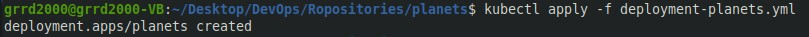  
* Działanie pod'ów w `kubectl` oraz `dashboard`  
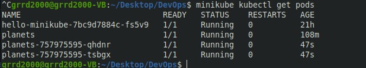  
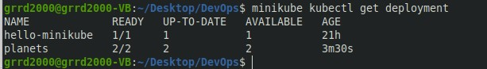  
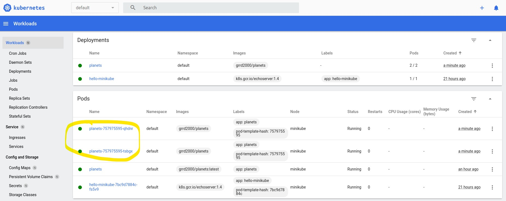  
* Edytowano plik `YML` zwiększając liczbę replik do 5, po czym czekano na reakcję `Kubernetes'a`  
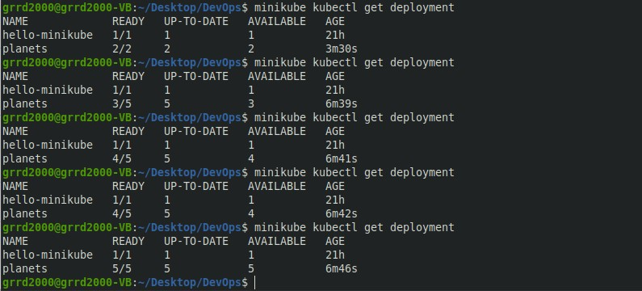  
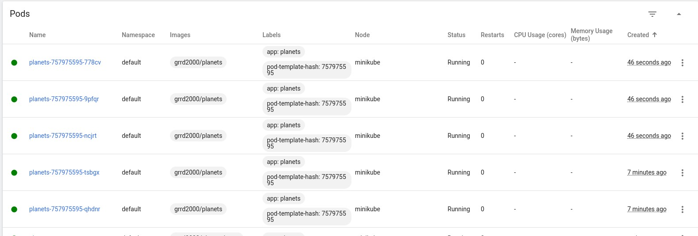  