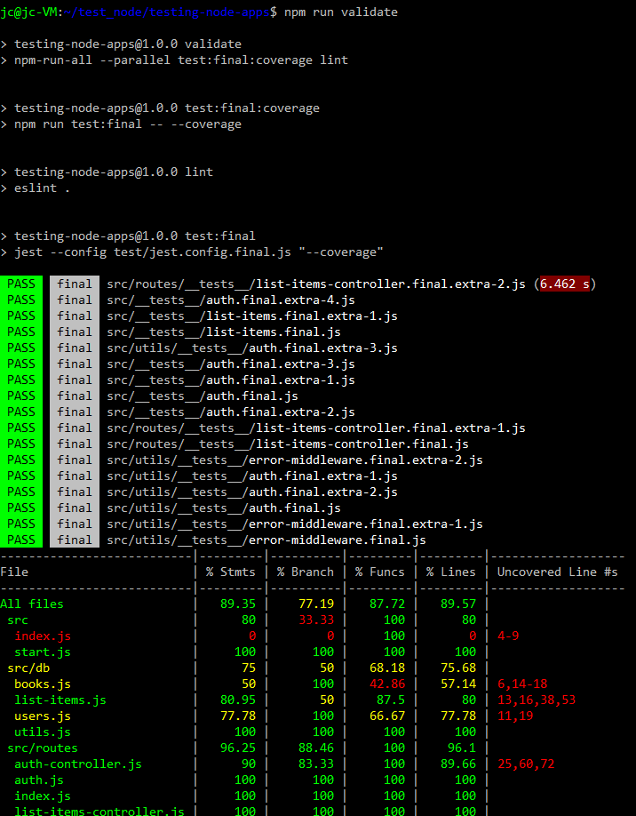
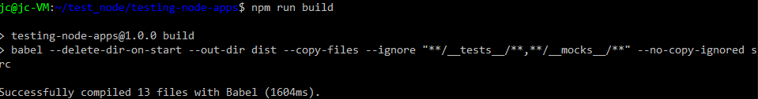
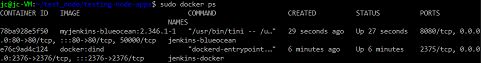
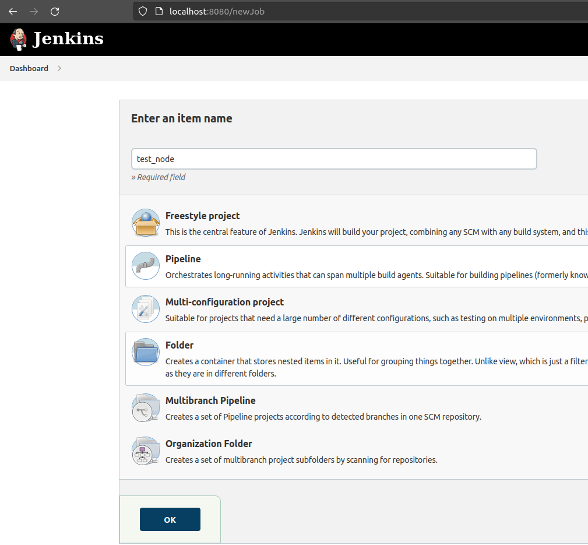

# Sprawozdanie  
Wybrana aplikacja do wdrożenia to **test-node-backend**  
*Licencja*: GPL version 3  
*Repo*: https://github.com/JSDenton/testing-node-app

**Testy:**  
`npm test` oraz (lepsze) `npm run validate`

**Build:**  
`npm run build`

Na razie to jest nieskończone, acz przed drugim terminem egzaminu, na pewno nie dam rady zdążyć.  
Udało mi się postawić Jenkinsa: 

I stworzyć pipeline (który nie działa):  

Nie jestem pewien czemu ten build nie działa: jak "z ręki" odpalam, to działa. A z dockera już nie.  

