# Sprawozdanie 12
# Kamil Pazgan Inżynieria Obliczeniowa GCL02

## Konwersja wdrożenia ręcznego na wdrożenie deklaratywne YAML

1. Na poprzednich laboratoriach wykonałem tylko podstawową wersję, więc zdecydowałem się na użycie obrazu serwera httpd - *https://hub.docker.com/_/httpd*.
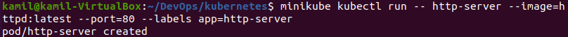
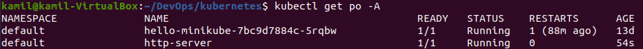
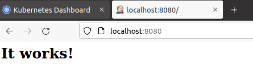
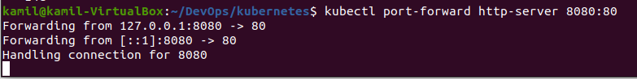

2. Plik ```docker-compose-httpd.yml``` wykorzystałem do konwersji do pliku *yaml* kubernetesa, zapomocą wcześniej zainstalowanego narzędzia *kompose*.\
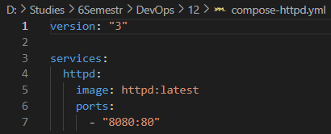
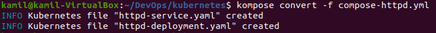

3. Wygenerowany plik do wdrożeń:
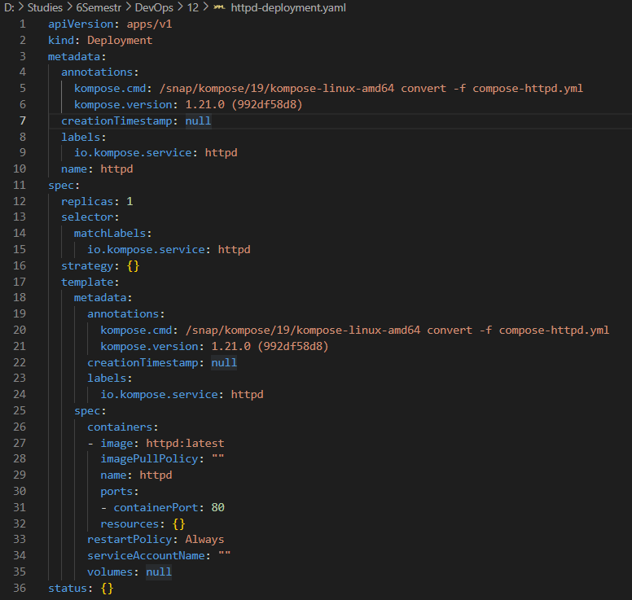

4. Wdrożenie za pomocą ```kubectl apply```:
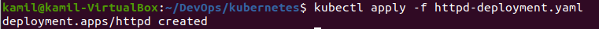

5. Zbadanie statusu za pomocą ```kubectl rollout status```:
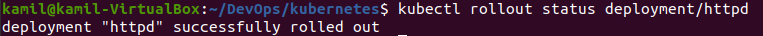

## Przygotowanie nowego obrazu i zmiany w deploymencie

1. Nowa/stara wersja obrazu: ```httpd:2.4-alpine```
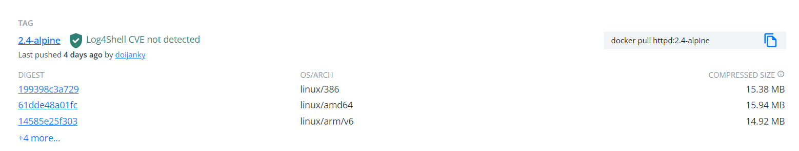

2. Manipulacja ilościąreplik:

- jedna:

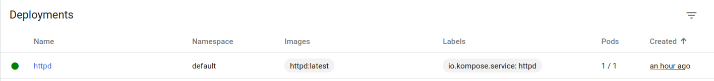

- zero:


- cztery:

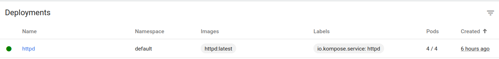

3. Zastosowanie starej wersji:

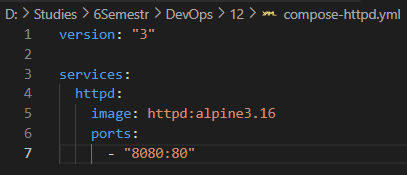
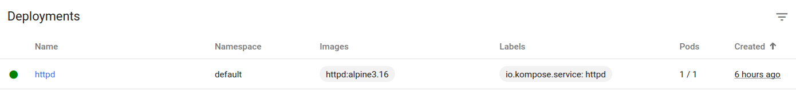

4. Przywrócenie poprzedniej wersji:

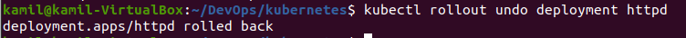

## Kontrola wdrożenia

1. Skrypt weryfikujący, czy wdrożenie "zdążyło" się wdrożyć (60 sekund):

Jeśli 60 sekund po wdrożeniu status zostanie wyrazony jako powodzenie to nastepuje wydruk informacji o sukcesie wdrożenia, natomiast jeśli nie o porażce.

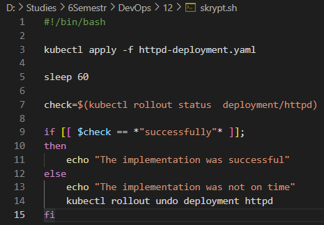
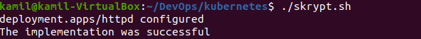

## Strategie wdrożenia

1. Recreate

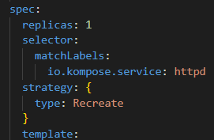


2. Rolling Update

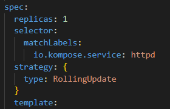


3. Canary Deployment workload

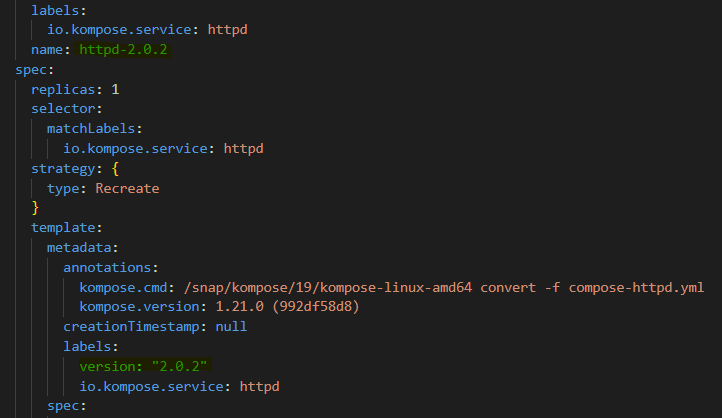
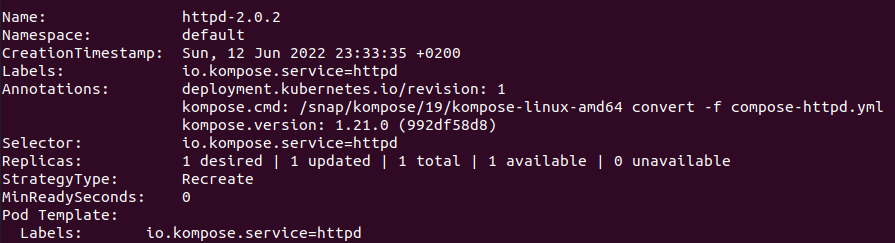

4. Różnice:

- Recreate - Wszystkie istniejące pody są zabijane, zanim zostaną utworzone nowe.

- Rolling Update - Wdrożenie aktualizuje pody w sposób stopniowej aktualizacji. Można  kontrolować proces aktualizacji kroczącej za pomocą parametrów.

- Canary Deployment workload - korzysta z podejścia progresywnego, przy czym jedna wersja aplikacji obsługuje większość użytkowników, a inna, nowsza wersja obsługuje niewielką pulę użytkowników testowych. Wdrożenie testowe jest wdrażane dla większej liczby użytkowników, jeśli się powiedzie.


