# Zajęcia 09
---

### Instalacja systemu Fedora w VM

Jako środowisko wirtualizacji wybieram VirtualBox. Najpierw tworzę nową maszynę wirtualną w trybie eksperta:

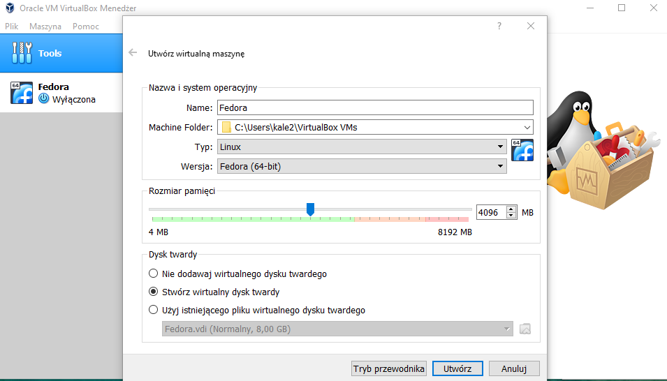

Ustawiam wielkość pamięci RAM jako 4GB. Następnie tworzę dysk o rozmiarze 15 GB:

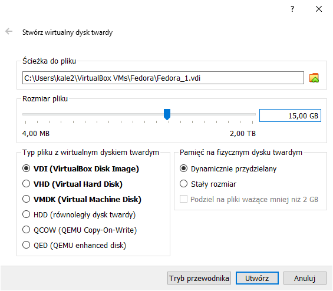

W ustawieniach nowo powstałej maszyny dodaję obraz rozruchowy instalatora w formie ISO pobranego z oficjalnej strony Fedory:

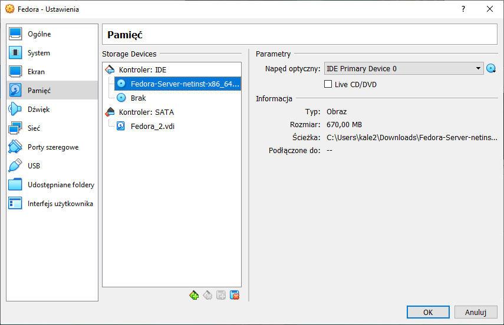

Następnie uruchamiam maszynę wirtualną:

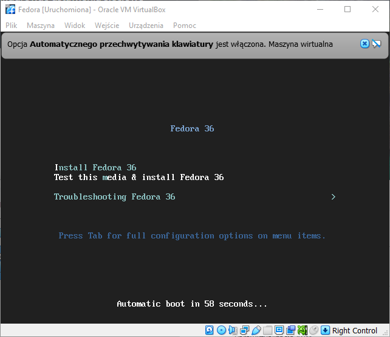

Wybieram język na angielski:

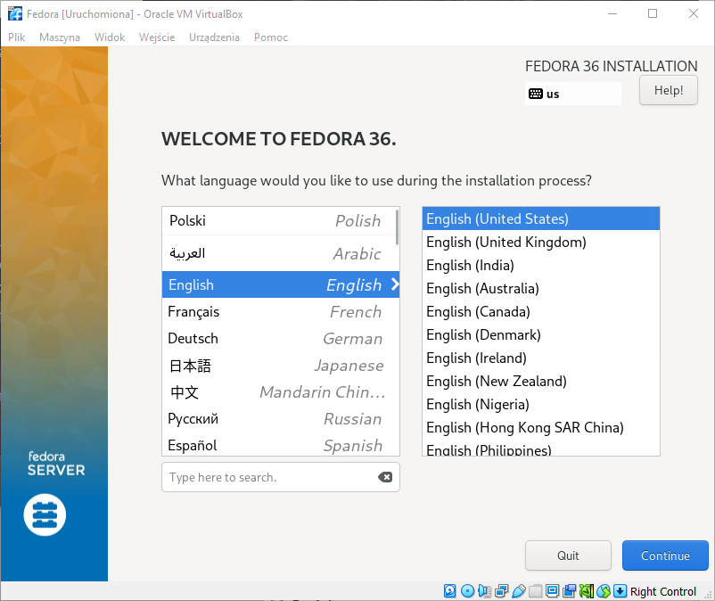

Wybieram dysk, na którym zostanie zainstalowany system:

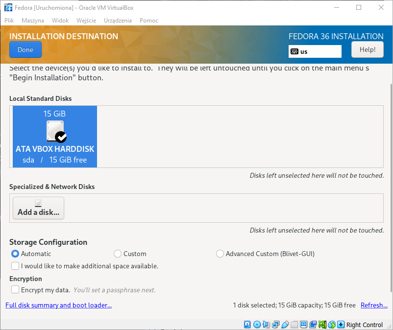

Następnie przystępuję do konfiguracji profilu roota, pozwalam na dostęp do niego przez SSH w celu łatwiejszej komunikacji w dalszej części:

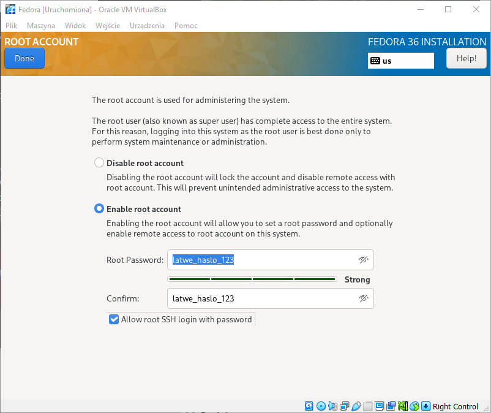

Dalej tworzę konto użytkownika:

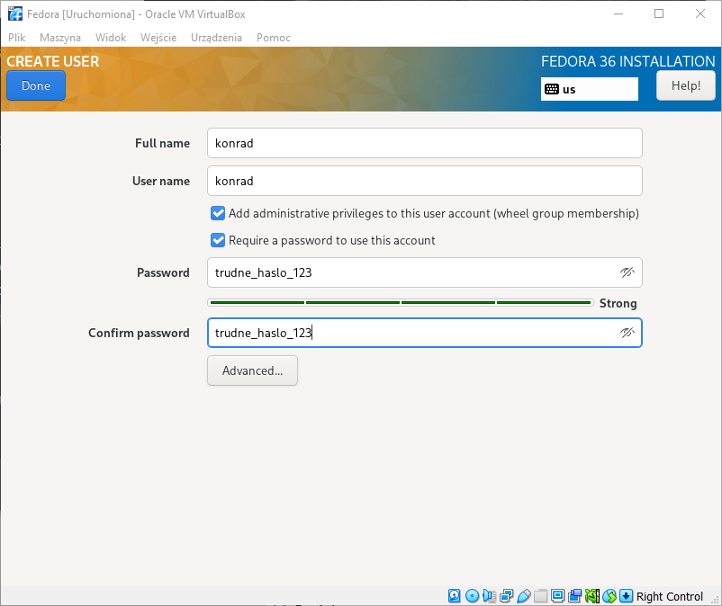

Wybieram instalację jako minimalną z podstawowymi narzędziami:

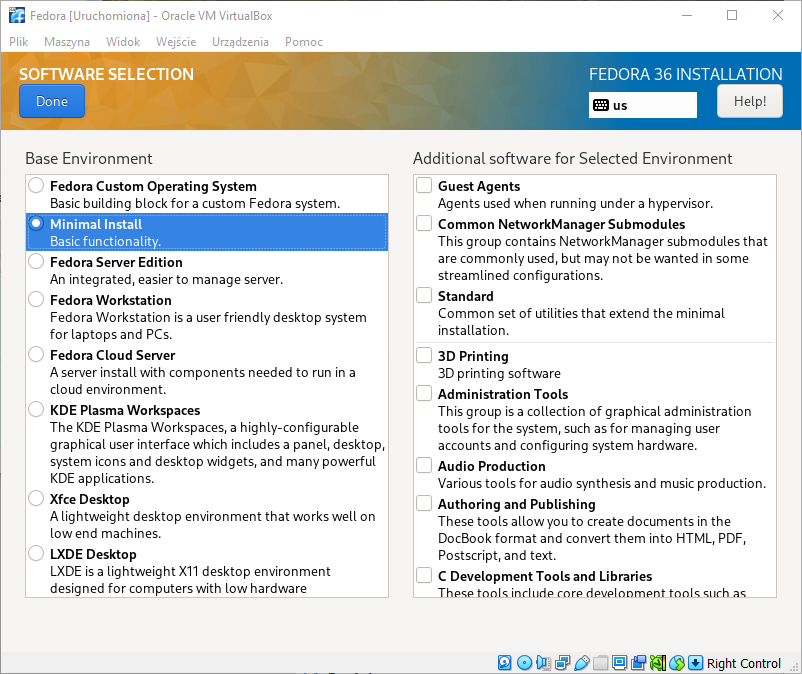

Rozpoczyna się proces instalacji:

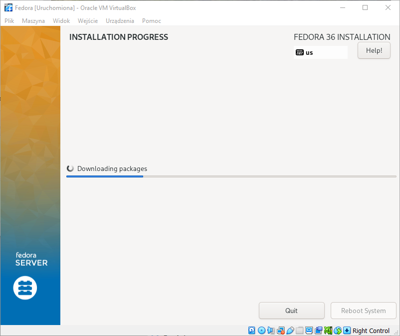

### Druga instalacja systemu Fedora w VM jako serwer HTTP dla artefaktu

Aby zaoszczędzić czasu z uwagi na to, że obie maszyny z Fedorą po instalacji są takie same, używam opcji klonowania obrazu dostępnej w VM aby utworzyć drugą instancję.

Następnie maszynie będącej serwerem instaluję oraz konfiguruję Apache httpd jako root:

```bash
$ dnf install -y httpd 
$ dnf group install -y "Web Server"
```

Następnie uruchamiam proces:

```bash
$ systemctl start httpd
$ systemctl enable httpd
```

Na końcu konfiguruję Firewalla aby ten nie blokował requestów:

```bash
$ firewall-cmd --add-service=http --add-service=https --permanent
$ firewall-cmd --reload
```

Dalej instaluję i uruchamiam SSH:

```bash
$ dnf install -y openssh-server
$ systemctl start sshd.service
```

W VirtualBoxie ustawiam sieć na mostkowaną (briged):

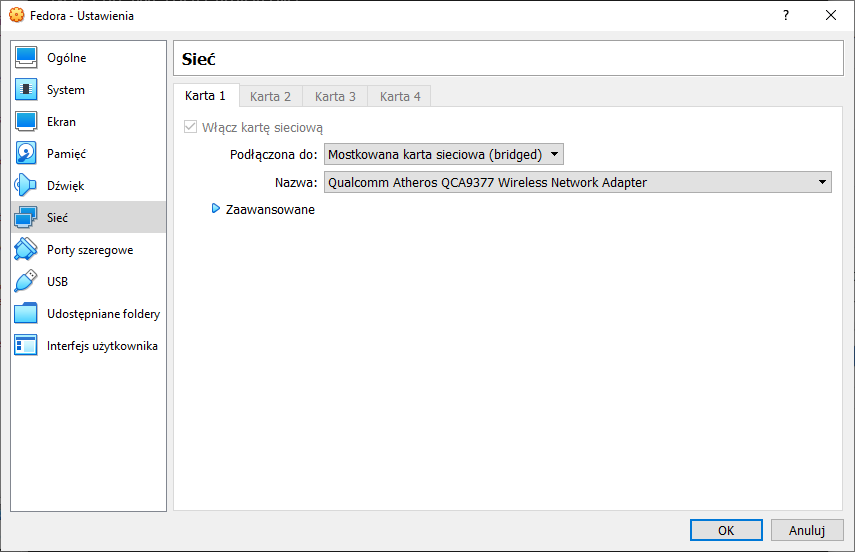

### Umieszczenie artefaktu z projektu na serwerze HTTP

Pobieram z Jenkinsa artefakt:


Na serwerze tworzę podfolder:

```bash
$ mkdir /var/www/html/simple-tetris
```

Na komputerze hoście łączę się z Powershella do maszyny kopiując plik artefaktu:

```powershell
$ scp C:\Users\kale2\Downloads\simple-tetris-1.3.0-rc.tgz root@192.168.8.106:/var/www/html/simple-tetris/
```

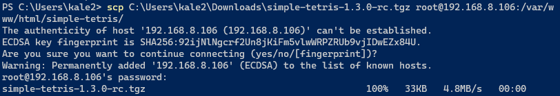

Na końcu wyciągam plik konfiguracyjny instalatora:

```powershell
$ scp root@192.168.8.106:/root/anaconda-ks.cfg anaconda-ks.cfg
```

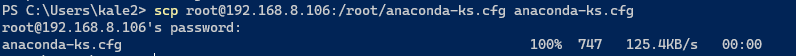

Po połączeniu się z hosta:

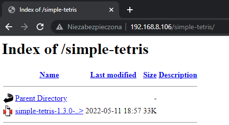


### Konfiguracja instalacji nienadzorowanej

Wygenerowany automatycznie plik `anaconda-ks.cfg` wygląda następująco:

```bash
# Generated by Anaconda 36.16.5
# Generated by pykickstart v3.36
#version=F36
# Use graphical install
graphical

# Keyboard layouts
keyboard --vckeymap=us --xlayouts='us'
# System language
lang en_US.UTF-8

%packages
@^minimal-environment

%end

# Run the Setup Agent on first boot
firstboot --enable

# Generated using Blivet version 3.4.3
ignoredisk --only-use=sda
autopart
# Partition clearing information
clearpart --none --initlabel

# System timezone
timezone Europe/Warsaw --utc

# Root password
rootpw --iscrypted $y$j9T$CeVdtTgXOJ5vrDFZXDLdlS5w$1MymgkYWEb9EAB/NEu.iB6KAKjJnyOz0usO2EwG5qGB
user --groups=wheel --name=konrad --password=$y$j9T$sGCo./zsxHPDngUivgYJZg7c$Ydk4z1Rqzk6Z0SHFh9Db68UgAm.4Ql5gdiRzFnb2oZ4 --iscrypted --gecos="konrad"
```

W powyższym pliku najpierw zmodyfikowano formę instalacji z graficznej na tekstową:

```bash
# Generated by Anaconda 36.16.5
# Generated by pykickstart v3.36
#version=F36
# Use graphical install
text
```

Następnie dodano konfigurację sieciową:

```bash
network --bootproto=dhcp --device=enp0s3 --ipv6=auto --activate
```

Dodano informacje o repozytoriach:

```bash
# Repo
url --mirrorlist=http://mirrors.fedoraproject.org/mirrorlist?repo=fedora-$releasever&arch=x86_64
repo --name=updates --mirrorlist=http://mirrors.fedoraproject.org/mirrorlist?repo=updates-released-f$releasever&arch=x86_64
```

Dodano jako dependencje `npm`, `wget` oraz `tar`:

```
%packages
@^minimal-environment
npm*
wget
tar
%end
```

Oraz pobrano artefakt:

```bash
# Get artifact
%post
mkdir simple-tetris
wget http://192.168.8.106/simple-tetris/simple-tetris-1.3.0-rc.tgz
tar -xf simple-tetris-1.3.0-rc.tgz -C simple-tetris/
%end
```

Powstały w ten sposób plik prezentuje się następująco:

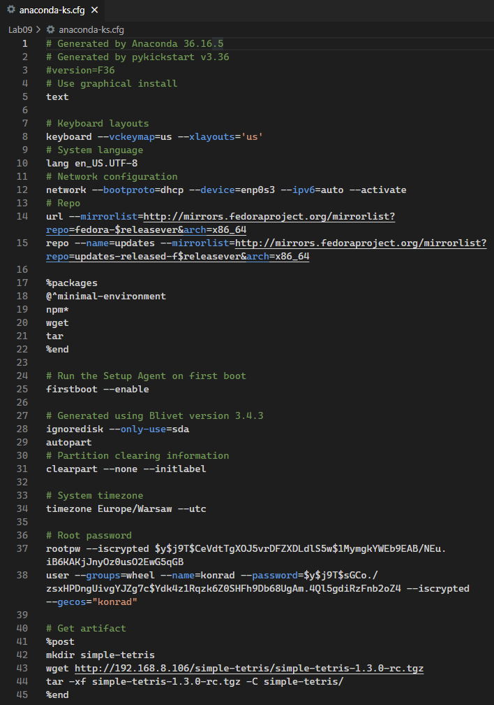


Tak utworzony skrypt następnie przekazuję do instalatora Fedory w celu przetestowania, podczas wyboru w menu instalacyjnym wciskam przycisk TAB i podaję następującą komendę:

```bash
inst.ks=https://raw.githubusercontent.com/InzynieriaOprogramowaniaAGH/MDO2022_S/KS404423/INO/GCL02/KS404423/Lab09/anaconda-ks.cfg
```

_**Notka:** Dla uproszczenia na przykładzie prezentacji korzystam z serwisu skracającego linki._

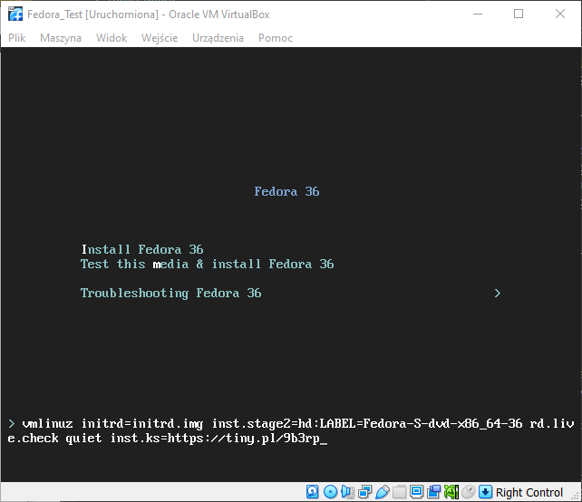

Instalacja przebiegła prawidłowo:

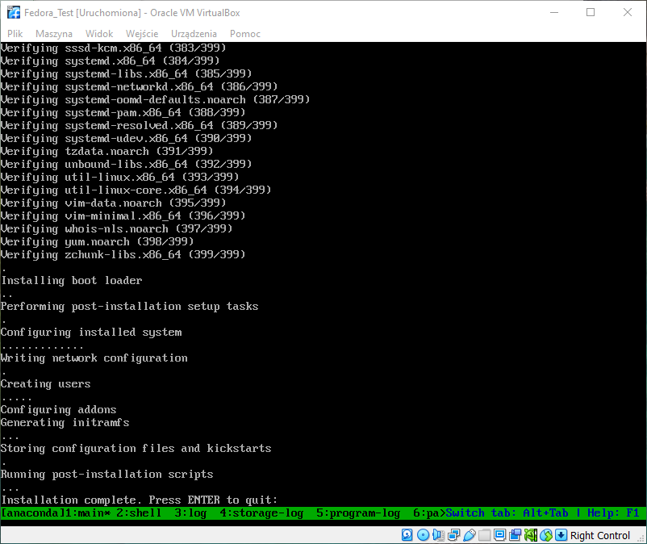

W głównym folderze można zobaczyć pobrany i rozpakowany artefakt:

```bash
$ ls
```

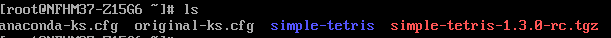
