# Zajęcia 11 - Kubernetes

---

### Instalacja klastra Kubernetes

Najpierw pobrano wymagane zależności:

```bash
$ curl -LO https://storage.googleapis.com/minikube/releases/latest/minikube-linux-amd64
```

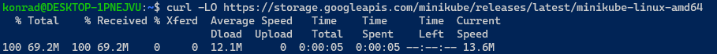

Zainstalowano je:

```bash
$ sudo install minikube-linux-amd64 /usr/local/bin/minikube
```


Instalacja pobranej paczki z internetu za pomocą skryptu odtwarzanego przez roota nie brzmi jak bezpieczna opcja instalacji.

Uruchamiam klaster:

```bash
$ minikube start
```


Następnie zaopatruję się w polecenie `kubectl`;

```bash
$ minikube kubectl -- get pods -A
```

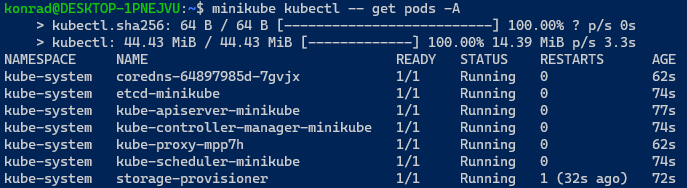

Utworzony kontener można wylistować następująco:

```bash
$ docker container ls
```

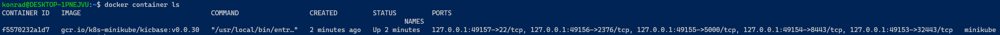

Nie miałem żadnych problemów z wymaganiami sprzętowymi, wszystko uruchamiane jest pod WSL2 na Windows 10, mój komputer spełnia podstawowe wymagania spisane w dokumentacji.

Na końcu uruchomiono Dashboard:

```bash
$ minikube dashboard
```

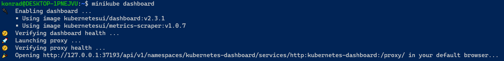

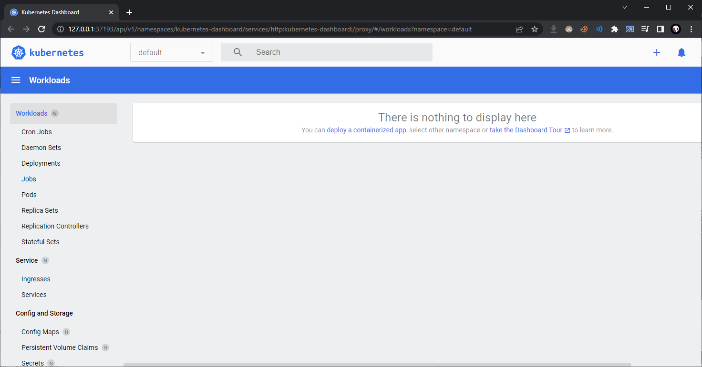


### Analiza posiadanego kontenera

Aby wdrożyć się w chmurę, najpierw poczynię lekkie zmiany w swoim Dockerfile dla etapu Deploy:

```dockerfile
FROM node:latest
RUN npm install http-server -g
COPY dist /home/simple-tetris
WORKDIR /home/simple-tetris
RUN  mv ascii-runner-browser.html index.html
ENTRYPOINT ["http-server"]
```

W powyższym zastosowaniu używam paczki `http-server`, żeby zestawić prościutki serwer HTTP do hostowania pliku `ascii-runner-browser.html`. W poprzednich labach łączyłem się z Dockerem przez terminal, więc nie potrzebowałem takiego zastosowania.

Pobieram i wypakowuję artefakt z Jenkinsa oraz umieszczam go w następujący sposób w folderze:

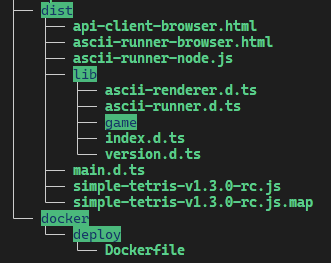

Następnie przełączam się na daemona Docker z Minikube, aby utworzyć obraz lokalnie, który będzie widoczny w dalszym etapie:

```bash
$ eval $(minikube docker-env)
```

Oraz buduję obraz:

```bash
$ docker build -f ./docker/deploy/Dockerfile -t simple-tetris-deploy .
```

Teraz będzie on widoczny w rejestrze:

```bash
$ docker image ls
```

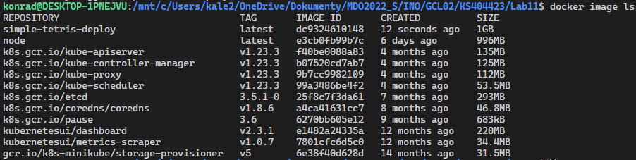

Utworzony obraz taguję:

```bash
$ docker tag simple-tetris-deploy simple-tetris:jedyny-sluszny
```

Wdrażam pobrany kontener na stosie k8s:

```bash
$ minikube kubectl run -- simple-tetris --image=simple-tetris:jedyny-sluszny --port=8080 --labels app=simple-tetris
```

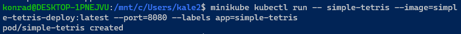

Jak widać pod działa:

```bash
$ minikube kubectl get pods
```

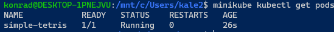


```bash
$ minikube kubectl -- expose pod/simple-tetris --type=NodePort --port=
8080
```

Następnie tworzę serwis dla aplikacji:

```bash
$ minikube service simple-tetris
```

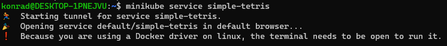

Na końcu wyprowadzam port aby przetestować funkcjonalność:

```bash
$ minikube kubectl port-forward simple-tetris 1234:8080
```

I testuję funkcjonalność:

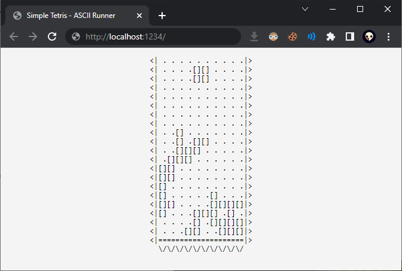


### Wdrożenie automatyczne

Na końcu gotowy plik wdrożeniowy zapisuję:

```bash
$ minikube kubectl get pod -- simple-tetris -o yaml > simple-tetris-deployment.yaml
```

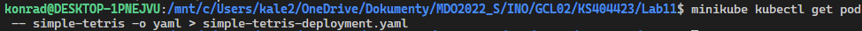

Usuwam istniejące wdrożenie:

```bash
$ minikube kubectl delete pod simple-tetris
```

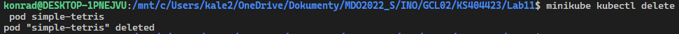

I testuję wdrożenie z pliku:

```bash
$ minikube kubectl create -- -f simple-tetris-deployment.yaml
```

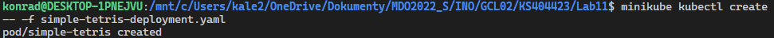

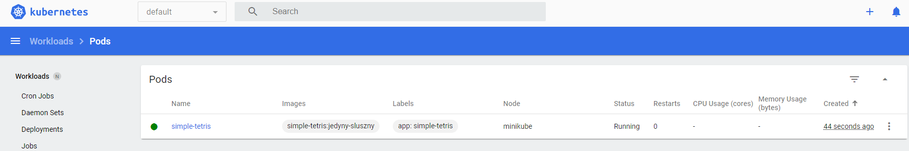