#  Michał Pieczonka - 303995
## Sprawozdanie 12 (Wdrażanie na zarządzalne kontenery: Kubernetes (2))

### Konwersja wdrożenia ręcznego na wdrożenie deklaratywne YAML
  * **Upewnij się, że posiadasz wdrożenie z poprzednich zajęć zapisane jako plik** <br>
    Posiadam wdrożenie z poprzednich zajęć, które umieściłem w ramach sprawozdania w katalogu lab11 w pliku  ``deployment-app-petclinic.yml``
  * **Wzbogać swój obraz o 4 repliki** <br>
    W celu używania 4 replik, w pliku YML wdrożenia w sekcji ``spec`` modyfikuję parametr ``replicas`` ustawiającego jego wartość na 4.
```yaml
apiVersion: apps/v1
kind: Deployment
metadata:
  name: app-petclinic-deployment
  labels:
    app: app-petclinic
spec:
  replicas: 4
  selector:
    matchLabels:
      app: app-petclinic
  template:
    metadata:
      labels:
        app: app-petclinic
    spec:
      containers:
        - name: app-petclinic
          image: michalpieczonka4/devops_repository:deploy_app_image
          ports:
            - containerPort: 8080
```

  * **Rozpocznij wdrożenie za pomocą ``kubectl apply``** <br>
    Rozpoczynam wdrożenie za pomocą ``minikube kubectl -- apply -f deployment-app-petclinic.yml``, w wyniku czego uzyskuję następujący rezultat:
    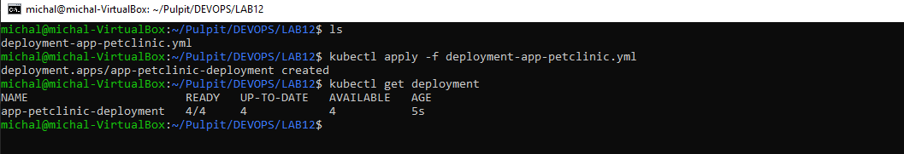 <br>
  * **Zbadaj stan za pomocą ``kubectl rollout status``** <br>
    Status wdrożenia sprawdzam za pomocą ``kubectl rollout status``
    
    W celu dodatkowej weryfikacji i podglądu wdrożenia uruchamiam dashboard - widać liczbę podów równą 4 - statusy: ``running``
    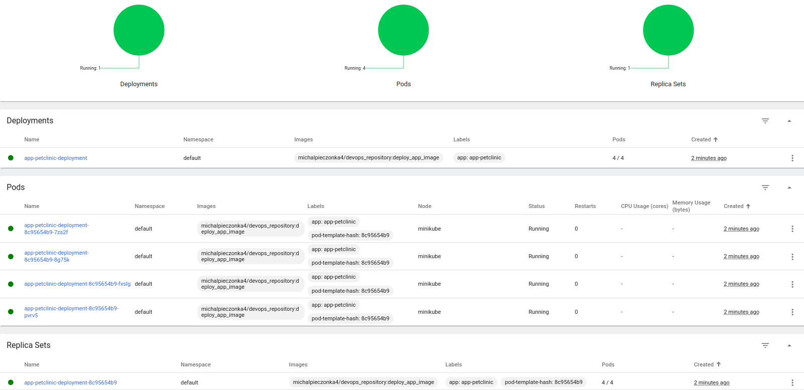 <br>
### Przygotowanie nowego obrazu
  * **Zarejestruj nową wersję swojego obrazu (w Docker Hub lub lokalnie)** <br>
    W celu rejestracji swojego obrazu wybrałem opcję rejestracji w DockerHub, ponieważ już w ramach poprzedniego sprawozdania utworzyłem stosowne repozytorium i umieściłem na nim
    jedną z wersji swojego obrazu (zbudowanego utworzonym w ramach projektu pipelinem).<br>
    Przygotowanie nowych wersji obrazu rozpocząłem od przygotowania wersji zmodyfikowanej. <br> 
    Z uwagi na fakt, że modyfikacja miała obejmowac sam obraz,a nie koniecznie modyfikacje w aplikacji, postanowiłem uprościć sprawę i obraz z zawartą aplikacją, przeznaczony do wdrożenia (u mnie nazwany ``deploy``)
    zmodyfikowałem o dodatkowy 'log' w ramach startu w postaci ``PETCLINIC::::MODIFIED IMAGE VERSION``. W celu utworzenia potrzebnego obrazu wykorzystałem pipeline utworzony w ramach projektu.
    Utworzyłem więc pierwszy - zmodyfikowany obraz, wykorzystując następujący Dockerfile:
    ```
    FROM openjdk:17-jdk-alpine
    RUN apk add --no-cache --upgrade bash
    RUN echo "PETCLINIC::MODIFIED::IMAGE"
    COPY output_volume/final_app.jar /final_app.jar
    EXPOSE 8080
    ENTRYPOINT [ "java", "-jar", "final_app.jar"]
    ```
    Poniżej zamieściłem zrzut ekranu  z przejścia pipeline'a, potwierdzający wykorzystanie prezentowanego powyżej Dockerfile'a:
    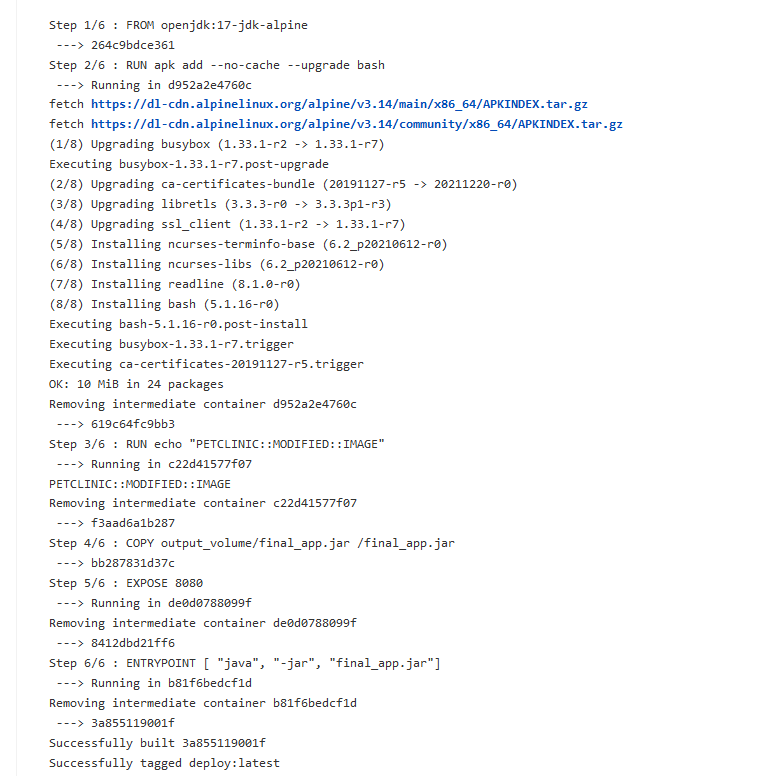 <br>
    W następnym kroku wewnątrz kontenera z Jenkinsem, loguję się do DockerHub, taguję obraz i wypycham go na repozytorium DockerHub:
    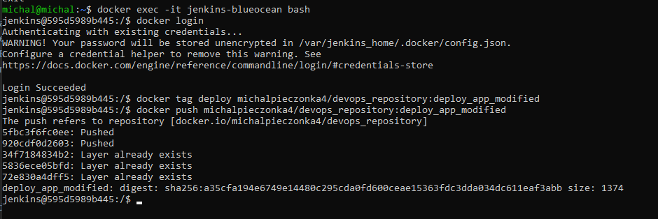
    Kolejno tworzę nową wersję obrazu - tym razem obraz, którego uruchomienie kończy się błędem. W tym celu, tym razem tworzę nowy DockerFile 
    ) w którym umieszczam dodatkowo polecenie ``CMD ["exit","1"]``, dzięki czemu uruchomienie kontenera kończy się błędem. Dockerfile:
    ```
    FROM openjdk:17-jdk-alpine
    RUN EXIT 1
    ```
    Proces budowania obrazu i sprawdzenia, czy uruchomienie kontenera kończy się błędem:
    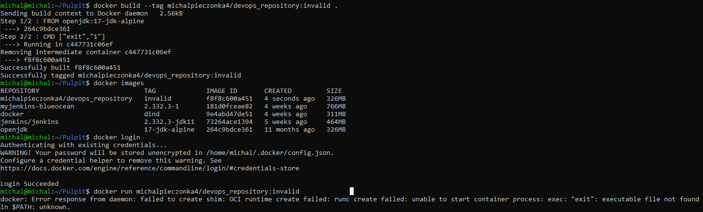
    Następnie wypycham przygotowany obraz ponownie na repozytorium DockerHub:
    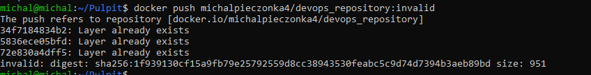
    Weryfikacja obecności obrazów na DockerHub:
    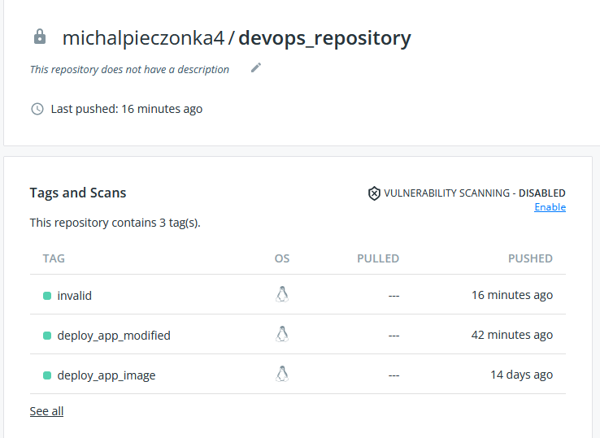
###Zmiany w deploymencie
   Zmiany rozpoczynam od pobrania z DockerHub'a przygotowanych wcześniej obrazów, na hosta, na którym pracuje kubernetes - pamiętając o ustawieniu odpowiedniego agenta (``eval $(minikube docker-env)``)
    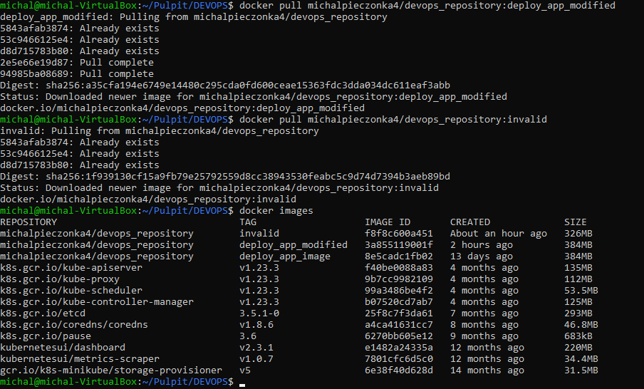
    Wszystkie dokonywane poniżej zmiany można przeprowadzić na dwa sposoby:<br>
    1) Kazdorazowo  modyfikująć plik YML wdrożenia i uruchamiając go ponownie z uwzględnieniem zmian - te opcję zastosowałem poniżej<br>
    2) Wykorzystać odpowiednie polecenia (zaprezentowane niżej), dzięki czemu można operowac na 1 wdrożeniu <br>
  * **Zwiększenie liczby replik**<br>
    Modyfikacji dokonuję 
    Zwiększam liczbę replik do 10 (były 2) - w tym celu w pliku YML w sekcji ``spec`` modyfikuje: ``replicas: 10``, następnie wykorzystując polecenie ``kubectl apply -f deployment-app-petclinic.yml`` wprowadzam zmiany,
    dodatkowo poprzez ``kubectl rollout status -f deployment-app-petclinic.yml`` weryfikuje poprawność sprawdzając stan - jak widać wszystko ok.
    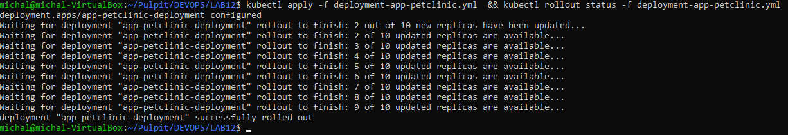
  * **Zmniejszenie liczby replik do 1**<br>
    Polecenie jak powyżej, z nową wartością ``replicas: 1``
   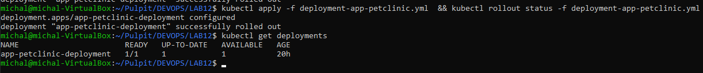
  * **Zmniejszenie liczby replik do 0**<br>
    Analogicznie ``replicas: 0``
    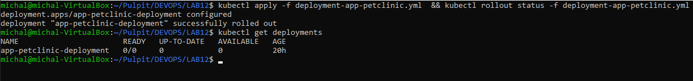
  * **Zastosowanie nowej wersji obrazu** <br>
    Modyfikacji dokonuję poprzez zmianę w pliku YML,  w sekcji ``spec``, ``containers`` wartość ``image`` : ``image:michalpieczonka4/devops_repository:deploy_app_modified``, a następnie poprzez polecenie ``kubectl apply -f deployment-app-petclinic.yml`` zatwierdzam zmianę:
    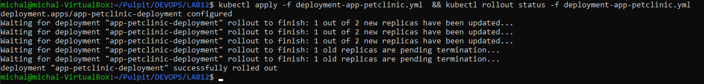
  * **Zastosowanie starszej wersji obrazu** <br>
    Ponownie modyfikuję plik YML zmieniając: ``image:michalpieczonka4/devops_repository:deploy_app_image`` i uruchamiam powyższe polecenie.
    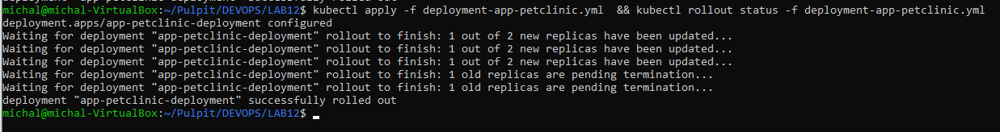
  * **Poprzednie wersje wdrożeń** <br>
    W celu przywracana poprzednich wersji wdrożeń używam poleceń ``kubectl rollout history`` aby wyświetlić historię wersji oraz ``undo`` w celu powrotu do poprzedniej wersji. Aby wrócić do konkretnej rewizji wykorzystuje przełącznik ``-to-revision=2``.
    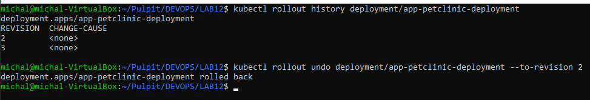
###Kontrola wdrożenia
* **Napisz skrypt weryfikujący, czy wdrożenie "zdążyło" się wdrożyć (60 sekund)** <br>
    Skrypt weryfikujący, czy wdrożenie zdążyło się wdrożyć tworze w shellu (plik skryptu dołączony w osobnym katalogu). W skrypcie tym wykorzystuję funkcję ``timeout``, która jako parametr przyjmuje ilość sekund 
    w tym wypadku równą ``60`` oraz komendę blokującą - ``kubectl rollout status`` - dzięki jej wykorzystaniu możliwe jest upewnienie się czy wdrożenie zostało zakończone, konkretniej w następnym etapie,
    w ``if'ie``sprawdzam wartość zwróconą przez timeout - jeśli ``zwrócona wartość = 0`` - wdrożenie zakończyło się w ustalonym czasie 60s, w przeciwnym razie przyjmuję błąd, w wyniku czego wykonywany jest rollback do poprzedniej wersji i wyswietlany jest dodatkowy komunikat.
    ```sh
    minikube kubectl -- apply -f deployment-app-petclinic.yml
    timeout 60 minikube kubectl -- rollout status  -f deployment-app-petclinic.yml
    if [ $? -eq 0 ]
    then
      echo "Deploy has been sucessfully finished."
    else
      echo "Fail, something went wrong with deploy."
      minikube kubectl -- undo deployment app-petclinic-deployment
    fi
    ```

    Poniżej prezentacja działania skryptu - w pierwszym wariancie 2 repliki, wdrożenie zakończone skucesem, w drugim wariancie 500 replik - brak sukcesu:
    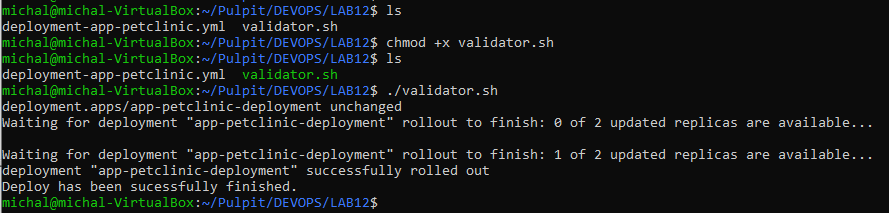 <br>
    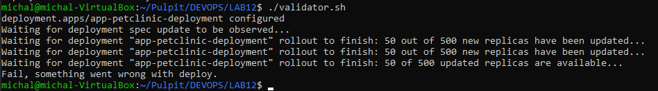<br>
###Strategie wdrożenia
* **Przygotowanie wersji wdrożeń, wykorzystując różne strategie, wraz z opisem, etykietami i obserwacjami. <br>
    Strategia wdrożenia to sposob zmiany lub akttualizacji aplikacji. Jej dobór definuje sposób zachowania całego ekosystemu w przypadku wystąpienia potrzeby zmian w środowisku. Na wstępie kluczową kwestią w przeprowadzaniu wszystkich deploymentów (wykorzystując kubectl apply) jest kwestia, kiedy rzeczywiście nowe wdrożenie zostanie zastosowane - tutaj najbardziej kluczowe okazuje się mechanizm kubernetesa,
    który przeprowadzi nowe wdrożenie stosując wybraną strategię (na potrzeby testów), tylko jeżeli zmiany nastąpią w sekcji ``spec.spec.*``, w przeciwnym razie nowe wdrożenie w rzeczywistości nie nastąpi (np. modyfikując tylko liczbę podów).
    W związku z powyższym w ramach przeprowadzanych testow, każdorazowo będę modyfikował wersję obrazu (na jedną z działających które w zasadzie się od siebie nie różnią - poza dodatkowym logiem), co umożliwi mi zauważenie teoretycznych różnic pomiędzy poszczególnymi strategiami.
  * Strategia **Recreate** <br>
    W celu wykorzystania strategi Recreate wdrożenia w sekcji ``spec`` pliku YML wdrożenia dodaje dodatkową podeskcję:
    ```yaml
    spec:
      strategy:
        type: Recreate
    ```
  Strategia ta charakteryzuje się przede wszystkim sposobem 'aktualizacji wersji' - stara wersja jest zabijana i dopiero po tym następuje wdrożenie nowej  wersji. W wyniku powyższych zachowań występuje sytuacja, w której czas w jakim docelowa aplikacja nie jest dostępna jest sumą czasu zamknięcia starych podów i uruchimienia nowych.
  Poniżej przedstawiłem testy, wykonane na 6 replikach - wraz z poleceniem ``rollout status```. Widać, że rzeczywiście w pierwszym etapie poprzednie pody zostają zabijane, dopiero gdy ostatni pod przestanie istnieć, tworzone są nowe, co zostało zaprezentowane poniżej:
  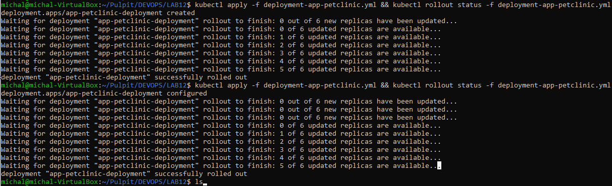<br>
  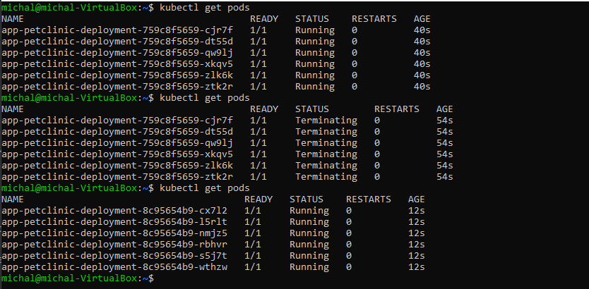<br>
  Po wdrożeniu pierwszej wersji deploymentu (na obrazie 1)  utworzone zostało 6 podow. Po zmianie obrazu z wykorzystaniem strategi recreate - w pierwszym etapie pody z poprzedniego wdrożenia zostaly zabite, a następnie nowe pody zostaly utworzone.
  * Strategia **RollingUpdate** <br>
    W wypadku w sekcji ``spec`` pliku YML wdrożenia modyfikuje wcześniej dodaną podeskcję:
    ```yaml
    spec:
      strategy:
        type: RollingUpdate
        rollingUpdate:
            maxSurge: 2
            maxUnavailable: 0
    ```
    Strategia ta jest domyślną strategią deploymentu, w przypadku gdy żadna inna nie jest wskazana. Polega ona na stopniowym aktualizowaniu liczby podów (tworzone są dodatkowe pody z nową wersją aplikacji,a pody ze starszą wersją aplikacji są zabijane, aż do osiągnięcia docelowej liczby replik).
    Poprzez etykietę ``maxSurge`` określana jest maksymalna liczba jednocześnie uaktualnianych replik (wartość może być wyrażona liczbą całkowitą lub wartością %), natomiast ``maxUnavailable`` - określa maksymalną liczbę replik niedostępnych podczas uaktualnienia. Strategia ta w porównaniu z Recreate 
    ma tę zaletę, że w przypadku wdrażania nowej wersji, nie wystąpi żaden czas przestoju - a płynne przejście pomiędzy wersjami. 
    W moim przypadku wybrałem kolejno wartości 2 oraz 0, co oznacza że w tym samym czasie maksymalnie 2 repliki mogą być aktualizowane/dodane (mogą wystepować maksymalnie 2 nadmiarowe pody).
    Poniżej przedstawiłem testy, wykonane na 6 replikach - wraz z poleceniem ``rollout status``
    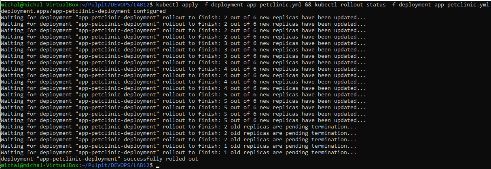<br>
    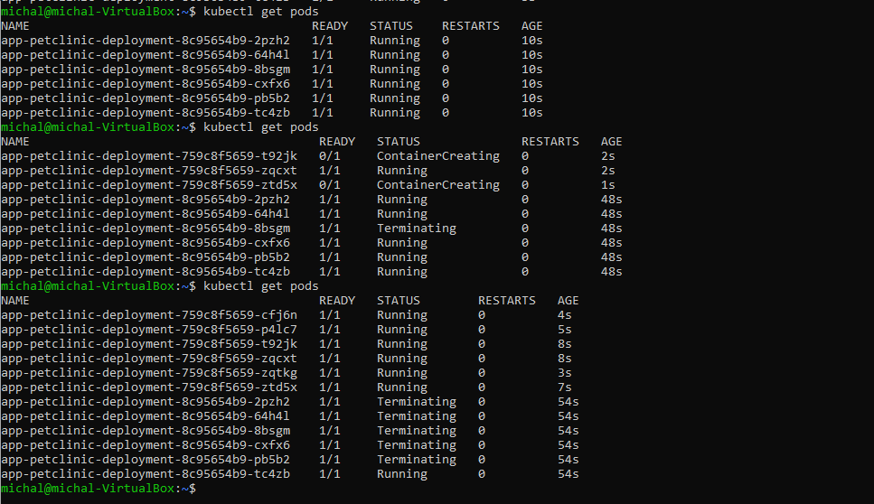<br>
    Widać iż zabijanie podów posteępowało progresywnie, tak aby liczba nadmiarowych podów nie była większa niż ``maxSurge: 2`` - tak więc przy pierwszym sprawdzeniu stanu podów, były obecne tylko 2 nowe pody.
  * Strategia **Canary** <br>
    Strategia ta opiera się na wdrażaniu nowych wersji aplikacji obok starszych stabilnych wersji produkcyjnych. W porównaniu do pozostałych strategi wyróżnia się także potrzebą dwóch plików YML z różnymi labelami (zwykle róznym numerem wersji).
    Jej zastosowanie pozwala na stopniowe zwiększanie podów z nowym wdrożeniem z równoczesnym wypieraniem podów korzystających ze starszej wersji.
    W tym wypadku, w pierwszym kroku utworzyłem dodatkowy plik YML deploymentu ``deployment-app-petclinic-canary``. Następnie w bazowym pliku YML wdrożenia (``deployment-app-petclinic``) modyfikuje usuwam wcześniej
    utworzoną sekcję ``strategy`` oraz w sekcji ``spec.metadata.labels`` obok ``app`` dodaje także numer wersji poprzez określenie parametru ``version``: 
    ```yaml
    spec:
        template:
            metadata:
                labels:
                    app: app-petclinic
                    version: "1.0"
    ```
    Natomiast w utworzonym wczesniej nowym pliku YML wdrożenia (``deployment-app-petclinic-canary``) dokonuje takiej samej modyfikacji - z nowym numerem wersji:
     ```yaml
    spec:
        template:
            metadata:
                labels:
                    app: app-petclinic
                    version: "2.0"
    ``` 
    Dodatkowo modyfikuję również wersję obrazu ``image: michalpieczonka4/devops_repository:deploy_app_modified`` <br>
    Następnie wdrażam pierwszą wersję deploymentu (``version 1.0``), a po jej poprawnym wdrożeniu robię to samo, dla wersji numer ``2.0``, czego efektem  jest jak widac - postępująca zamiana podów z starej wersji wdrożenia na nowo utworzone - w nowej wersji wdrożenia
    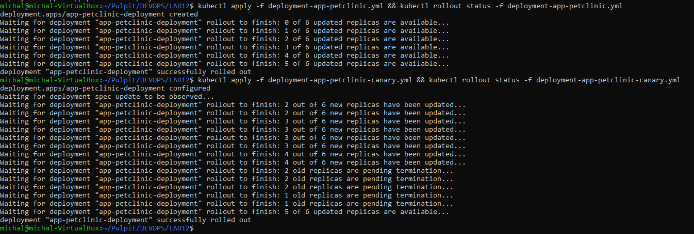<br>
    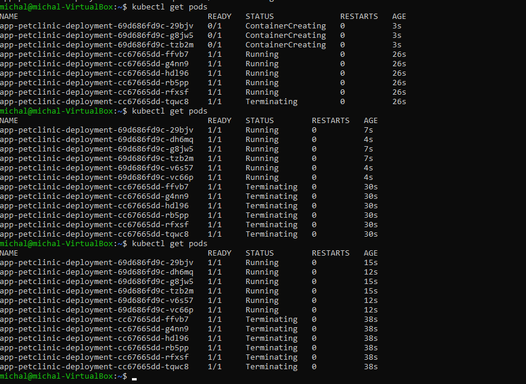<br>