# Sprawozdanie
### 12.06.2022
---
## Wdrażanie na zarządzalne kontenery: Kubernetes (1)

W celu poprawnego działania kubernetesa upewniłem się na samym początku czy zostały spełnione wszystkie wymagania sprzętowe, czyli:

1.  Przydzieliłem 2 rdzenie procesora
2.  3GB pamięci RAM
3.  60GB miejsca fizycznego (tak dla pewności)
4.  Połączenie z internetem
5.  Kontener (docker)

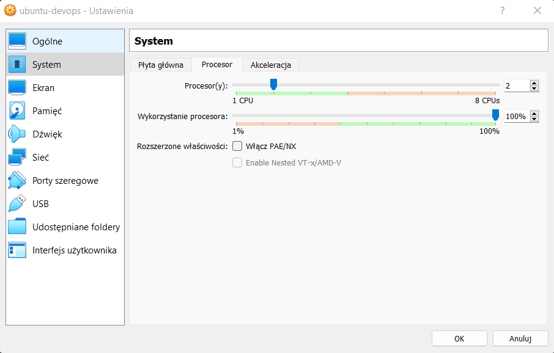

Podczas pierwszego podejścia napotkałem problemy których nie byłem w stanie naprawić. Pojawiały się one podczas polecenia `minikube start --driver=docker`. Próbowałem je rozwiązać ale na miejsce rozwiązanego problemu pojawiały się dwa następne. Doprowadziło to do sytuacji, gdzie nie byłem w stanie już przywrócić normalnego działania maszyny. Pokazywał się dziwny błąd o braku miejsca na dysku, więc postanowiłem stworzyć nową maszynę wirtualną. Pewnie jest jakiś łatwy sposób na rozwiązanie tego problemu, ale niestety go nie znalazłem.

Na nowej maszynie konfiguruje połączenie SSH, Gita oraz Dockera. Następnie przechodzę do instalacji zgodnie z dokumentacją:

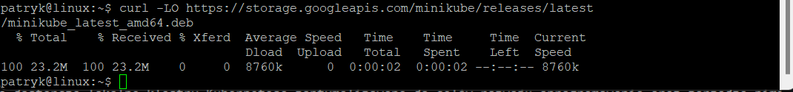

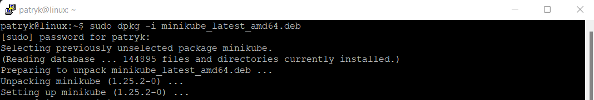

Zgodnie z sugestią dodaje moje konto `patryk` do grupy dockera i odpalam polecenie `minikube start --driver=docker`

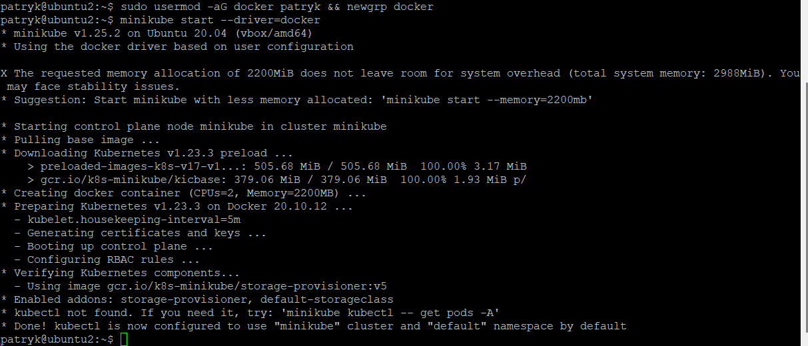

Pokazuje działające kontenery:

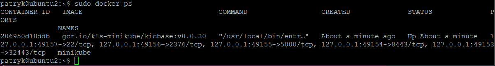

Następnie aby uzyskać dostęp do klastra wywołuje komendę `minikube kubectl --get pods -A`

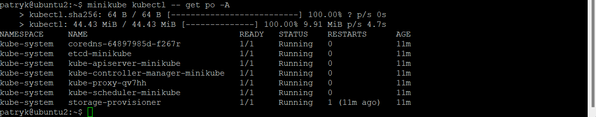

Pusty dashboard:

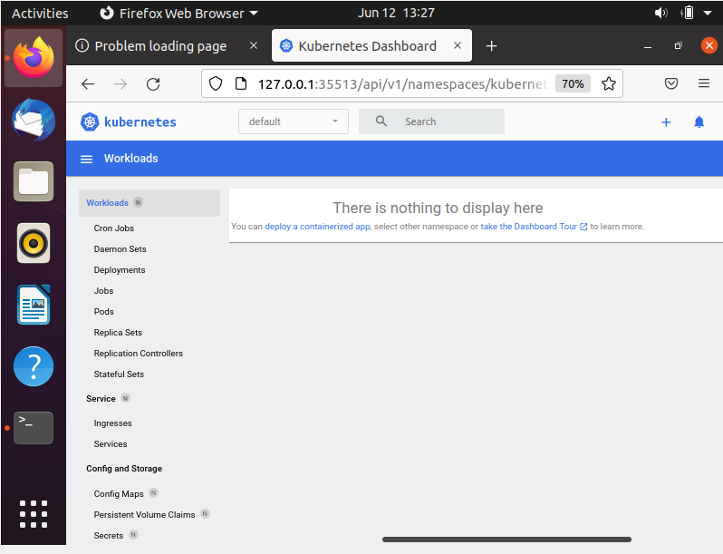

Instaluję `kubectl`

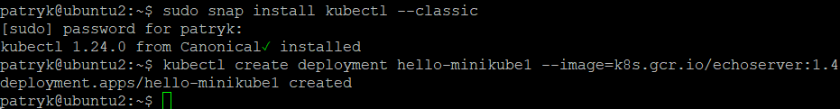

Następnie tworze deployment, eksponuje odpowiedni port, włączamy obsługe deploymentu oraz przekierowuje porty:

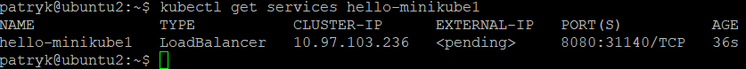

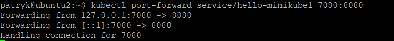

Na localhoscie sprawdzam czy wszystko działa poprawnie:

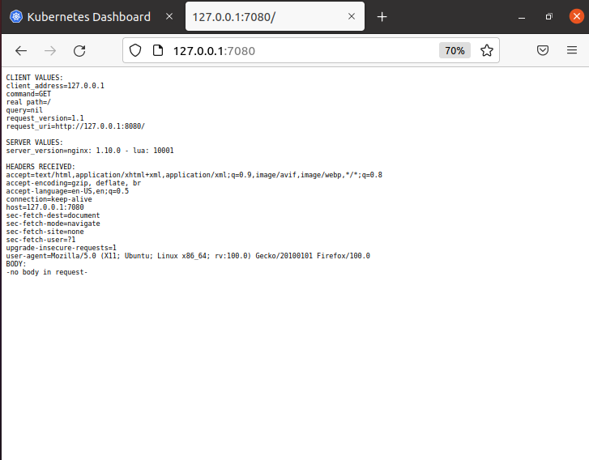

Widzimy że wszystko działa poprawnie

Dashboard:

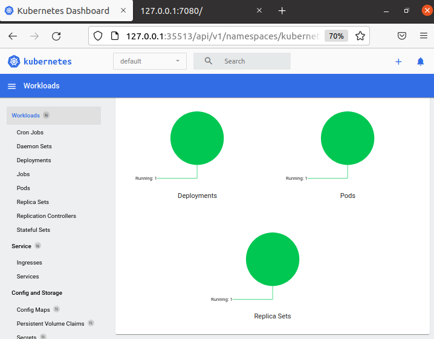

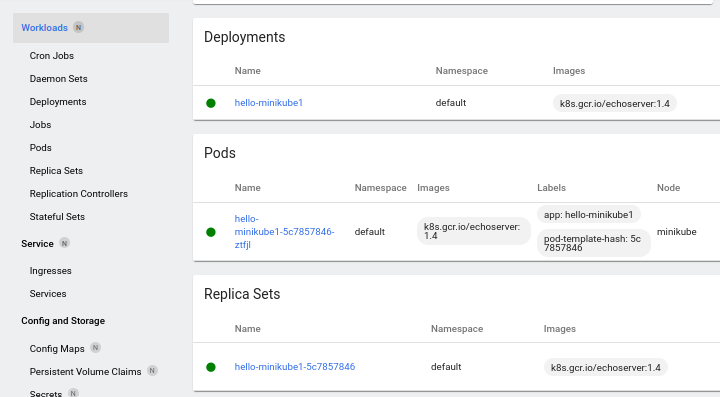

Następnie tworze plik YAML, którego templatke biore z oficjalnej dokumentacji i odpowiednio go modyfikuje na swoje potrzeby

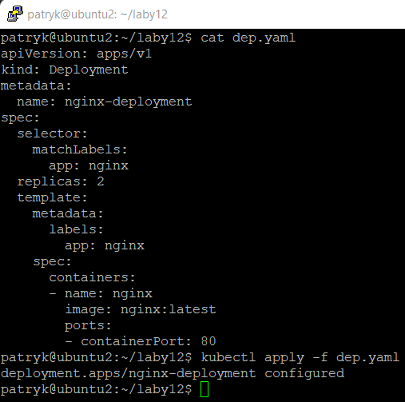

Zdecydowałem się na obraz Nginx z tego wzglądu że pracowałem z nim w poprzednich zajęciach

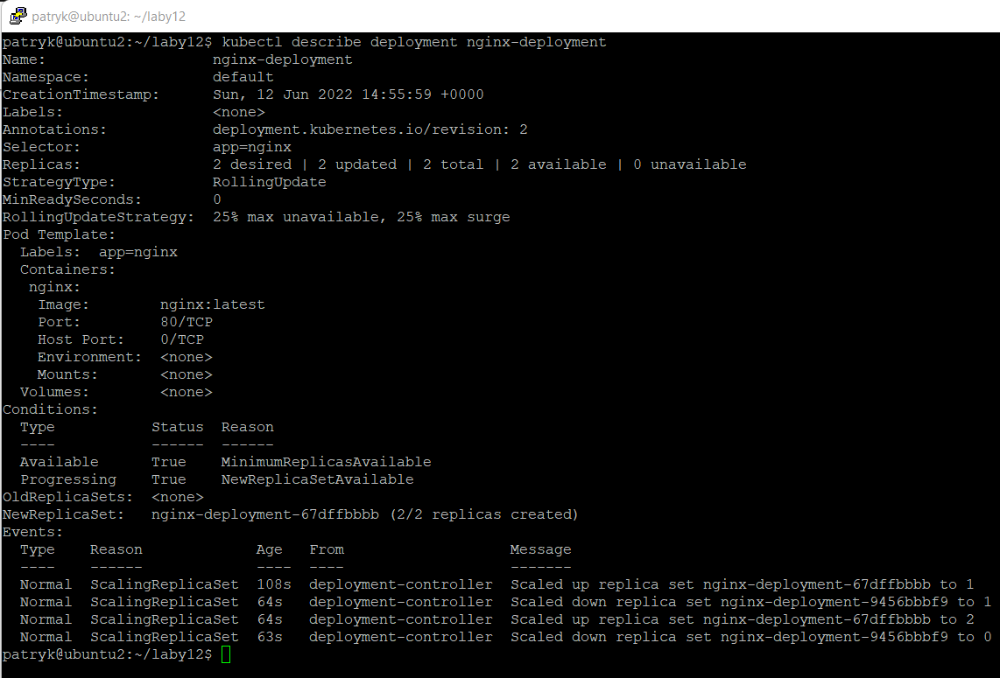

