# Sprawozdanie
### 13.06.2022
---
## Wdrażanie na zarządzalne kontenery: Kubernetes (2)

W poprzednim sprawozdaniu stworzyłem plik YAML z obrazem Nginx z dwiema replikami. Pierwszym krokiem tych zajęć jest zwiększenie tej liczny do 4. Wykonuje to poprzez zmiane w pliku YAML liczby replik z 2 na 4. W efekcie mamy działające 4 pody.

Plik YAML:

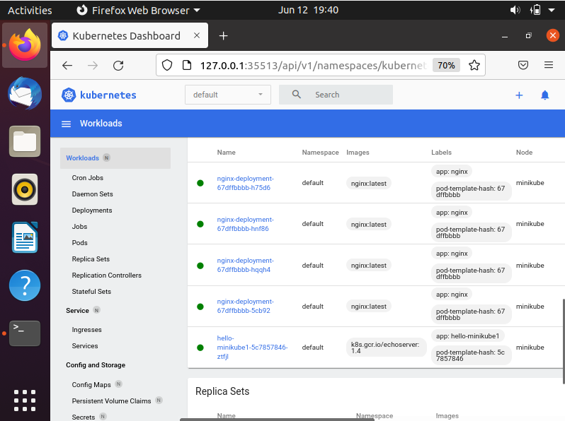

Badam stan za pomocą `kubectl rollout status`:

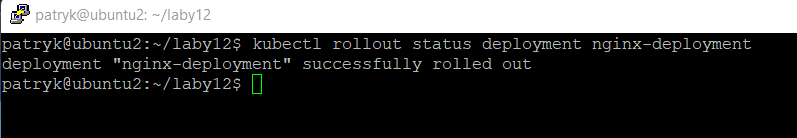

Jako obraz alternatywny wybrałem starszą wersję Nginx'a:

-   zmniejszenie liczby replik do 1

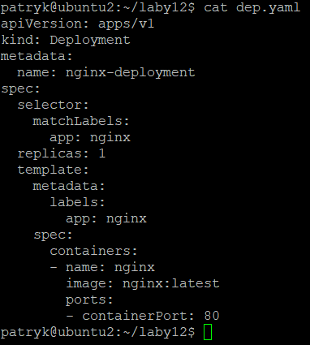

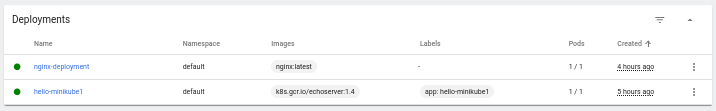

-   zmniejszenie liczby replik do 0

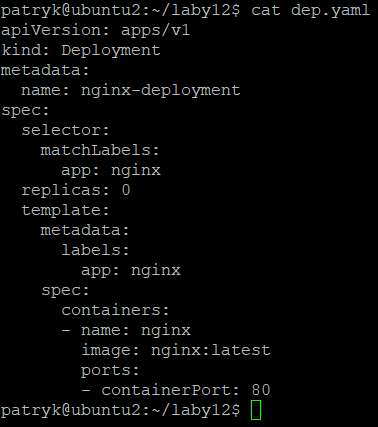

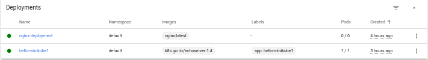

-   utworzenie 4 replik

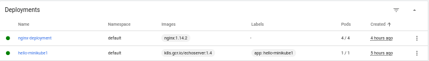

-   zastosowanie nowej wersji obrazu.

Wyżej była zastosowana wersja obrazu `latest` czyli najnowsza

-   zastosowanie starszej wersji obrazu.

Została zastosowana podczas prezentacji 4 replik

Za pomocą polecenia `kubectl rollout undo` przywracam nowszą wersję `latest`

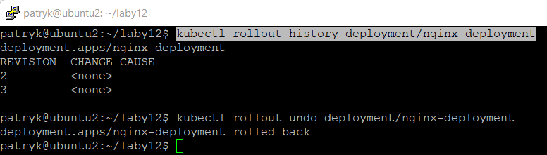

-   Napisz skrypt weryfikujący, czy wdrożenie "zdążyło" się wdrożyć (60 sekund).

Stworzyłem prosty skrypt sprawdzający czy wdrożenie "zdążyło" się wdrożyć w określonym czasie

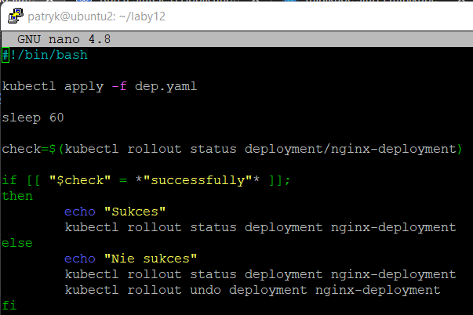

Odpalam skrypt i czekam 60 sekund

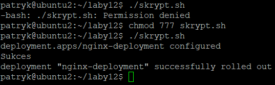

Widzimy że wdrożenie "zdążyło się wdrożyć" :)

Następnym krokiem było przygotowanie wdrożeń korzystając z różnych strategii

**Recreate** strategia ta charakteryzuje się zakończeniem działania instancji będących nieaktualnymi a następnie uruchomieniem ich ponownie w nowszej wersji. Wdrożenie to zapewnia nam ciągłość odnawiania stanu aplikacji, jednak czas przestoju wdrożenia jest sumą czasu zamknięcia oraz uruchomienia aplikacji.

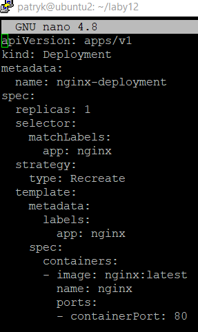

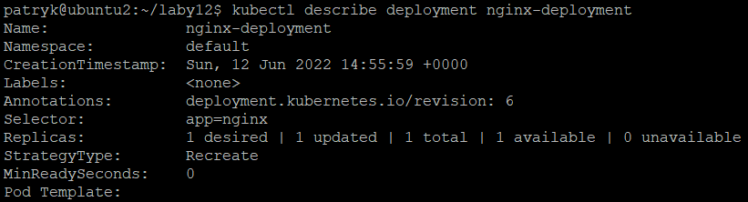

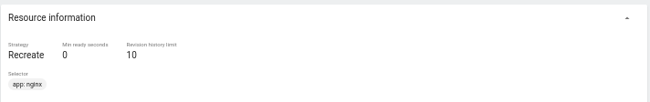

**Rolling Update** wdrażanie to prowadzi do stopniowej aktualizacji, ponadto tworzony jest dodatkowy zestaw podów z aktualną, nową wersją aplikacji. Kolejno pody ze starszą wersją aplikacji jest zmniejszana, a nowa wersja zwiększana. Proces ten jest kontynuuowany aż do osiągnięcia nominalnej liczby replik.

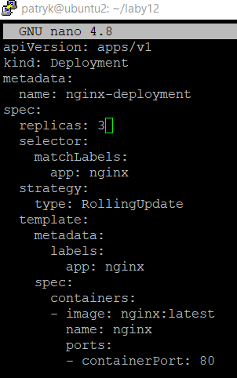

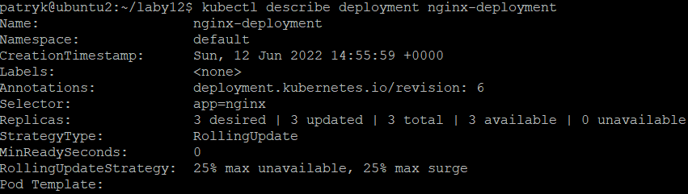

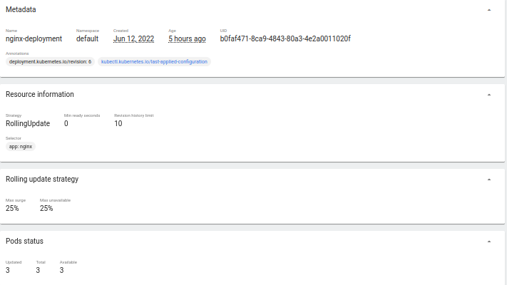

**Canary deployment workload** to wdrożenie opiera się na wdrażaniu nowego oprogramowania obok starszych stabilnych wersji, takie wdrożenie wykonujemy przy użyciu dwóch plików yamlowych z różnymi labelami. Postępujące z czasem wdrożenie pozwala nam na zwiększanie podów z nowym wdrożeniem i rezygnacje ze starego.

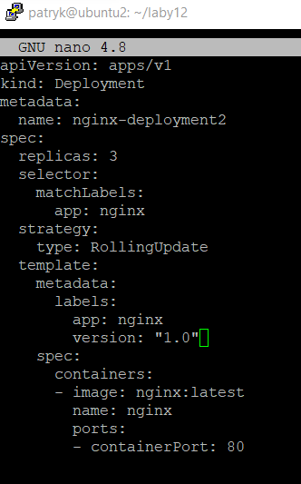

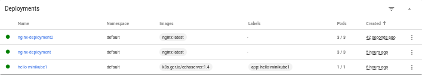