# Sprawozdanie z lab 9

Na początku musiałem ponownie wygenerować artefakt z pipelineu, było to spowodowane "awarią" poprzedniej maszyny wirtualnej. Niestety wykonanie pipeline nie powiódło się...


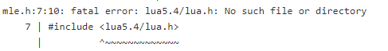

Jak się okazało jest to spowodowane zmianą wersji biblioteki `lua`

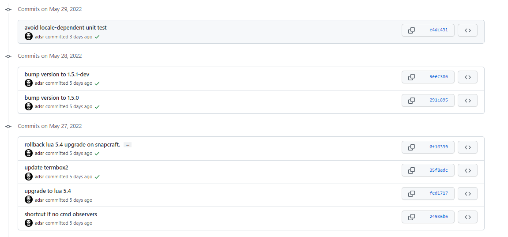

Niestety wersja biblioteki jest w nazwe headera


Aby nie modyfikować wrzuconych już na Githuba plików projektu postanowiłem edytować pipeline lokalnie. Przerzuciłem w tym celu wszytskie potrzebne pliki do katalogu projektu w `/var/jenkins_home/workspaces`.

Problem postanowiłem rozwiązać cofając się do starych commitów używających starszej wersji biblioteki. Użyłem w tym celu `git reset --hard <commit-hash>`

```docker
FROM ubuntu:latest

RUN apt-get update && apt-get install -y git
CMD ["sh", "-c",  "git clone --recursive https://github.com/adsr/mle.git && cd mle && git reset --hard 66cd599a363b7387839b12054da4bba00cb897ff && cd ../  && cp -r mle /mle_src"]
```

Ostaczenie udało się otrzymać artefakt będący pakietem debianowym.
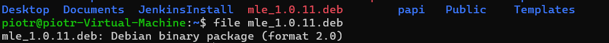

Problemem jest to, że fedora którą będziemy instalować używa innych packageów - `.rpm`.
W tym celu spróbowałem przekonwertować paczkę `.deb` na `.rpm` przy użyciu narzędzia `alien`.


Otrzymano paczkę `.rpm`


Nastepnie wrzucono ją na `Githuba` (do innego repozytorium) aby można ją było łatwo pobrać na inną maszyne.

Następnie zainstalowano `Fedore` na `HyperV` jednoczesnie generując plik `kickstart`.


Po instalacji postanowiłem sprawdzić czy faktycznie będzie dało się łatwo wykorzystać "nowy" instalator.

W tym celu zaciągnąłem paczke z instalotorem

`curl -o mle-1.0.11-2.all.rpm -L https://github.com/ptrk00/PSI2022/raw/master/mle-1.011-2.all.rpm`

I podjąłem próbę instalacji

`yum install ./mle-1.0.11-2.all.rpm`

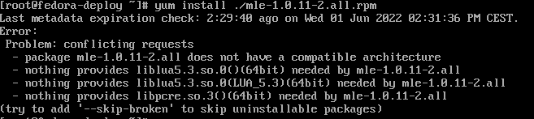

O ile problem problem z kompatybilnością architektury wydaje się być jakoś do rozwiązania (myślę, że może chodzić o modyfikacje jakichś metadanych w pliku konfiguracyjnym dla paczki) to nie wiedziałem co zrobić z brakującymi bibliotekami.

Przykładowo dla biblioteki `liblua5.3-dev`
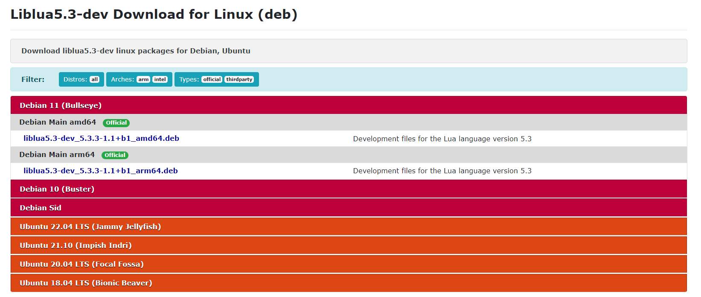
Nie wiem jak znaleźć odpowiednik dla Fedory.

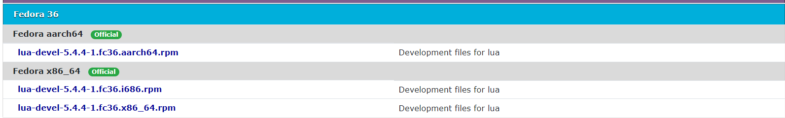

W tym momencie poddałem się z tworzeniem własnego instalatora dla Fedory i postanowiłem wykorzystać package ze `snapa'a` stworzony przez autora projektu który buduję.

Tak jak poprzednio przed definiowaniem kroków w pliku `kickstart` chciałem sprawdzić już na zainstalowanym systemie czy będą jakieś problemy z instalacją pakietu.

Instalacja snapa

`yum install snapd`

Instalacja pakietu

`snap install mle-editor`

I faktycznie tym razem program zainstalował się poprawnie

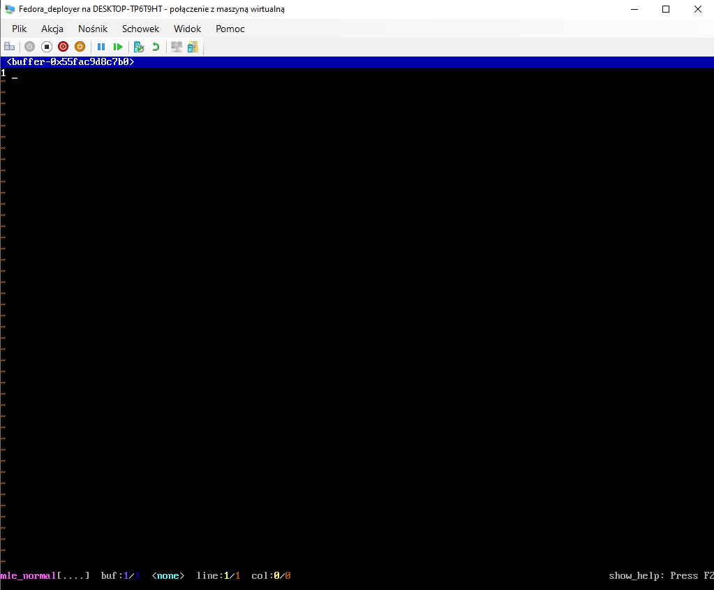

Do wygenerowanego pliku kickstart dodano do niego następujące linijki
```
# Repo
url --mirrorlist=http://mirrors.fedoraproject.org/mirrorlist?repo=fedora-$releasever&arch=x86_64
repo --name=updates --mirrorlist=http://mirrors.fedoraproject.org/mirrorlist?repo=updates-released-f$releasever&arch=x86_64
```

installacje `snapd` umieszczono w sekcji packages
```
%packages
@^minimal-environment
snapd
%end
```

a w sekcji post dodano komende pobierającą program z repozytorium
```
%post
dnf reinstall -y snapd
snap install mle-editor
%end
```

Niestety podczas próby okazało się, że instlacja nie przebiegła pomyślnie. `Snapd` instalował się poprawnie jednak próba instalacji
docelowego programu przy jego pomocy kończyła się nie powodzeniem

`Error: too early for operation, device not yet seeded or device model not acknowledged`

Okazało się że jest to bug związany z HyperV

[snapcraft](https://forum.snapcraft.io/t/error-too-early-for-operation-device-not-yet-seeded-or-device-model-not-acknowledged/12421)

[bugs.launchpad](https://bugs.launchpad.net/ubuntu/+source/livecd-rootfs/+bug/1828500)

Pierwsza próba polegała na zmianie skryptu instalującego tak by przed próbą installacji głównego pakietu dokonać reinstalacji
`snap'a`

```
%post
dnf reinstall -y snapd
snap install mle-editor
%end
```

Próba ta zakończyła się ponownie niepowodzeniem.

Kolejna próba polegała na instalacji `snapd` w sekcji `%post` zamiast w `package`, to zakończyło się ponownie niepowodzeniem.

Ogólnie po instalacji systemu `mle-editor` nie jest zainstalowany, pierwsze wywołanie 

`snap install mle-editor`

kończy się wcześniej spowodowanym błedem, jednak ponowne wywołoanie przechodzi i program instaluje się poprawnie.

Próba umiesczenia kilku poleceń `snap install mle-editor` w sekcji `%post` również kończy się niepowodzeniem. W tym momencie się ponownie poddałem i założyłem, że w normalnej sytuacji powinno to działać.

Ostatni krok polegał na połączeniu pliku odpowiedzi z ISO instalacyjnym. W tym celu kierowano się instrukcjami z 

[Making the kickstart file avaiable](https://access.redhat.com/documentation/en-us/red_hat_enterprise_linux/6/html/installation_guide/s1-kickstart2-putkickstarthere?fbclid=IwAR2W9OZkBAYOjWNj-y2LsLbN1w7Mh7RVlec_wvQSGiPiEW2LTCMTwRWV1Vk)

Najpierw przekopiowano obraz `.iso` przy pomocy `scp` na Fedore.

`mount Fedora-Server-netinst-x86_64-36_Beta-1.4.iso /mnt/iso`

`cp -pRf /mnt/iso workdir/`

`umount /mnt/iso`

`cp /root/anaconda-ks.cfg /home/deployer/workdir/iso/`

następnie edytowano plik `isolinux/isolinux.cfg`. Dodano linijkę

`ks=https://raw.githubusercontent.com/ptrk00/PSI2022/master/anaconda-ks.cfg`

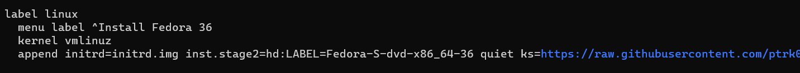

Następnie wygenerowano nowy plik `.iso`.

`genisoimage -U -r -v -T -J -joliet-long -V "RHEL-6.9" -volset "RHEL-6.9" -A "RHEL-6.9" -b isolinux/isolinux.bin -c isolinux/boot.cat -no-emul-boot -boot-load-size 4 -boot-info-table -eltorito-alt-boot -e images/efiboot.img -no-emul-boot -o ../Fedora_mle_deploy.iso .`


`implantisomd5 ../Fedora_mle_deploy.iso`

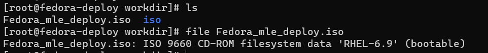

Następnie zaciągnięto wygenerowany obraz `.iso` na widnowsa


I uwtorzono nową maszyne wirtualną z tego obrazu. Podczas isntalacji pojawiły się problemy.
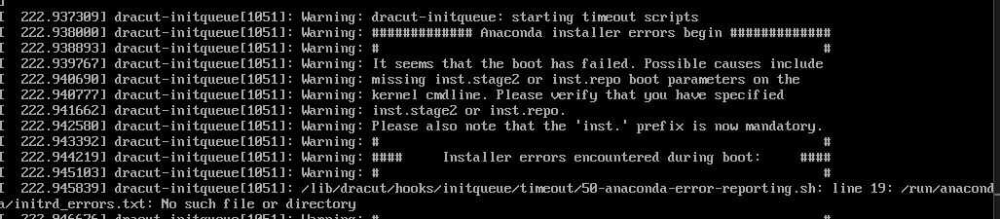

W pierwszej kolejności dopisałem `isnt.` przed `ks` jednak to nie pomogło. Później, w komendzie `genisoimage` wycztałem, że parametr `-V` ustawia LABEL obrazu,
zatem dałem taki sam label `"RHEL-6.9"` do pliku `isolinux/isolinux.cfg`.

`inst.stage2=hd:LABEL=RHEL-6.9`

jednak problem pozostał pomimo, iż upewniłem się, że `Volume id` jest odpowiedni

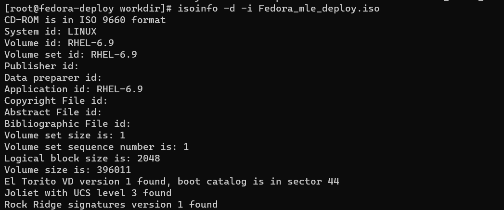
