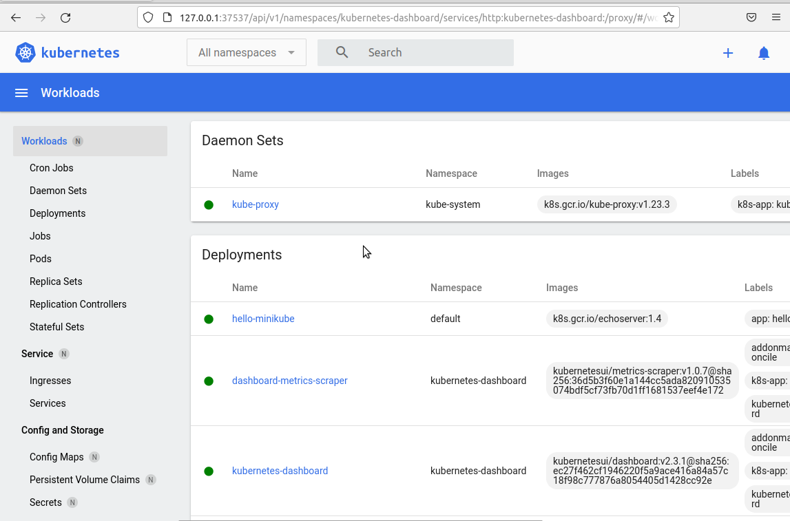
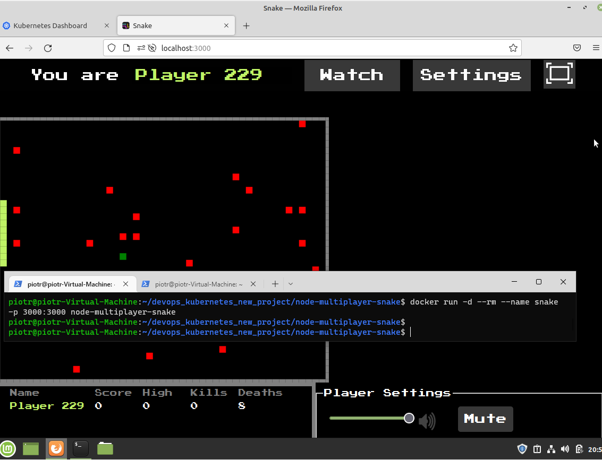
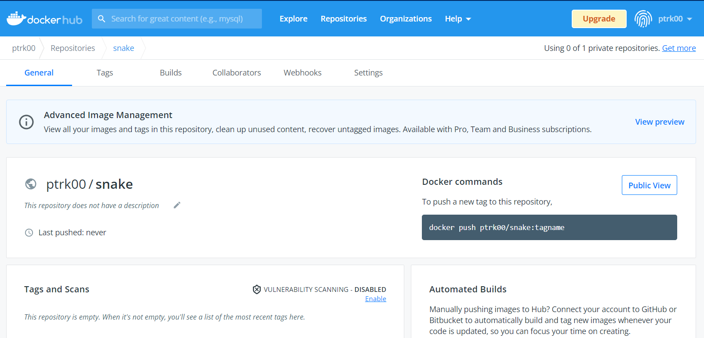
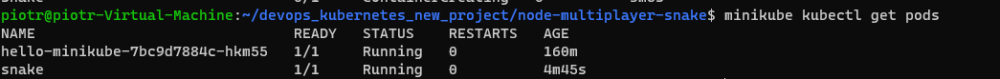
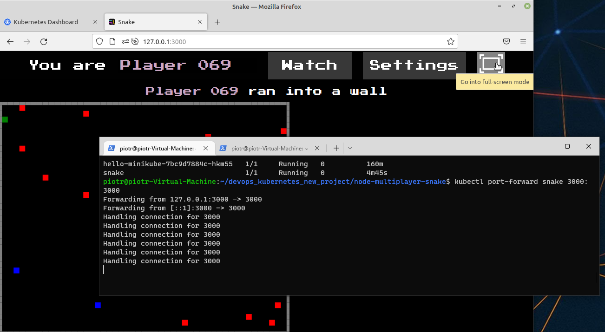
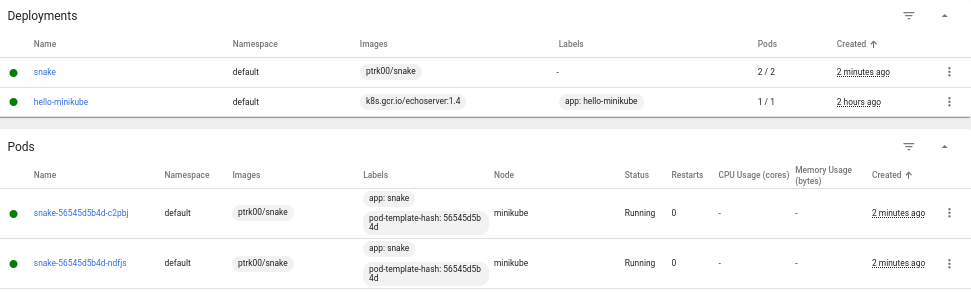

# Sprawozdanie z Lab11
### Piotr Pyka


## Instalacja klastra Kubernetes

Na początku przeprowadzono instalacje `minikube`.

Zciągnięto isntalator

`curl -LO https://storage.googleapis.com/minikube/releases/latest/minikube_latest_amd64.`

Następnie zainstalowano paczkę `.deb`

`sudo dpkg -i minikube_latest_amd64.deb`

Dodano odpowiednie uprawnienia

`sudo chown -R $USER $HOME/.minikube; chmod -R u+wrx $HOME/.minikube`


Uruchomiono program 

`minikube start`

Następnie rozpoczęto proces instalacji `kubectl`.

Zainstalowano odpowiednie zależności.

`sudo apt-get update`

`sudo apt-get install -y apt-transport-https ca-certificates curl`

Dodano klucz `.gpg`.

`sudo curl -fsSLo /usr/share/keyrings/kubernetes-archive-keyring.gpg https://packages.cloud.google.com/apt/doc/apt-key.gpg`

Dodano repozytorium `apt`

`echo "deb [signed-by=/usr/share/keyrings/kubernetes-archive-keyring.gpg] https://apt.kubernetes.io/ kubernetes-xenial main" | sudo tee /etc/apt/sources.list.d/kubernetes.list`

Na końcu zupdateowano index `apt` i pobrano `kubectl`.

`sudo apt-get update`
`sudo apt-get install -y kubectl`

Następnie w celu przetestowania poprawoności działania stworzono poda `hello-minikube`

``` sh
kubectl create deployment hello-minikube --image=k8s.gcr.io/echoserver:1.4

kubectl expose deployment hello-minikube --type=NodePort --port=8080
```

`kubectl get services hello-minikube`

Następnie przekierowano port `8080` z kontenera na `7080` na hoscie.

`kubectl port-forward service/hello-minikube 7080:8080`

Wynik zapytania `http` 


Na końcu uruchomiono `dashboard`

`minikube dashboard`



Widać na nim działającego `pod'a` `hello minikube`

## Analiza posiadanego kontenera

Ponieważ projekt budowany z pipelineu będący konsolowym edytorem tekstu nie wystawiał żadnego
portu sieciowego, zdecydowano na zmiane projektu.

Wybrano projekt będący grą snake multiplayer działającą w przeglądarce. Projekt dostępny jest pod linkiem

`https://github.com/simondiep/node-multiplayer-snake`

Projekt ten nie zawierał pliku `dockerfile` dlatego taki stworzono samodzielnie.

```docker
FROM node:latest

WORKDIR /app

COPY package.json .

RUN npm install
EXPOSE 3000

COPY . .

CMD ["npm", "start"]
```

Następnie zbudowano obraz z powstałego `dockerfile`.

`docker build -t node-multiplayer-snake .`

oraz uruchomiono aplikacje, port `3000` w kontenerze został wyprowadzony na port `3000` na hoscie.

`docker run -d --rm --name snake -p 3000:3000 node-multiplayer-snake`

Urchomienie aplikacji




Nastepnie stworzono nowe repozytorium na `dockerhub`.



Otagowano istniejący image

`docker tag node-multiplayer-snake ptrk00/snake`

i zuploadowano obraz na `dockerhub`

`docker push ptrk00/snake`

## Uruchamianie oprogramowania

Uruchomiono pod'a ze zbudowanym obrazem

`minikube kubectl run -- snake -- image=ptrk00/snake --port=3000 --labels app=snake`

oraz upewniono się co do poprawności działania przy pomocy `kubectl`



następnie wyprowadzono port `3000` na `3000`

`kubectl port-forward snake 3000:3000`

i ponownie sprawdzono poprawność działania, tym razem bezpośrednio z przeglądarki.



Poprawne działanie z poziomu dashboarda pokazane jest już przy wykorzystaniu pliku `yaml` z replikami na ostatnim screenie w sprawozdaniu.

## Przekucie wdrożenia manualnego w plik wdrożenia 

Proces wdrożenia przedstawiono przy pomocy pliku `yaml`. Plik ten zawiera lokalizacje kontenera wdrożenia (`ptrk00/snake`), nazwę wdrożenia (`snake`), ilość replik (2) oraz port na którym będzie działał kontener (`3000`). 

``` yaml
apiVersion: apps/v1
kind: Deployment
metadata:
  name: snake
spec:
  selector:
    matchLabels:
      app: snake
  replicas: 2 # tells deployment to run 2 pods matching the template
  template:
    metadata:
      labels:
        app: snake
    spec:
      containers:
      - name: snake
        image: ptrk00/snake
        ports:
        - containerPort: 3000

```

Na końcu dokonano wdrożenia wykonując `kubectl apply` na pliku `yaml`.

`kubectl apply -f ./kube-apply.yaml`

Na screenie poniżej możemy zauważyć faktyczne działanie dwóch replik.



