# Sprawozdanie z lab 12
### Piotr Pyka


## Konwersja wdrożenia ręcznego na wdrożenie deklaratywne YAML

Plik wdrożenia `yaml` zmienio w taki sposób by tworzone były 4 repliki.

``` yaml
apiVersion: apps/v1
kind: Deployment
metadata:
  name: snake
spec:
  selector:
    matchLabels:
      app: snake
  replicas: 4 # tells deployment to run 4 pods matching the template
  template:
    metadata:
      labels:
        app: snake
    spec:
      containers:
      - name: snake
        image: ptrk00/snake
        ports:
        - containerPort: 3000
```

Następnio rozpoczęto wdrożenie wykoując

`kubectl apply -f ./kube-apply.yaml`

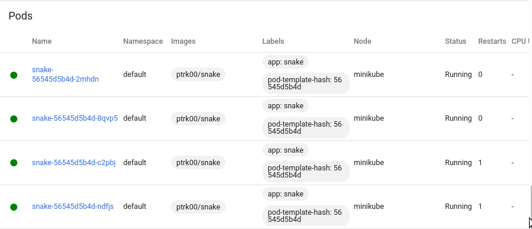

2 pody działały już wcześniej poniważ w pliku `yaml` label `replica` był ustawiony na `2`. W momencie gdy liczba ta została zmieniona na `4` do życia powołono dwa kolejne nowe pody.

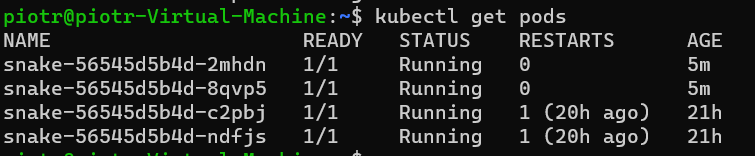

Następnie sprawdzono status wdrożenia przy pomocy

`kubectl roullout status deployment/snake`

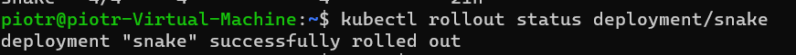

Jak widać wdrożenie przebiegło poprawnie.

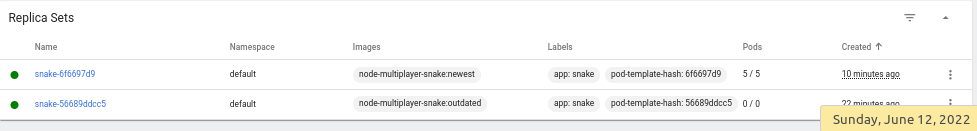

## Przygotowanie nowego obrazu

Następnie lokalnie zarejstrowano nową wersję obrazu, nadano jej tag `outdated`.

`docker build -t node-multiplayer-snake:outdated .`

A następnie zarejstrowano kolejną wersję obrazu, której uruchomienie kończy się błędem. Dzieje się tak z powodu odinstalowania `express'a`. 

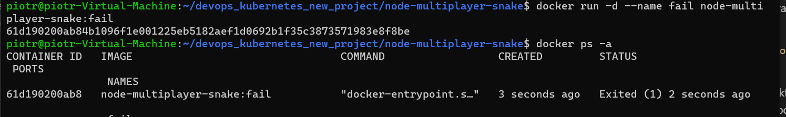

## Zmiany w deploymencie

Następnie zwiększono liczbę replik do `10`.

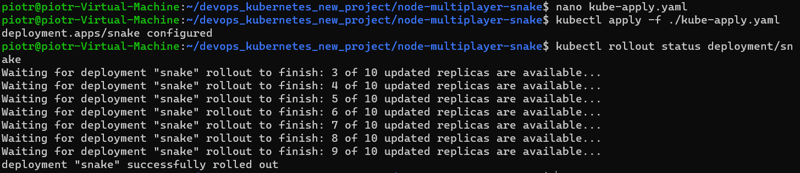

Następnie zmniejszono liczbę replik do `1`.

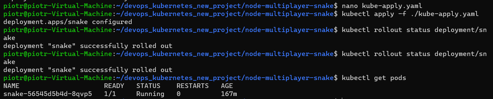

Później zmieniszono liczbę replik do `0`.

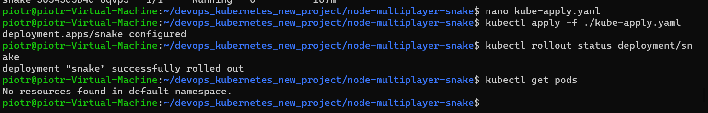

Wszytskie wdrożenia dotychczas działały na nowszej wersji. Zmieniono teraz plik `yaml` by wykorzystywany był obraz 'starszej' wersji - otagowany `outaded`. 

Podczas próby wdrożenia pojawił się błąd.

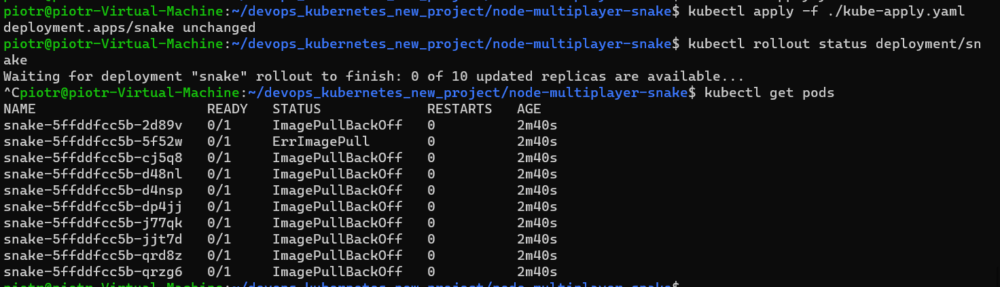

okazało się, że obraz był szukany na `dockerhub` jednak obraz znajdował się lokalnie.

W celu rozwiązania tego problemu wykonano najpierw polecenie

`eval $(minikube -p minikube docker-env)`

następnie do pliku `yaml` dodano następującą linijkę

`imagePullPolicy: Never`

na końcu przebudowano wszytskie obrazy.

Ostatecznie udało się rozwiązać problem.

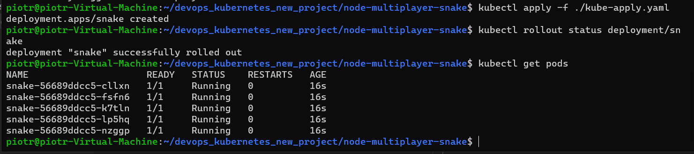

Po wykonaniu

`kubectl rollout history deployments\snake`

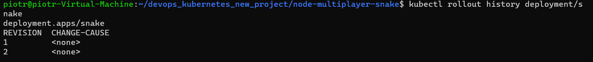

A następnie cofnięto się do poprzedniej wersji (`newest`) wykonując

`kubectl rollout undo deployment/snake`


## Kontrola wdrożenia

Następnie opracowano skrypt który weryfikuje czy wdrożenie zdążyło się wdrożyć w zadanym czasie.

```sh
#!/bin/bash

timeout $1 kubectl rollout status deployment/snake
ret=$?
if [ "$ret" -eq 0 ]
then
        echo "Successfull deployment"
        exit 0
else
        echo "Failed deployment! Kubectl returned $ret"
        exit "$ret"
fi

```

Skrypt wywołuje `rollout status` na zadanym deploymencie z ilością sekund podaną jako pierwszy parametr. Następnie sprawdzany jest exit code polecenia.

Aby całość 'zgrabnie odpalić' wdrożenie poprzez `kubectl apply` oraz uruchomienie powyższego skryptu zostało ujęte w kolejny skrypt.

```sh
#!/bin/bash
kubectl apply -f ./kube-apply.yaml
./validate.sh $1
```

Przykład: 25 replik i 15 sekund

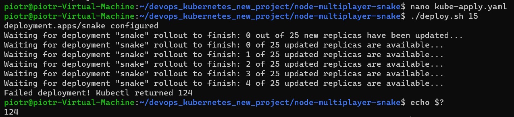

25 replik i 60 sekund


## Strategie wdrożenia

Następnie przygotowano wersje wdrożeń stosujące różne strategie takie jak `recreate`, `rolling update` oraz `canary deployment workload`.

- Recreate 

``` yaml
strategy:
      type: Recreate
```

Wszystkie pody wersji starej zostają zabite a następnie zostają uruchamiane pody nowej wersji.

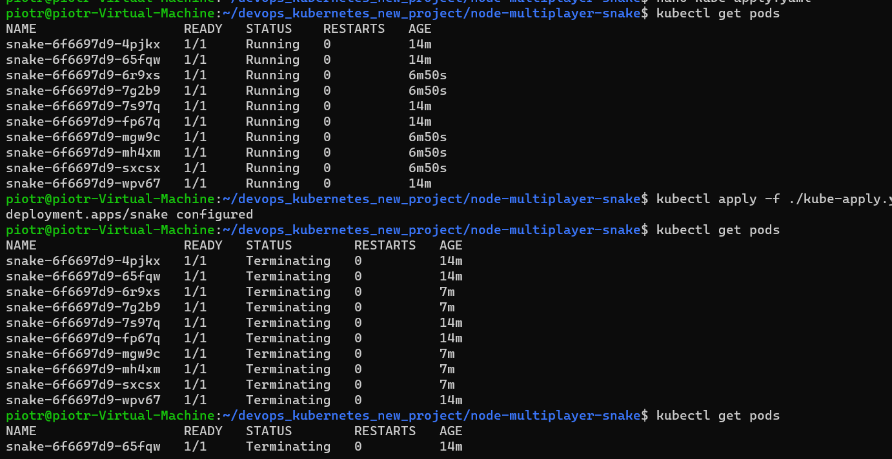
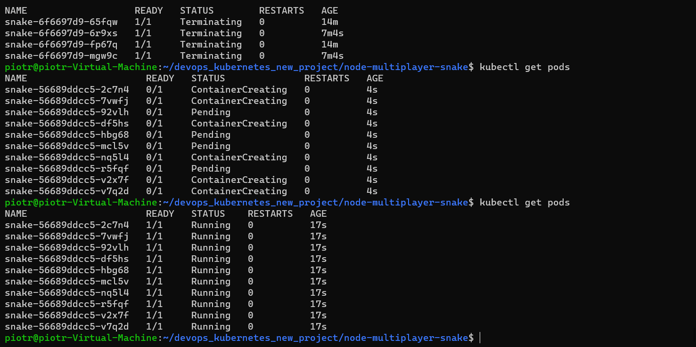

- Rolling update 

``` yaml
strategy:
      type: RollingUpdate
```

Zabijanie starych podów i tworzenie nowych podów nie następuje bezpośrednio po sobie. Proces zabijania i tworzenia podów jest ze sobą przeplatany w ten sposób aby w każdej chwili czasu liczba niedziałających podów nie przewyrzała z góry ustalonej wartości (`maxUnavailable`) oraz liczba wszystkich podów biorących w procesie update'u nie przekroczyła również z góry usalonej wartości (desired number of pods + `maxSurge`).

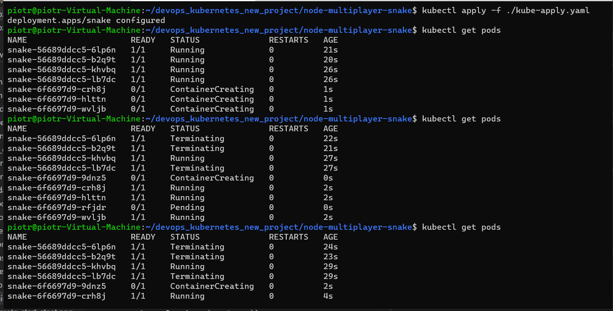
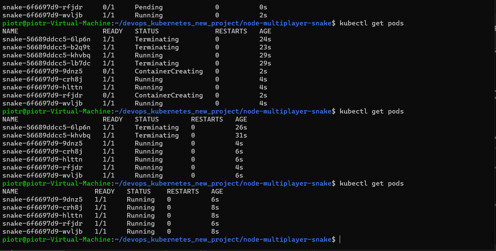

Z racji, że wartości `maxUnavailable` oraz `maxSurge` nie zostały ręcznie ustawione zostały one ustawione na domyślne.

Liczba replik zadanych w pliku `yaml` wynosi `5`. Dla `maxUnavailable` wartość wynosi `25%` z liczby replik zaokrąglone w dół. Czyli w naszym przypadku wartość ta będzie wynosić `1`. Widzimy, że faktycznie w każdym momencie dziają conajmniej jeden pod. Dla `maxSurge` wartość ta to `30%` replik zaokrąglone w góre + liczba replik. Czyli w naszym wartość ta to 2+5=7. Widzimy na screenach iż faktycznie, że podczas update'u maksymalnie działało `7` podów.

- Canary Deployment workload

``` yaml
  template:
    metadata:
      labels:
        app: snake
        track: stable
```

Polega na depolyowaniu `canary` będącego nową wersją programu równorzędnie do poprzedniej wersji tak aby nowa wersja moglą zacząć pobierać traffic jeszcze przed tym jak się ostatecznie zdeployuje. 

Dzięki wykorzystaniu etykiet jesteśmy w stanie rozróżnić depoloymenty różnych wersji tego samego programu.

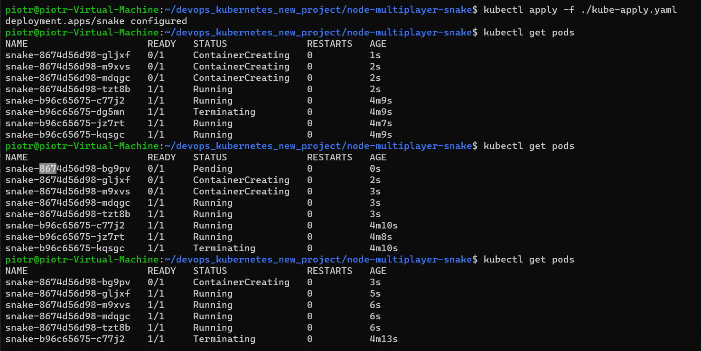
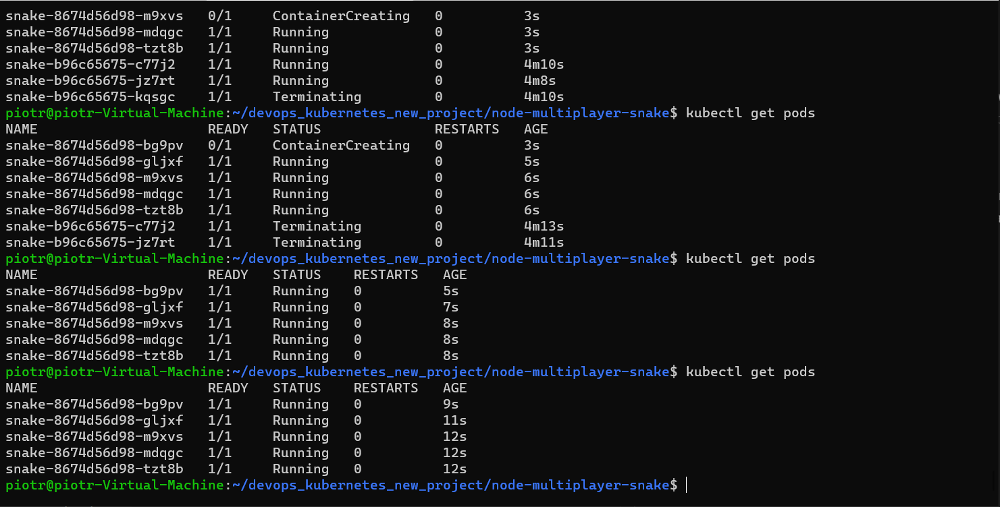