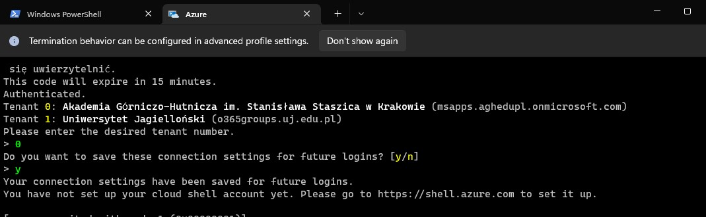
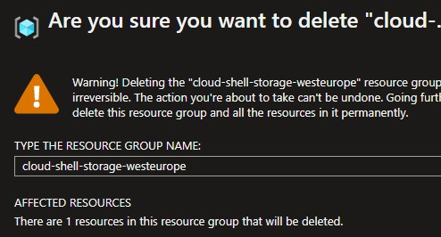

# Wdrożenie Azure


Na panelu agh miałem już przygotowane konto azure dlatego pozostało mi aktywować środki

Aby na cloudzie Azure obraz mógł zostać pobrany z mojego własnego docker registry niedostępnego publicznie ściągnąłem artefakt na lokalny komputer.

Następnie zalogowałem się za pomocą ```docker login -u user```

I wypchałem obraz na publiczne docker hub, umożliwiając tym samym użycie go w chmurze

```sh
 ~ 
❯ docker tag szymonmusial.eu.org:10000/prodenv elomelo320/prodenv
 ~ 
❯ docker push elomelo320/prodenv
Using default tag: latest
The push refers to repository [docker.io/elomelo320/prodenv]
9b8141f84344: Pushed
9e3bec0e0266: Pushed
9a2791989794: Pushed
707838254cc1: Pushed
9e74561e8bf1: Pushed
391945f70452: Pushed
4480c403aa45: Pushed
3185c5ca0c1f: Pushed
latest: digest: sha256:17e3ef66b915cd2fd714fc82a9203e3036c65147fea17606a201b299bd0bb36a size: 2000
```

Korzystając z Windows Terminala zalogowałem się do chmury po uprzednim stworzeniu grupy dla cloud shella




Następnie stworzyłem resource grupe w której w usługach Azure dokonuje się wdrożeń wybierając region wschodnią europę

```sh

szymon@Azure:~$ az group create --name myResourceGroup --location westeurope
{
  "id": "/subscriptions/f/resourceGroups/myResourceGroup",
  "location": "westeurope",
  "managedBy": null,
  "name": "myResourceGroup",
  "properties": {
    "provisioningState": "Succeeded"
  },
  "tags": null,
  "type": "Microsoft.Resources/resourceGroups"
}
szymon@Azure:~$

```

Następnie stworzyłem wdrożenie korzystając z domyślnych ustawień: 
- 1 kontener 
- 1 vCpu
- 1.5 Gb RAM

Jawnie ustawiłem alias perfix dns: emoto-prod oraz port 80

```sh
szymon@Azure:~$ az container create --resource-group myResourceGroup --name mycontainer --image elomelo320/prodenv:tagname --dns-name-label emoto-prod --ports 80
Resource provider 'Microsoft.ContainerInstance' used by this operation is not registered. We are registering for you.
Registration succeeded.

{
  "containers": [
    {
      "command": null,
      "environmentVariables": [],
      "image": "elomelo320/prodenv",
      "instanceView": {  ...  }
      "livenessProbe": null,
      "name": "mycontainer",
      "ports": [
        {
          "port": 80,
          "protocol": "TCP"
        }
      ],
      "readinessProbe": null,
      "resources": {
        "limits": null,
        "requests": {
          "cpu": 1.0,
          "gpu": null,
          "memoryInGb": 1.5
        }
      },
      "volumeMounts": null
    }
  ],
  "diagnostics": null,
  "dnsConfig": null,
  "encryptionProperties": null,
  "id": "/subscriptions/f8347e30-213f-420d-83e6-2ad7a8ceadd2/resourceGroups/myResourceGroup/providers/Microsoft.ContainerInstance/containerGroups/mycontainer",
  "identity": null,
  "imageRegistryCredentials": null,
  "initContainers": [],
  "instanceView": {
    "events": [],
    "state": "Running"
  },
  "ipAddress": {
    "autoGeneratedDomainNameLabelScope": "Unsecure",
    "dnsNameLabel": "emoto-prod",
    "fqdn": "emoto-prod.westeurope.azurecontainer.io",
    "ip": "20.103.214.4",
    "ports": [
      {
        "port": 80,
        "protocol": "TCP"
      }
    ],
    "type": "Public"
  },
  "location": "westeurope",
  "name": "mycontainer",
  "osType": "Linux",
  "provisioningState": "Succeeded",
  "resourceGroup": "myResourceGroup",
  "restartPolicy": "Always",
  "sku": "Standard",
  "subnetIds": null,
  "tags": {},
  "type": "Microsoft.ContainerInstance/containerGroups",
  "volumes": null,
  "zones": null
}


```

Po pierwszej próbie wyeksponowany port 5000 który miałem w obrazie produkcyjnym spowodował problem z dostępem z zewnątrz. Dlatego po sugestiach z forum stworzyłem nowszą wersję obrazu kora ponadto uruchamia aplikację na porcie 80


```docker
FROM prodenv
WORKDIR /build
EXPOSE 80
ENTRYPOINT ["dotnet", "Panel.EmotoAgh.Backend.dll", "JWTAuthority=''", "PostgreSqlConnectionString='localhost'", "--urls=http://0.0.0.0:80/"]
````

## Lista kontenerów

```sh

szymon@Azure:~$ az container list --resource-group myResourceGroup --output table
Name         ResourceGroup    Status     Image               IP:ports           Network    CPU/Memory       OsType    Location
-----------  ---------------  ---------  ------------------  -----------------  ---------  ---------------  --------  ----------
mycontainer  myResourceGroup  Succeeded  elomelo320/prodenv  20.101.201.202:80  Public     1.0 core/1.5 gb  Linux     westeurope
szymon@Azure:~$

```


### Część logów z serwera na porcie 80

```sh
szymon@Azure:~$ az container logs --resource-group myResourceGroup --name mycontainer

info: IdentityServer4.Startup[0]
      Starting IdentityServer4 version 4.1.2+997a6cdd643e46cd5762b710c4ddc43574cbec2e
info: IdentityServer4.Startup[0]
      Using the default authentication scheme Bearer for IdentityServer
info: IdentityServer4.Startup[0]
      Authentication scheme Bearer is configured for IdentityServer, but it is not a scheme that supports signin (like cookies). If you support interactive logins via the browser, then a cookie-based scheme should be used.
warn: Microsoft.AspNetCore.DataProtection.Repositories.FileSystemXmlRepository[60]
      Storing keys in a directory '/root/.aspnet/DataProtection-Keys' that may not be persisted outside of the container. Protected data will be unavailable when container is destroyed.
warn: Microsoft.AspNetCore.DataProtection.KeyManagement.XmlKeyManager[35]
      No XML encryptor configured. Key {7ef22170-1673-4b8d-bb37-70e7dd2fd431} may be persisted to storage in unencrypted form.
info: Microsoft.Hosting.Lifetime[14]
      Now listening on: http://0.0.0.0:80
info: Microsoft.Hosting.Lifetime[0]
      Application started. Press Ctrl+C to shut down.
info: Microsoft.Hosting.Lifetime[0]
      Hosting environment: Production
info: Microsoft.Hosting.Lifetime[0]
      Content root path: /build/

```


### Aby nie płacić za usługi które nie są używane dokonałem oczyszczania po wdrożeniach

```sh
szymon@Azure:~$ az container delete --resource-group myResourceGroup --name mycontainer
Are you sure you want to perform this operation? (y/n): y
{
  "containers": [
    {
      "command": null,
      "environmentVariables": [],
      "image": "elomelo320/prodenv",
      "instanceView": {

```

```sh

szymon@Azure:~$ az group delete --name myResourceGroup
Are you sure you want to perform this operation? (y/n): y

```

