# Zajęcia 09

## Przygotowanie wdrożeń nienadzorowanych dla platform z pełnym OS

### Przygotowanie systemu pod uruchomienie

* Pobrałem ISO systemu Fedora i rozpocząłem instalację w progarmie Virtual Box systemu `Fedora_system`

    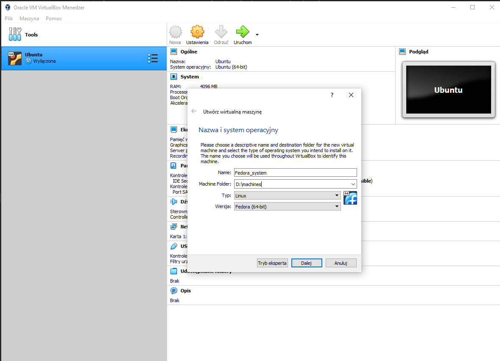

* Wybrałem dysk startowy

    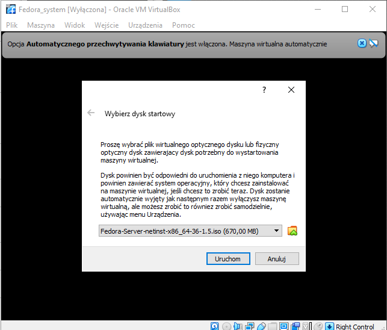

* Wybrałem opcję "Install Fedora 36"

    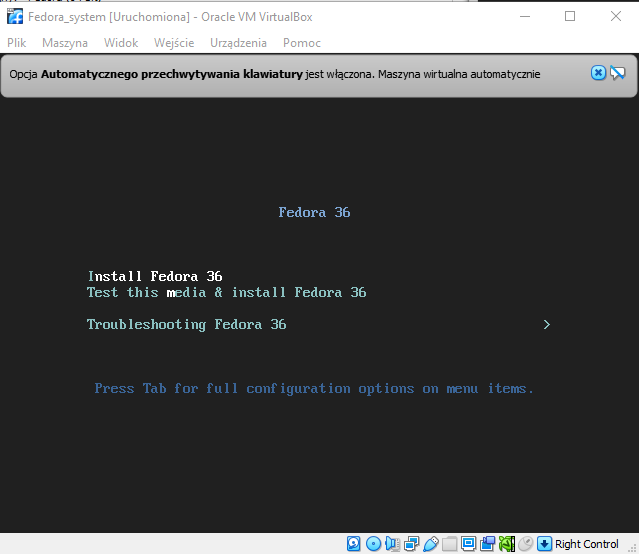

* Podczas instalacji wybrałem język angielski

    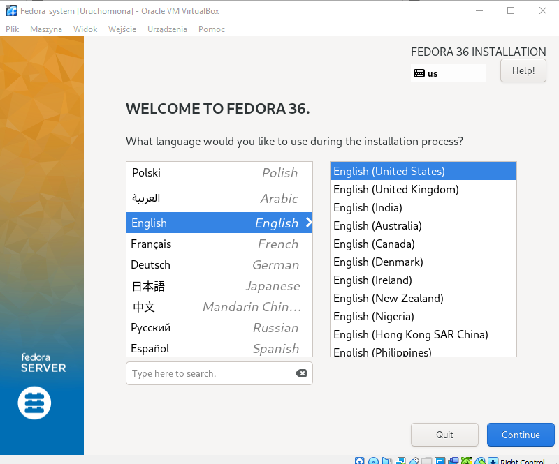

* Kolejno wybrałem dysk na którym zostanie zainstalowany system

    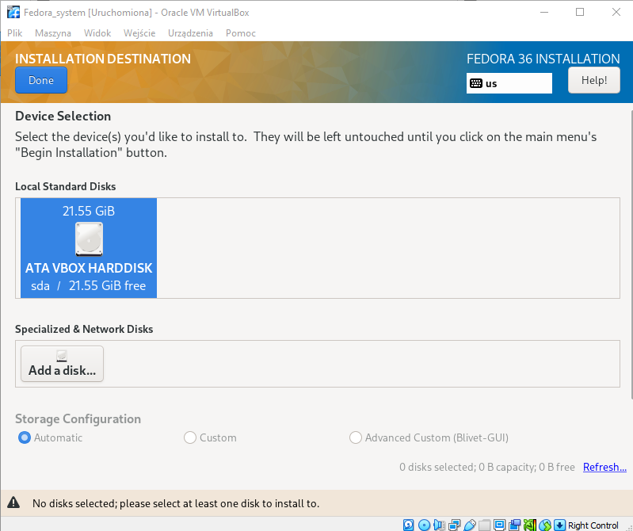

* Zgodnie z instrukcją wybrałem minimalną instalację, bez GUI

    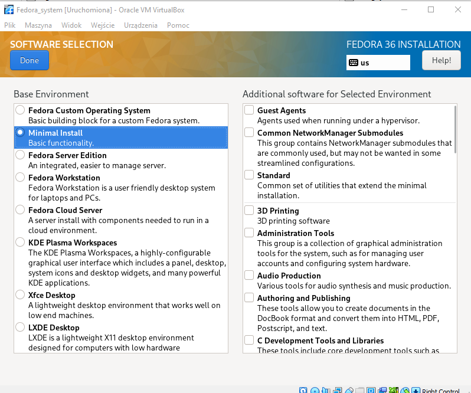

* Utworzyłem konto `root` z hasłem, które bezkarnie można wrzucić na gita

    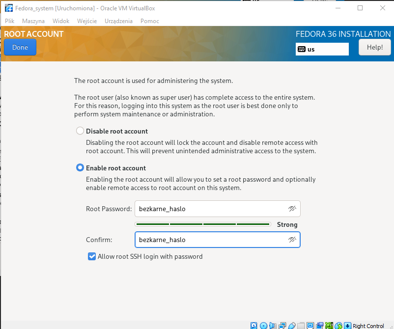

* Rozpocząłem instalację

    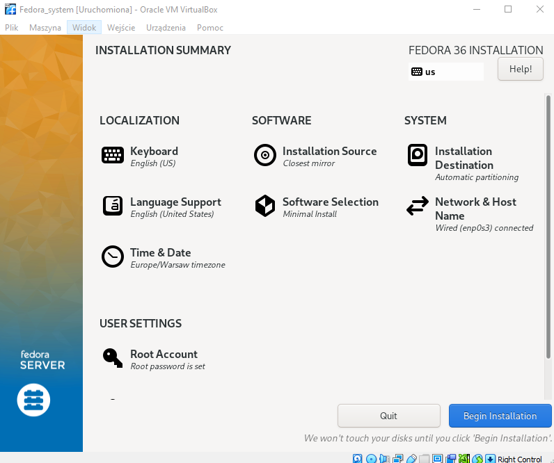

    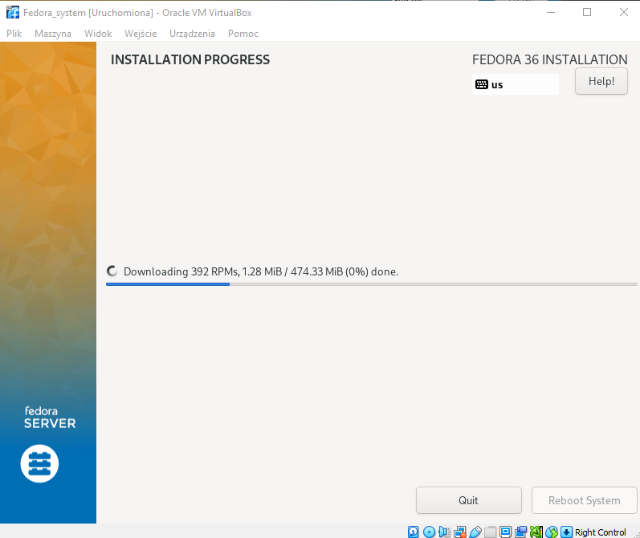

* Po zainstalowaniu zlokalizowałem plik `anaconda-ks.cfg`

    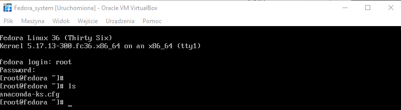

* Doinstalowałem `net-tools`, aby móc wywołać komendę `ifconfig` do sprawdzenia addresu ip, aby móc za pomocą `scp` przekopiować plik `anaconda-ks.cfg`

    ```bash
    $ dnf install net-tools
    $ ifconfig
    ```

    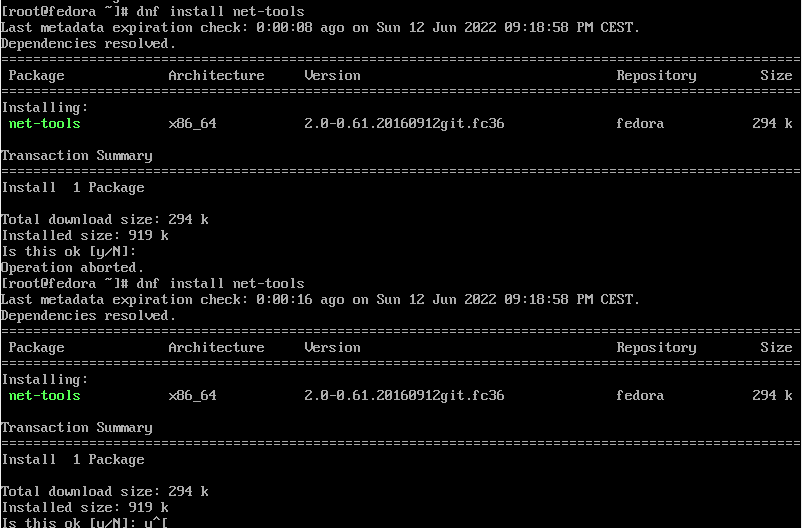

* Przekopiowałem plik `anaconda-ks.cfg` do lokalnej maszyny

    ```bash
    $ scp root@192.168.100.20:/root/anaconda-ks.cfg anaconda-ks.cfg
    ```

    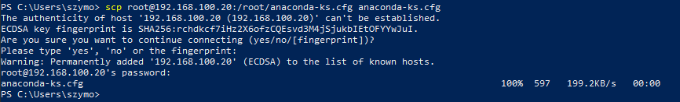

* Następie zamiast ponownie instalować system Fedora użyłem opcji "sklonuj" dostępnej w programie Virtual Box, sklonowałem system `Fedora_system`, żeby utworzyć `Fedora_serwer`

    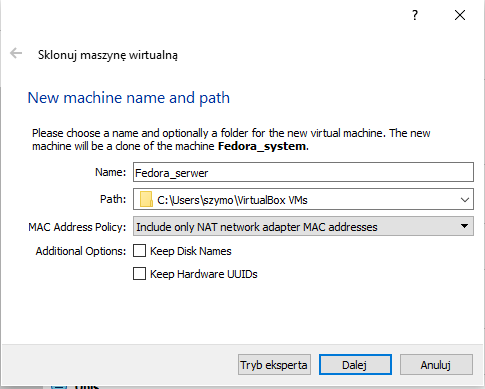

* Następnie przygotowałem `Fedora_serwer`, żeby służył jako serwer http zgodnie z instrukcją na stronie https://docs.fedoraproject.org/en-US/quick-docs/getting-started-with-apache-http-server/

    - Zainstalowałem pakiety `httpd`

        ```bash
        $ sudo dnf install httpd -y
        ```

    - Uruchomiłem serwis `HTTPD`

        ```bash
        $ sudo systemctl start httpd
        $ sudo systemctl enable httpd 
        ```
    
    - Otworzyłem porty firewall

        ```bash
        $ sudo firewall-cmd --add-service=http -- --permanent
        $ sudo firewall-cmd --add-service=https -- --permanent
        $ sudo firewall-cmd --reload
        ```    

    - Zainstalowałem paczkę `wget`

        ```bash
        $ sudo dnf install wget
        ```
    
    - Następnie stworzyłem folder w `/var/www/html` `retrofit-artifacts`

        ```bash
        $ cd /var/www/html
        $ mkdir retrofit-artifacts
        $ cd retrofit-artifacts
        ```

    - Pobrałem z Jenkinsa ostatni artefakt

        ```bash
        $ wget http://192.168.100.7:8080/job/Retrofit-Pipeline/lastSuccessfulBuild/artifact/retrofit-v1.0.0.jar
        ```
    
    - Sprawdziłem czy z innej lokalnej maszyny jest dostępny wrzucony plik na serwer

        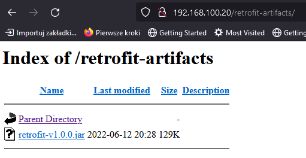
    
* Sprawdziłem na `Fedora_system` kroki potrzebne do pobrania artefaktu

    - Pobrałem denendencję `wget`

        ```bash
        sudo dnf install wget
        ```

        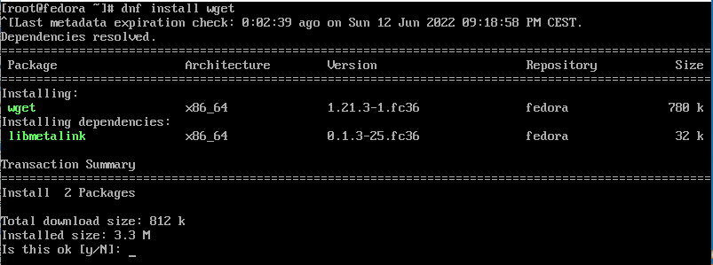

    - Pobrałem denendencję `openjdk`

        ```bash
        sudo dnf install java-1.8.0-openjdk.x86_64
        ```

        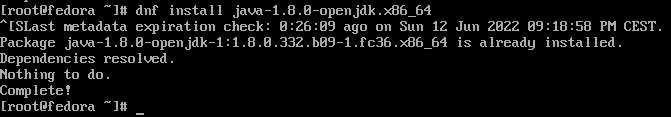

    - Pobrałem z Jenkinsa plik artefaktu

        ```
        wget http://192.168.100.20/retrofit-artifacts/retrofit-v1.0.0.jar
        ```

        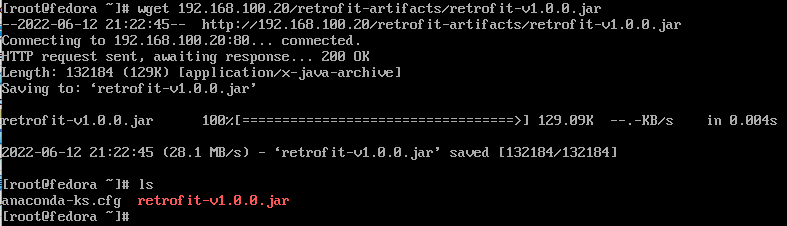

### Instalacja nienadzorowana 

* Zmieniłem `graphical install` na `text`

    ```
    # Use graphical install
    text
    ```

* Zdefiniowałem konfikurację network

    ```
    network --bootproto=dhcp --device=enp0s3 --ipv6=auto --activate
    ```

* Dodałem repozytoria

    ```
    url --mirrorlist=http://mirrors.fedoraproject.org/mirrorlist?repo=fedora-$releasever&arch=x86_64
    repo --name=updates --mirrorlist=http://mirrors.fedoraproject.org/mirrorlist?repo=updates-released-f$releasever&arch=x86_64
    ```

* Dodałem depenencję `wget` do pobrania artefakcji i wymaganą do artefaktu dependencję `java-1.8.0-openjdk.x86_64`

    ```
    %packages
    @^minimal-environment
    java-1.8.0-openjdk.x86_64
    wget
    %end
    ```

* Następnie w etapie post dodałem pobranie artefaktu

    ```
    wget http://192.168.100.20/retrofit-artifacts/retrofit-v1.0.0.jar
    ```

* Ostateczny wygląd pliku `anaconda-ks.cfg`

    ```
    # Generated by Anaconda 36.16.5
    # Generated by pykickstart v3.36
    #version=F36
    # Use graphical install
    text

    # Keyboard layouts
    keyboard --vckeymap=us --xlayouts='us'
    # System language
    lang en_US.UTF-8

    # Network
    network --bootproto=dhcp --device=enp0s3 --ipv6=auto --activate
    #Repo
    url --mirrorlist=http://mirrors.fedoraproject.org/mirrorlist?repo=fedora-$releasever&arch=x86_64
    repo --name=updates --mirrorlist=http://mirrors.fedoraproject.org/mirrorlist?repo=updates-released-f$releasever&arch=x86_64
    %packages
    @^minimal-environment
    java-1.8.0-openjdk.x86_64
    wget
    %end

    # Run the Setup Agent on first boot
    firstboot --enable

    # Generated using Blivet version 3.4.3
    ignoredisk --only-use=sda
    autopart
    # Partition clearing information
    clearpart --none --initlabel

    # System timezone
    timezone Europe/Warsaw --utc

    # Root password
    rootpw --iscrypted $y$j9T$E0T9Mynl8uLmIz5o9uYg.O4h$O/n3mWiJIH94oP0BxQbdvGNrj.KZenN2yjWS1rA5.C6

    %post
    wget http://192.168.100.20/retrofit-artifacts/retrofit-v1.0.0.jar
    %end
    ```

### Infrastructure as a code

* Wrzuciłem na gita plik `anaconda-ks.cfg`

    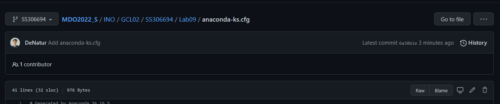

* Połączyłem plik odpowiedzi z ISO instalacyjnym

    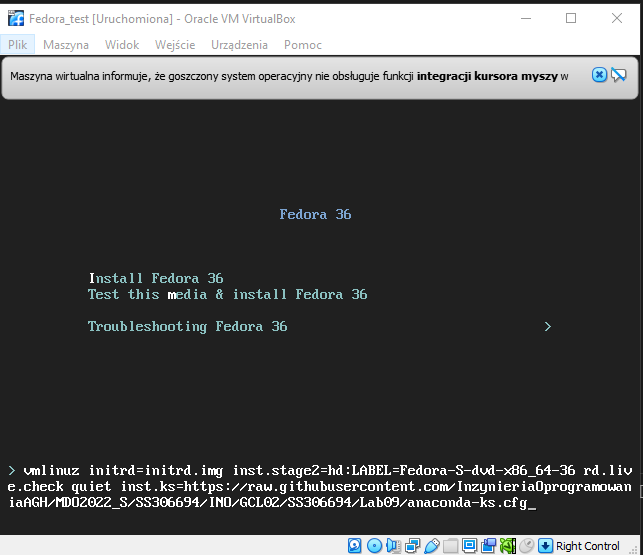

* Instalacja zakończyła się sukcesem

    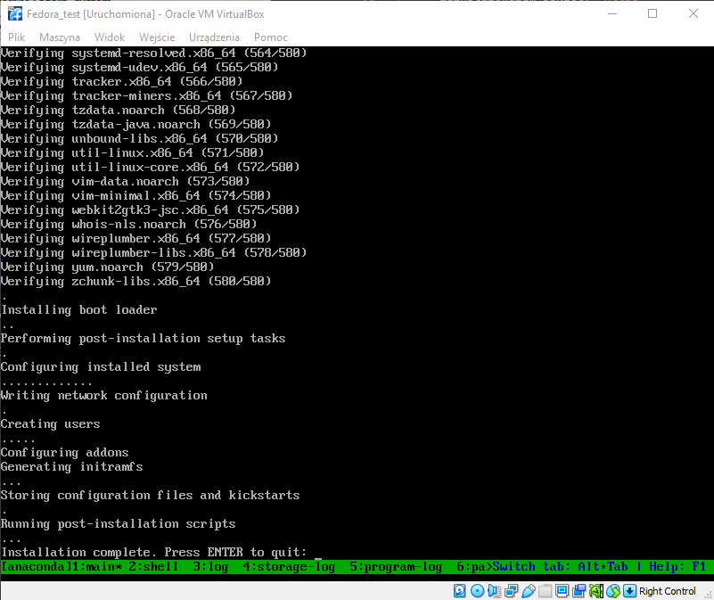

* Artefakt jest dostępny

    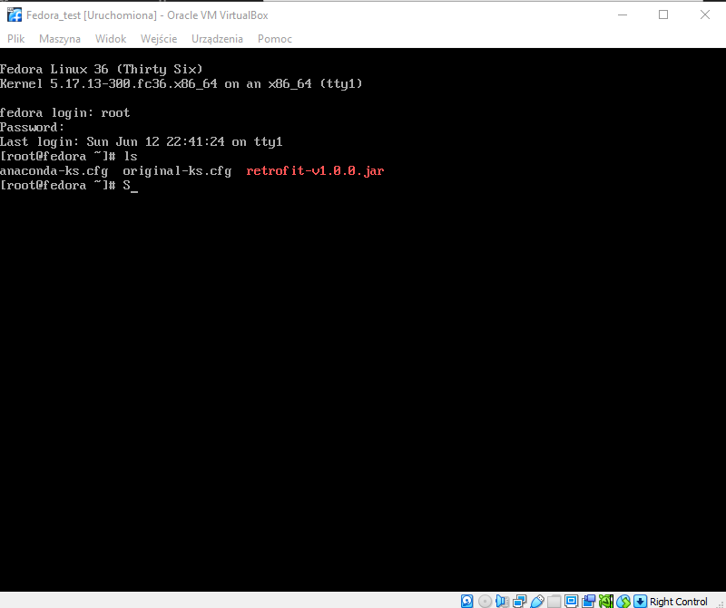
    