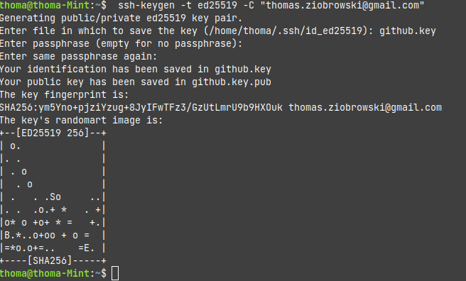
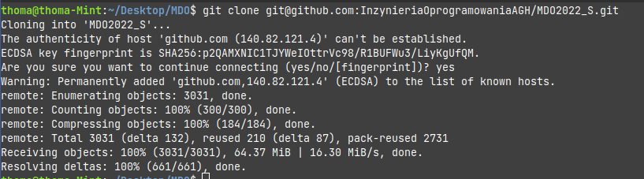
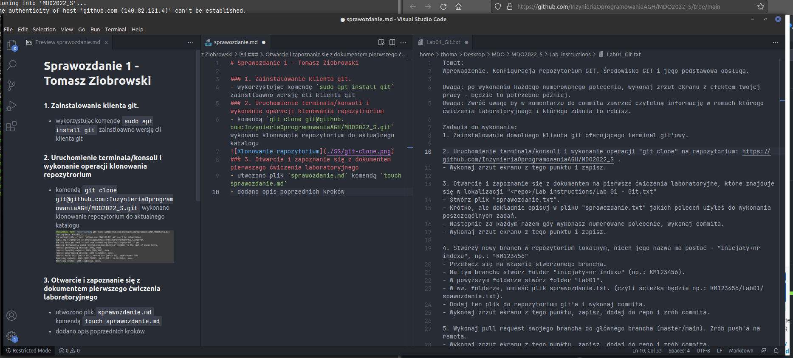
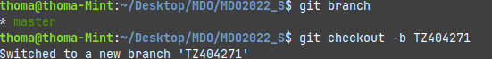
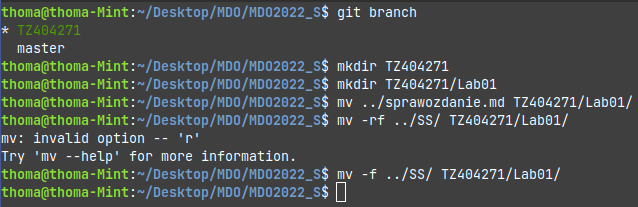
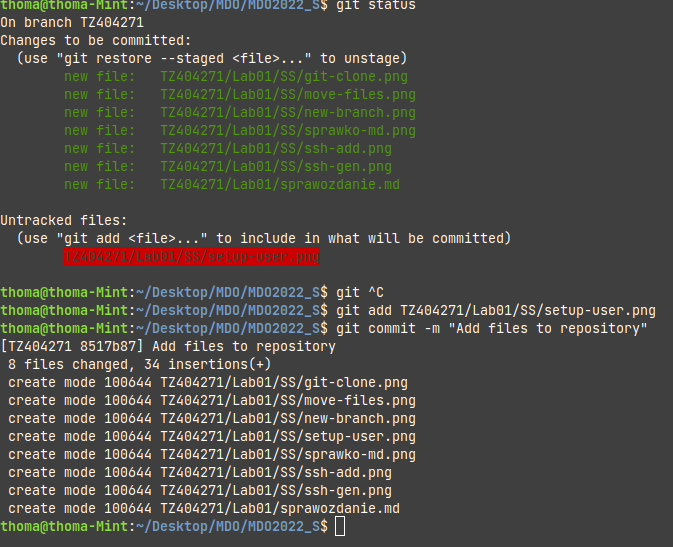

# Sprawozdanie 1 - Tomasz Ziobrowski

### 1. Zainstalowanie klienta git.
- wykorzystując komendę `sudo apt install git` zainstloawno wersję cli klienta git
- należało wygenerować klucz SSH wykorzystując polecenie `ssh-keygen -t ed25519 -c "thomas.ziobrowski@gmail.com"` w wyniku czego otrzymano klucz publiczny oraz prywatny


- uzyskany klucz publiczny został przypisany do github w ustawieniach konta
- nastepnie należało ustawić dane użytkownika git, pod którymi jest podpisywany podczas operacji 
```console
git config --global user.email "thomas.ziobrowski@gmail.com"
git config --global user.name "ziobrowskyy"

```

### 2. Uruchomienie terminala/konsoli i wykonanie operacji klonowania repozytrorium
- komendą `git clone git@github.com:InzynieriaOprogramowaniaAGH/MDO2022_S.git` wykonano klonowanie repozytorium do aktualnego katalogu 



### 3. Otwarcie i zapoznanie się z dokumentem pierwszego ćwiczenia laboratoryjnego
- utwozono plik `sprawozdanie.md` komendą `touch sprawozdanie.md`
- dodano opis poprzednich kroków



### 4. Tworzenie nowego brancha
- utworzono nowego brancha komendą `git checkout -b TZ404271`


- następnie upewiono się, że pracuje sie na utworzonym poprzednio branchu `git branch`
- utworzono folder o takiej samej nazwie co branchm oraz folder `Lab01` w nim w ktrórym będą przechowywane wszystkie pliki z tego ćwiczenia
```console
mkdir TZ404271
mkdir TZ404271/Lab01
```
- a następnie przeniesiono do niego folder ze screenami oraz plik sprawozdania
```console
mv sprawozdanie.md TZ404271/Lab01/
mv -f SS TZ404271/Lab01/
```


- dodano wcześniej utworzony folder do śledzonych plików `git add TZ404271/`
- poleceniem `git status` sprawdzono, czy wszystkie pliki są poprawnie śledzone, oraz jaki jest status aktualnego brancha
- stworzono commit'a wraz z wiadomością `git commit -m "Add files to repository"`




