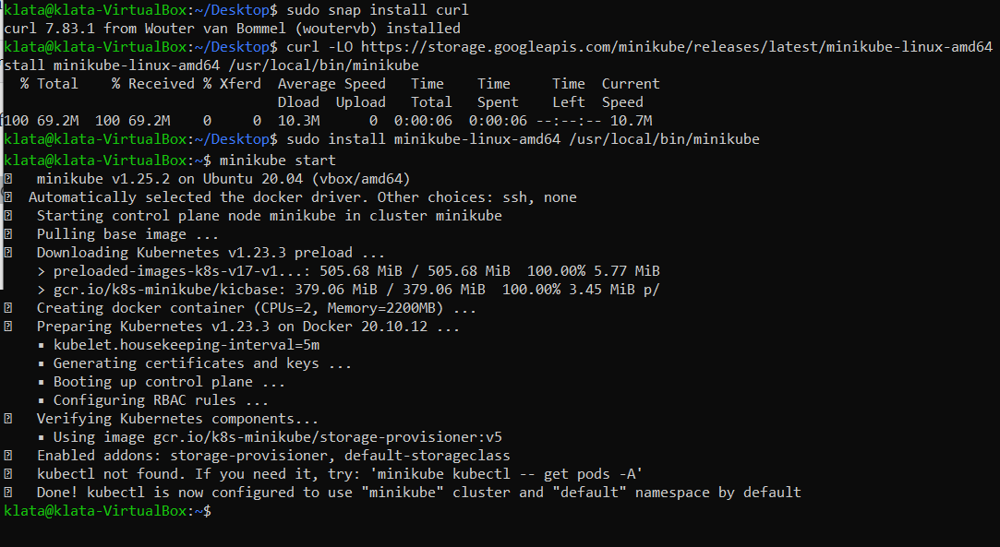
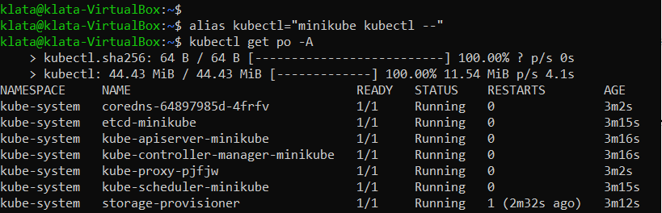
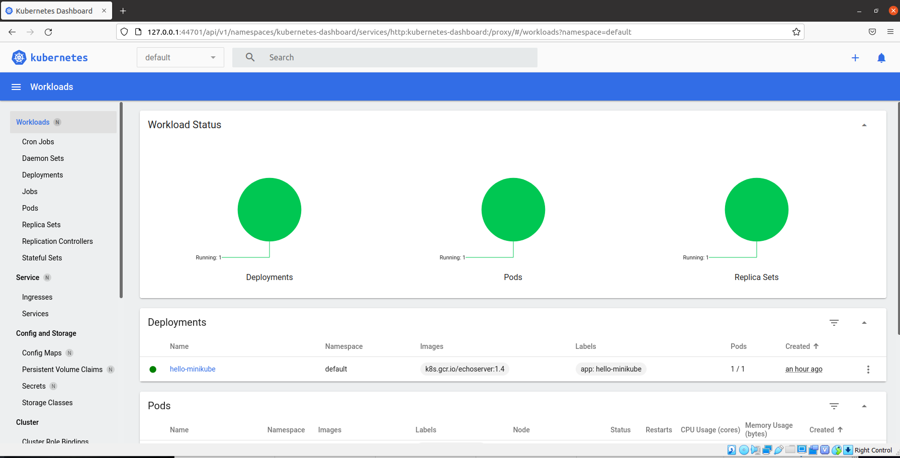
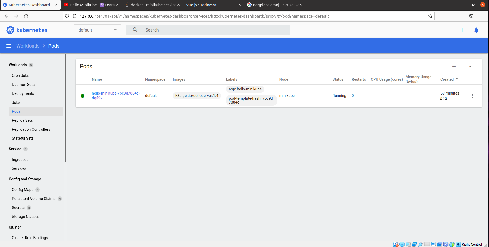
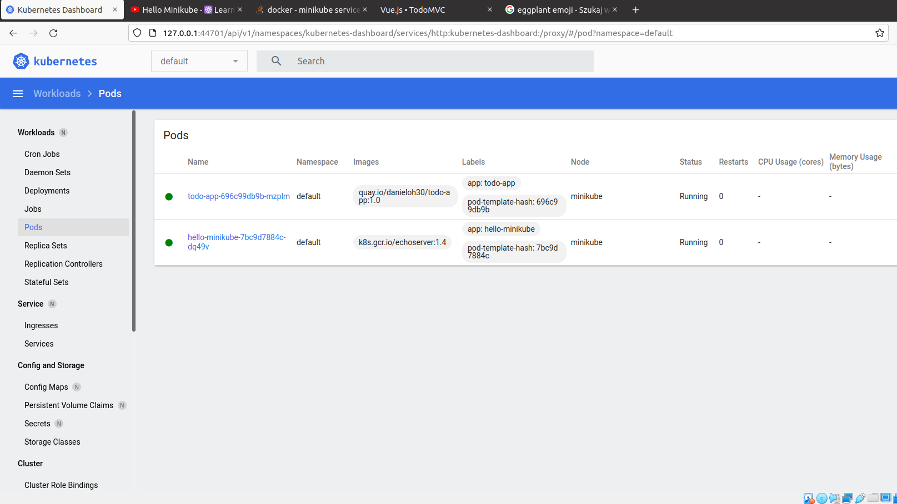
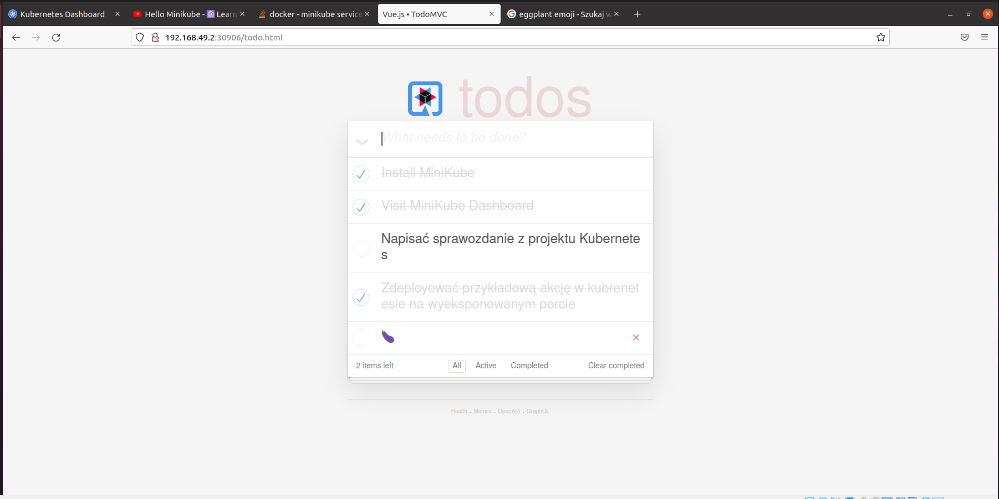

#Sprawozdanie DevOps - lab11
### Daniel Klata - ITE-GCL03

## Zadanie

Zadanie polegało na wdrażaniu na zarządzalne kontenery: Kubernetes

Zadanie polega na zainstalowaniu stosu k8s: minikube, pokazaniu jego działania, uruchomieniu dashboardu oraz wdrożeniu wybranej aplikacji eksponującej port na kubernetesa.

## Wykonanie

Instalacja minikube: 

- zainstalowano curl
- zainstalowano minikube według poleceń dostępnych na stronie `https://minikube.sigs.k8s.io/docs/start/`

	sudo snap install curl

	curl -LO https://storage.googleapis.com/minikube/releases/latest/minikube-linux-amd64
	sudo install minikube-linux-amd64 /usr/local/bin/minikube

A następnie uruchomiono klaster komendą `minikube start`

Następnie zaopatrzono się w komendę kubectl komendą `minikube kubectl -- get po -A`

Uruchomiono dashboard kubernetesa komendą `minikube dashboard`

Zrobiono przykładowe wdrożenie manualne obrazu `hello-minikube` aby sprawdzić działanie kubernetesa.

	kubectl create deployment hello-minikube --image=k8s.gcr.io/echoserver:1.4
	kubectl expose deployment hello-minikube --type=NodePort --port=8080
	

Jak widać instalacja kubernetesa na obrazie-gotowcu działa poprawnie, a pod tworzy się prawidłowo.

Następnie stworzono plik wdrożeniowy dla znalezionej aplikacji wyświetlającej prostą interaktywną listę todo.

plik pod_todo.yaml:

	apiVersion: apps/v1
	kind: Deployment
	metadata:
		name: todo-deployment
	spec:
	selector:
		matchLabels:
		app: todo
	replicas: 2
	template:
		metadata:
		labels:
			app: todo
		spec:
		containers:
		- name: todo
			image: quay.io/danieloh30/todo-app:1.0
			ports:
			- containerPort: 80

Następnie użyto na pliku komendy `kubectl apply`

Jak widać pod z aplikacją działa poprawnie. 

Jak widać aplikacja działa poprawnie wyprowadzona na porcie, uruchomiona wewnątrz kubernetesa:

