#Sprawozdanie DevOps - lab12
### Daniel Klata - ITE-GCL03

## Zadanie

Zadanie jest kontynuacją wdrażania na zarządzalne kontenery w Kubernetes.

Polegało na zmianie pliku wdrożeniowego skonstruowanego w ramach poprzedniego laboratorium, zbadaniu zachowania kubernetesa podczas zmiany ilości replik, stworzeniu nowej wersji obrazu, której wdrożenie ma się zakończyć katastrofą wewnątrz kontenerów oraz stworzenie mechanizmu kontroli wdrożenia, który sprawdzi czy wdrożenie powiodło się w krócej niż 60 sekund.

## Wykonanie

Plik .yaml z poprzednich zajęć, który wykorzystano do modyfikacji:

	apiVersion: apps/v1
	kind: Deployment
	metadata:
		name: todo-deployment
	spec:
	selector:
		matchLabels:
		app: todo
	replicas: 2
	template:
		metadata:
		labels:
			app: todo
		spec:
		containers:
		- name: todo
			image: quay.io/danieloh30/todo-app:1.0
			ports:
			- containerPort: 80

Aby przeprowadzić dalsze badania, zwyczajnie zmieniano ilość replik w powyższym pliku:

`replicas: 2` - > `replicas: 4` / `6` / `1` / `0`

4 repliki - Przerobiono plik wdrożenia w następujący sposób:

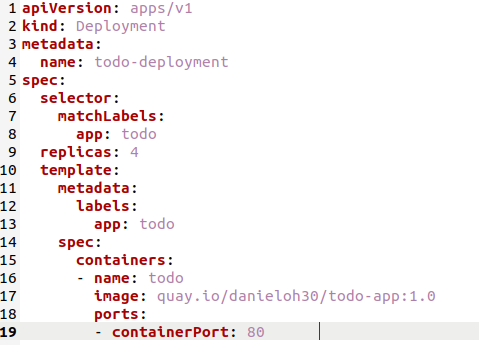

Wdrożono aplikację z pliku komendą
`kubectl apply -f pod_todo.yaml`

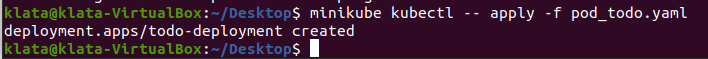

Po wykonaniu komendy, na dashboardzie kubernetesa możemy zauważyć, że utworzył się deployment `todo-deployment` posiadający 4 pody replik.

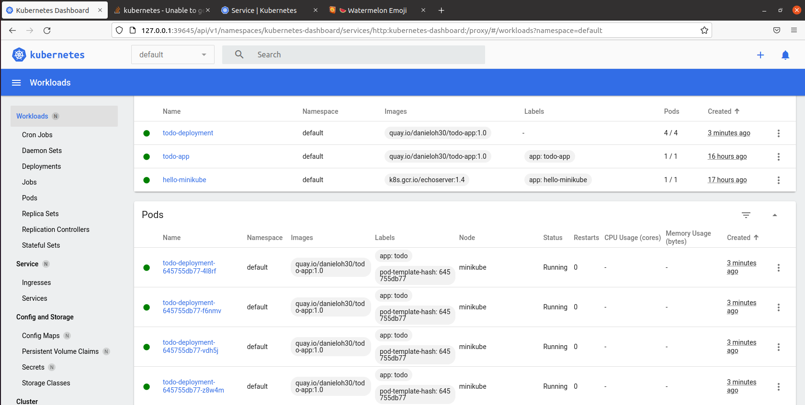

Sprawdzono poprawność wdrożenia za pomocą komendy `kubectl rollout status deployment todo-deployment`

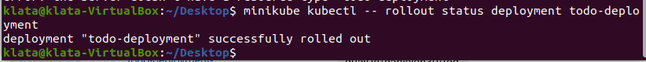

Następnie zmodyfikowano plik .yaml w analogiczny sposób jak poprzednio, lecz ustawiono ilość replik na 6. Po ponownym wykonaniu `kubectl apply` można zauważyć, że wiadomość zmieniła się z `deployment created`, na `deployment configured`

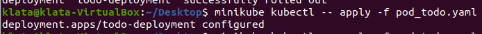

W dashboardzie można zauważyć utworzone dodatkowe 2 pody:

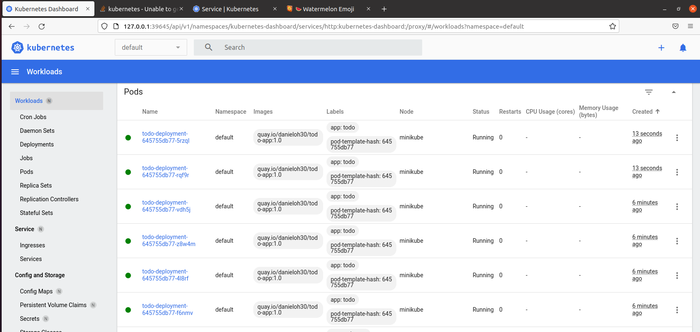

Wykonano wszystkie powyższe kroki ponownie dla pojedynczej repliki, jak widać wdrożenie todo ma tylko jednego poda:

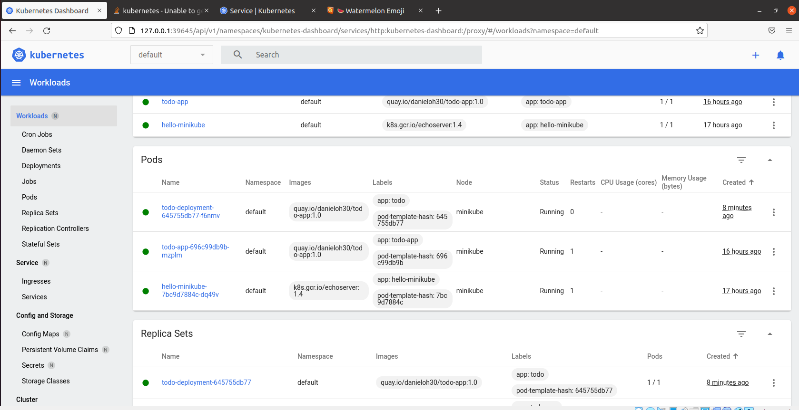

Oraz dla 0 replik, w tym przypadku widać, że deployment istnieje, lecz posiada 0/0 podów, replica set podobnie ma 0 podów:

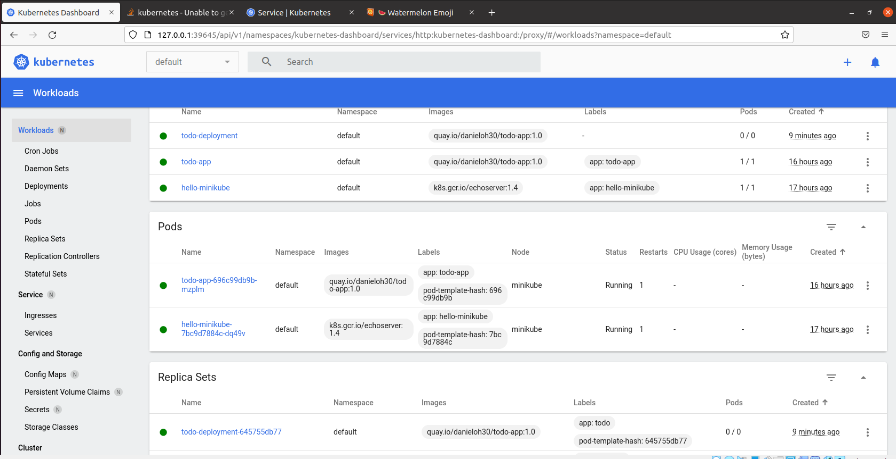

Następnie stworzono plik dockerfile, którego zadaniem jest wyrzucenie błędu w kontenerze, stworzono z niego obraz oraz otagowano jako `error`

	FROM nginx:latest
	RUN echo 'Dockerfile który ma się wywalić 🍉'
	ENTRYPOINT echo ["exit", 1]

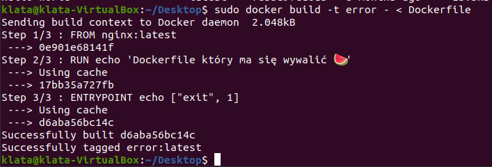

Zaktualizowano plik wdrożenia .yaml, tak aby korzystał z zepsutego Dockerfile'a

		containers:
		- name: todo
			image: error
			ports:
			- containerPort: 80

A następnie wdrożono zmiany komendą `kubectl apply -f pod_todo.yaml`. Zmiany w dashboardzie pokazują, że obraz wprowadzony na nasze pody powoduje errory:

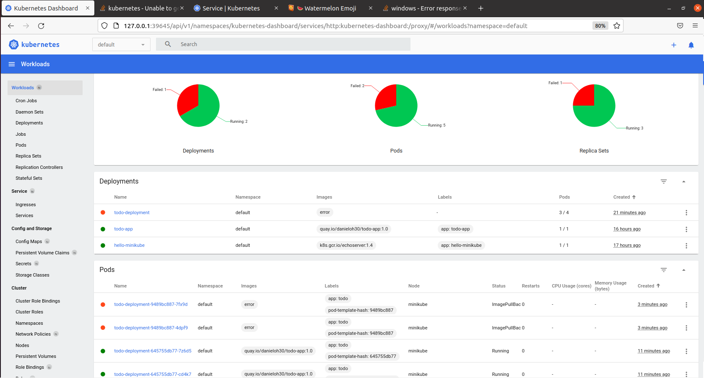

Aby naprawić sytuacje z niedziałajacymi podami, skorzystano z komend:
`kubectl rollout history deployment todo-deployment` - która pokaże nam historię zmian
`kubectl rollout undo deployment todo-deployment` - która cofnie zmiany na podach do poprzedniej, działającej wersji

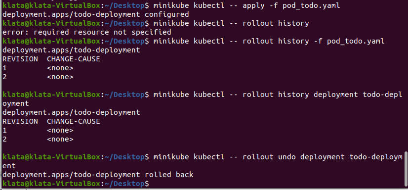

Jak widać na dashboardzie, niedziałajace pody zostały przywrócone do stabilnego stanu po użyciu komendy `undo`:

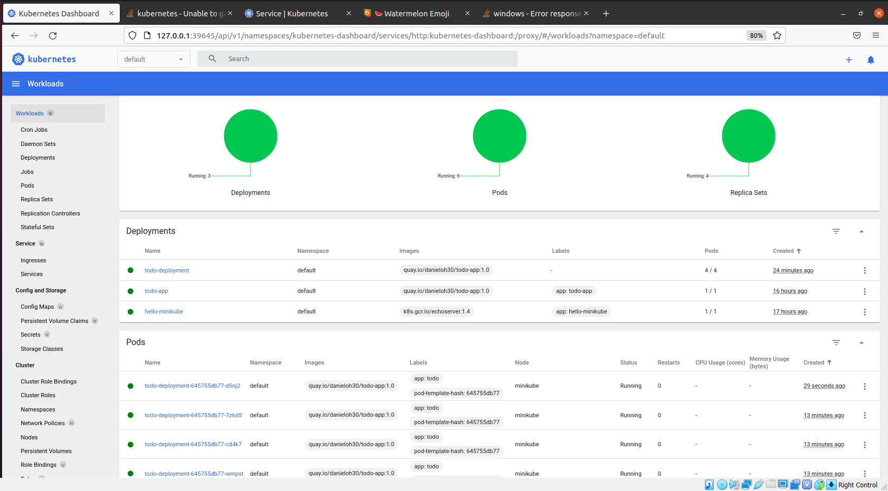

Następnie sprawdzono szczegóły deploymentu komendą `kubectl describe deployment`

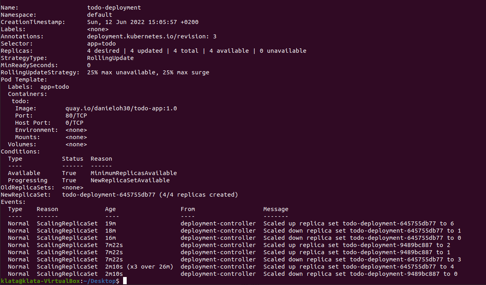

Na końcu stworzono system kontroli wdrożenia, który miał sprawdzić poprawność wdrożenia. (Czy udało się ono w mniej niż 60 sekund):

	#!/bin/bash
	minikube kubectl -- apply -f pod_todo.yaml
	timeout 60 minikube kubectl -- rollout status deployment/todo-deployment
	
	if [ "$?" -eq 0 ]
	then
		echo "SUCCESS - poprawnie wdrożono aplikację z pliku yaml 🍉"
	else
		echo "ERROR - wdrożenie zajęło zbyt długo 😭"
	fi

Działanie skryptu:

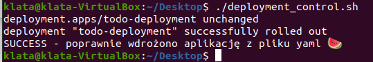

Strategie wdrożeń:

`Rolling deployment`— Jest to strategia wdrożeniowa, która zamienia wszystkie pody działające na starej wersji aplikacji z nową wersją. Zamiana wykonywana jest jeden po drugim, przez co klaster nie ma żadnego downtime'u.
`Recreate`— Strategia wdrożeniowa, która niszczy wszystkie pody i zastępuje je nową wersją. 
`Canary deployment`— Jest to strategia która ma podejście progresywnego dostarczania, gdzie jedna z wersji aplikacji jest udostępniana większości użytkowników, a nowsza wersja jest serwowana mniejszej bazie test userów, jeśli testowy deployment działa prawidłowo, jest on udostępniany większej ilości użytkowników.

W powyższym projekcie zastosowano strategię rolling deployment, jest ona defaultową strategią używaną przez kubernetesa.

Aby zastosować strategię recreate należy zdefiniować ją wewnątrz pliku wdrożeniowego:

	...
	apiVersion: app/v1
	...
	spec:
		replicas:8
		strategy:
			type: Recreate
		template:
		...
	EOF

Problem ze strategią recreate jest taki, że może ona powodować downtime, gdyż stare pody są usuwane zanim upewnimy się że pody z nową wersją aplikacji zostały wdrożone.

