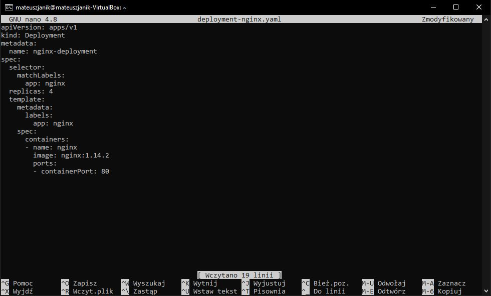
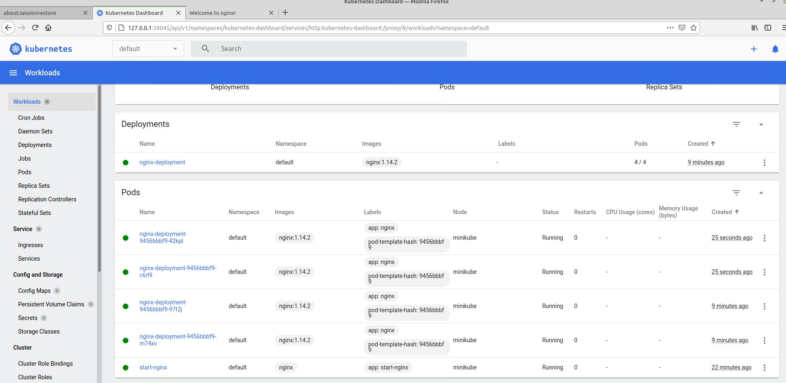
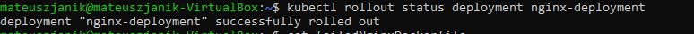
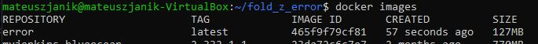
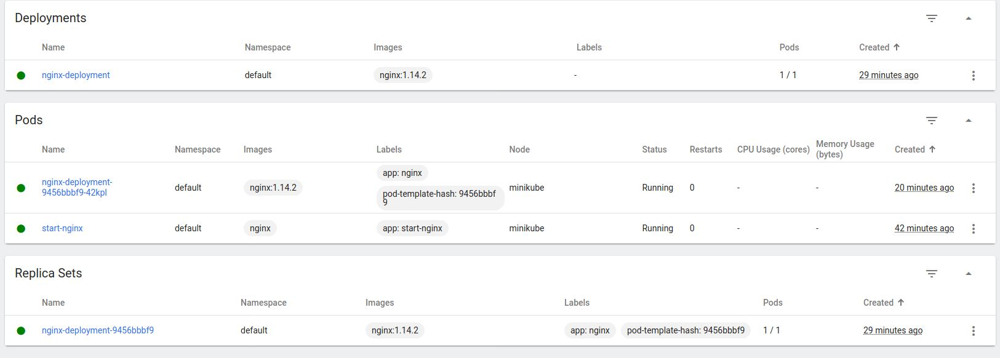
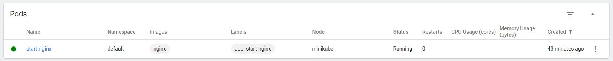
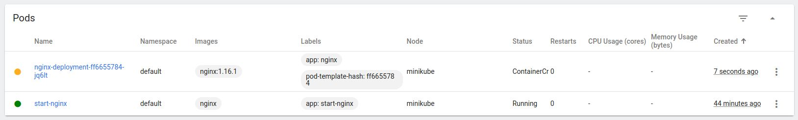
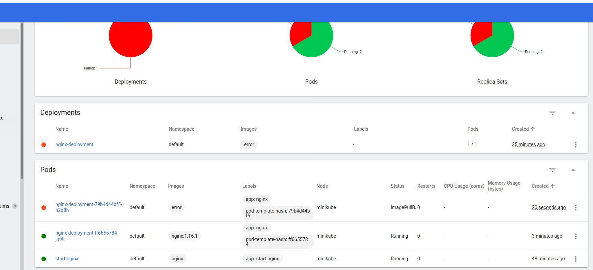
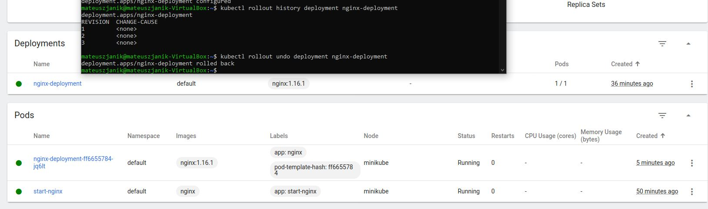
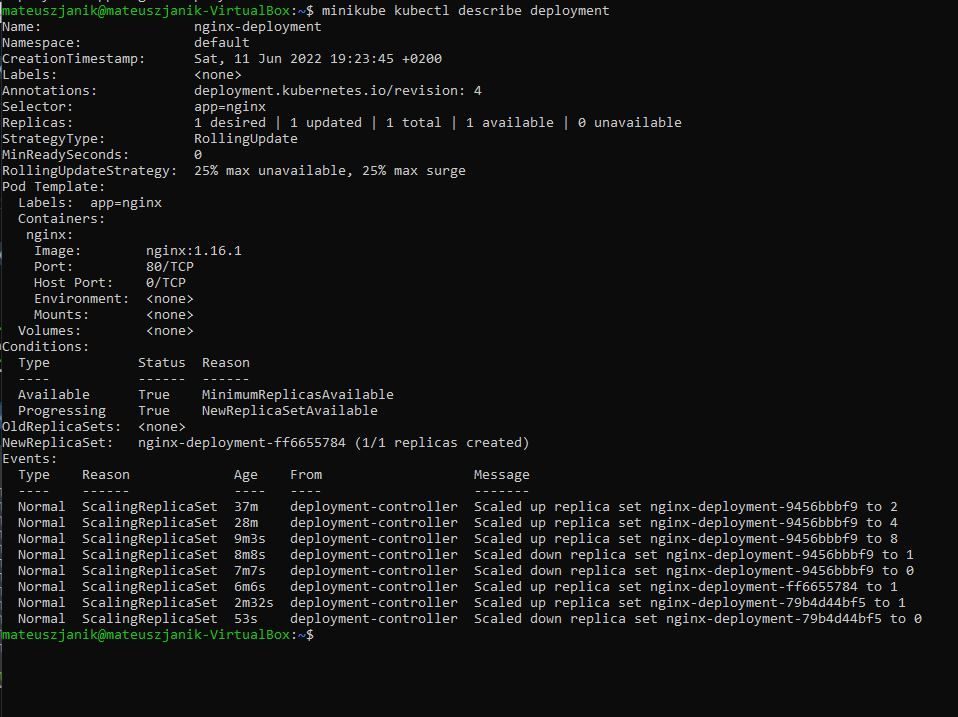

<h1>Sprawozdanie z zajęć laboratoryjnych 12 Metodyki DevOps</h1>
<strong>Mateusz Janik</strong>

<strong>grupa laboratoryjna 03</strong>

Zadania, które wykonałem:

<strong>
Uruchomiłem poda z czterema replikami

Zbadałem stan/status

Stworzyłem obraz nginx, który zwróci bład przy uruchomieniu

Zmieniłem ilość replik na 8

Zmieniłem ilość replik na 1

Zmieniłem ilość replik na 0

Zastosowałem nowszą wersję obrazu

Po zrobieniu tego pojawił się tymczasowy pod. Po chwili stare pody zostały zamienione na nowe z nowszą wersją obrazu.

Zastosowałem złą wersję obrazu

kubectl rollout history

kubectl rollout undo

minikube kubectl describe deployment

Recreate:

Strategia wdrożenia polegająca na tym, że wszystkiego pody są zabijane przed powstaniem nowych

Rolling Update:

Strategia polegająca na krokowym aktualizowaniu następnych podów.
Ta strategia zapewnia ciągłość działania aplikacji

Canary Deployment workload:

Jest to jedna ze strategii blue,green. Polega ona na tym, że nowa aplikacja jest wdrażana obok starej. Jeżeli wersja dobrze sobie radzi to poprzednia wersja jest wygaszana, a ruch przekierowywany jest do podów wersji wyżej.

