<h1>Sprawozdanie z zajęć laboratoryjnych 11 Metodyki DevOps</h1>
<strong>Mateusz Janik</strong>

<strong>grupa laboratoryjna 03</strong>

Zadania, które wykonałem:

<strong>
Zainstalowałem minikube
</strong>

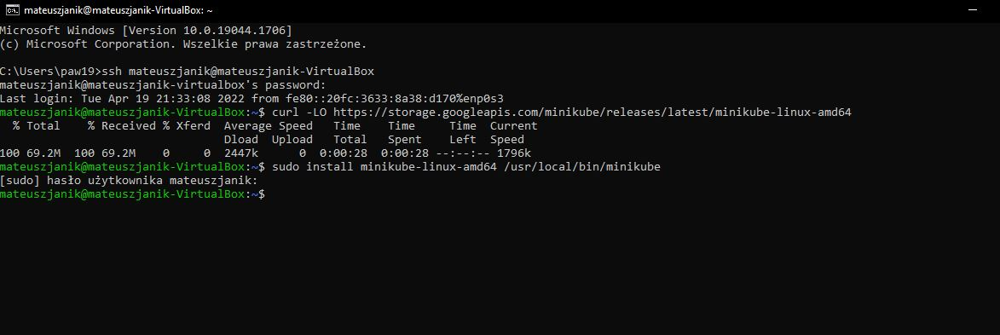

<strong>
Zainstalowałem kubectl
</strong>

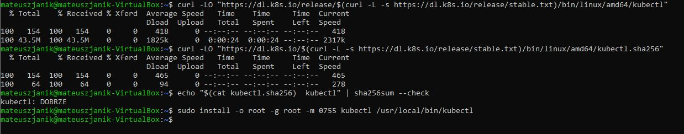

<strong>
Sprawdziłem poprawność instalacji

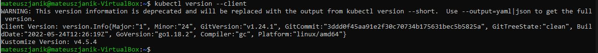

Uruchomiłem minukube

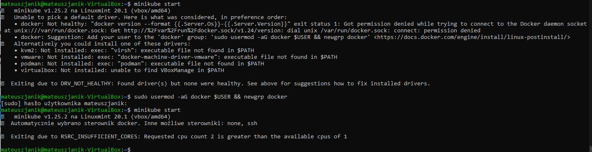
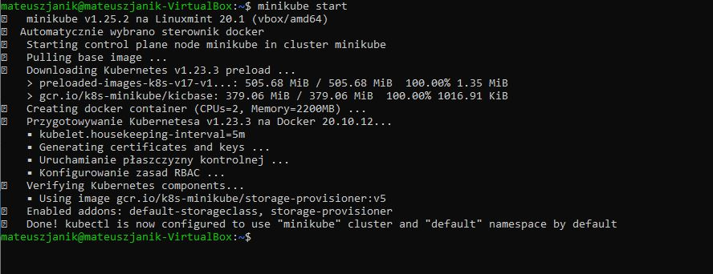

Uruchomiłem dashboard

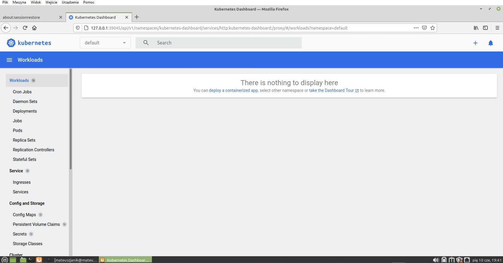

Sprawdziłem czy kontener minikube został stworzony

Stworzyłem node'a z nginx

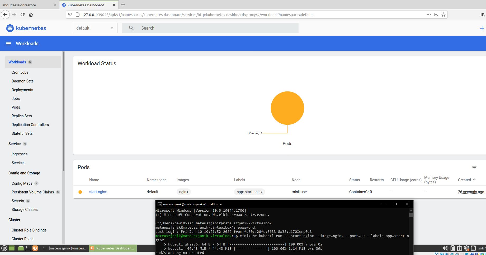

Przekierowałem porty

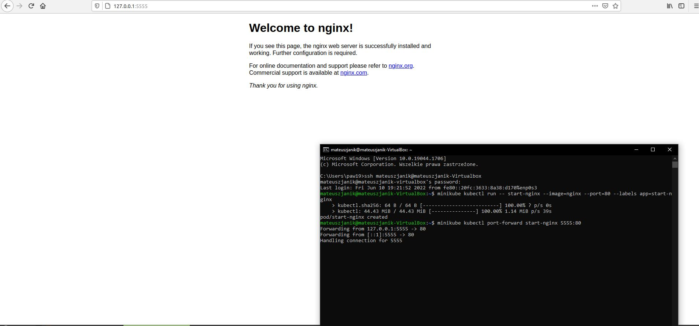
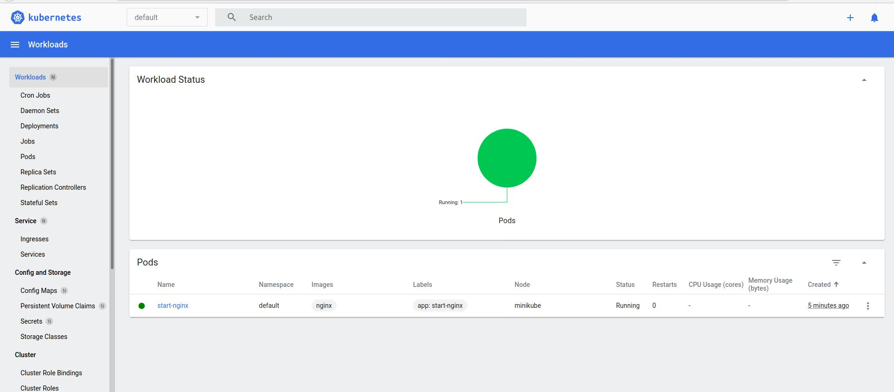

Stworzyłem plik typu .yaml

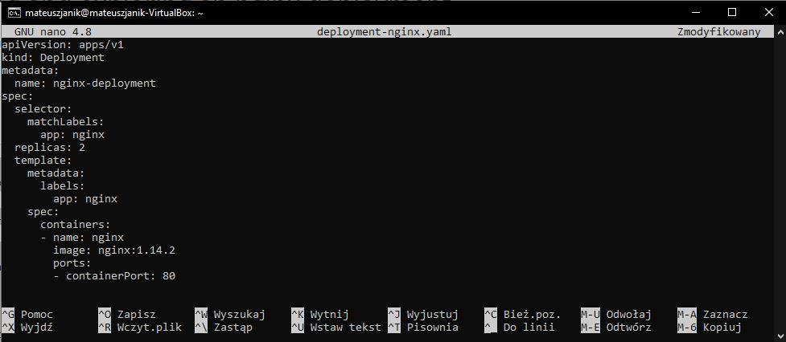

Stworzyłem pody na podstawie pliku .yaml

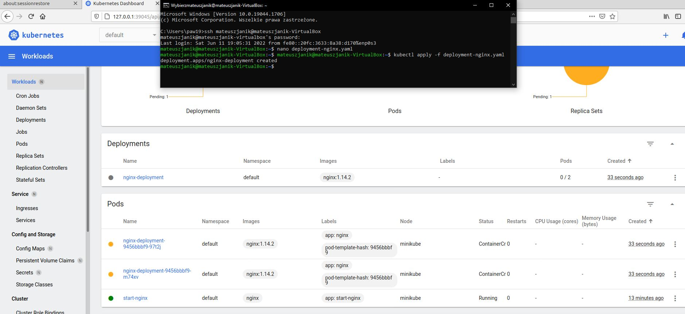