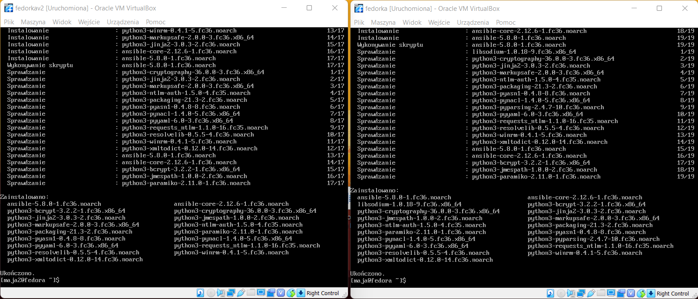
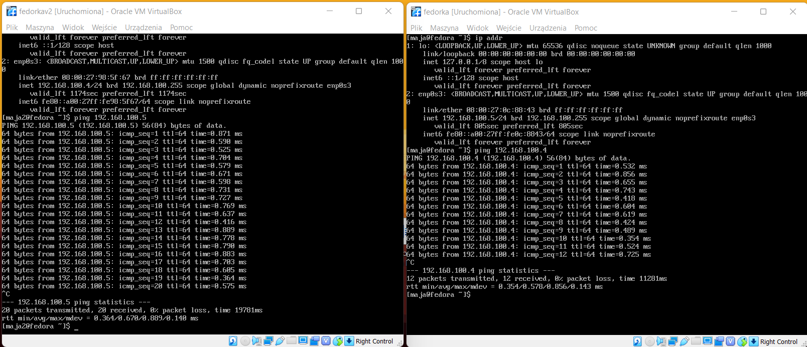
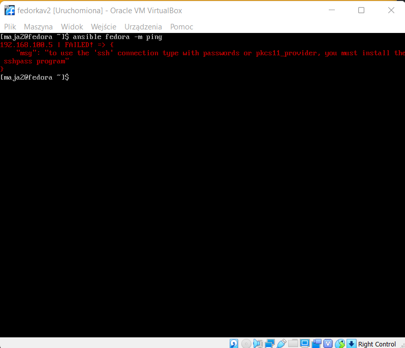

# Sprawozdanie Lab.10
#### 1. Zainstalowanie `ansible`

#### 2. Uruchomienie dwóch maszyn z fedorą, zainstalowanie narzędzi ssh. Przetestowanie poleceniem ping

#### 3. Stworzenie pliku ansible.cfg

#### 4. Stworzenie pliku inventory, który określa docelowy adres IP, użytkownika oraz hasło.

#### 5. Po wykonaniu ping za pomocą za pomocą `ansible fedora -m ping` pojawił się błąd, należało zainstalować `sshpass` za pomocą komendy `sudo dnf -y install sshpass`

#### 6. Po wykonaniu polecenia ponownie, udało się zpingować z drugą maszyną

