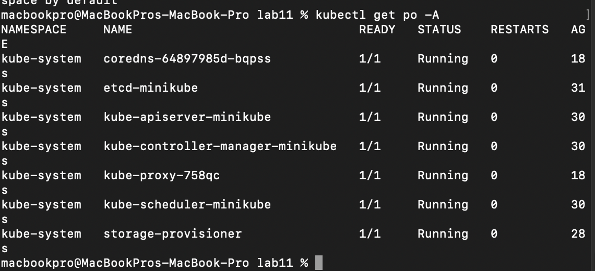
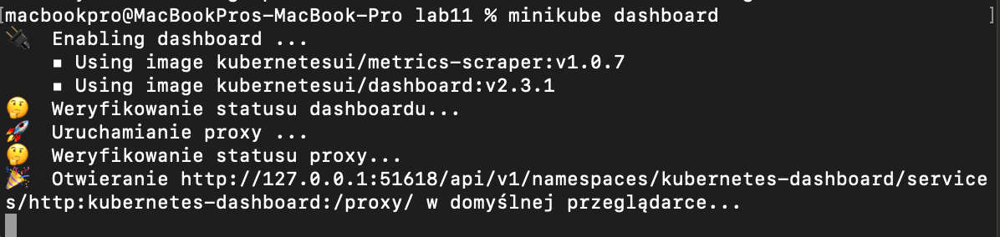
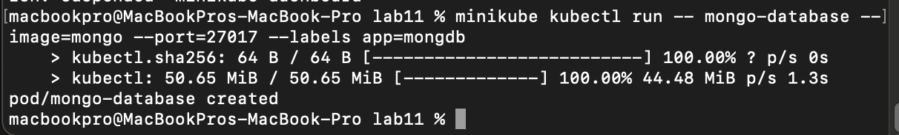
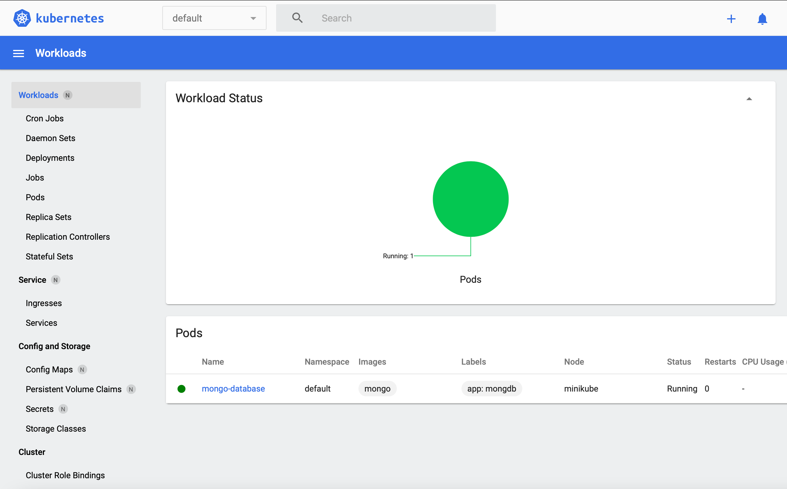
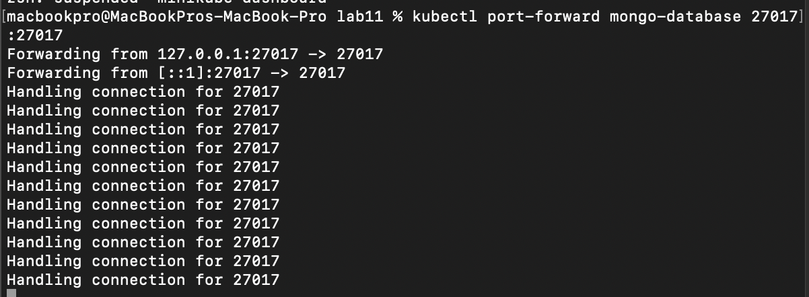
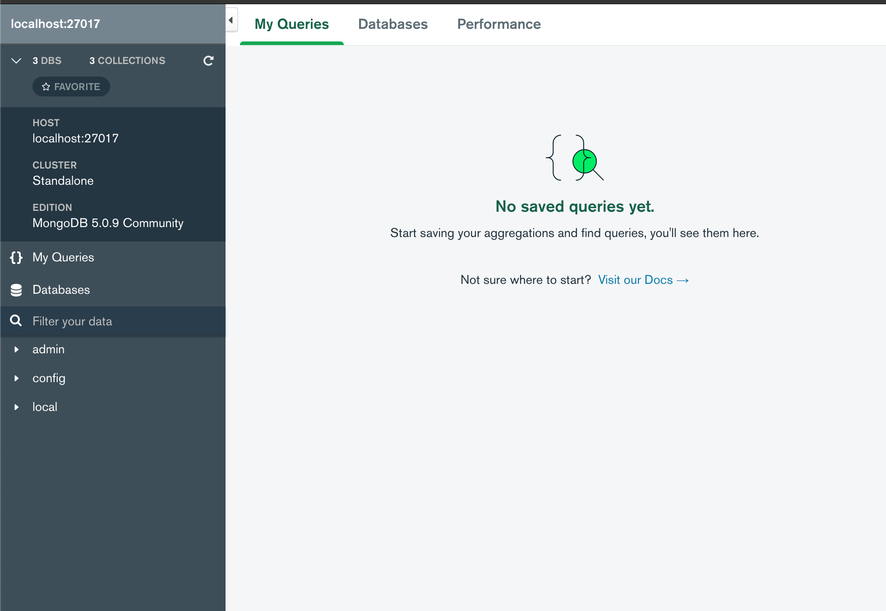

# Sprawozdanie z lab 11
## 1.Instalacja klastra Kubernetes
Komendą `curl -LO https://storage.googleapis.com/minikube/releases/latest/minikube-darwin-amd64`
zaopatrzono się w implementację kubernetesa oraz przeprowadzono instalację poprzez `sudo install minikube-darwin-amd64 /usr/local/bin/minikube`

## 2.Uruchomienie minikube w dashboardzie

Przed otworzeniem dashboarda w przegladarce komenda ` kubectl get po -A` sprawdzono dostęp do klastra 

Następnie poleceniem `minikube start` uruchomiony został dashboard

Zrzut ekranu ze strony:

## 3.Uruchomienie bezpośrednio z obrazu
Komendą `minikube kubectl run -- mongo-database --image=mongo --port=27017 --labels app=mongdb` uruchomione zostało mongo, które automatycznie zostaje ubrane w pod.

Działający pod: 

## 5.Przekierowanie portów
Następnie komenda `kubectl port-forward mongo-database 27017:27017` wyprowadzono port.

Oraz połączono do hostowanej bazy.

