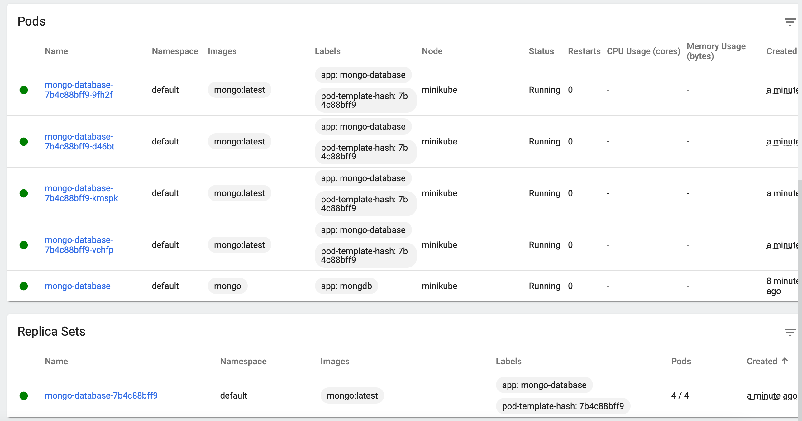
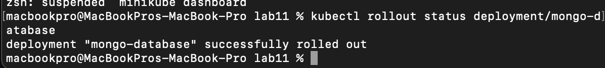

# Sprawozdanie z Lab 12

## 1.Plik deployment.yml z konfiguracją

Utworzono plik wdrożenia wraz z replikami:

```
apiVersion: apps/v1
kind: Deployment
metadata:
  name: mongo-database
  labels:
    app: mongo-database
spec:
  replicas: 4
  selector:
    matchLabels:
      app: mongo-database
  template:
    metadata:
      labels:
        app: mongo-database
    spec:
      containers:
      - name: mongo-database
        image: mongo:latest
        ports:
        - containerPort: 27017
```
## 2. Zmieniona wersja obrazu

Uruchomiony został ze zmienioną wersją obrazu (latest).


Po tym komendą `kubectl rollout status deployment/mongo-database` wykonano rollout status z poprawnie wdrożonym deploymentem.


 
Następnie komendą `kubect set image deployment/mongo-database mongo-database=mongo:crash` znów zmieniona została wersja obrazu na taką która sie wykraszuje.
Po tym odwołano wykonane czynności komendą `kubectl rollout undo deployment/mongo-database`


## 3. Kontrola wdrożenia

Komendą ```sleep 60 && sh ./Lab11/script.sh``` uruchomiono poniższy skrypt:

```
cmd() {
    kubectl rollout status deployment/mongo-database
}
if cmd | grep -q 'successfully rolled out'; then
  echo "Deployment is up and running"
else
  echo "Deployment is not running"
fi
```

## 4. Strategia recreate

 W strategii recreate poszczególne pody za każdym razem
i w jednoczesnym czasie zostają wyłączone i tworzone od nowa

```
apiVersion: apps/v1
kind: Deployment
metadata:
  name: mongo-database
  labels:
    app: mongo-database
spec:
  strategy:
    type: Recreate
  replicas: 4
  selector:
    matchLabels:
      app: mongo-database
  template:
    metadata:
      labels:
        app: mongo-database
    spec:
      containers:
      - name: mongo-database
        image: mongo:latest
        ports:
        - containerPort: 27017
```

## 5. Strategia rolling update

W strategii rolling update jednoczesnie updateowanych jest jakas liczba podów,
 a kiedy te juz wstana nastepuje update kolejnych

```
apiVersion: apps/v1
kind: Deployment
metadata:
  name: mongo-database
  labels:
    app: mongo-database
spec:
  strategy:
    type: RollingUpdate
    rollingUpdate:
      maxSurge: 2
      maxUnavailable: 1
  replicas: 4
  selector:
    matchLabels:
      app: mongo-database
  template:
    metadata:
      labels:
        app: mongo-database
    spec:
      containers:
      - name: mongo-database
        image: mongo:latest
        ports:
        - containerPort: 27017
```
