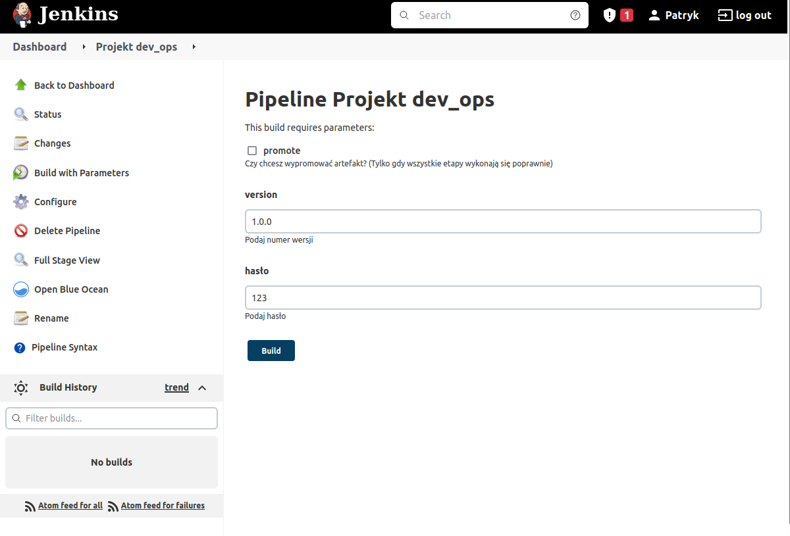
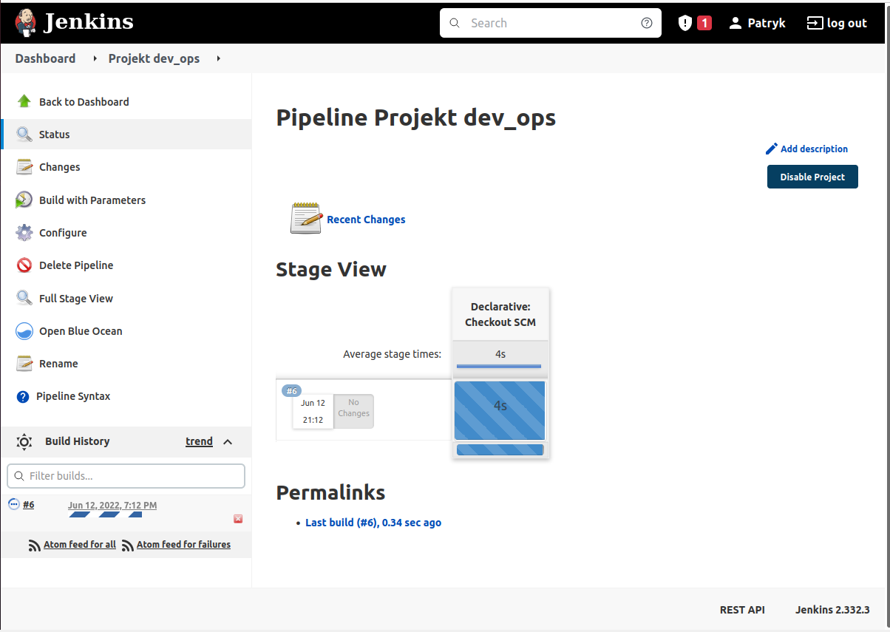
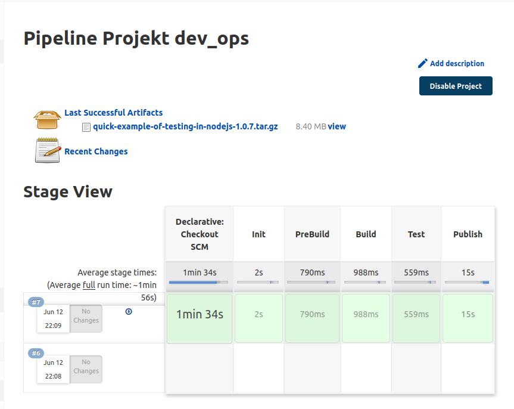
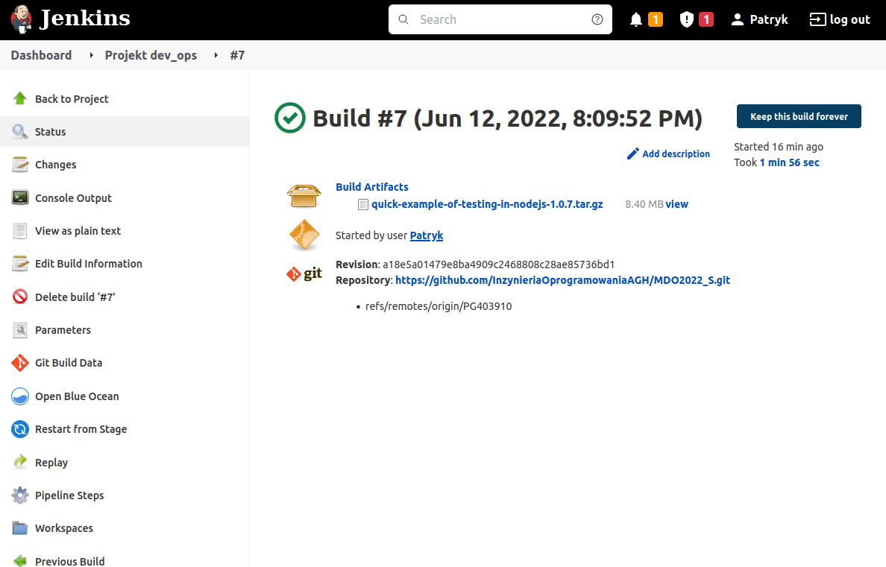
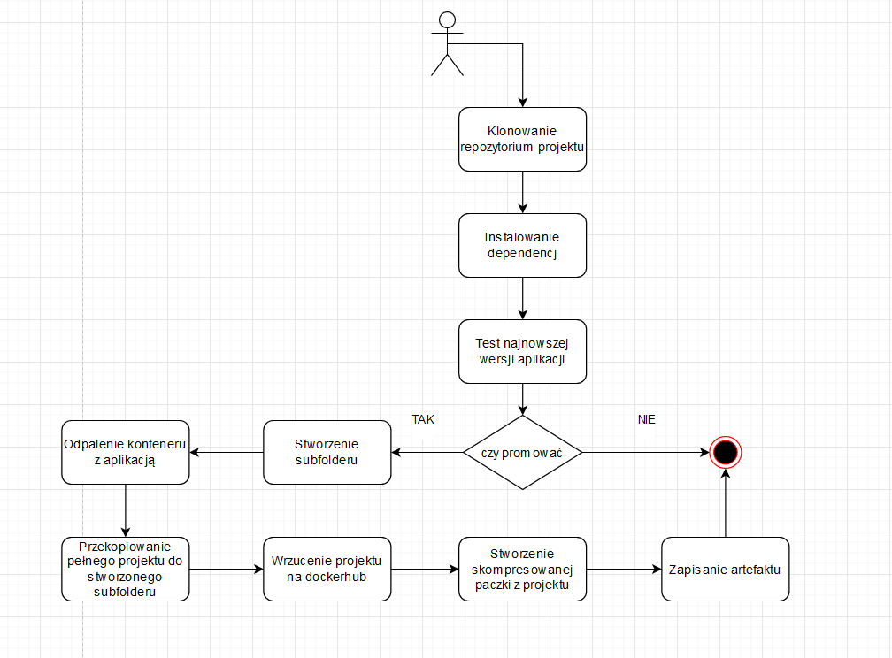
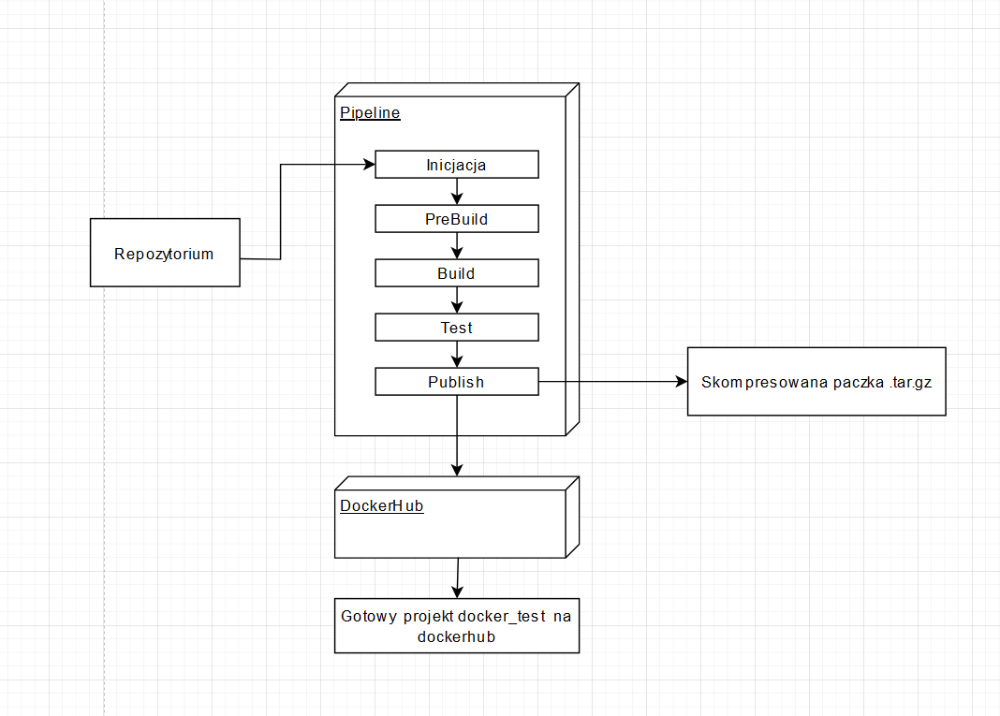

|Patryk Grabowski|403910|
| :- | :- |
|IT WIMIIP|
#
# Cel projektu 
Budowanie, testowanie, wdrażanie i publikowanie projektów dzięki technologii przetwarzania potokowego.

# Wykonane kroki
1. Instalacja i konfiguracja jenkinsa\
Kontynuowałem zadanie nr. 4, dzięki czemu miałem już zainstalowanego jenkinsa na dockerze.\
   
By jenkins po ponownym uruchomieniu maszyny wirtualnej działał i widział dockera, należało odpalić następujące komendy:\  
```
docker run 
  --name jenkins-docker \
  --rm \
  --detach \
  --privileged \
  --network jenkins \
  --network-alias docker \
  --env DOCKER_TLS_CERTDIR=/certs \
  --volume jenkins-docker-certs:/certs/client \
  --volume jenkins-data:/var/jenkins_home \
  --publish 2376:2376 \
  docker:dind \
  --storage-driver overlay2
```
  
```
docker run \
  --name jenkins-blueocean \
  --rm \
  --detach \
  --network jenkins \
  --env DOCKER_HOST=tcp://docker:2376 \
  --env DOCKER_CERT_PATH=/certs/client \
  --env DOCKER_TLS_VERIFY=1 \
  --publish 8080:8080 \
  --publish 50000:50000 \
  --volume jenkins-data:/var/jenkins_home \
  --volume jenkins-docker-certs:/certs/client:ro \
  jenkins \
```

2. Utworzenie pipeline
W panelu Jenkinsa należało kliknąć New Item => Pipeline, a następnie nadać mu nazwę.  
Następnie można było wpisać opis pipelina:  
    
I wybrać by nasz pipeline był zbudowany przez SCM:   
    
Zdefiniowanie gałęzi na której pracujemy oraz ścieżki do Jenkinsfile:    
    

#  
#  Jenkinsfile
1. Na początku chcemy zdefiniować zmienne, według których nasz pipeline będzie budowany:  
Potrzebujemy wiedzieć, czy chcemy publikować artefakt, jaka będzie wersja naszego projektu i hasło do naszego konta dockerhub (nie chcemy go podawać w pliku):
```
    parameters {
        booleanParam(name: "Promote",
            defaultValue: false, 
            description: "Czy chcesz wypromować artefakt? (Tylko gdy wszystkie etapy wykonają się poprawnie)") 
        string(name: "Version", 
            defaultValue: "1.0.0", 
            description: "Podaj numer wersji") 
        string(name: "Password", 
            defaultValue: "123", 
            description: "Podaj hasło") 
    }
```  
2. Pierwszy etap (Init):  
W pierwszym etapie musimy zdefiniować jakiego repozytorium będziemy używać do pobierania plików Dockerfile:
  
```
    stage('Init'){
        steps {
            git url: 'https://github.com/InzynieriaOprogramowaniaAGH/MDO2022_S.git', branch: 'PG403910'
        }\
        post{
            success{
                echo 'Project initialized'
            }
            unsuccessful{
                echo 'Failed to initialize project'
            }
        }
    }
```
  
3. Drugi etap (PreBuild):  
W tym etapie budujemy kontener dockera z podanego pliku:  
  
```
    stage('PreBuild') {
        steps {
            dir('./ITE/GCL03/PG403910/Lab05/pliki'){
                echo 'Pre building'
                sh 'ls -a'
                sh 'docker build -t docker_build:latest . -f docker_build'
            }
        }
        post{
            success{
                echo 'Success'
            }
            unsuccessful{
                echo 'Failed'
            }
        }
    }
```
  

Dockerfile:  
```
    FROM node:latest
    RUN git clone https://github.com/Lissy93/quick-example-of-testing-in-nodejs.git
    WORKDIR quick-example-of-testing-in-nodejs
    RUN npm install
```
  
4. Trzeci etap (Build):  
Etap trzeci czyli build to oddzielenie tworzenia kontenera, od odpalania kontenera. Tak naprawdę Prebuild i Build w przypadku mojego projektu mógł być w jednym etapie. Miałem jednak problem z odpaleniem Builda ze względu na konflikt nazw i dlatego by "zdebugować" pipeline postanowiłem to oddzielić i tak już zostało. \
  
```
    stage('Build') {
        steps {
            dir('./ITE/GCL03/PG403910/Lab05/pliki'){
                echo 'Building'
                sh 'docker run --name  docker_build docker_build:latest'
            }
        }
        post{
            success{
                echo 'Success'
            }
            unsuccessful{
                echo 'Failed'
            }
        }
    }
```
  
5. Czwarty etap (Test):  
Testujemy projekt z pliku dockerfile:  
  
```
    stage('Test') {
            steps {
                dir('./ITE/GCL03/PG403910/Lab05/pliki'){
                    echo 'Starting Testing'
                    sh 'docker build -t docker_test:latest . -f docker_test'
                }
            }
        post{
            success{
                echo 'Tested successfully'
            }
            unsuccessful{
                echo 'Failed to make tests'
            }
        }
    }
```
  
Dockerfile:  
  
```
    FROM docker_build
    WORKDIR quick-example-of-testing-in-nodejs
    RUN npm test
```
  
6. Piąty etap (Publish):  
Po wykonaniu wszystkich czynności, możemy opublikować nasz package na dockerhubie. Dzięki temu upublicznimy paczkę która będzie łatwa do zainstalowania dla innych użytkowników.  
  
```
    stage('Publish'){
        when{
            expression{
                return params.Promote == true; 
            }
        }
        steps{
            echo 'Starting Publishing'
            sh "mkdir ${params.Version}"
            sh 'docker run --name docker_test docker_test:latest'
            sh "docker cp docker_test:/quick-example-of-testing-in-nodejs ./${params.Version}"
            echo "Pushing Image to DockerHub"

            sh "docker login -u malokreatywny22222 -p ${params.Password}"
            sh "docker tag docker_test:latest malokreatywny22222/quick-example-of-testing-in-nodejs:${params.Version}"
            sh "docker push malokreatywny22222/quick-example-of-testing-in-nodejs:${params.Version}"
            
            sh 'docker rm docker_test'
            sh "tar -czvf quick-example-of-testing-in-nodejs-${params.Version}.tar.gz ${params.Version}/"
            echo "Creating Artifact"
            archiveArtifacts artifacts: "quick-example-of-testing-in-nodejs-${params.Version}.tar.gz"
        }
        post{
            success{
                echo "Publishing complete"
            }
            unsuccessful{
                echo "Failed to publish"
            }
        }
    }
```
  
Najpierw sprawdzamy czy parametr Promote został zaznaczony. Jeśli tak to tworzymy subfolder o nazwie wersji naszego kodu i puszczamy na nim testy. Następnie odpalamy kontener i kopiujemy zawartość po zainstalowaniu dependencji do folderu docelowego (czyli podfolderu o nazwie wersji).   
  
Następnie publikujemy zawartość folderu na dockerhubie wykorzystując do tego hasło wpisane przy odpaleniu pipeline'a. Całość kończymy usunięciem instancji dockera i zapakowaniu projektu w skompresowaną paczkę.  
7. Ostatni krok (Cleanup):  
Jest to ostatni etap, który usuwa obie instancje stworzone podczas kompilowania pipeline'a, by w przyszłości można było od nowa odpalić cały proces (ponieważ nie możemy stworzyć 2 instancji o tej samej nazwie). 
  
```
    stage('Cleanup') {
        steps {
            sh 'docker rm docker_build'
            sh 'docker rm docker_test'
        }
    }
```
  
8. Odpalenie pipeline'a: \
Wybranie czy promujemy artefakt, numeru wersji i wpisanie hasła do dockerhuba:\
   
  
# Wyniki: 

   
   
   

# Diagramy

1. Diagram aktywności:   
  
2. Diagram wdrożenia:  
  

