|Patryk Grabowski|403910|
| :- | :- |
|IT WIMIIP|
#
# Przygotowywanie maszyn wirtualnych z Fedorą
1. Pobrano obraz fedory i skonfigurowano ją na nowej instancji maszyny wirtualnej:\
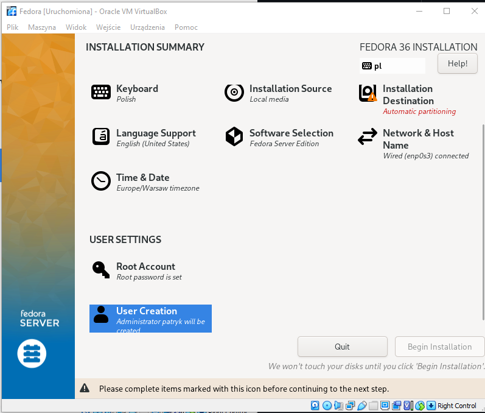  
2. Drugą maszynę wirtualną z fedorą sklonowano na bazie pierwszej maszyny.
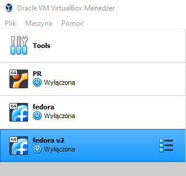  
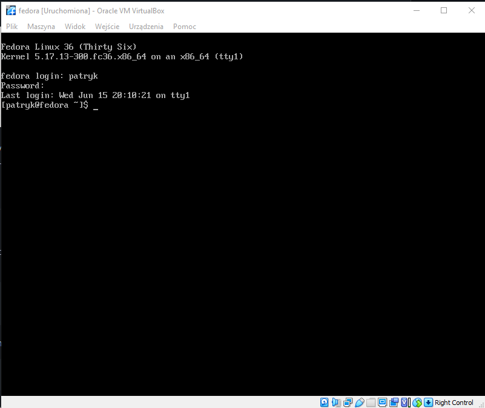  
  
# Przygotowanie serwera nginx
1. Na maszynie nr. 1 zainstalowano nginx za pomocą następujących komend:\
```
sudo dnf module enable nginx:mainline
sudo dnf install nginx
```  
2. Odblokowano firewalla na dostęp http i https:
```
sudo firewall-cmd --permanent --zone=public --add-service=http
sudo firewall-cmd --permanent --zone=public --add-service=https
sudo firewall-cmd --reload
```  
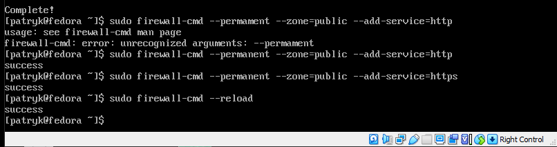  

3. Stworzono wspólną sieć NAT łączącą obie maszyny\
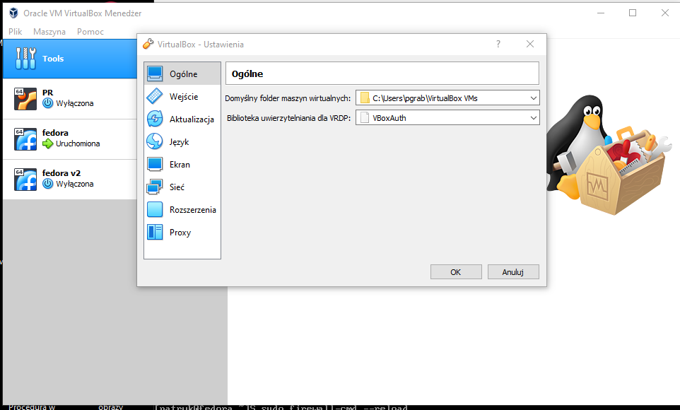  
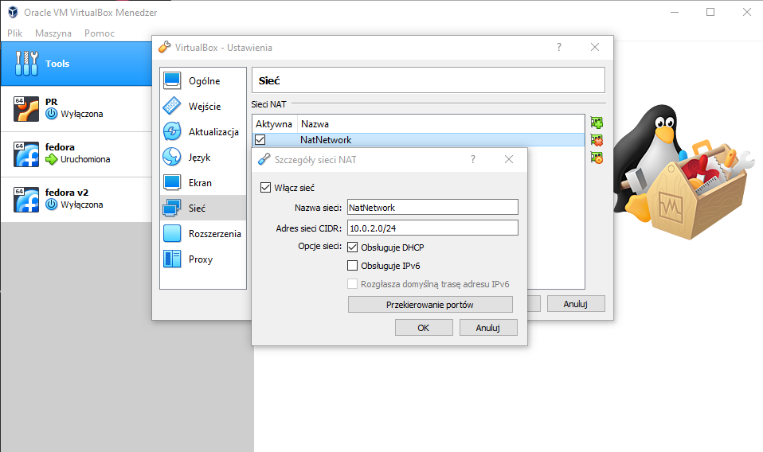  
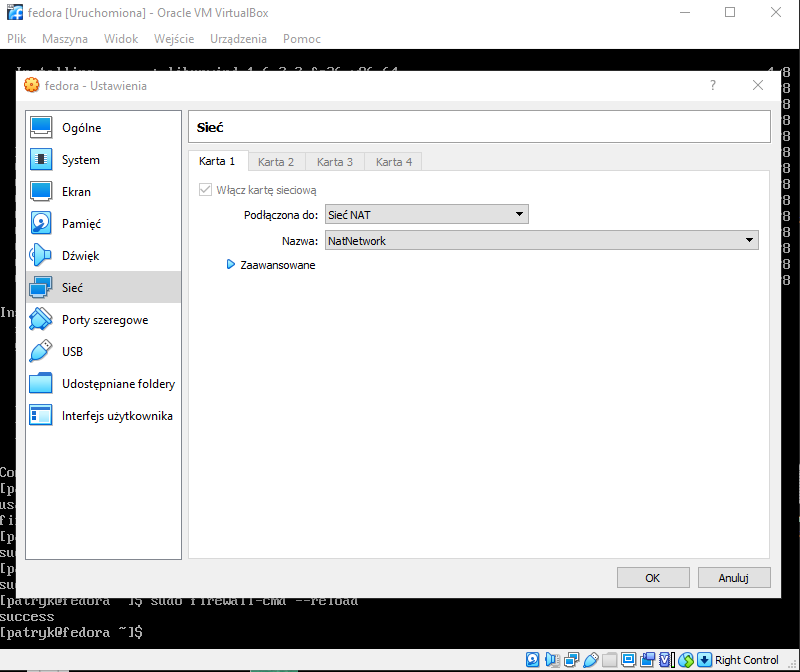  

4. Połączono obie maszyny i sprawdzono czy adres ip się zgadza:\
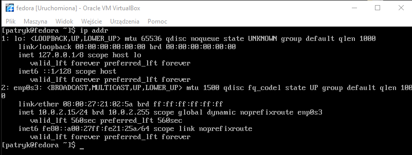  
5. Test czy maszyny się widzą:\
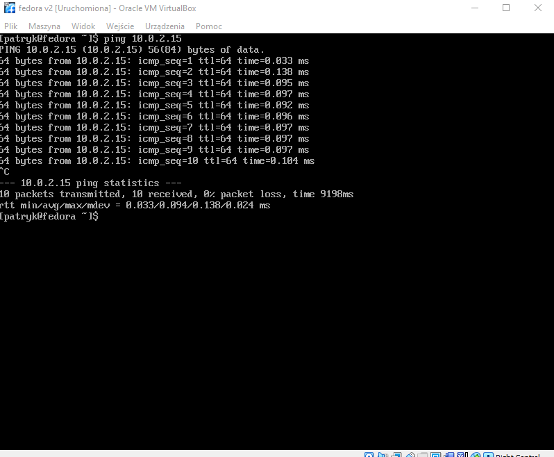  
6. Umieszczono artefakt na serwerze w folderze zawierającym pliki dostępne na serwerze:\
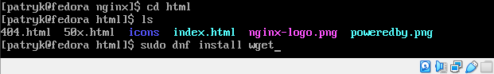  
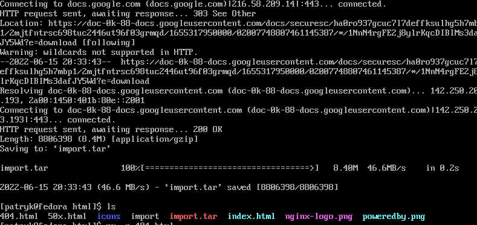  
7. Zmiana uprawnień pliku by był on dostępny dla każdego do pobrania\
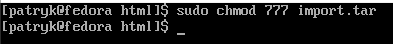  
8. Próba ściągnięcia pliku za pomocą polecenia wget\
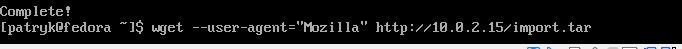  
Podczas wykonywania ćwiczenia na maszynie wirtualnej miałem nieznany błąd związany z wget i nie mogłem dostać się do zawartości serwera, dlatego przygotowałem dodatkową maszynę z interfacem graficznym i tam bezpośrednio z przeglądarki przetestowałem czy wszystko działa:\
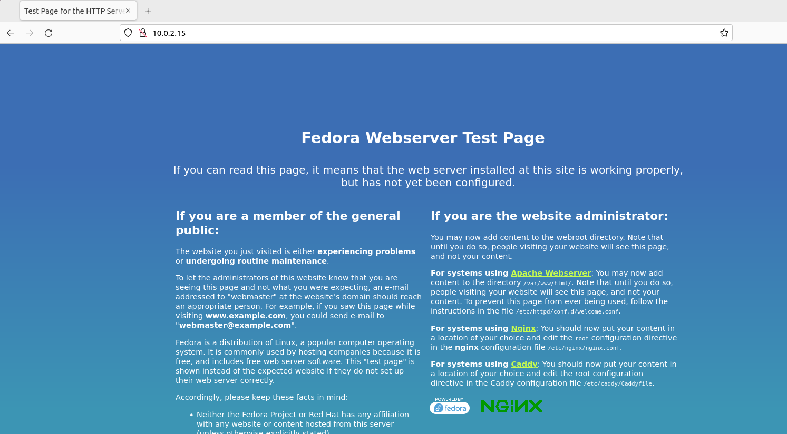  
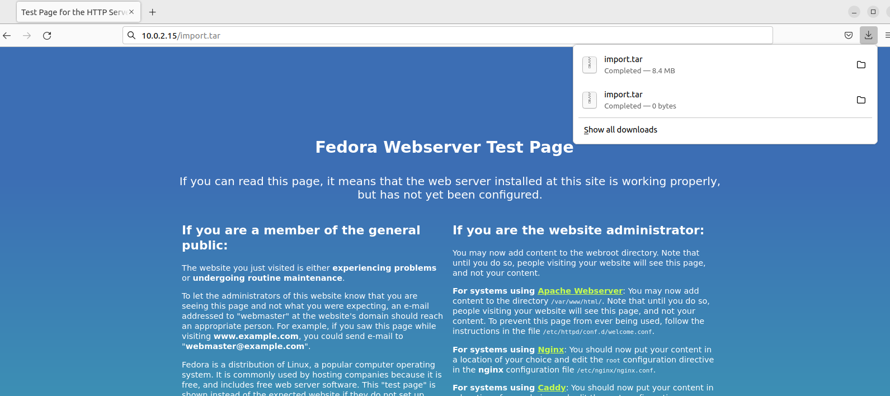  
Rozpakowanie plików:\
  

# Instalacja nienadzorowana
1. Sprawdzenie pliku anaconda-ks.cfg na jednej z maszyn:\
  
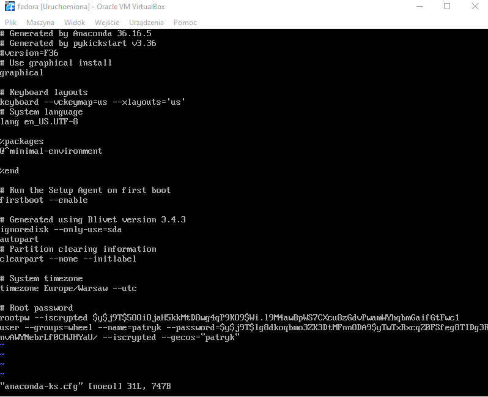  
2. Instalacja nowego obrazu fedory za pomocą komendy:\
```
vmlinuz initrd=initrd.img inst.stage2=hd:LABEL=Fedora-S-dvd-x86_64-36 rd.live.check quiet inst.ks=https://raw.githubusercontent.com/malokreatywny/devops/main/anakonda-ks.cfg
```
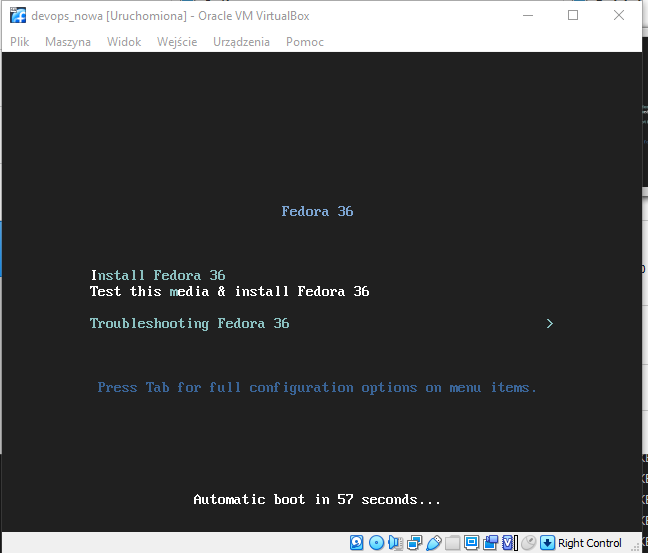  
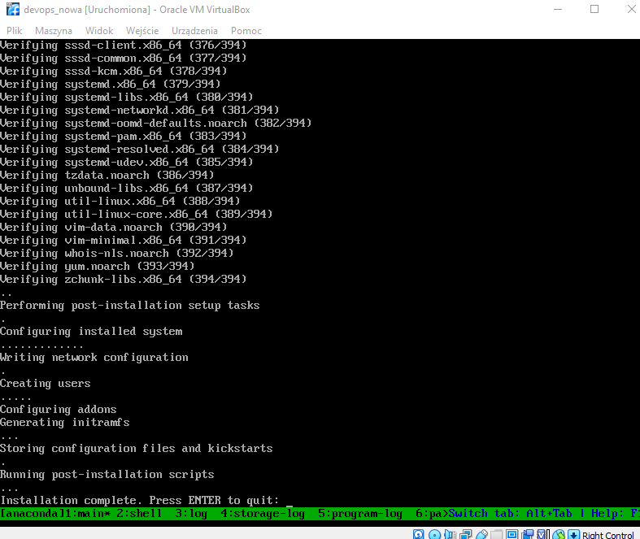  
3. Sprawdzenie czy pliki znajdują sie na nowej maszynie:\
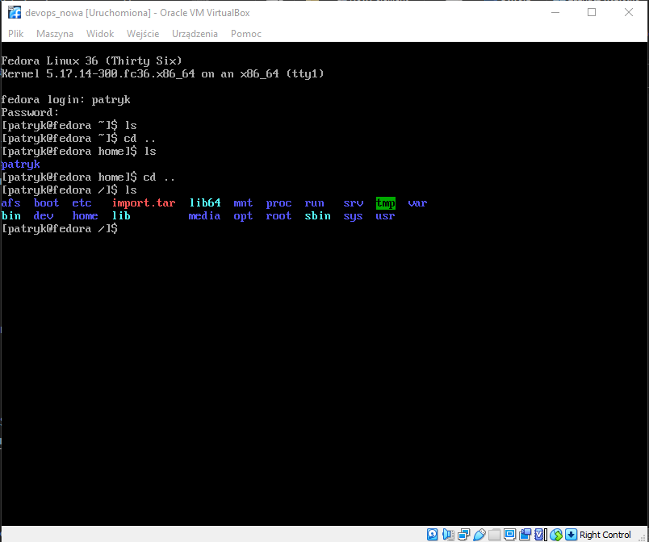  