|Patryk Grabowski|403910|
| :- | :- |
|IT WIMIIP|
#
# Instalacja Kubernetes
1. Pobrano kubernetes według poradnika z oficjalnej strony za pomocą następujących komend:\
```
curl -LO https://storage.googleapis.com/minikube/releases/latest/minikube-linux-amd64
sudo install minikube-linux-amd64 /usr/local/bin/minikube
```
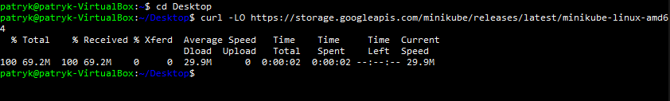  
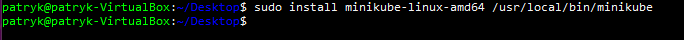  
2. Uruchomiono klaster za pomocą komendy
```
minikube start
```

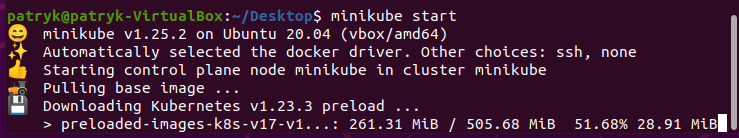  
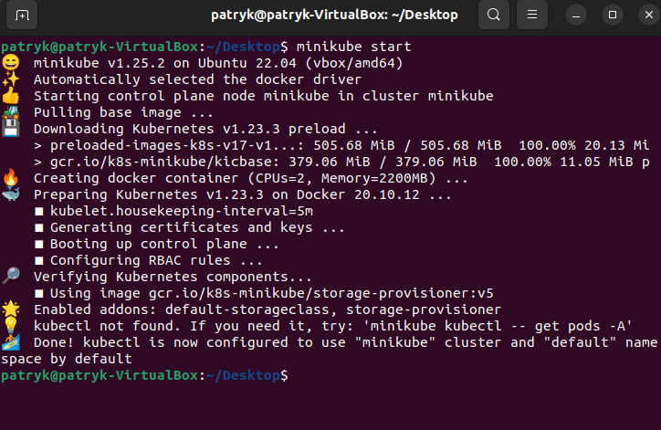  

3. Uruchomiono graficzny dashboard kubernetes komendą
```
minikube dashboard
```
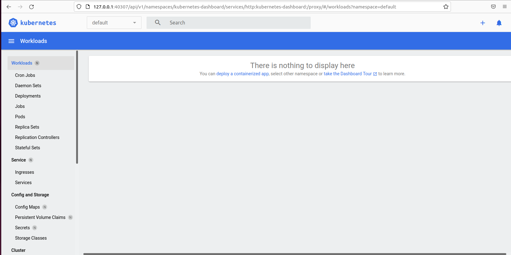  
  
# Uruchomienie odpowiedniego kontenera:
1. Ściągnięto najnowszy obraz nginx z oficjalnego repozytorium dockera:\
```
docker pull nginx:latest
```
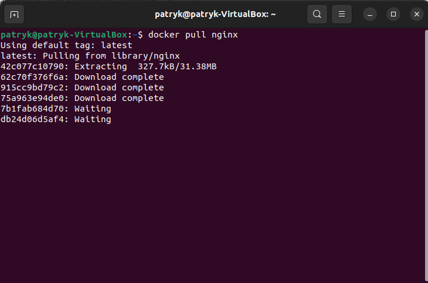  

2. Odpalono kontener:\
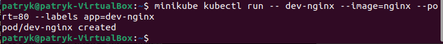  
3. Sprawdzenie widoczności kontenera w dashboardzie:\
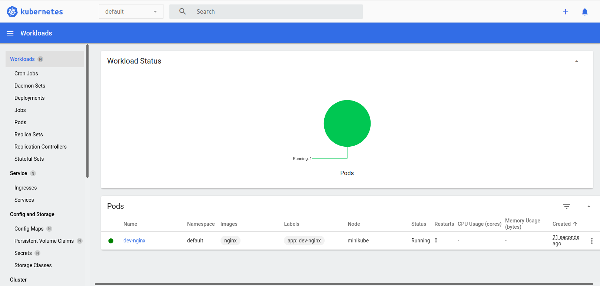  
4. Zmieniono port z 80 na 5000:\
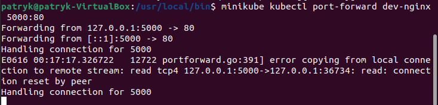  
5. Sprawdzono działanie na locahoście z portem 5000:\
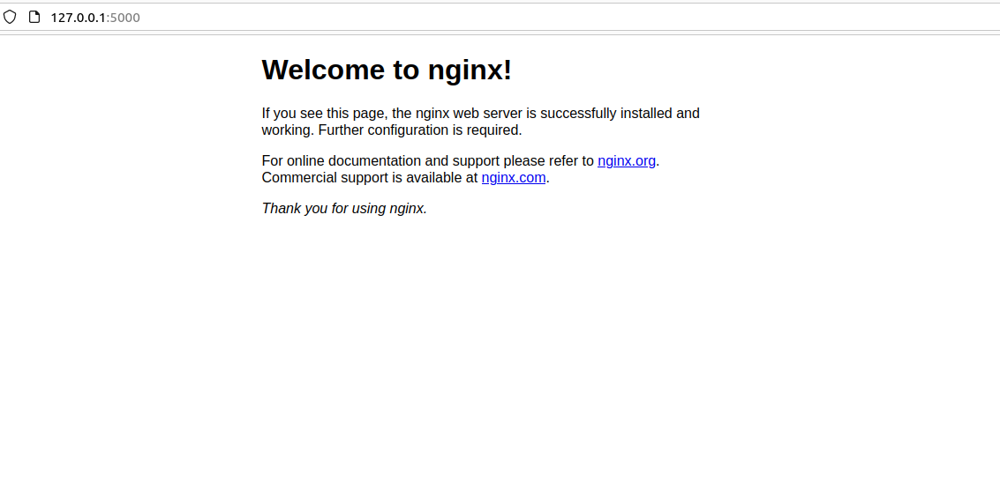  

# Stworzenie pliku wdrożeniowego i stworzenie na jego podstawie klastra
1. Plik wdrożeniowy:\
```
apiVersion: apps/v1
kind: Deployment
metadata:
 name: nginx-prod
spec:
 selector:
   matchLabels:
     app: nginx
 replicas: 2
 template:
   metadata:
     labels:
       app: nginx
   spec:
     containers:
     - name: nginx
       image: nginx
       ports:
       - containerPort: 80
```
2. Odpalono kontener i sprawdzono czy działa:\
Komenda:\
```
kubectl apply -f plik.yaml
```
  
3. Sprawdzenie czy wszystkie zmiany są widoczne na dashboardzie kubernetes:\
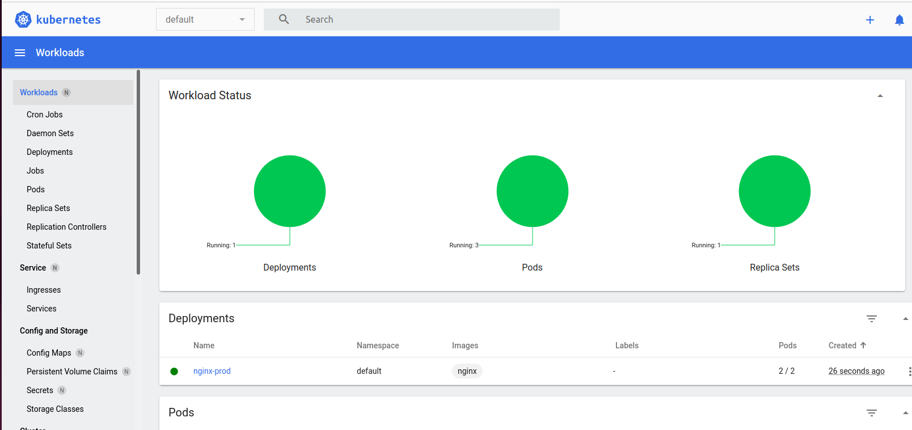  
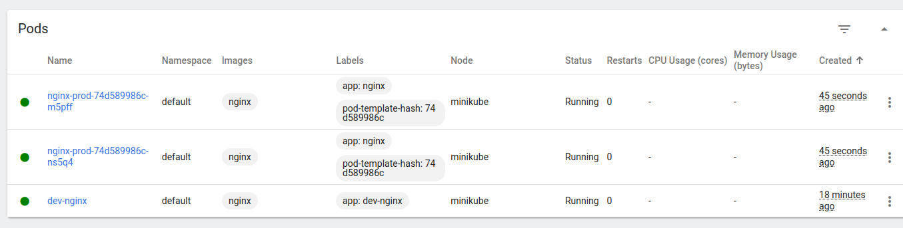  
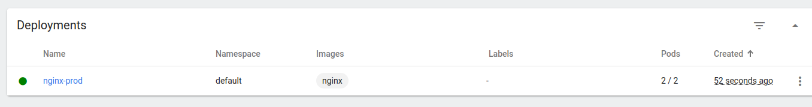  
