|Patryk Grabowski|403910|
| :- | :- |
|IT WIMIIP|
#
# Opis
Zadanie kontynuuje zagadnienia z laboratorium nr. 11, czyli zarządzalne kontenery w Kubernetes. Polegało ono na zmianie pliku wdrożeniowego, zmianie ilości replik poszczególnych deploymentów, zdeployowanie obrazu który kończył się nie powodzeniem i stworzenie skryptu sprawdzającego stan deploymentu.

# Stworzenie deploymentu testowego
1. Stworzono nowy deployment z 6 replikami:\
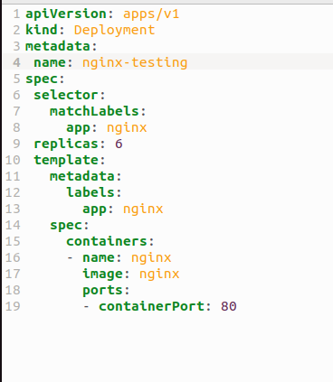  
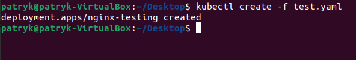  
  
  
Sprawdzenie ilości replik:\
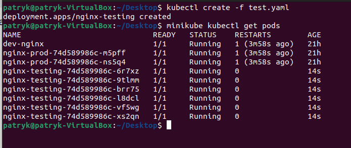  

# Zmiana ilości replik
1. Zwiększenie ilości replik do 9:\
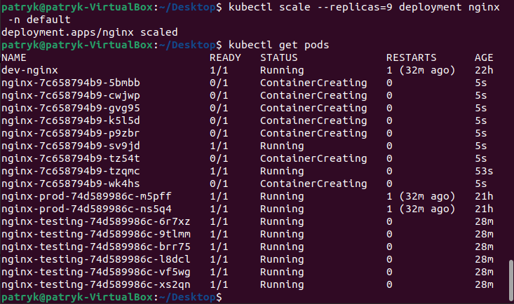  
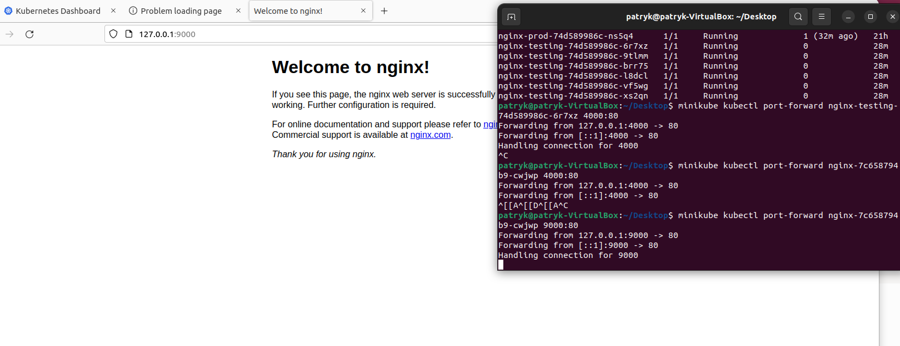  

2. Zmniejszenie ilości replik do 1:\
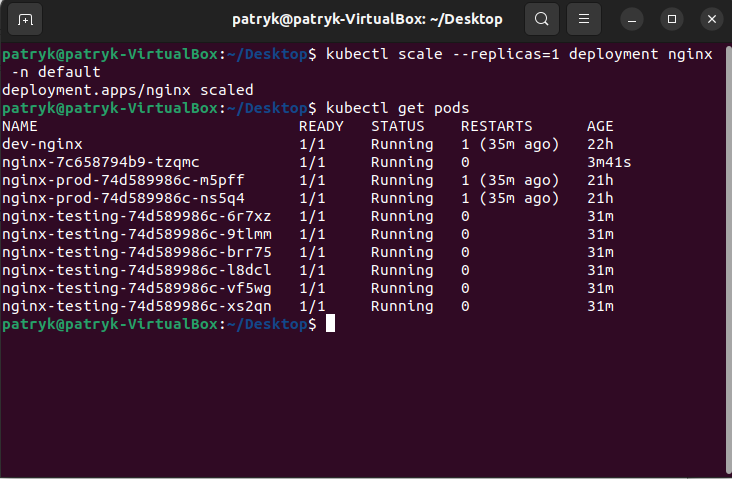  
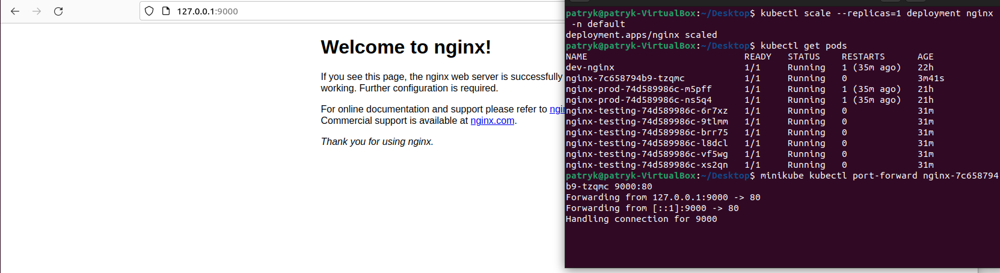  

3. Zmniejszenie ilości replik do 0:\
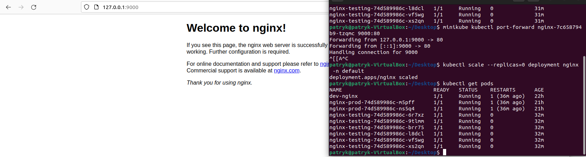  
  

# Stworzenie deploymentu na bazie obrazu który nie działa
1. Dockerfile:\
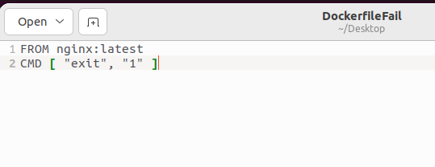  
  
2. Zbudowanie obrazu dockera na podstawie błędnego dockerfile:\
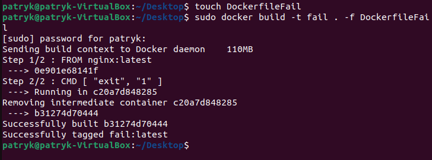  
  
3. Zmiana obrazu deploymentu nginx-testing na błędny:\
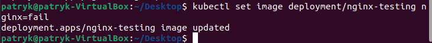  
  
Sprawdzenie czy nginx-testing załadował nowy obraz:\
  
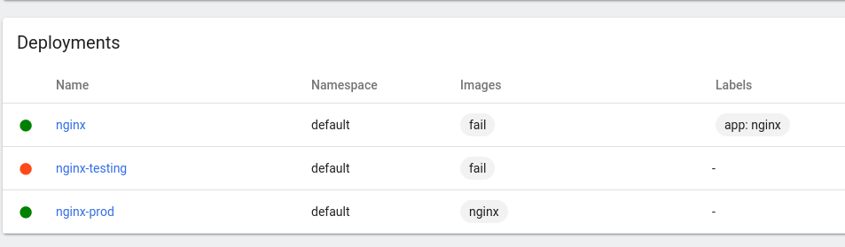  
  
Tak jak widać obraz został załadowany i zablokował deployment.

4. Zmiana obrazu nginx-testing na obraz działający:\
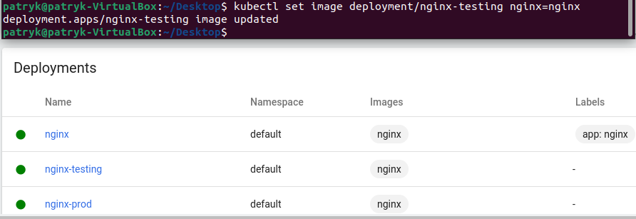  
  
Obraz został załadowany i deployment znowu działa.
  
5. Rollout nginx-testing do poprzedniej wersji (nie działającej):\
Sprawdzenie historii zmian:\
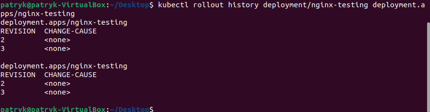  
  
  
Rollout do zmiany nr. 2:\
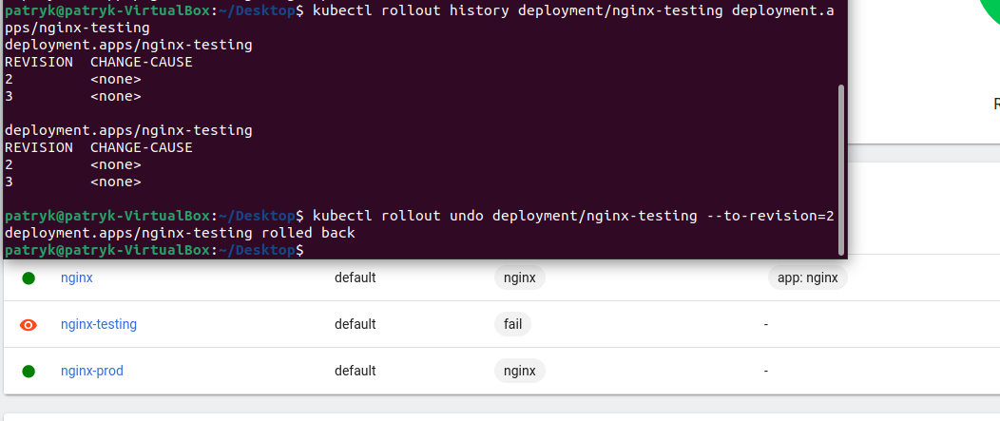  
  
  
# Kontrolowanie wdrożenia za pomocą skryptu bash:
1. Napisanie skryptu bash:\
```
#!/bin/bash
kubectl apply -f test-skryptu.yaml
sleep 15
kubectl rollout status deployment/nginx-test-skryptu
if [[ "$?" -ne 0 ]];
then echo 'fail'
else echo 'success'
fi
```
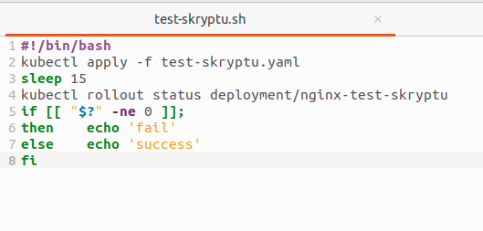  

2. Odpalenie skryptu:\
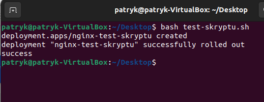  
  
  
Wyniki działania skryptu:\
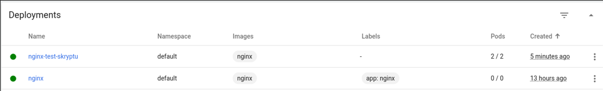  

# Strategie wdrożeniowe:
1. Rolling Update:\
Strategia ta jest ustawiona jako domyślna. Wszystkie pliki wykorzystane dotychczas w zadaniach były przykładem tej strategii.\
W tej strategii jesteśmy w stanie aktualizować liczbę podów bez przerw w działaniu deploymentów. Przykładowo możemy zmienić liczbę podów z 6 do 9, to te 6 replik zostanie tak jak jest i zostaną dołożone do tego 3 repliki. Przy zmniejszeniu replik z 9 do 1, to jeden pod zostanie nietknięty, a reszta zostanie usunięta.
  

2. Recreate:\
Jest to strategia która polega na zabiciu wszystkich podów i utworzeniu nowych, dzięki czemu możemy odpalić od nowa deployment który miał error.\
Plik:\
  
  

Ważna zmiana:\
```
strategy:
  type: Recreate
```
  
Odpalenie pliku:\
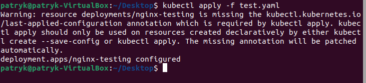  
  
Działanie:\
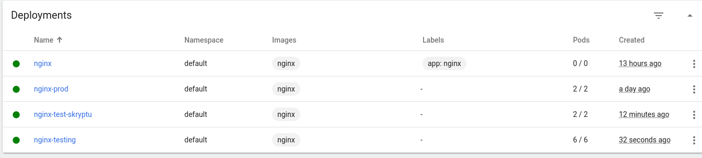  
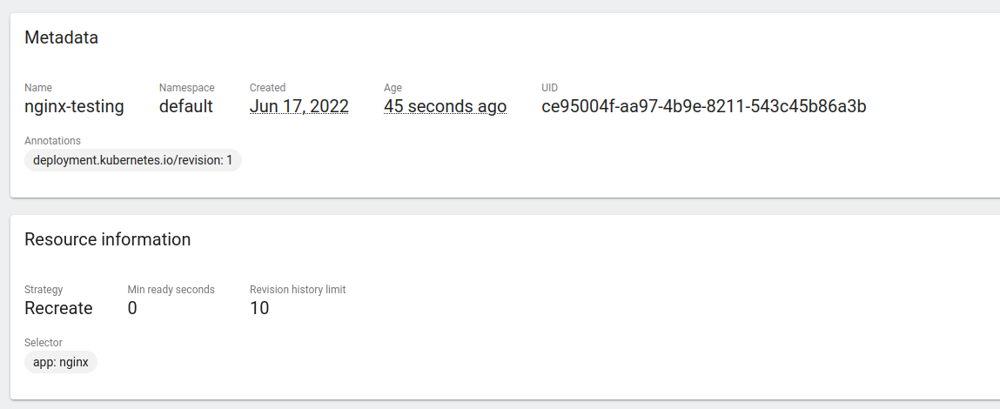  
  
  
3. Canary:\
Canary (kanarek) polega na tym, że tworzymy dwa deploymenty, w których jeden jest "bazowym", a drugi jest dodatkowy, np: version 1.0 i version 2.0. Jest to strategia wykorzystywana w sytuacji w której chcemy zaktualizować aplikację i stopniowo przerzucać część użytkowników na nową wersję, po to by ją testowali. Działa to tak, że druga wersja jest monitorowana i stopniowo migrowani są użytkownicy z wersji nr. 1 do tej wersji. Trwa to tak długo, aż wszyscy użytkownicy zostaną przeniesieni na nowszą wersję. Ewentualnie proces może zostać przerwany w momencie wykrycia błędu.\
  
Plik wersji 1:\
  
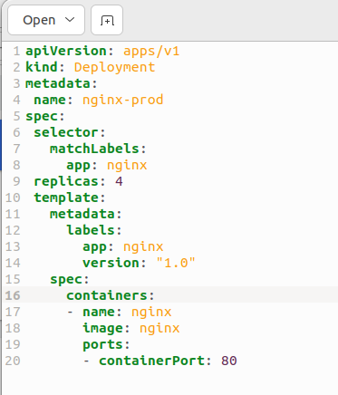  
  
  
Plik wersji 2:\
  
  
  
Stworzenie obu deploymentów:\
  
  
  