# Sprawozdanie z Lab05
# Szymon Guziak, IT, gr.3, ITE-GCL03

# Cel projektu

Celem projektu na Lab05 było przygotowanie pipeline-u, który automatycznie wykona built oraz test.
Na koniec pipeline miał wykonać Publish.

Do wykonania tego projektu korzystaliśmy z Jenkins-a.
Jenkins jest to bardzo znany system, dzięki któremu mogliśmy utworzyć automatyczny pipeline.

Do realizacji projektu wykorzystałem repozytorium na nodejs - dało mi to możliwość z korzystania z prostego npm.

### 1. Postawienie Jenkins-a

Dzięki posiadanym już umiejętnościom z poprzdednich labów uruchomiłem Jenkinsa korzystając z kilku komend.

Na początku utworzyłem network dzięki docker network create jenkins:
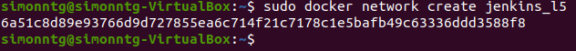

Kolejnym krokiem było uruchomienie obrazu kontenera:
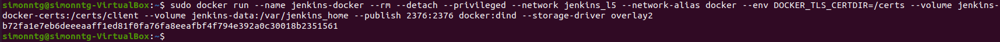

Następnie utworzyłem DockerFile:
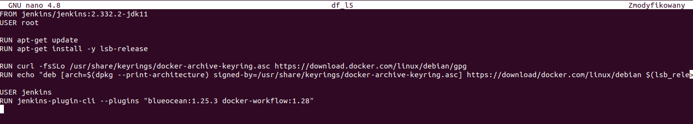

Zbudowałem obraz (z małymi problemami z lokalizacją Dockerfile - wystarczyło go tylko przenieść w odpowiednie miejsce):

Na koniec uruchomiłem obraz z Jenkins-em:
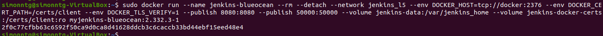
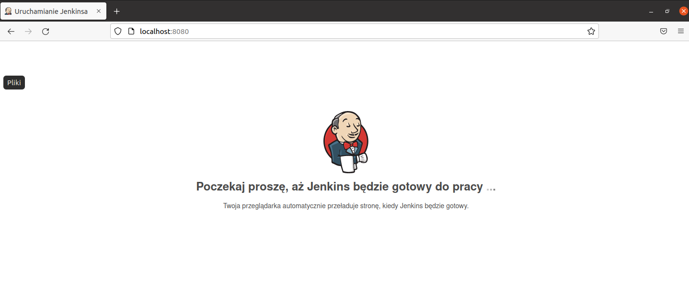

Musiałem się zalogować, na szczęście hasło miałem zapisane, a nazwę użytkownika pamiętałem :D
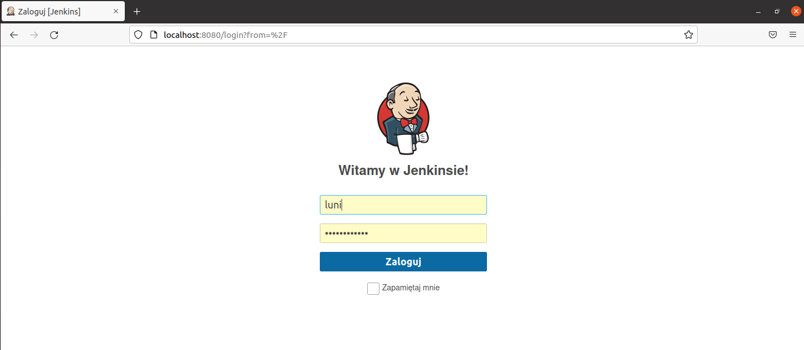

Dzięki wykonaniu tych kroków na adresie localhost:8080 ukazał się Jenkins, dzięki któremu mogłem kontynuować zajęcia.

### 2. Tworzenie pipeline-u na Jenkins-ie
Gdy już byłem zalogowany na Jenkis-ie wszedłem w Nowy Projekt --> Pipeline, gdzie nadałem mu odpowiednią nazwę i go utworzyłem:
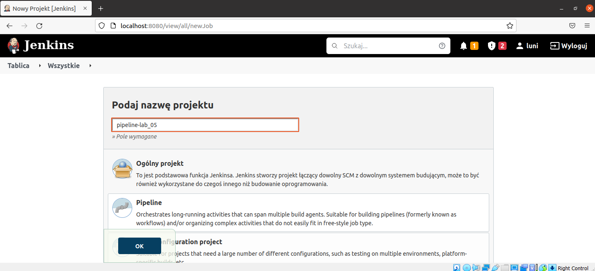

Do stworzenia pipeline-u przygotowałem dwa Dockerfile - na build oraz na test:
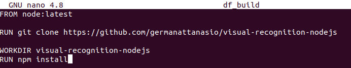
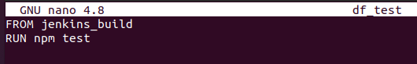

Dalszą częścią projektu było przygotowanie pipeline-u - w tym celu, trzymając się konwencji, podzieliłem go na części.
Każda taka część nazywa się Stage.
Stage dzieli się na steps.

Mój pipeline podzieliłem na 3 stage:

Stage nr 1 - build:
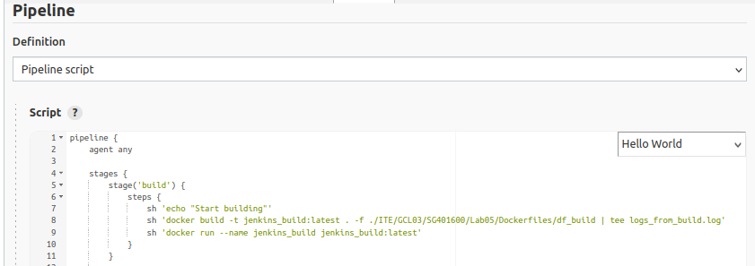

Ten stage buduje obraz z pliku Dockerfile, który znajduje się na mojej gałęzi.
Wykorzystałem komendę tee w celu zapisania logów z tego stage-a do pliku.

Stage nr 2 - test:
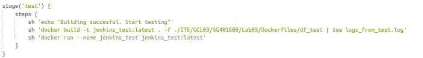

Podczas tego stage również poprzez plik Dockerfile tworzę obraz.
Wykonuje testy za pomocą komendy 'npm test'

Stage nr 3 - publish:

W tym stage kopiuję zawartość kontenera z testami.
To również w tym stage-u pakuję ten folder i tworzę artefakt.
Tan stage wykonuje się jedynie, gdy zaznaczyłem wcześniej parametr 'promote'.

### 3. Konfiguracja pipeline-u
Zastosowałem takie ustawienia przy uruchamianiu mojego pipeline-u:
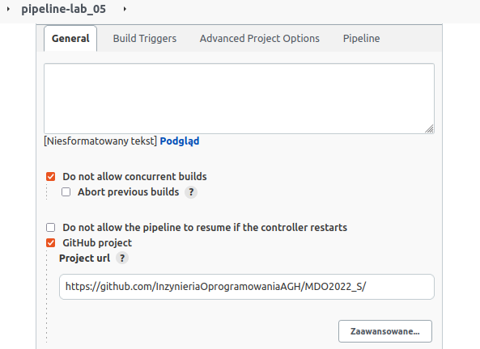
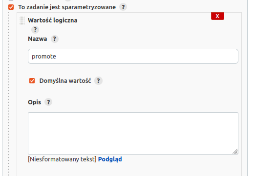
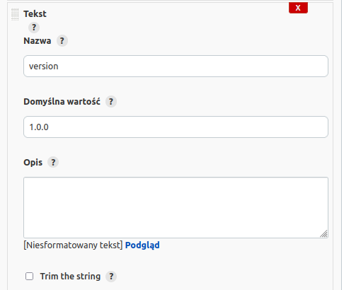

### 4. Uruchomienie pipeline-u

Tutaj napotkałem małe problemy przy uruchamianiu stworzonego pipeline-u:
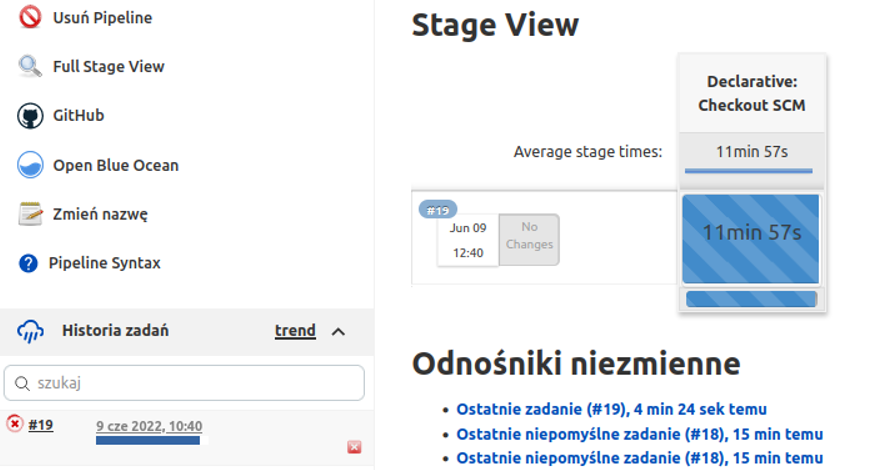

Na początku był problem z buildem - nie chciał mi pipeline działać na kontenerze.
W tym celu przeniosłem plik z pipelinem na moją gałąź - uważałem to za wygodniejsze.
Po wprowadzeniu paru zmian m.in. wstawieniu timelimit na 60 minut, a nie jak było na początku 10min udało mi się odpalić pipeline, jak widać na zdjęciu powyżej.

Sam build bardzo długo się robił - minimalnie ponad 30 minut - podejrzewam, że było to spowodowane słabym połączeniem internetowym.

Następnie, po minimalnym poprawkach, wykonał się test oraz publish.
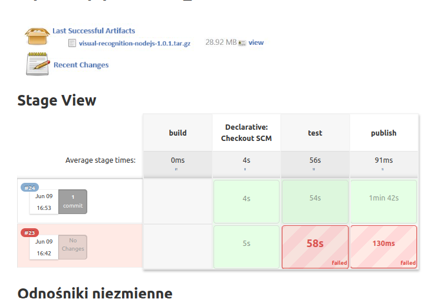

### 5.  Diagram
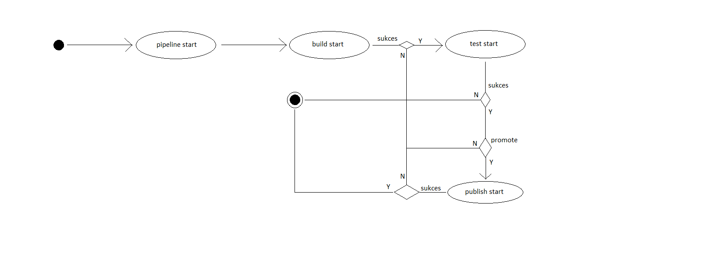
