# Sprawozdanie z Lab11

# Szymon Guziak, IT, gr.3, ITE-GCL03

## Instalacja klastra Kubernetes

To labolatorium nie obyło się bez problemów.
Na początku chciałem zainstalować minikube:
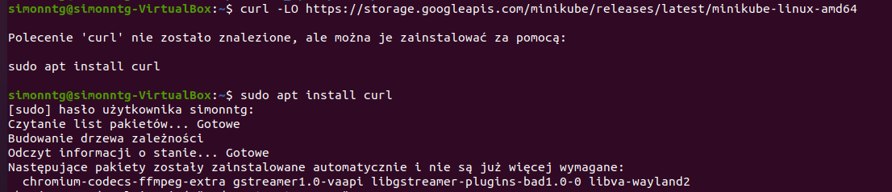
Przez to, że miałem nową maszynę wirtualną nie miałem polecenia curl, więc musiałem je wpierw zainstalować.

Przystąpiłem wtedy do dalszej instalacji minikube:
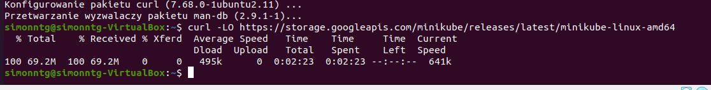

Trzymając się dokumentacji zainstalowałem kubectl z sha256:
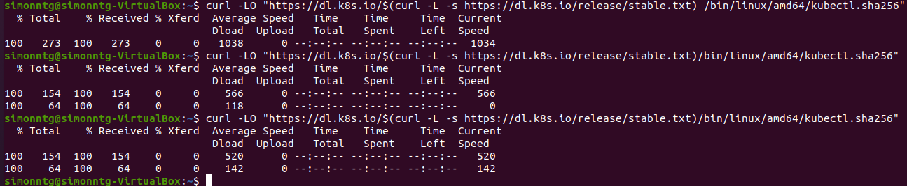

Tutaj wystąpiły pierwsze problemy.
Wykonując polecenie 'echo "$(cat kubectl.sha256) kubectl" " sha256sum --check' otrzymałem odpowiedź - kubectl: Niepowodzenie
Później jak wpisywałem dla testu 'kubectl version --client' otrzymywałem odpowiedź - kubectl: Nie znaleziono polecenia
Mimo, że wykonywałem instalację jak w dokumenctacji miałem problemy z nią.

Znalazłem wtedy instalację skierowaną streakte dla Ubuntu.

Wykonałem po kolei takie polecenia i instalacje (niektóre były zbędne, bo np miałem zainstalowanego docker.io, ale wykonałem polecenie, by na pewno wszystko działało):
	'sudo apt-get install -y apt-transport-https'
	'sudo apt install docker.io'
	'sudo systemctl start docker'
	'sudo systemctl enable docker'
	'sudo apt-get install curl'
	'sudo curl -s https://packages.cloud.google.com/apt/doc/apt-key.gpg | sudo apt-key add'
	'sudo chmod 777 /etc/apt/sources.list.d'
	'cat /etc/apt/sources.list.d/kubernetes.list' (plik 'kubernetes.list' stworzony ręcznie) - zawartość pliku - deb https://apt.kubernetes.io/ kubernetes-xenial main
	'sudo apt-get update'
	'sudo apt-get install -y kubelet kubeadm kubectl kubernetes-cni'
	'sudo swapoff -a'
	'sudo kubeadm init' - pod koniec tego polecenia pokazują się 3 komendy, które należy przekopiować:
	'mkdir -p $HOME/.kube'
	'sudo cp -i /etc/kubernetes/admin.conf $HOME/.kube/config'
	'sudo chown $(id -u):$(id -g) $HOME/.kube/config'

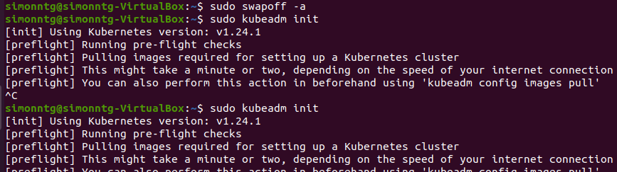
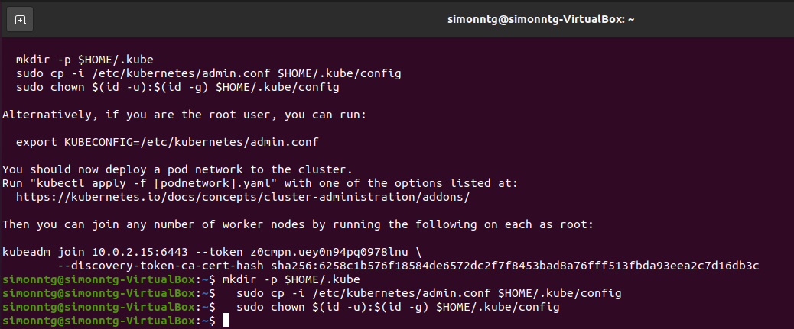

Po wykonaniu tego całego bloku komend wykonałem komendy na instalację osobno kubectl i kubectl.sha256
Wyczytałem, że aby uniknąć problemów najlepiej zainstalować tę samą wersję, dlatego wpisałem w komendzie v1.24.0"
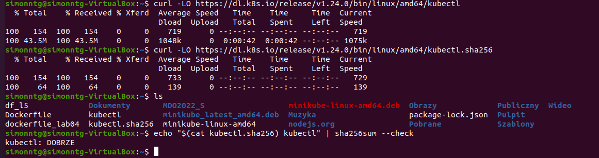
Teraz komenda echo zwróciła wartość DOBRZE

Następnie zainstalowałem kubectl zgodnie z dokumentacją:
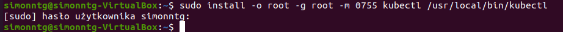

Sprawdziłem wersję:

Wystartowałem minukube:
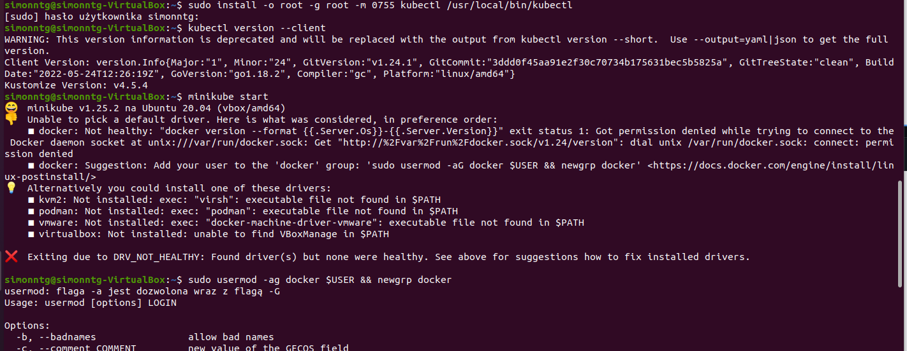
Miałem tutaj błąd. Z tego co znalazłem, to był to błąd user-a - nie możemy wejść do minikube jako root.
Zmieniłem usera: 
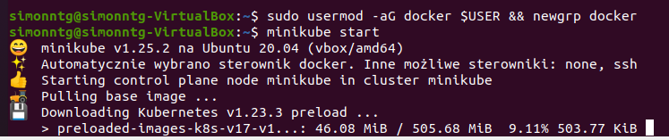

Tutaj instalowało mi się kilkanaście minut.
Następnie uruchomiłem dashboard:
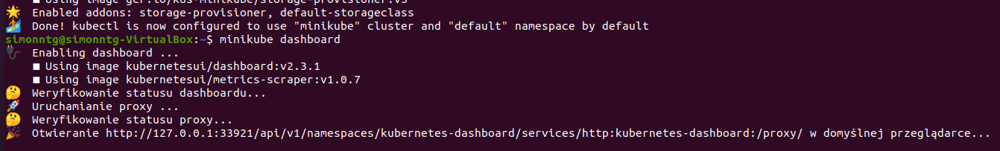
Włączyła się przeklądarka z odpalonym, pustym Kubernetesem:
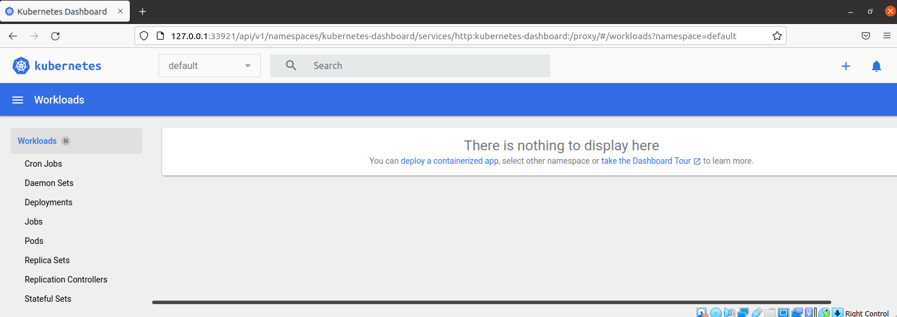

Sprawdziłem czy wszystko jest poprawnie uruchomione:
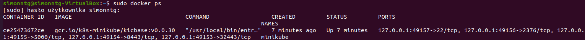

Następnym krokiem było stworzenie node z nginx:
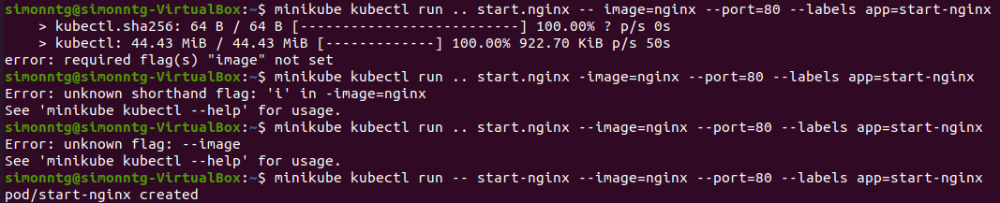
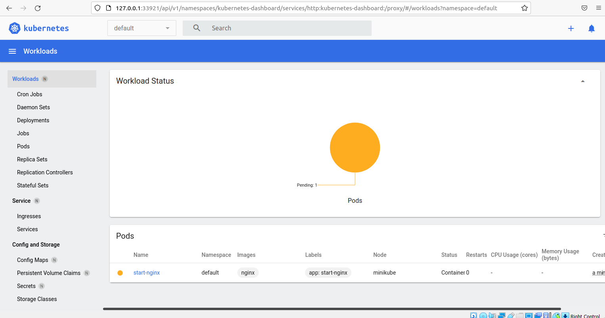

Przekierowałem porty na 5555:80
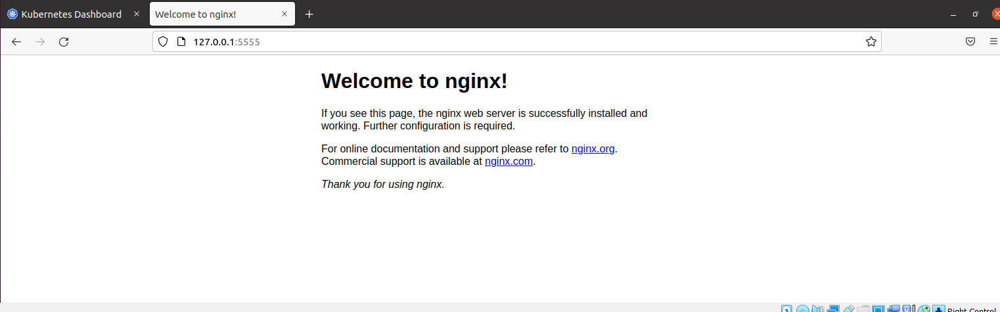
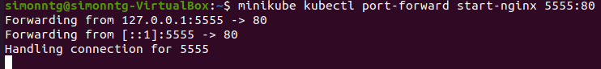
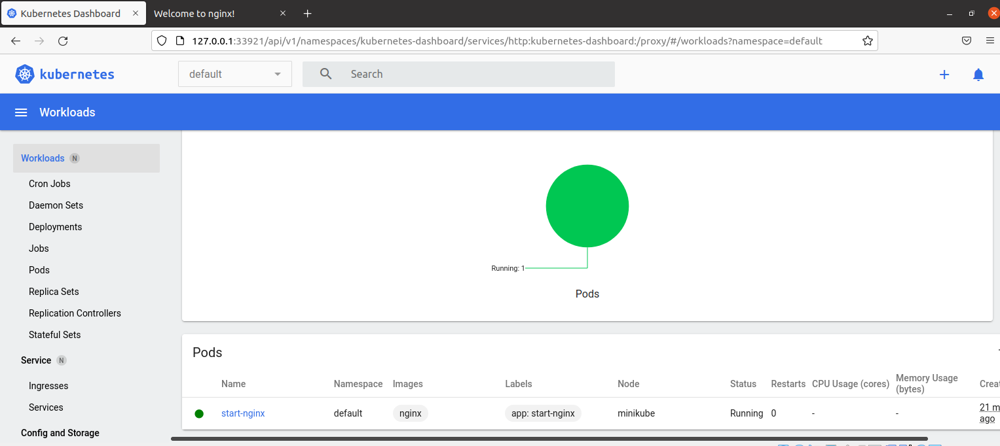

Na koniec utworzyłem plik z rozszerzeniem .yaml
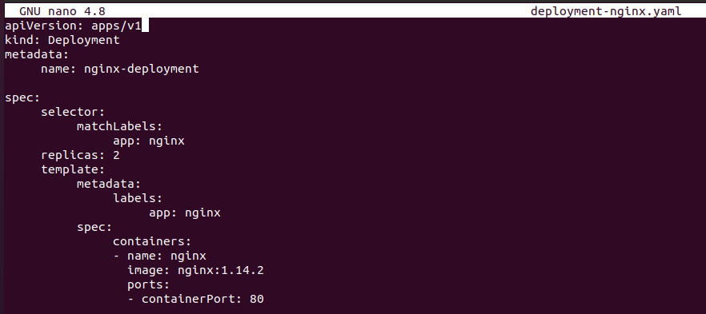

A na koniec stworzyłem pody na podstawie pliku yaml:
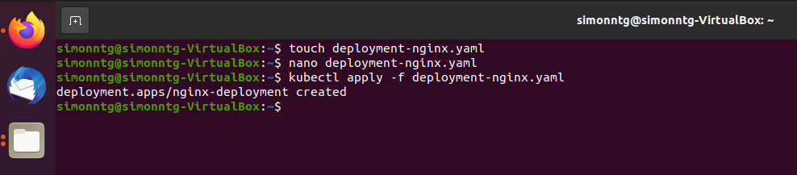
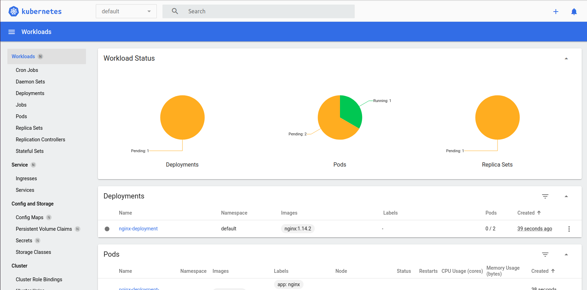
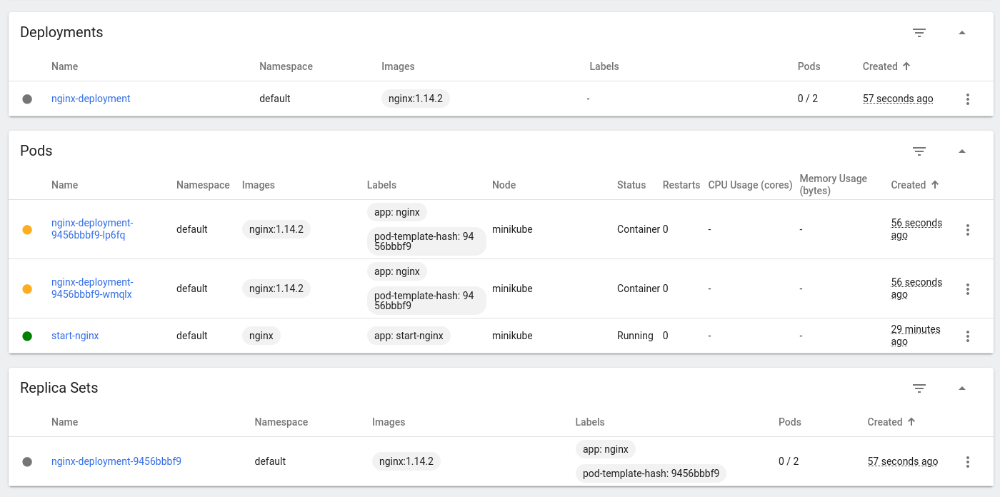
