# Sprawozdanie z Lab12

# Szymon Guziak, IT, gr.3, ITE-GCL03

# Wyjaśnienie

Czasy w tym sprawozdaniu będą bardzo małe - mam na myśli, że czas 'Created: X minutes ago' będzie szybko mijał.
Jest to spowodowane faktem, iż wykonałem całe to sprawozdanie i robiłem screeny do każdego kroku, ale na zakończenie przypadkowo usunąłem wszystkie screeny z komputera i nie byłem w stanie przywrócić ich na komputer.
Z tego to powodu wykonałem całe sprawozdanie jeszcze raz kopiując komendy z jednego terminala na drugi, przez co wykonanie tego sprawozdania zajęło mi tak mało czasu.

# Cztery pody

Na początku uruchomiłem poda z 4 replikami.
W tym celu w pliku deployment-nginx.yaml ustawiłem ilość replik na 4:
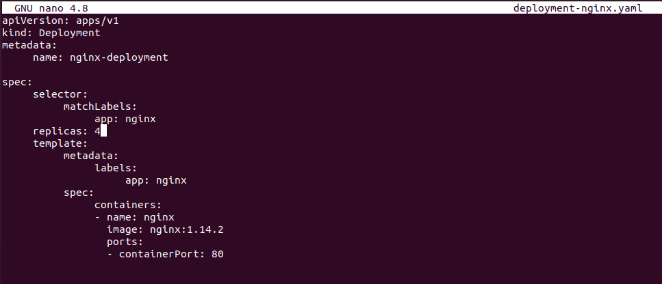

Aby znalazło się to na kubernetesie wykonałem 'kubectl apply':
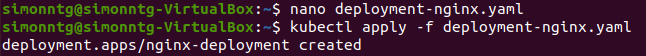

Rezultat:
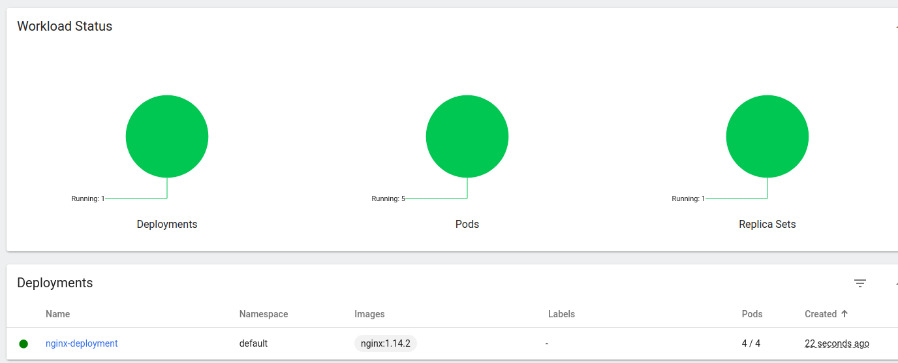

Po sprawdzeniu rezultatu na stronie sprawdziłem status przy pomocy 'kubectl rollout status deployment':
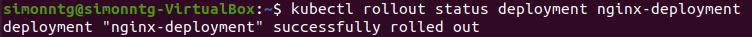

# Błędny obraz - przygotowanie

Kolejnym elementem sprawozdania było przygotowanie obrazu, który miał zwrócić błąd podczas uruchamiania:

W tym celu stworzyłem plik DockerFile:
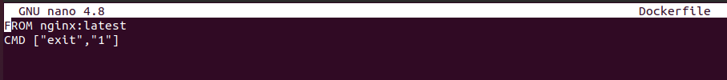

Następnie stworzyłem obraz poprzez 'docker build' - obraz nazwałem 'nginx_with_fail':
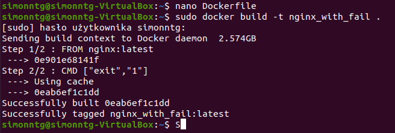

# Zmiana ilości podów

Kolejnymi krokami były modyfikacje związane z ilością podów.
Na początku zwiększyłem tę ilość z 4 do 20 podów:

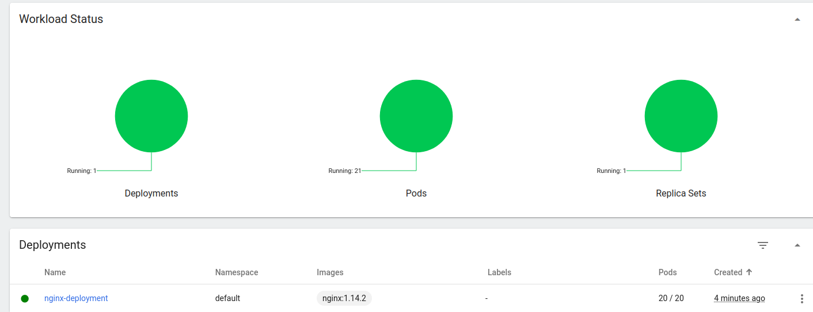

Potem zmieniłem ilość replik na 1:
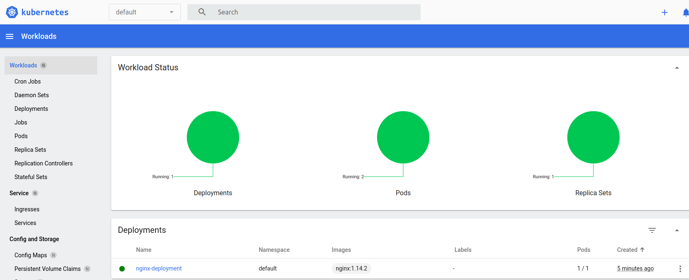

A na koniec na 0 podów:
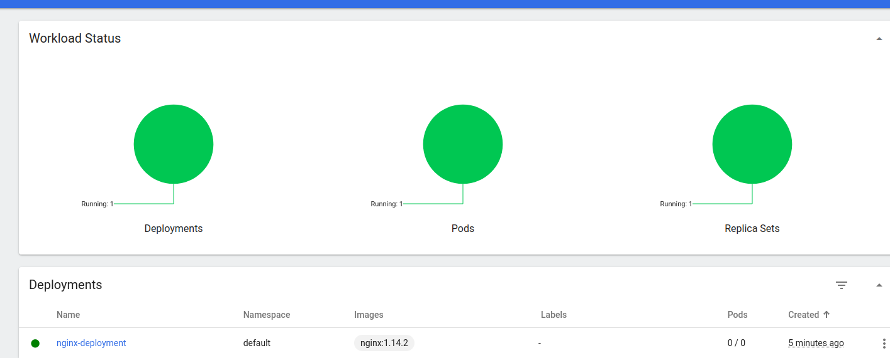

Kolejnym krokiem było zastosowanie nowej wersji obrazu:
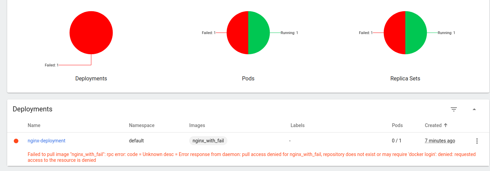

Za pomocą komend 'kubectl rollout history' oraz 'kubectl rollout undo' przywróciłem poprzednią wersję:
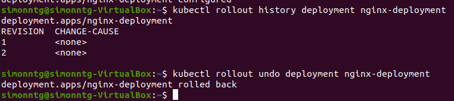
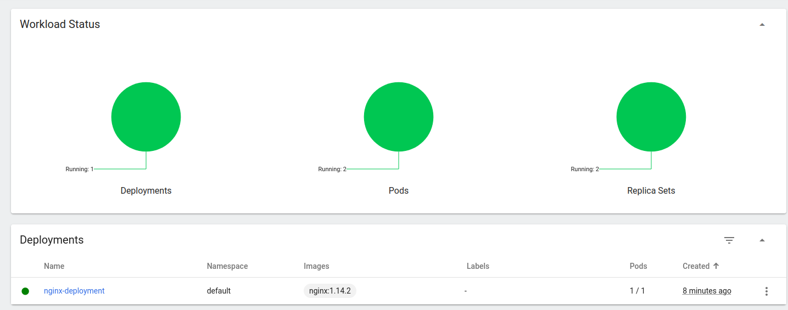

Na koniec wywołałem komendę 'minikube kubectl describe deployment':
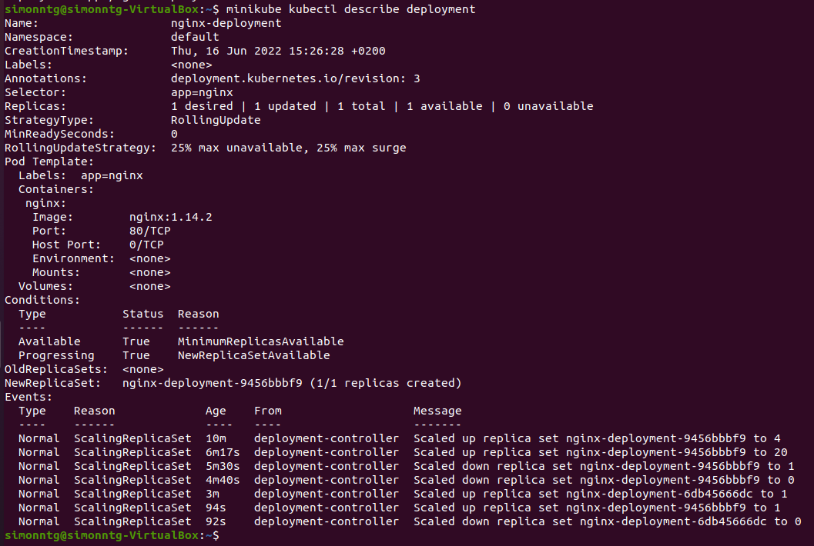

# Typy strategii

Recreate
	Strategia ta powoduje, iż wszystkie pody są automatycznie zabijane natychmiastowo i na ich miejsce są tworzone nowe.
	
Rolling Update
	Domyślna strategia.
	Strategia polegająca na płynnym aktualizowaniu liczby podóœ. Rolling Update zachowuje ciągłość działania aplikacji.

Canary Deplyment
	Strategia ta polega na wdrażaniu nowej wersji aplikacji zaraz obok starej.
	Ruch ze starej wersji jest przerzucany na nową wersję - proces ten będzie trwać aż do momentu wykrycia błędu, bądź gdy wszyscy użytkownicy znajdą się już na nowej wersji.
