# Sprawozdanie

Wojciech Jaskowski

### Konwersja wdrożenia ręcznego na wdrożenie deklaratywne YAML

 Wzbogacenie obrazu o 4 repliki

```yaml
apiVersion: apps/v1
kind: Deployment
metadata:
  name: lab11-agh
spec:
  selector:
    matchLabels:
      app: lab11-agh
  replicas: 4
  template:
    metadata:
      labels:
        app: lab11-agh
    spec:
      containers:
      - name: nginx-agh
        image: nginx
        ports:
        - containerPort: 80
```

Wdrożenie

```
kubectl apply -f kubernetes-deployment.yml
kubectl rollout status -f kubernetes-deployment.yml
```

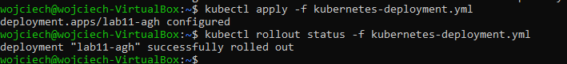

### Przygotowanie nowego obrazu

 Przygotowanie dockerfile'a który zwraca kod błędu

```dockerfile
FROM nginx:latest
CMD ["exit","1"]
```

 Budowanie obrazu 

```
docker build -t devops-lab12-1:latest -f dockerfile-lab12 .
```

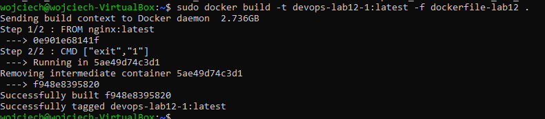

### Zmiany w deploymencie

 Zwiększenie ilości replik

```
kubectl scale deployment/lab11-agh --replicas=6
```

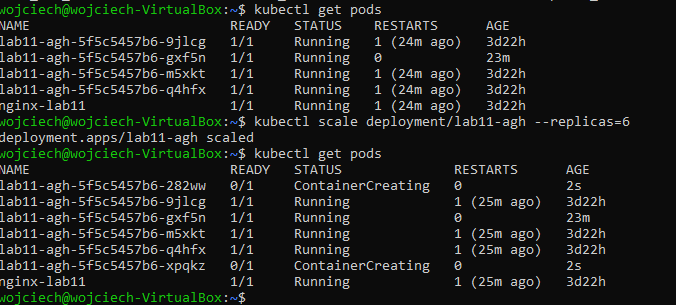

 Zmniejszenie ilości replik do 1

```
kubectl scale deployment/lab11-agh --replicas=1
```

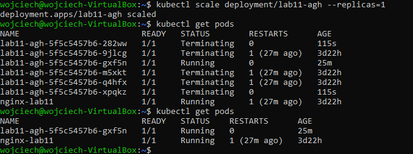

 Zmniejszenie ilości replik do 0

```
kubectl scale deployment/lab11-agh --replicas=0
```

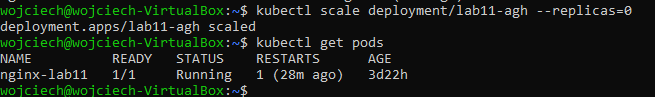

Zastosowanie nowej wersji obrazu

```
kubectl set image deployment/lab11-agh nginx-agh=devops-lab12-1
```

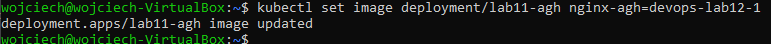

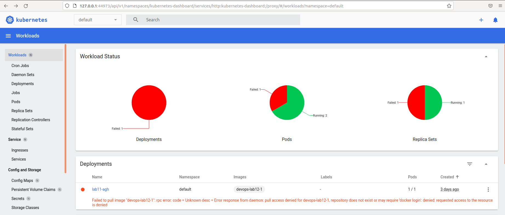

Zastosowanie starszej wersji obrazu

```
kubectl rollout history deployment/lab11-agh
kubectl rollout undo deployment/lab11-agh --to-revision=1
```


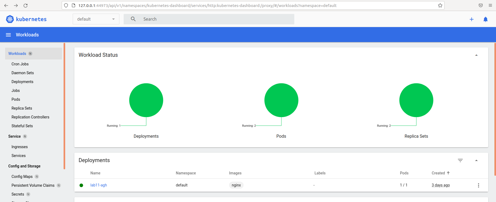

### Kontrola wdrożenia

 Przygotowanie skryptu

```sh
#!/bin/bash
kubectl apply -f kubernetes-deployment.yml
sleep 60
kubectl rollout status deployment/lab11-agh
if [[ "$?" -ne 0 ]]; then
  echo "blad podczas wdraznia"
else
  echo "wdrozono pomyslnie"
fi
```

Usunięcie poprzedniego deploymentu i uruchomienie skryptu

```
kubectl delete deployment lab11-agh
./deploy-script.sh
```

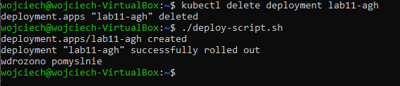

### Strategie wdrożenia

* Recreate

Podczas modyfikacji ilości podów wszystkie pody tworzone są od nowa.

Modyfikacja pliku wdrożeniowego

```yaml
apiVersion: apps/v1
kind: Deployment
metadata:
  name: lab11-agh
spec:
  strategy:
  	type: Recreate
  selector:
    matchLabels:
      app: lab11-agh
  replicas: 4
  template:
    metadata:
      labels:
        app: lab11-agh
    spec:
      containers:
      - name: nginx-agh
        image: nginx
        ports:
        - containerPort: 80
```

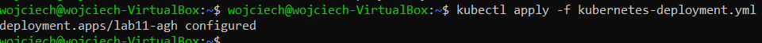

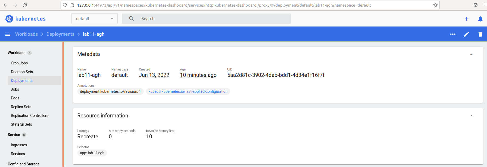

* Rolling Update

Domyślna strategia, modyfikacja ilości podów nie powoduje przerwy w działaniu pozostałych podów, czyli np. podczas zwiększania ilości podów dodawane są nowe pody do juz istniejących a nie tworzone są wszystkie od nowa.

Modyfikacja pliku wdrożeniowego

```yaml
apiVersion: apps/v1
kind: Deployment
metadata:
  name: lab11-agh
spec:
  strategy:
  	type: RollingUpdate
  	rollingUpdate:
      maxSurge: 1
      maxUnavailable: 1
  selector:
    matchLabels:
      app: lab11-agh
  replicas: 4
  template:
    metadata:
      labels:
        app: lab11-agh
    spec:
      containers:
      - name: nginx-agh
        image: nginx
        ports:
        - containerPort: 80
```

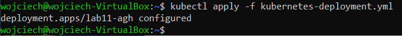

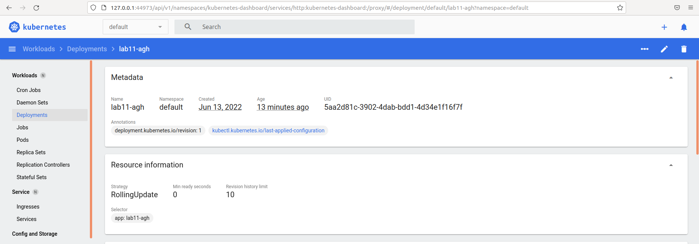

* Canary Deployment workload

Utworzenie dwóch plików wdrożeniowych o innych numerach wersji oraz wdrożenie

```yaml
apiVersion: apps/v1
kind: Deployment
metadata:
  name: lab11-agh-1
spec:
  selector:
    matchLabels:
      app: lab11-agh
  replicas: 4
  template:
    metadata:
      labels:
        app: lab11-agh
        varsion: "1.0"
    spec:
      containers:
      - name: nginx-agh
        image: nginx
        ports:
        - containerPort: 80
```

```yaml
apiVersion: apps/v1
kind: Deployment
metadata:
  name: lab11-agh-2
spec:
  selector:
    matchLabels:
      app: lab11-agh
  replicas: 4
  template:
    metadata:
      labels:
        app: lab11-agh
        varsion: "2.0"
    spec:
      containers:
      - name: nginx-agh
        image: nginx
        ports:
        - containerPort: 80
```

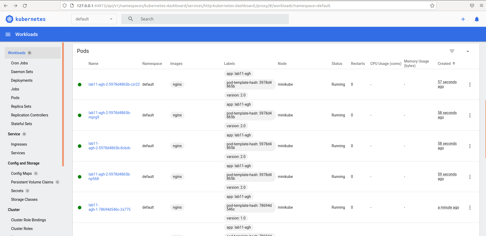

Wersja 1.0 będzie aktywna do momentu przejścia wszystkich użytkowników na wersję 2.0.

