# Projekt 
## Rosiak B³a¿ej
### Wdra¿anie na zarz¹dzalne kontenery: Kubernetes
Instalacja minikube'a:

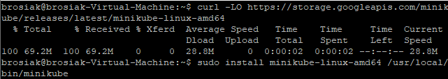

Uruchomienie minikube'a i dashboarda:

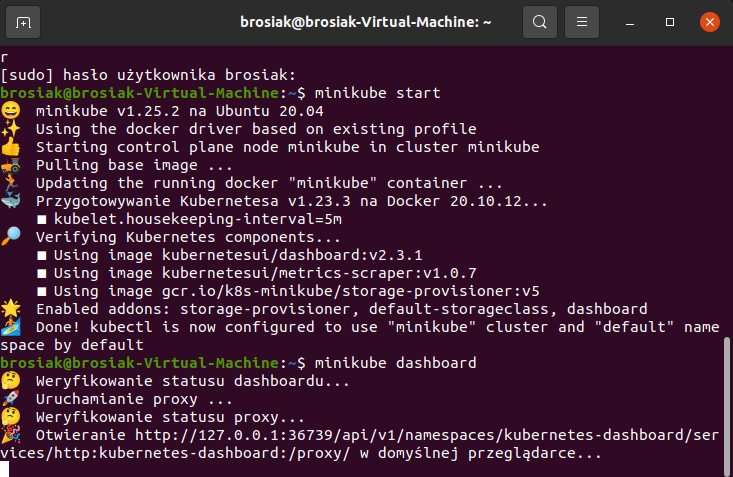
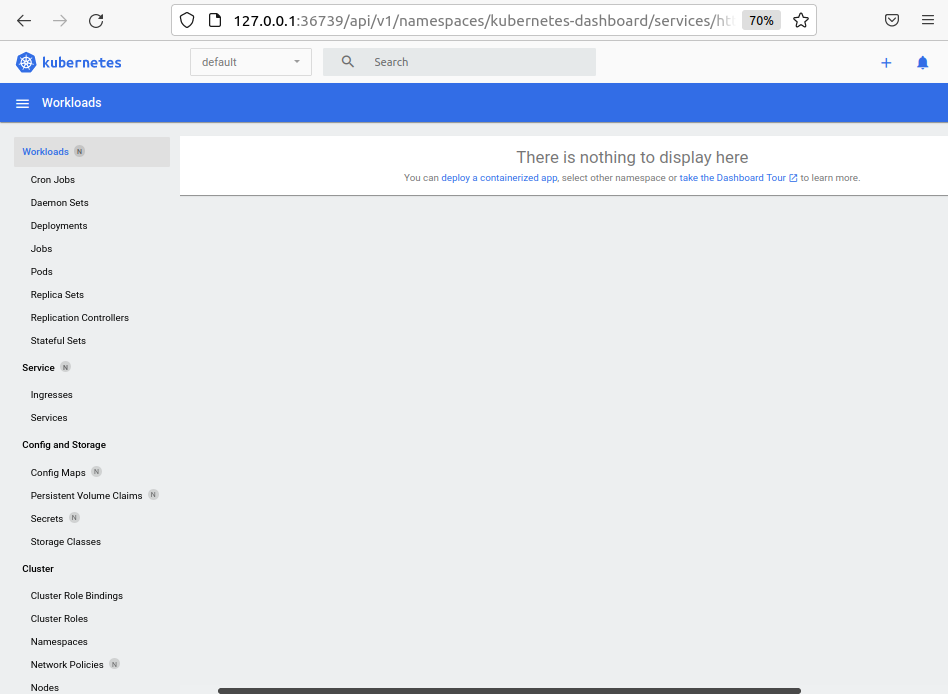

Kontener minikube'a:

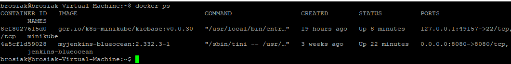

Utworzenia poda nginx:

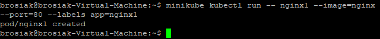
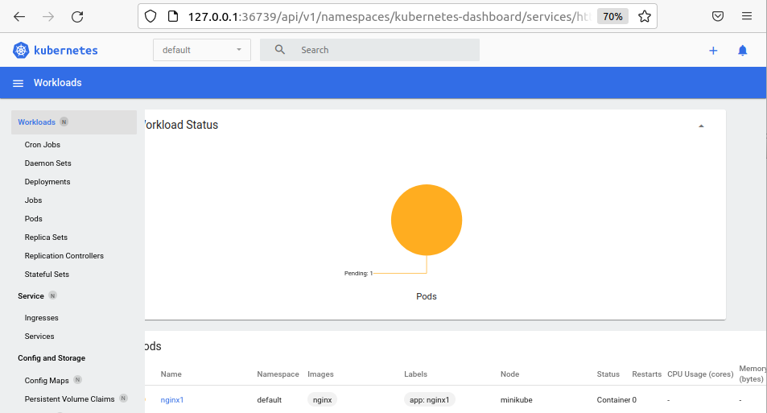

Przekierowanie portów + sprawdzenie poprawnoœci dzia³ania:

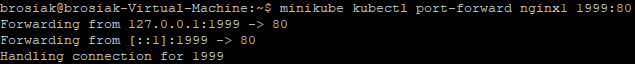
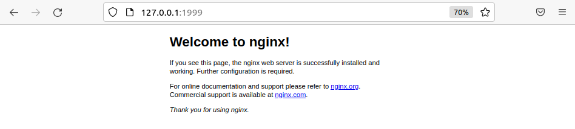

Utworzenie YAML'a tworz¹cego dwa pody *nginx*, stworzenie podów na podstawie plików i sprawdzenie dzia³ania:

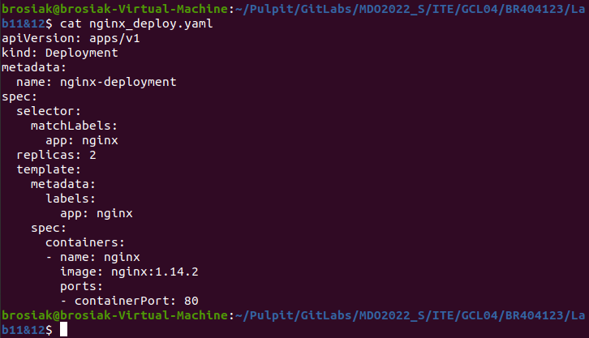
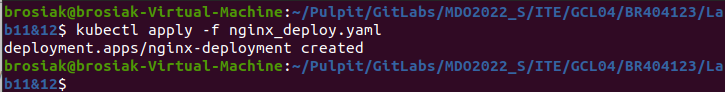
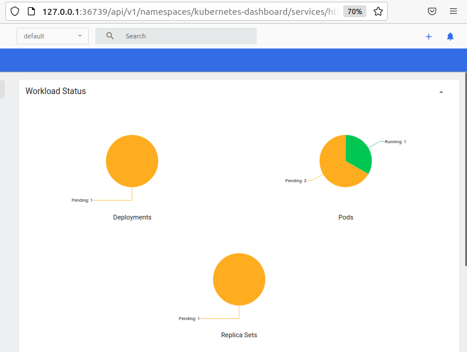

Zmiana iloœci replik/podów na 4 (zmiana, wdro¿enie i sprawdzenie):

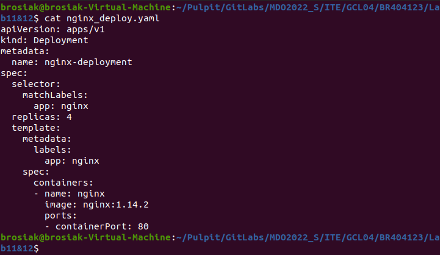
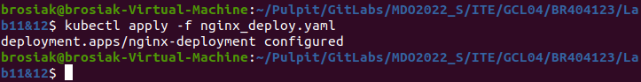
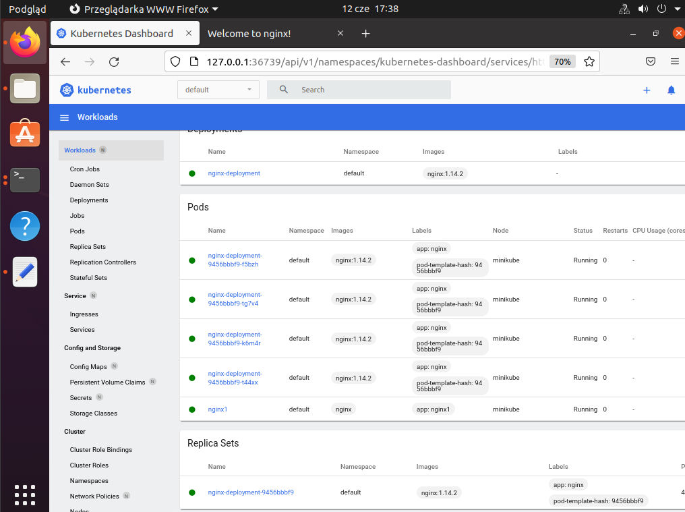

Badanie stanu za pomoc¹ *kubectl rollout status*:

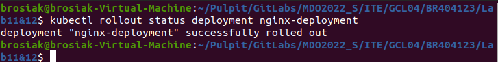

Budowa obrazu, które zadaniem bêdzie zawsze zwróciæ b³¹d:

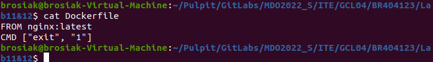
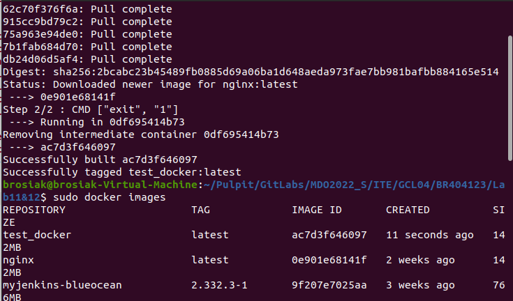

Zabawa podami (iloœci¹ replik):
- 8 replik:

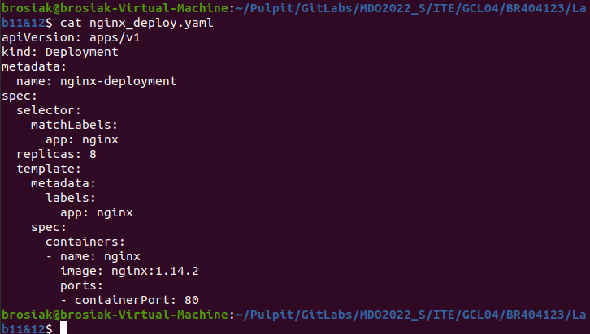
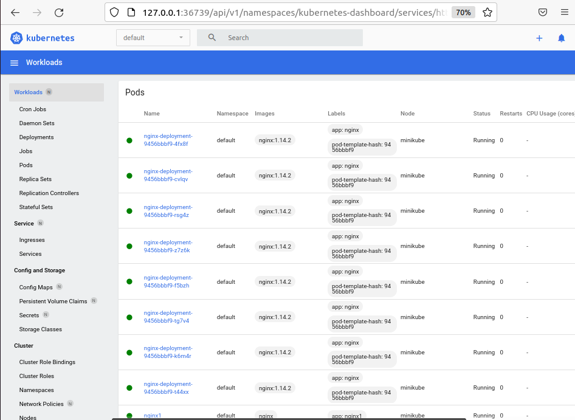

- 1 replika:

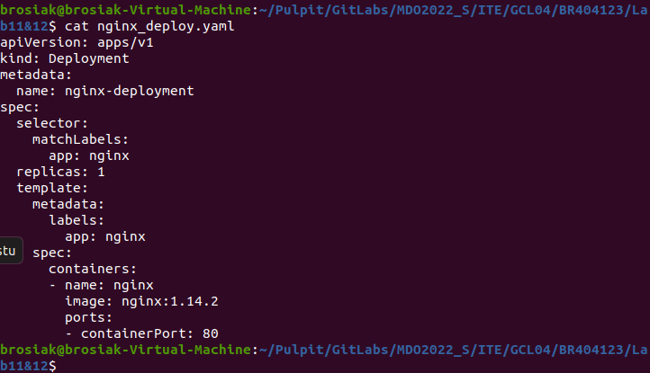
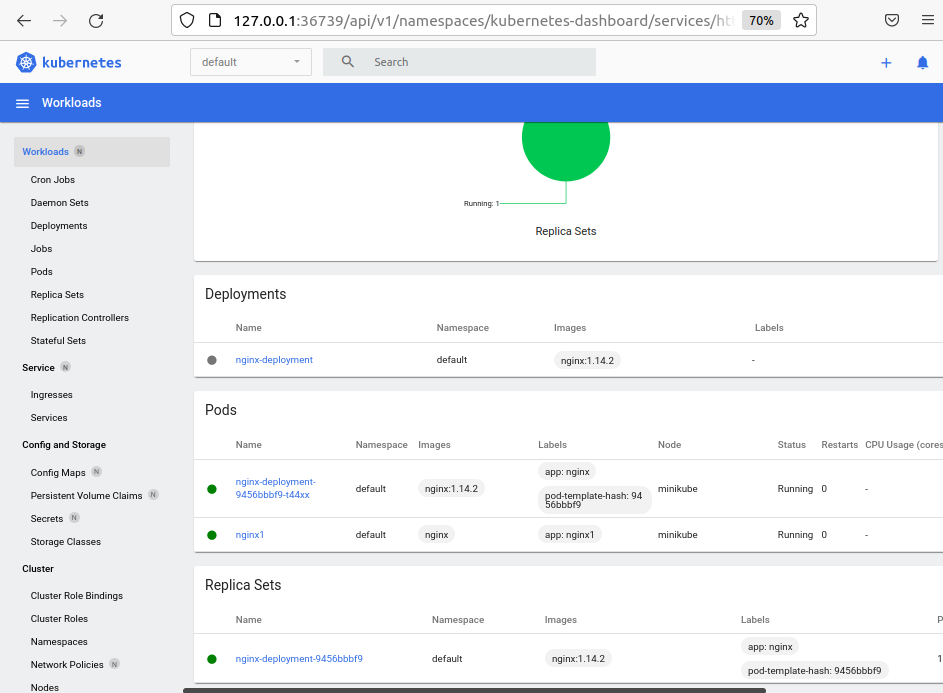

- 0 replik:

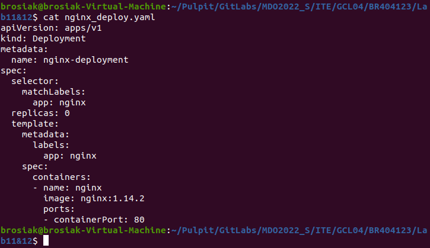

- Nowsza wersja:

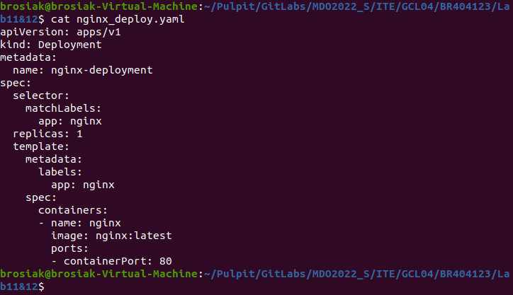
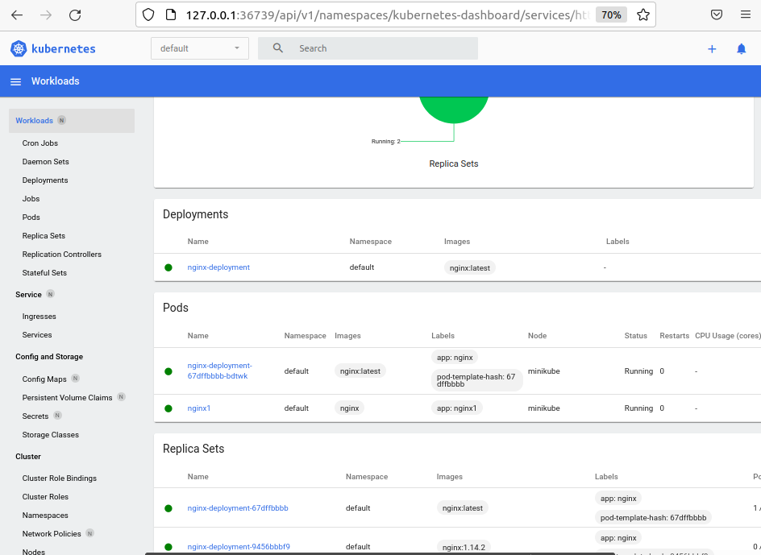

- Z³y obraz:

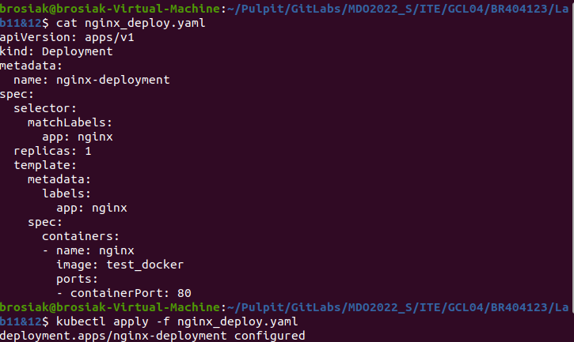
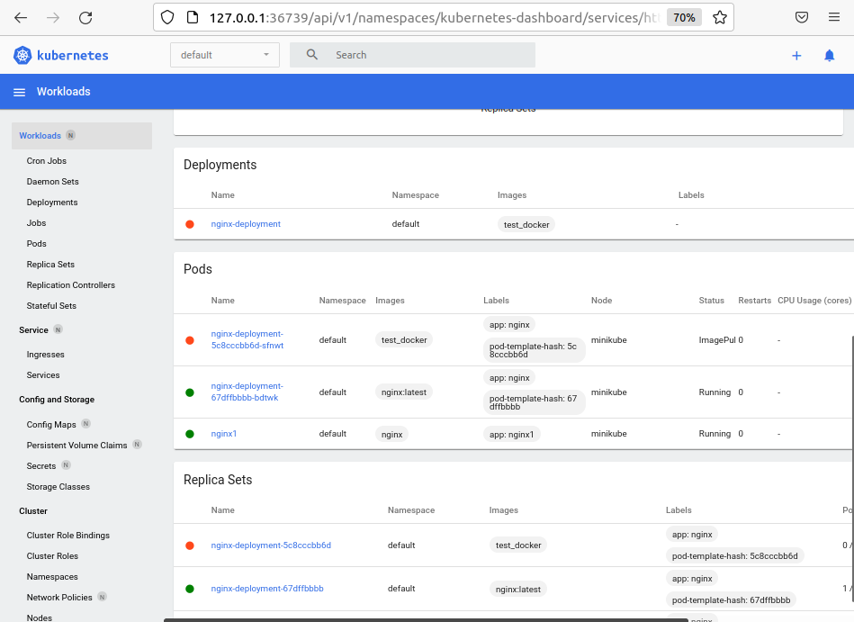

U¿ycie komendy *kubectl rollout history* w celu pokazania historii zmian oraz *kubectl rollout undo* w celu wycofania ostatniego, niedzia³aj¹cego kontenera:

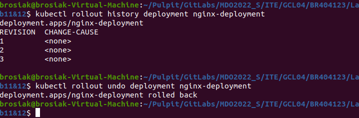

Utworzenie skryptu weryfikuj¹cego czy wdro¿enie zd¹¿y³o siê wdro¿yæ i uruchomienie go:

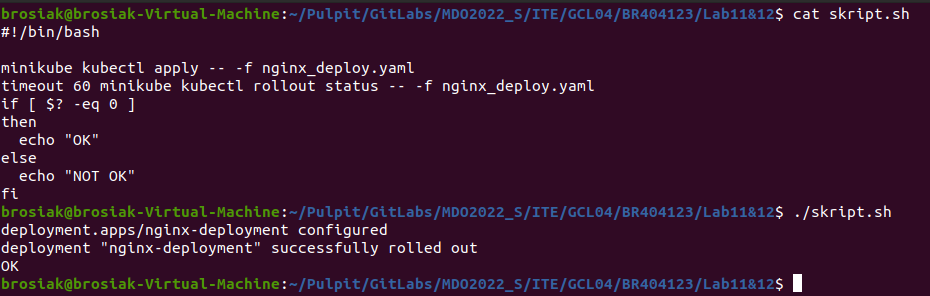