## Sprawozdanie Lab 12
###  Daniel Gabryś
#

## Konwersja wdrożenia ręcznego na wdrożenie deklaratywne YAML

- Wdrożenie z poprzednich zajęć wraz z 4 replikami  
  
  ```
  apiVersion: apps/v1 
  kind: Deployment
  metadata:
    name: mysql
  spec:
    minReadySeconds: 55
    progressDeadlineSeconds: 60
    replicas: 3
    selector:
      matchLabels:
        app: mysql
    template:
      metadata:
        labels:
          app: mysql
      spec:
        containers:
        - image: mysql:5
          name: mysql
          env:
          - name: MYSQL_ROOT_PASSWORD
            value: password
          ports:
          - containerPort: 3306
            name: mysql
  ```        
  - Rozpoczęcie wdrożenia:
  
    > kubectl apply -f deploy.yml

  - Zbadanie stanu
     > kubectl rollout status -f deploy.yml  

    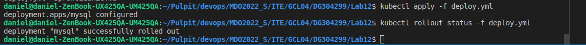  


## Przygotowanie nowego obrazu  

- Wybranie obrazu:  

Został wybrany obraz z DockerHub, w projektcie nie były wyprowadzane porty (wybrano obraz mysql)

- Przygotuj wersję obrazu, którego uruchomienie kończy się błędem

Aby uruchomienie wybranego obrazu zakończyło się niepowodzeniem należy usunąć z pliku "deploy.yml" zmienną środowiskową "MYSQL_ROOT_PASSWORD". Kontener nie uruchomi sie poprawnie i będzie się ciągle restartował 

```
apiVersion: apps/v1 
kind: Deployment
metadata:
  name: mysql
spec:
  minReadySeconds: 55
  progressDeadlineSeconds: 60
  replicas: 4
  selector:
    matchLabels:
      app: mysql
  template:
    metadata:
      labels:
        app: mysql
    spec:
      containers:
      - image: mysql:5.6
        name: mysql
        env:
        ports:
        - containerPort: 3306
          name: mysql
        
```
Bład pokazujący ciągłe uruchamianie się kontenera

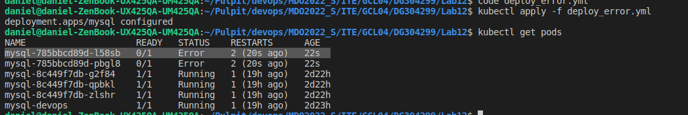  

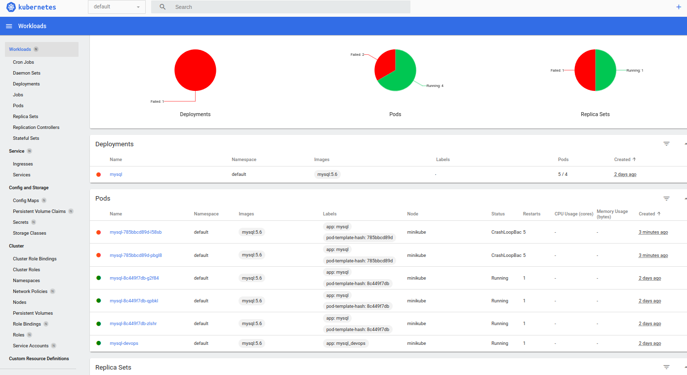 

## Zmiany w deploymencie
- Aktualizuj plik YAML z wdrożeniem i przeprowadzaj je ponownie po zastosowaniu następujących zmian:\
  
  + zwiększenie replik z 4 do 6
  
    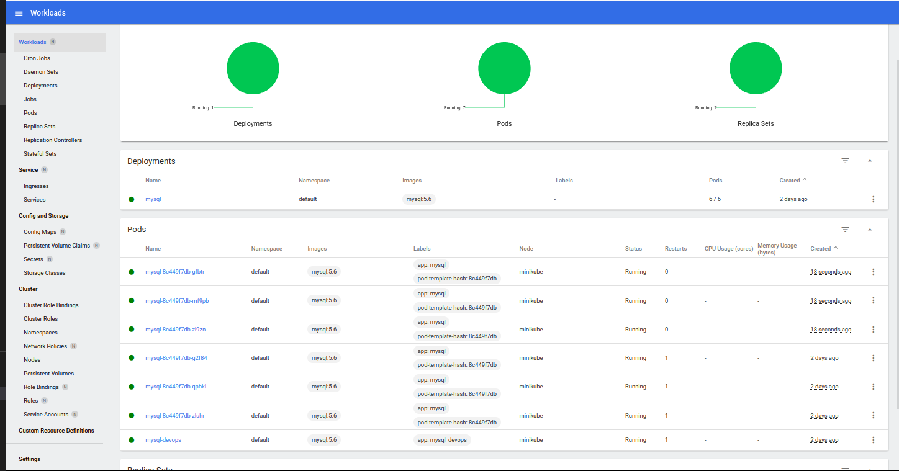  

   + zmniejszenie liczby replik do 1

     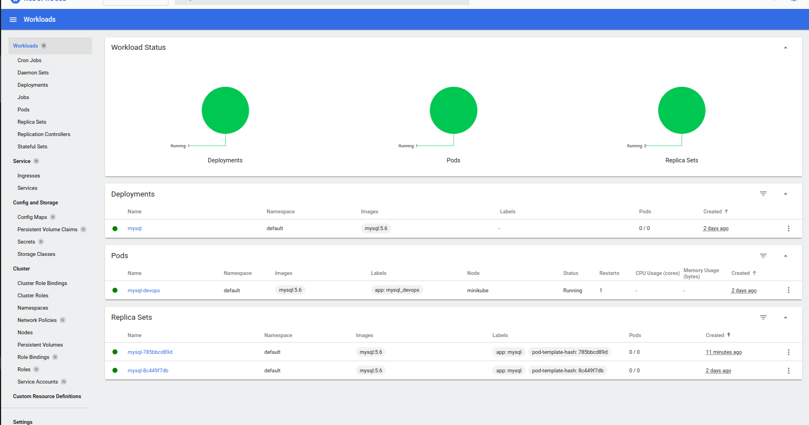  

   + zmniejszenie liczby replik do 0

          

- Zastosowanie nowej wersji obrazu  

   + Zmiana obrazu mysql z wersji 5.6 na najnowszą (3 repliki)

        ```image: mysql:latest``` 
    
        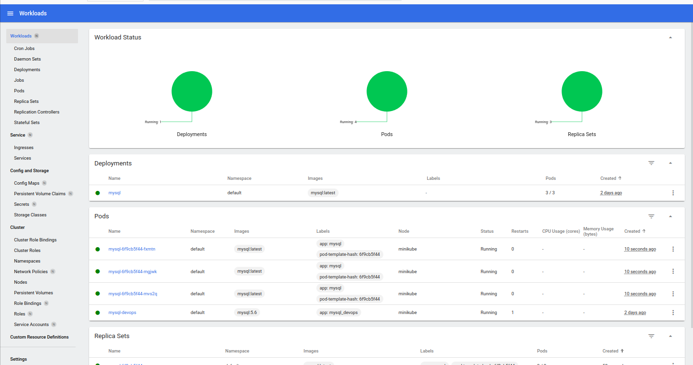  

   + Zastosowanie starszej wersji obrazu  

        ```image: mysql:5``` 

        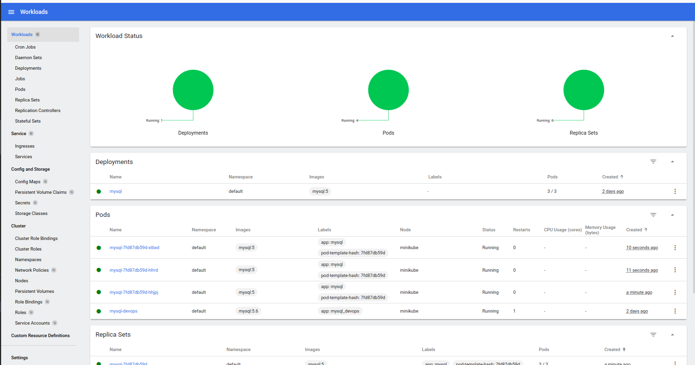  
        

- Przywracaj poprzednie wersje wdrożeń za pomocą poleceń  

   + Wyświetlenie histori wdrozeń
    
        ```kubectl rollout history deployment mysql```
    
   + Wybranie interesującego nas wdrozenia

        ```kubectl rollout undo deployment mysql ```

        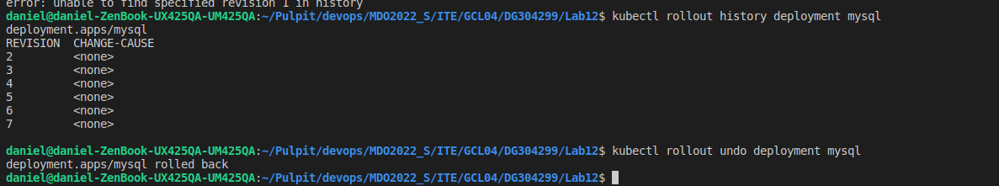  
        


## Kontrola wdrożenia

 - Napisz skrypt weryfikujący, czy wdrożenie "zdążyło" się wdrożyć (60 sekund) 
  
     plik: "deploy.sh"

    ```
    #!/bin/bash

    name="mysql"

    kubectl apply -f $1

    sleep 60
    kubectl rollout status deployment $name
    if [ "$?" -ne 0 ]; then
        echo "deployment failed!"
    else
        echo "deployment succeeded"
    fi
    ```  
    Uruchomiono skrypt w celu przetestowania działania dla działających kontenerów

    > ./deploy.sh deploy.yml 

    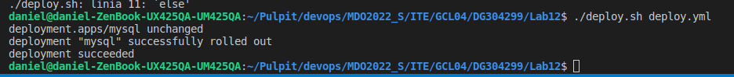  

    Uruchomiono skrypt dla niedziałających kontenerów

     > ./deploy.sh deploy_error.yml 

    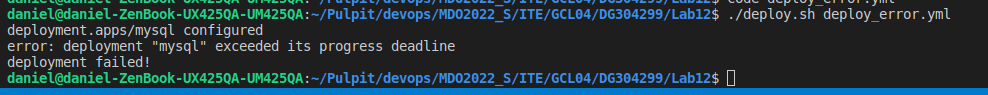  


 
## Strategie wdrożenia
- Przygotuj wersje wdrożeń stosujące następujące strategie wdrożeń
   + Recreate

      Dopisanie w pliku .yml sekcji spec strategi o typie Recreate:  
      ```yml
        strategy:
          type: Recreate
      ```

      stworzono plik na bazie deploy.yml : deploy_recreate.yml (analogicznie resztę plików dla innych strategi)

      > kubectl apply -f deploy_recreate.yml 

      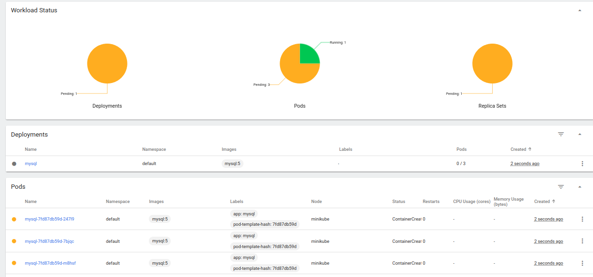    

      Strategia recreate usuwa wszystkie istniejące pody, a po ich usunieciu uruchamiane są nowe z nową wersją oprogramowania.

  + Rolling Update

    Dopisanie w pliku .yml sekcji spec strategi o typie RollingUpdate:  
    ```yml
      strategy:
        type: RollingUpdate
        rollingUpdate:
          maxSurge: 1
          maxUnavailable: 1
    ```

       > kubectl apply -f deploy_update.yml 

      Edytowano wersje obrazu aby były widoczne zmiany w stosunku do potrzedniego deploymentu

    ```maxUnavailable``` -ustawia ile podów moze być niedostepnych podczas wdrażania

    ```maxSurge``` - okresla ile podów może być tworzone ponad określoną ilosć

    Strategia ta nie usuwa wszystkich podów jednocześnie, dzięki jej aplikacja nie będzie miała przerwy w działaniu.

    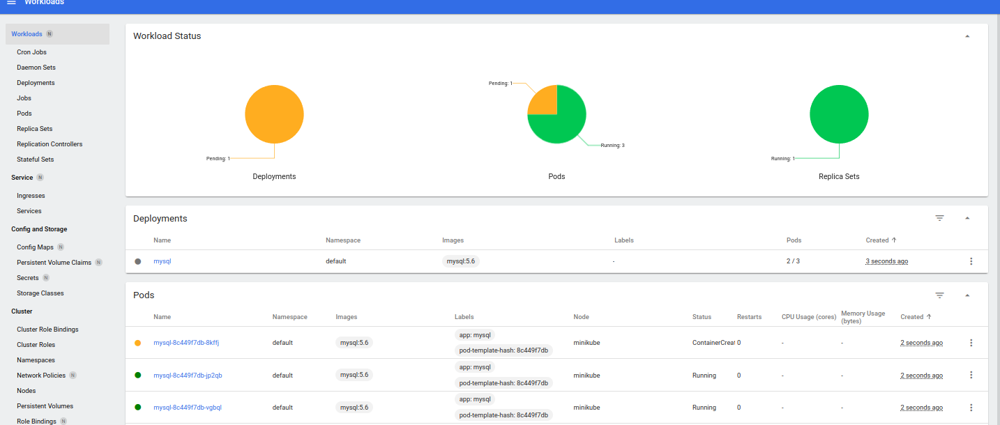   

  - Canary Deployment workload

    Strategia ta polega na załadowaniu dwóch kontenerów o różnych wersjach. Loadbalancer będzie przełączał się między nimi. Zależnie od odświeżenia strony możemy trafić na różną wersję aplikacji

  Podsumowanie

  Rolling update, pozwala on największą niezawodność, poprzez ciągły dostęp do aplikacji. 
  Canary Deployment jest powszechnie stosowany w celu betatestowania nowych funkcjonalności aplikacji.